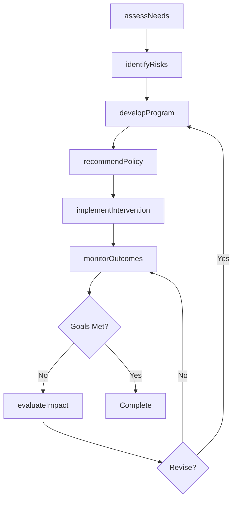
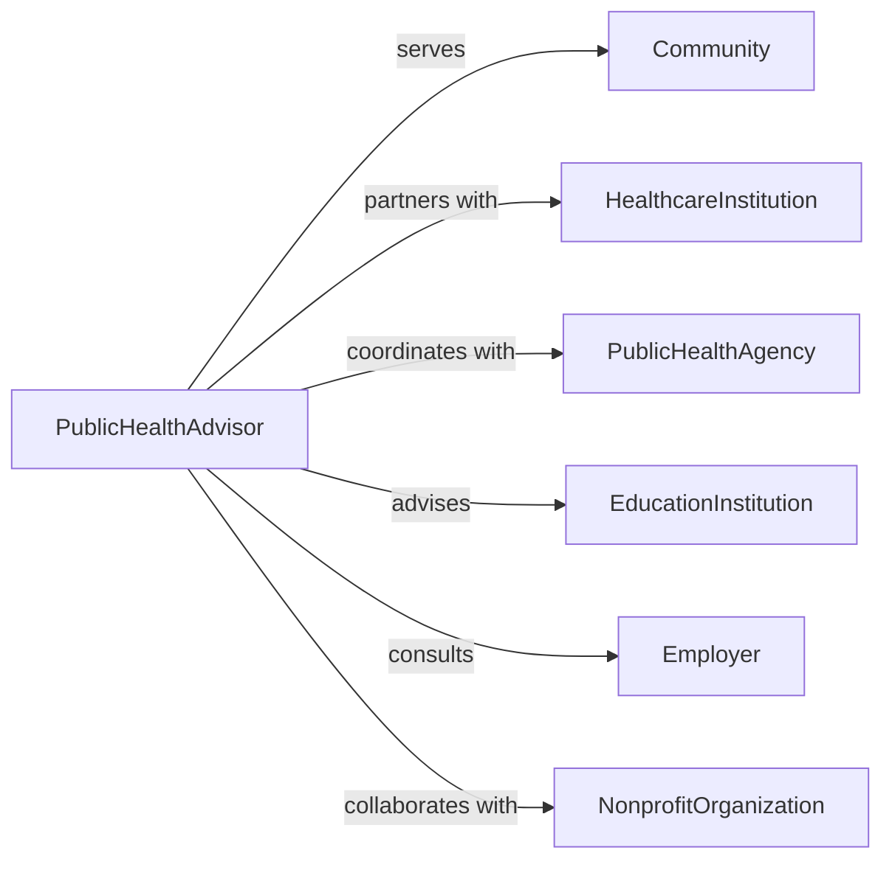

# Advise Communities Institutions Regarding Health

> Business-as-Code definition for public health advisory services. Models the complete consultation process from health needs assessment through program development, policy recommendations, and community health initiatives.

## Overview

Public health advisory involves evaluating community health status, identifying risks, and guiding organizations toward improved population health outcomes. This definition exposes actions for needs assessment, program design, and outcome monitoring, along with events for tracking public health initiatives and policy implementation.

## Actors

| Actor | Description |
|-------|-------------|
| Community | Population group with shared health needs |
| HealthcareInstitution | Hospital or clinic serving population |
| PublicHealthAgency | Government body managing community health |
| EducationInstitution | School or university implementing health programs |
| Employer | Business providing workplace health initiatives |
| NonprofitOrganization | Charitable group supporting health causes |

## Roles

| Role | Description |
|------|-------------|
| PublicHealthAdvisor | Guides community health strategy development |
| EpidemiologistConsultant | Analyzes disease patterns and risk factors |
| PolicyAdvisor | Recommends health policy and regulations |
| ProgramDirector | Oversees implementation of health initiatives |

## Entities

| Entity | Description |
|--------|-------------|
| NeedsAssessment | Evaluation of community health status and gaps |
| HealthProgram | Initiative targeting specific population health issue |
| Policy | Formal guideline or regulation promoting health |
| Intervention | Specific action to improve health outcomes |
| Metric | Measurable indicator of population health |
| Outcome | Result of health program or policy implementation |

## Actions

| Action | Description |
|--------|-------------|
| assessNeeds | Evaluate community health status and priorities |
| identifyRisks | Catalog health threats and vulnerable populations |
| developProgram | Create initiative to address health need |
| recommendPolicy | Suggest regulations or guidelines |
| implementIntervention | Deploy specific health improvement action |
| monitorOutcomes | Track population health metrics over time |
| evaluateImpact | Assess effectiveness of programs and policies |

## Events

| Event | Description |
|-------|-------------|
| needsAssessed | Community health evaluation completed |
| risksIdentified | Health threats cataloged |
| programDeveloped | Initiative created |
| policyRecommended | Guidelines suggested |
| interventionImplemented | Action deployed |
| outcomesMonitored | Health metrics updated |
| impactEvaluated | Effectiveness assessed |

## Searches

| Search | Description |
|--------|-------------|
| findCommunities | List populations by health status or priority |
| getPrograms | Retrieve initiatives by type or target population |
| getPolicies | Find guidelines by topic or implementation status |
| getOutcomes | List health metrics by community or period |

## Workflow



## Actor Relationships



## Usage

### Calling Actions

```typescript
import { adviseCommunitiesInstitutionsRegardingHealth } from '@headlessly/advise-communities-institutions-regarding-health'

const advisory = adviseCommunitiesInstitutionsRegardingHealth()

// Assess community health needs
const assessment = await advisory.assessNeeds({
  communityId: 'community-456',
  population: 85000,
  dataSource: ['Hospital records', 'Survey', 'Census'],
  priorities: ['Chronic disease', 'Mental health', 'Access to care']
})

// Identify at-risk populations
const risks = await advisory.identifyRisks({
  assessmentId: assessment.id,
  factors: ['Diabetes prevalence', 'Food insecurity', 'Lack of insurance']
})

// Develop diabetes prevention program
const program = await advisory.developProgram({
  communityId: 'community-456',
  target: 'Adults with pre-diabetes',
  intervention: 'Lifestyle modification program',
  duration: '12 months',
  partners: ['YMCA', 'Local clinics']
})
```

### Event-Driven Automation

```typescript
// Generate report when needs assessment completes
advisory.needsAssessed(async ({ communityId, assessment }) => {
  await generateReport({
    template: 'community-health-needs',
    data: assessment,
    deliverTo: assessment.stakeholders
  })
})

// Alert on adverse health trends
advisory.outcomesMonitored(async ({ communityId, outcomes }) => {
  const worsening = outcomes.metrics.filter(m => m.trend === 'declining')
  if (worsening.length > 0) {
    await escalate({
      to: 'public-health-director',
      severity: 'high',
      message: `${worsening.length} health metrics declining in ${communityId}`
    })
  }
})
```
