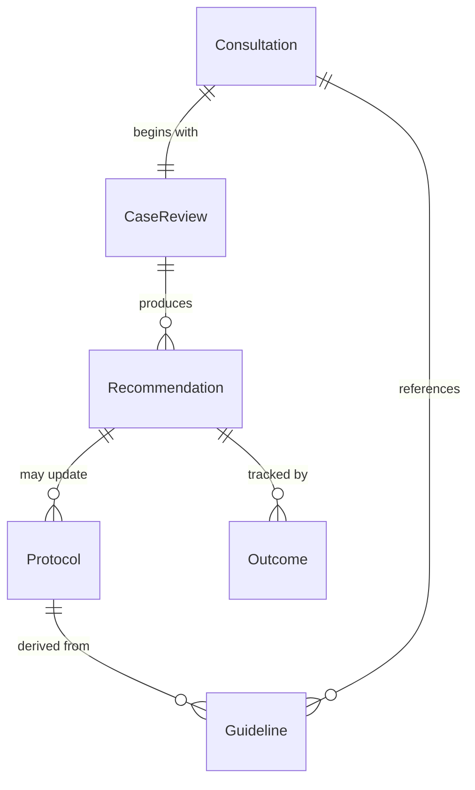
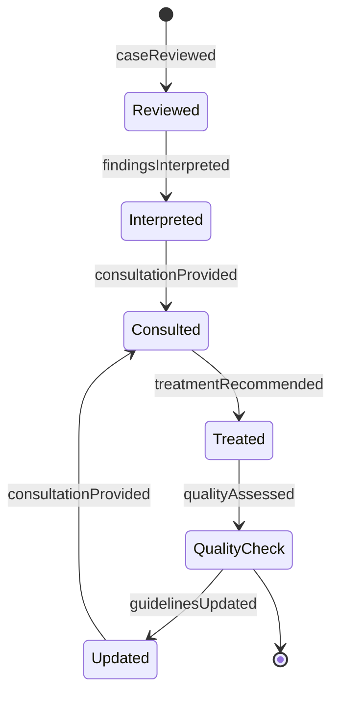
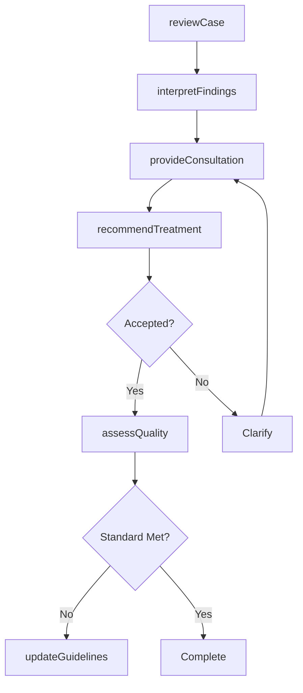
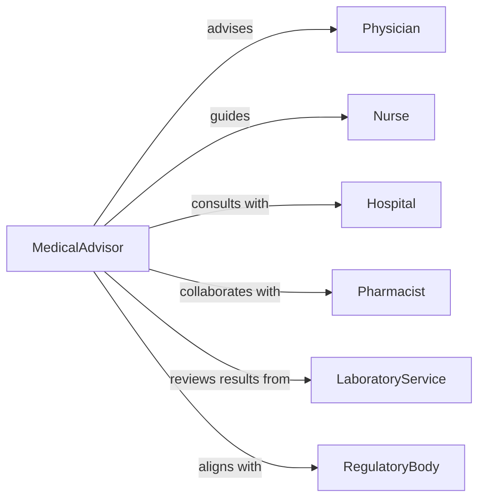

# Advise Medical Personnel Regarding Healthcare

> Business-as-Code definition for clinical advisory services. Models the complete consultation process from case review through clinical guidance, treatment recommendations, and quality improvement for healthcare providers.

## Overview

Clinical advisory services involve providing expert medical guidance to healthcare professionals on complex cases, treatment protocols, and care standards. This definition exposes actions for case consultation, protocol development, and quality assurance, along with events for tracking clinical recommendations and outcomes.

## Actors

| Actor | Description |
|-------|-------------|
| Physician | Primary care or specialist clinician |
| Nurse | Registered or advanced practice nurse |
| Hospital | Healthcare facility implementing protocols |
| Pharmacist | Medication therapy specialist |
| LaboratoryService | Diagnostic testing provider |
| RegulatoryBody | Agency setting healthcare standards |

## Roles

| Role | Description |
|------|-------------|
| MedicalAdvisor | Provides expert clinical consultation |
| ClinicalSpecialist | Offers subspecialty expertise on complex cases |
| QualityImprovement | Develops care protocols and standards |
| ComplianceOfficer | Ensures adherence to clinical guidelines |

## Entities

| Entity | Description |
|--------|-------------|
| Consultation | Request for expert clinical advice |
| CaseReview | Detailed analysis of patient presentation |
| Protocol | Standardized clinical care pathway |
| Recommendation | Specific guidance on diagnosis or treatment |
| Guideline | Evidence-based clinical practice standard |
| Outcome | Result of implemented clinical advice |

## Actions

| Action | Description |
|--------|-------------|
| reviewCase | Analyze patient presentation and clinical data |
| provideConsultation | Offer expert guidance on diagnosis or treatment |
| developProtocol | Create standardized care pathway |
| recommendTreatment | Suggest specific therapeutic intervention |
| interpretFindings | Explain diagnostic or laboratory results |
| assessQuality | Evaluate adherence to care standards |
| updateGuidelines | Revise clinical protocols based on evidence |

## Events

| Event | Description |
|-------|-------------|
| caseReviewed | Patient presentation analyzed |
| consultationProvided | Expert guidance delivered |
| protocolDeveloped | Care pathway created |
| treatmentRecommended | Therapeutic intervention suggested |
| findingsInterpreted | Results explained |
| qualityAssessed | Care standards evaluated |
| guidelinesUpdated | Protocols revised |

## Searches

| Search | Description |
|--------|-------------|
| findConsultations | List expert requests by specialty or status |
| getCases | Retrieve patient presentations by complexity |
| getProtocols | Find care pathways by condition or department |
| getRecommendations | List guidance by clinician or outcome |

## Entity Relationships



## State Diagram



## Workflow



## Actor Relationships



## Usage

### Calling Actions

```typescript
import { adviseMedicalPersonnelRegardingHealthcare } from '@headlessly/advise-medical-personnel-regarding-healthcare'

const advisory = adviseMedicalPersonnelRegardingHealthcare()

// Review complex cardiac case
const review = await advisory.reviewCase({
  requestingPhysician: 'dr-smith',
  specialty: 'Cardiology',
  presentation: 'Recurrent syncope with negative initial workup',
  patientAge: 67,
  comorbidities: ['Type 2 diabetes', 'Hypertension'],
  priorStudies: ['ECG', 'Echocardiogram', 'Holter monitor']
})

// Provide consultation
const consultation = await advisory.provideConsultation({
  caseId: review.id,
  consultantSpecialty: 'Electrophysiology',
  urgency: 'Routine'
})

// Recommend treatment approach
const recommendation = await advisory.recommendTreatment({
  consultationId: consultation.id,
  diagnosis: 'Suspected intermittent complete heart block',
  treatment: 'Implantable loop recorder followed by pacemaker if confirmed',
  rationale: 'High-risk features warrant prolonged monitoring'
})
```

### Event-Driven Automation

```typescript
// Notify physician when consultation complete
advisory.consultationProvided(async ({ caseId, consultation }) => {
  await sendSecureMessage({
    to: consultation.requestingPhysician,
    subject: 'Specialist Consultation Complete',
    message: consultation.summary,
    priority: consultation.urgency
  })
})

// Trigger protocol review on quality gaps
advisory.qualityAssessed(async ({ protocolId, assessment }) => {
  if (assessment.adherenceRate < 80) {
    await createTask({
      assignedTo: 'quality-team',
      title: `Review protocol ${protocolId}`,
      description: `Adherence rate ${assessment.adherenceRate}% below target`,
      dueDate: addDays(new Date(), 7)
    })
  }
})
```
