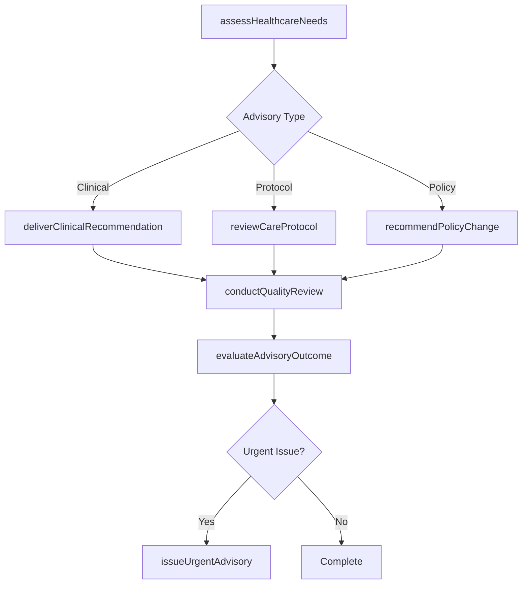
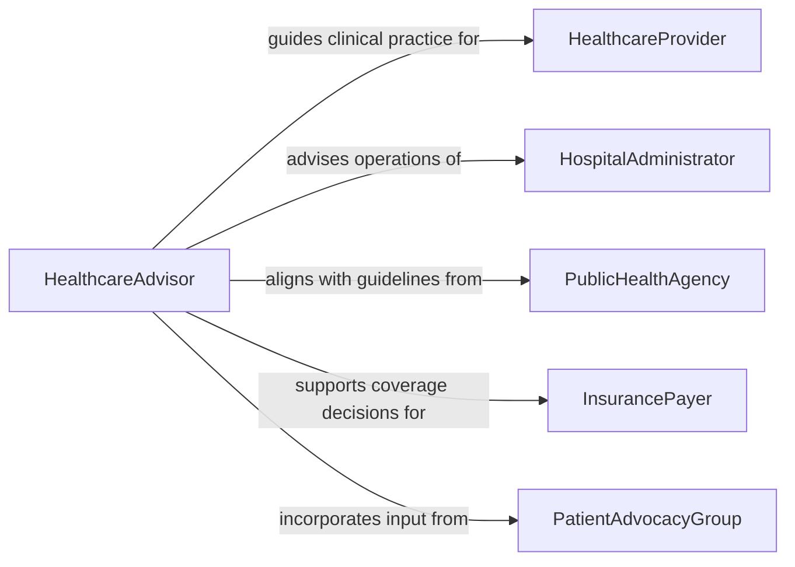

# Advise Others on Healthcare Matters

> Business-as-Code definition for advising others on healthcare matters. Models the consultative process from health needs assessment through clinical guidance, policy recommendations, and outcome evaluation.

## Overview

Advising others on healthcare matters involves providing expert guidance to healthcare professionals, administrators, organizations, and policymakers on clinical practices, healthcare delivery, regulatory compliance, and quality improvement. This definition exposes actions for assessing healthcare needs, delivering clinical recommendations, reviewing care protocols, and evaluating advisory outcomes. Events enable automated routing of urgent recommendations, while searches surface clinical guidelines, regulatory requirements, and advisory engagement histories.

## Actors

| Actor | Description |
|-------|-------------|
| HealthcareProvider | Receives clinical guidance and best-practice recommendations |
| HospitalAdministrator | Seeks advice on healthcare operations and policy decisions |
| PublicHealthAgency | Sets guidelines and requests advisory input on population health |
| InsurancePayer | Evaluates clinical recommendations for coverage determinations |
| PatientAdvocacyGroup | Represents patient interests in healthcare policy discussions |
| PharmaceuticalCompany | Provides drug and treatment data relevant to clinical recommendations |

## Roles

| Role | Description |
|------|-------------|
| HealthcareAdvisor | Provides expert guidance on clinical and operational healthcare matters |
| ClinicalConsultant | Delivers specialty-specific medical recommendations |
| QualityImprovementSpecialist | Advises on care standards, patient safety, and outcome metrics |
| HealthPolicyAnalyst | Evaluates healthcare policies and recommends reforms |

## Entities

| Entity | Description |
|--------|-------------|
| AdvisoryConsultation | A documented session providing healthcare guidance |
| ClinicalRecommendation | A specific recommendation on diagnosis, treatment, or care protocol |
| CareProtocol | A standardized set of procedures for managing a health condition |
| QualityMetric | A measurable indicator of healthcare service quality |
| RegulatoryGuideline | A rule or standard issued by a health regulatory authority |
| OutcomeReport | Documentation of results following advisory implementation |

## Actions

| Action | Description |
|--------|-------------|
| assessHealthcareNeeds | Evaluate the healthcare challenges or gaps requiring advisory input |
| deliverClinicalRecommendation | Provide specific guidance on diagnosis, treatment, or care delivery |
| reviewCareProtocol | Analyze existing care protocols for effectiveness and compliance |
| recommendPolicyChange | Propose modifications to healthcare policies or procedures |
| conductQualityReview | Assess care quality metrics and identify improvement opportunities |
| evaluateAdvisoryOutcome | Measure the impact of implemented recommendations |
| issueUrgentAdvisory | Communicate time-sensitive healthcare guidance |

## Events

| Event | Description |
|-------|-------------|
| healthcareNeedsAssessed | Healthcare challenges and gaps have been evaluated |
| clinicalRecommendationDelivered | A clinical recommendation has been formally provided |
| careProtocolReviewed | An existing care protocol has been analyzed |
| policyChangeRecommended | A healthcare policy modification has been proposed |
| qualityReviewCompleted | Care quality assessment and findings have been documented |
| advisoryOutcomeEvaluated | Impact of recommendations has been measured |
| urgentAdvisoryIssued | A time-sensitive advisory has been communicated |

## Searches

| Search | Description |
|--------|-------------|
| findConsultations | List advisory consultations by provider, topic, or date range |
| getClinicalGuidelines | Retrieve clinical guidelines by condition, specialty, or authority |
| getQualityMetrics | Look up quality indicators by facility, department, or measure type |
| findCareProtocols | Search care protocols by condition, version, or compliance status |

## Workflow



## Actor Relationships



## Usage

### Calling Actions

```typescript
import { adviseOthersOnHealthcareMatters } from '@headlessly/advise-others-on-healthcare-matters'

const advisor = adviseOthersOnHealthcareMatters()

// Assess healthcare needs for a facility
const assessment = await advisor.assessHealthcareNeeds({
  facility: 'Regional Medical Center',
  department: 'Emergency Medicine',
  concerns: ['patient-wait-times', 'readmission-rates', 'sepsis-protocol-adherence']
})

// Deliver a clinical recommendation
await advisor.deliverClinicalRecommendation({
  assessmentId: assessment.id,
  topic: 'Sepsis Early Detection Protocol',
  recommendation: 'Implement qSOFA scoring at triage for all patients presenting with suspected infection',
  evidenceBasis: 'Surviving Sepsis Campaign 2024 Guidelines',
  urgency: 'high'
})

// Review an existing care protocol
await advisor.reviewCareProtocol({
  protocolId: 'PROTO-SEPSIS-V3',
  reviewCriteria: ['clinical-effectiveness', 'nursing-workflow-impact', 'regulatory-compliance']
})
```

### Event-Driven Automation

```typescript
// Escalate urgent advisories to leadership
advisor.urgentAdvisoryIssued(async ({ facility, topic, urgency }) => {
  await notify({
    to: 'medical-director',
    message: `Urgent healthcare advisory for ${facility}: ${topic}`,
    priority: 'critical'
  })
})

// Schedule outcome evaluation after recommendation implementation
advisor.clinicalRecommendationDelivered(async ({ assessmentId, topic }) => {
  await scheduleTask({
    action: 'evaluateAdvisoryOutcome',
    assessmentId,
    topic,
    delay: '60d'
  })
})
```
