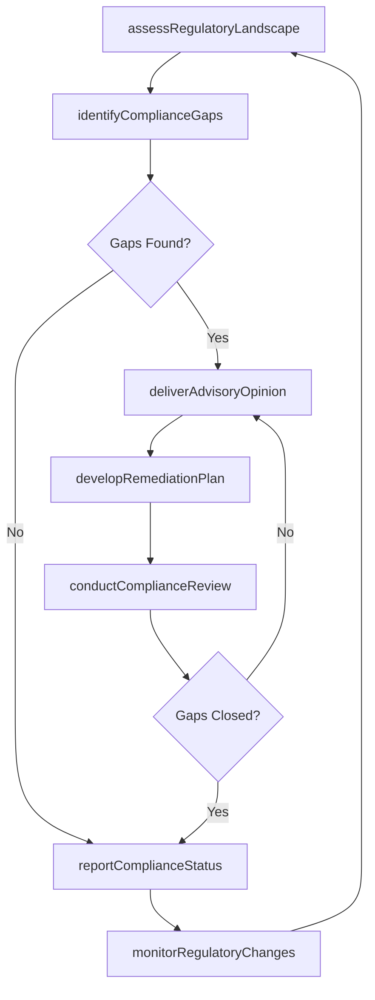
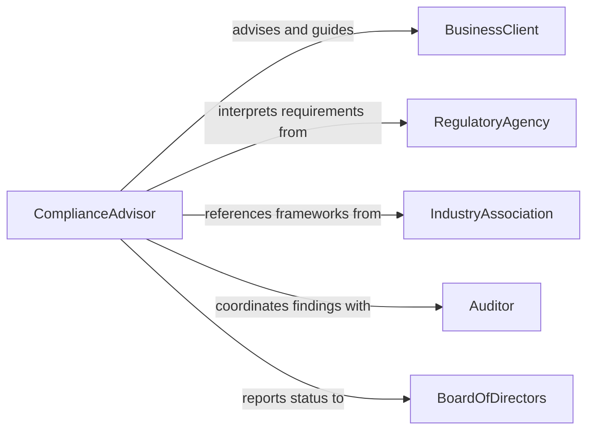

# Advise Others on Legal or Regulatory Compliance Matters

> Business-as-Code definition for advising others on legal and regulatory compliance matters. Models the compliance advisory process from regulatory landscape assessment through risk identification, guidance delivery, and compliance monitoring.

## Overview

Advising others on legal or regulatory compliance matters involves interpreting laws, regulations, and industry standards to help organizations and individuals maintain compliance. This definition exposes actions for assessing regulatory requirements, identifying compliance gaps, delivering advisory opinions, and monitoring adherence to applicable rules. Events enable automated alerting on regulatory changes and audit findings, while searches provide access to regulatory databases, compliance histories, and advisory engagement records.

## Actors

| Actor | Description |
|-------|-------------|
| BusinessClient | Seeks guidance on maintaining compliance with applicable regulations |
| RegulatoryAgency | Issues and enforces laws, rules, and compliance requirements |
| IndustryAssociation | Publishes best practices and compliance frameworks for member organizations |
| Auditor | Conducts compliance audits and reports findings |
| BoardOfDirectors | Oversees organizational governance and compliance posture |
| OutsideCounsel | Provides specialized legal opinions on complex regulatory questions |

## Roles

| Role | Description |
|------|-------------|
| ComplianceAdvisor | Interprets regulations and provides compliance guidance |
| RegulatoryAnalyst | Monitors regulatory changes and assesses organizational impact |
| ComplianceOfficer | Oversees the organization's compliance program and reporting |
| LegalCounsel | Provides formal legal opinions on compliance questions |

## Entities

| Entity | Description |
|--------|-------------|
| ComplianceAssessment | An evaluation of an organization's adherence to applicable regulations |
| RegulatoryRequirement | A specific law, rule, or standard that must be satisfied |
| ComplianceGap | An identified area where current practices fall short of requirements |
| AdvisoryOpinion | A documented interpretation or recommendation on a compliance matter |
| RemediationPlan | A structured approach to closing identified compliance gaps |
| AuditFinding | A documented observation from a compliance audit |

## Actions

| Action | Description |
|--------|-------------|
| assessRegulatoryLandscape | Survey applicable laws, regulations, and standards for the client |
| identifyComplianceGaps | Compare current practices against regulatory requirements |
| deliverAdvisoryOpinion | Provide a documented interpretation or recommendation |
| developRemediationPlan | Create an action plan to address identified compliance gaps |
| monitorRegulatoryChanges | Track updates to laws and regulations affecting the client |
| conductComplianceReview | Perform a periodic assessment of adherence to requirements |
| reportComplianceStatus | Communicate current compliance posture to stakeholders |

## Events

| Event | Description |
|-------|-------------|
| regulatoryLandscapeAssessed | Applicable regulations have been surveyed and cataloged |
| complianceGapsIdentified | Areas of non-compliance have been documented |
| advisoryOpinionDelivered | A compliance recommendation has been formally provided |
| remediationPlanDeveloped | An action plan to close gaps has been created |
| regulatoryChangeDetected | A change to applicable law or regulation has been identified |
| complianceReviewCompleted | A periodic compliance assessment has been finalized |
| complianceStatusReported | Current compliance posture has been communicated to stakeholders |

## Searches

| Search | Description |
|--------|-------------|
| findComplianceAssessments | List assessments by client, regulation, or date range |
| getRegulatoryRequirements | Retrieve requirements by jurisdiction, industry, or topic |
| getComplianceGaps | Look up identified gaps by severity, regulation, or remediation status |
| findAdvisoryOpinions | Search advisory opinions by topic, client, or date |

## Workflow



## Actor Relationships



## Usage

### Calling Actions

```typescript
import { adviseOthersOnLegalOrRegulatoryCompliance } from '@headlessly/advise-others-on-legal-or-regulatory-compliance'

const advisor = adviseOthersOnLegalOrRegulatoryCompliance()

// Assess the regulatory landscape for a client
const landscape = await advisor.assessRegulatoryLandscape({
  clientId: 'ORG-2200',
  industry: 'financial-services',
  jurisdictions: ['US-federal', 'US-NY', 'EU'],
  focusAreas: ['data-privacy', 'anti-money-laundering', 'consumer-protection']
})

// Identify compliance gaps
const gaps = await advisor.identifyComplianceGaps({
  clientId: 'ORG-2200',
  landscapeId: landscape.id,
  currentPolicies: ['privacy-policy-v3', 'aml-procedures-v2'],
  benchmarkStandards: ['GDPR', 'BSA-AML', 'CCPA']
})

// Deliver an advisory opinion
await advisor.deliverAdvisoryOpinion({
  clientId: 'ORG-2200',
  topic: 'Cross-border data transfer compliance under GDPR',
  opinion: 'Current Standard Contractual Clauses require supplementary measures per Schrems II',
  recommendation: 'Implement data localization for EU customer records',
  urgency: 'high'
})
```

### Event-Driven Automation

```typescript
// Alert compliance team when regulatory changes are detected
advisor.regulatoryChangeDetected(async ({ regulation, changeType, effectiveDate }) => {
  await notify({
    to: 'compliance-team',
    message: `Regulatory change: ${regulation} - ${changeType}, effective ${effectiveDate}`,
    priority: 'high'
  })
})

// Auto-schedule compliance review after remediation
advisor.remediationPlanDeveloped(async ({ clientId, planId, targetDate }) => {
  await scheduleTask({
    action: 'conductComplianceReview',
    clientId,
    planId,
    scheduledDate: targetDate
  })
})
```
