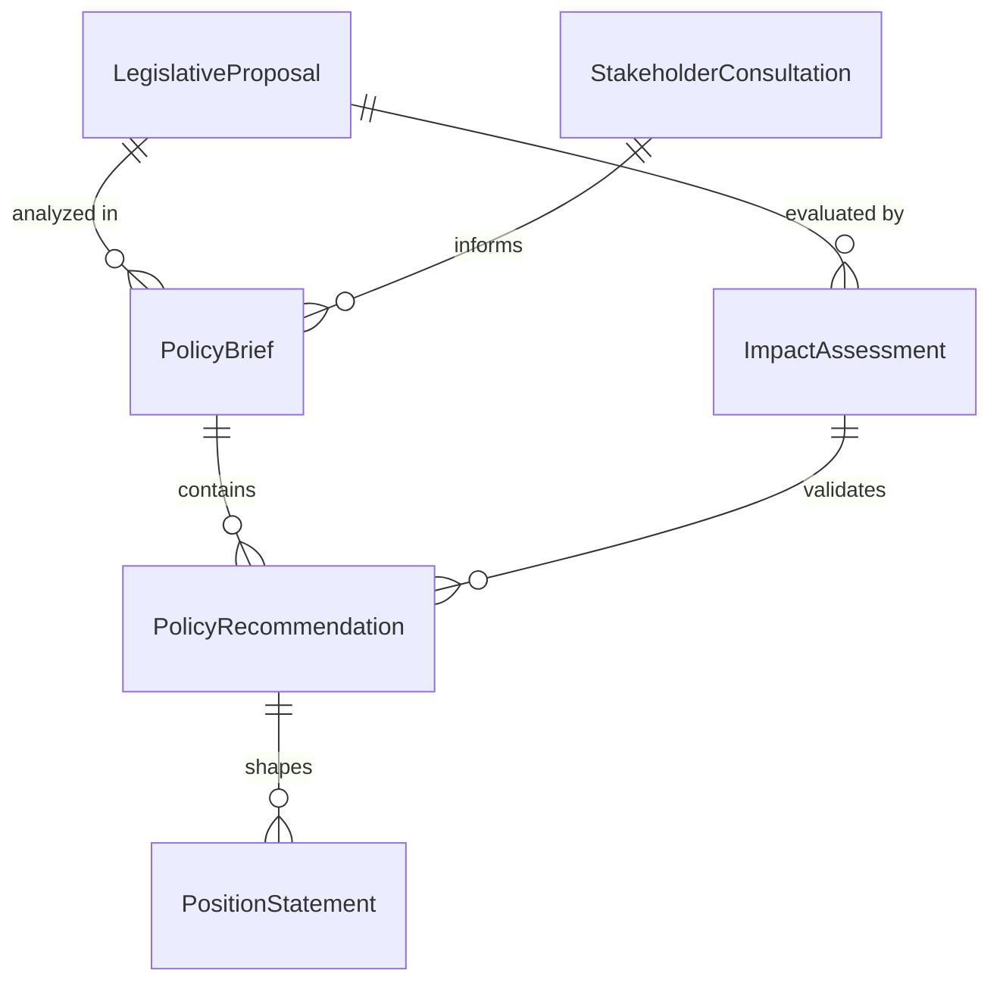
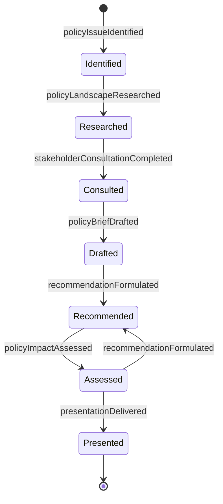
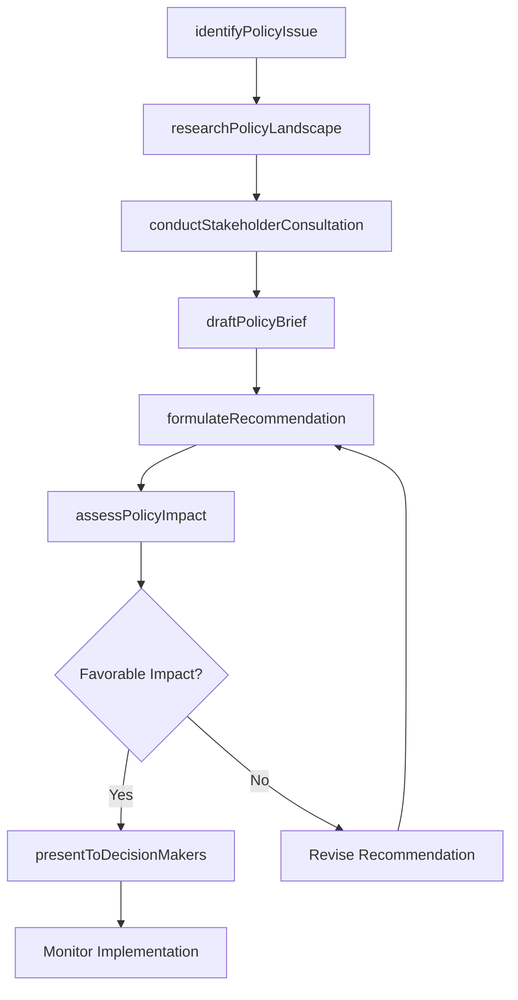
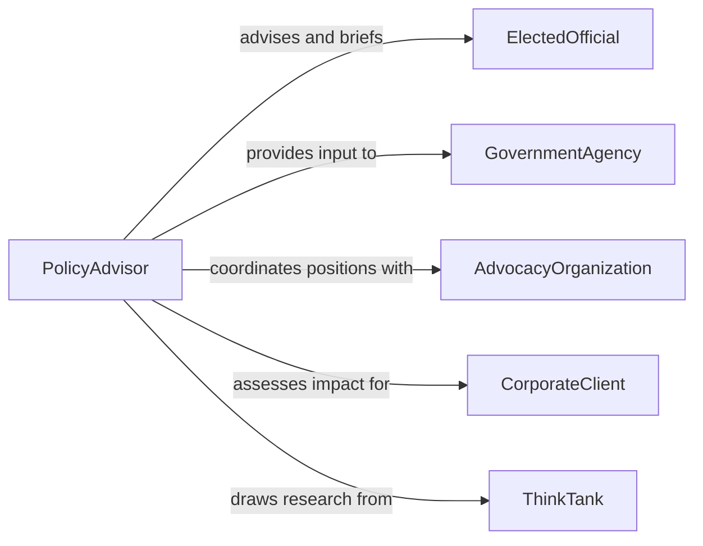

# Advise Others on Matters of Public Policy

> Business-as-Code definition for advising others on matters of public policy. Models the policy advisory process from issue identification through research, stakeholder consultation, recommendation formulation, and impact assessment.

## Overview

Advising others on matters of public policy involves researching legislative proposals, regulatory frameworks, and government initiatives to provide informed guidance to organizations, elected officials, advocacy groups, and public agencies. This definition exposes actions for analyzing policy issues, conducting stakeholder consultations, drafting policy recommendations, and evaluating implementation outcomes. Events enable automated tracking of legislative developments and advisory deliverables, while searches provide access to policy databases, legislative histories, and stakeholder engagement records.

## Actors

| Actor | Description |
|-------|-------------|
| ElectedOfficial | Seeks policy guidance for legislative decisions and constituent matters |
| GovernmentAgency | Requests advisory input on program design and regulatory development |
| AdvocacyOrganization | Engages policy advisors to advance specific legislative priorities |
| CorporateClient | Seeks guidance on how proposed policies affect business operations |
| ThinkTank | Produces research and policy analysis that informs advisory work |
| MediaOutlet | Reports on policy developments and amplifies advisory findings |

## Roles

| Role | Description |
|------|-------------|
| PolicyAdvisor | Researches issues and formulates public policy recommendations |
| LegislativeAnalyst | Evaluates pending legislation and assesses organizational impact |
| GovernmentRelationsSpecialist | Manages relationships with policymakers and advocates for positions |
| PublicAffairsDirector | Oversees strategic communication of policy positions |

## Entities

| Entity | Description |
|--------|-------------|
| PolicyBrief | A concise document summarizing a policy issue and recommended action |
| LegislativeProposal | A pending bill or regulatory change under analysis |
| StakeholderConsultation | A recorded engagement with parties affected by a policy |
| ImpactAssessment | An evaluation of economic, social, or environmental effects of a policy |
| PositionStatement | A formal organizational stance on a policy issue |
| PolicyRecommendation | A documented course of action proposed to decision-makers |

## Actions

| Action | Description |
|--------|-------------|
| identifyPolicyIssue | Surface emerging legislative or regulatory matters requiring attention |
| researchPolicyLandscape | Analyze existing laws, proposals, and precedents relevant to the issue |
| conductStakeholderConsultation | Gather input from affected parties and interest groups |
| draftPolicyBrief | Prepare a concise analysis with background, options, and recommendations |
| formulateRecommendation | Develop a specific course of action for decision-makers |
| assessPolicyImpact | Evaluate the projected effects of a proposed or enacted policy |
| presentToDecisionMakers | Deliver advisory findings and recommendations to officials or leadership |

## Events

| Event | Description |
|-------|-------------|
| policyIssueIdentified | An emerging policy matter has been flagged for analysis |
| policyLandscapeResearched | Relevant laws, proposals, and precedents have been analyzed |
| stakeholderConsultationCompleted | Input from affected parties has been gathered and documented |
| policyBriefDrafted | A policy analysis document has been prepared |
| recommendationFormulated | A specific course of action has been developed |
| policyImpactAssessed | Projected effects of the policy have been evaluated |
| presentationDelivered | Advisory findings have been delivered to decision-makers |

## Searches

| Search | Description |
|--------|-------------|
| findPolicyBriefs | List policy briefs by topic, jurisdiction, or date range |
| getLegislativeProposals | Retrieve pending legislation by jurisdiction, status, or subject area |
| getStakeholderConsultations | Look up consultation records by issue, stakeholder, or date |
| findImpactAssessments | Search impact evaluations by policy, projected effect, or scope |

## Entity Relationships



## State Diagram



## Workflow



## Actor Relationships



## Usage

### Calling Actions

```typescript
import { adviseOthersOnMattersOfPublicPolicy } from '@headlessly/advise-others-on-matters-of-public-policy'

const advisor = adviseOthersOnMattersOfPublicPolicy()

// Identify an emerging policy issue
const issue = await advisor.identifyPolicyIssue({
  topic: 'AI Transparency Requirements',
  jurisdiction: 'US-federal',
  trigger: 'Senate Bill S.4127 introduced',
  affectedSectors: ['technology', 'financial-services', 'healthcare']
})

// Research the policy landscape
await advisor.researchPolicyLandscape({
  issueId: issue.id,
  scope: ['existing-state-laws', 'eu-ai-act-comparison', 'industry-self-regulation'],
  sources: ['congressional-research-service', 'brookings', 'nist-ai-rmf']
})

// Draft a policy brief
await advisor.draftPolicyBrief({
  issueId: issue.id,
  title: 'Federal AI Transparency: Analysis of S.4127',
  sections: ['background', 'key-provisions', 'sector-impact', 'options', 'recommendation'],
  audience: 'corporate-government-relations'
})
```

### Event-Driven Automation

```typescript
// Alert government relations team on new legislative proposals
advisor.policyIssueIdentified(async ({ topic, jurisdiction, trigger }) => {
  await notify({
    to: 'government-relations',
    message: `New policy issue: ${topic} in ${jurisdiction} - triggered by ${trigger}`
  })
})

// Schedule impact assessment after recommendation is formulated
advisor.recommendationFormulated(async ({ issueId, recommendation }) => {
  await scheduleTask({
    action: 'assessPolicyImpact',
    issueId,
    scope: 'full-economic-analysis',
    delay: '14d'
  })
})
```
