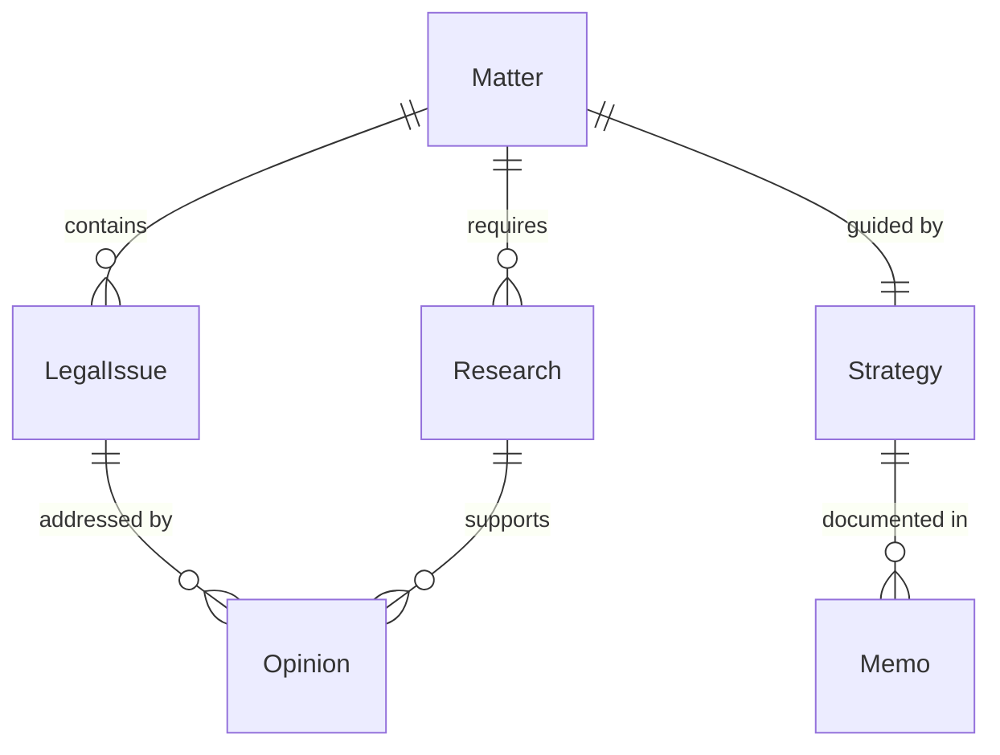
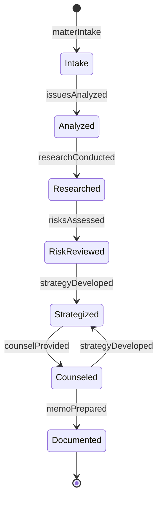
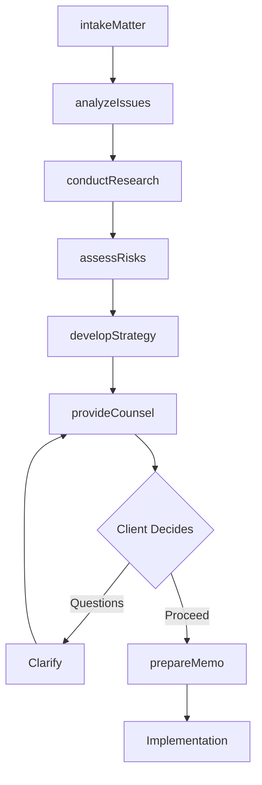
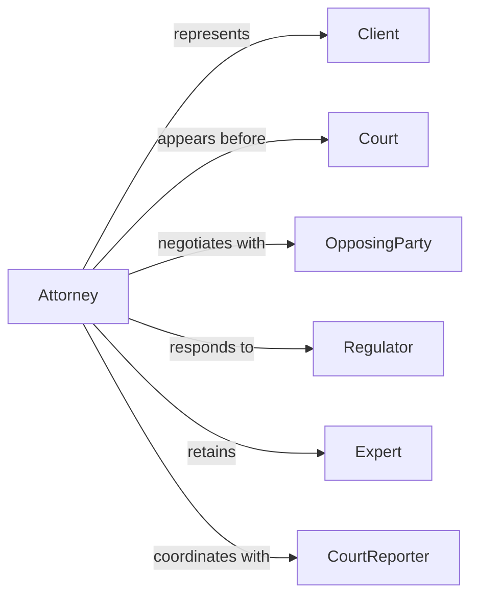

# Provide Legal Advice Clients

> Business-as-Code definition for legal advisory services. Models the complete consultation process from matter intake through legal analysis, strategy development, and counsel delivery across civil, corporate, and transactional law.

## Overview

Legal advisory services involve analyzing client situations, researching applicable law, and providing counsel on rights, obligations, and strategies. This definition exposes actions for matter evaluation, legal research, and opinion preparation, along with events for tracking advisory work and client decisions.

## Actors

| Actor | Description |
|-------|-------------|
| Client | Individual or organization seeking legal counsel |
| Court | Judicial body with jurisdiction over matters |
| OpposingParty | Counterparty in dispute or transaction |
| Regulator | Government agency enforcing laws |
| Expert | Specialist providing technical testimony or analysis |
| CourtReporter | Professional documenting proceedings |

## Roles

| Role | Description |
|------|-------------|
| Attorney | Provides legal counsel and representation |
| AssociateAttorney | Conducts research and drafts documents |
| Paralegal | Assists with case preparation and documentation |
| LegalAnalyst | Researches precedents and statutory law |

## Entities

| Entity | Description |
|--------|-------------|
| Matter | Legal issue or transaction requiring counsel |
| LegalIssue | Specific question of law or rights |
| Research | Analysis of statutes, cases, and regulations |
| Opinion | Formal legal advice on rights or obligations |
| Strategy | Recommended approach to achieve client goals |
| Memo | Written analysis of legal questions |

## Actions

| Action | Description |
|--------|-------------|
| intakeMatter | Document client situation and legal questions |
| analyzeIssues | Identify legal problems and applicable law |
| conductResearch | Investigate statutes, cases, and precedents |
| assessRisks | Evaluate legal exposure and liability |
| developStrategy | Create approach to achieve client objectives |
| provideCounsel | Deliver legal advice and recommendations |
| prepareMemo | Document legal analysis and opinion |

## Events

| Event | Description |
|-------|-------------|
| matterIntake | Client situation documented |
| issuesAnalyzed | Legal problems identified |
| researchConducted | Law and precedent investigated |
| risksAssessed | Legal exposure evaluated |
| strategyDeveloped | Approach created |
| counselProvided | Legal advice delivered |
| memoPrepared | Analysis documented |

## Searches

| Search | Description |
|--------|-------------|
| findMatters | List matters by client, type, or status |
| getOpinions | Retrieve legal advice by issue or outcome |
| getResearch | Find precedent research by topic or jurisdiction |
| getMemos | List written analyses by attorney or date |

## Entity Relationships



## State Diagram



## Workflow



## Actor Relationships



## Usage

### Calling Actions

```typescript
import { provideLegalAdviceClients } from '@headlessly/provide-legal-advice-clients'

const advisory = provideLegalAdviceClients()

// Intake new employment matter
const matter = await advisory.intakeMatter({
  clientId: 'client-654',
  issueType: 'Employment termination',
  facts: 'Client terminated after reporting safety violations',
  jurisdiction: 'California',
  urgency: 'High'
})

// Analyze legal issues
const analysis = await advisory.analyzeIssues({
  matterId: matter.id,
  claimedViolations: ['Wrongful termination', 'Retaliation'],
  applicableLaws: ['FEHA', 'Cal Labor Code', 'OSHA whistleblower']
})

// Conduct research on retaliation claims
const research = await advisory.conductResearch({
  matterId: matter.id,
  issues: ['Protected activity', 'Causal connection', 'Remedies'],
  jurisdiction: 'Ninth Circuit'
})
```

### Event-Driven Automation

```typescript
// Generate engagement letter when matter intake completes
advisory.matterIntake(async ({ matterId, client }) => {
  await generateDocument({
    template: 'engagement-letter',
    matter: matterId,
    deliverTo: client.email,
    requireSignature: true
  })
})

// Alert on high-risk matters
advisory.risksAssessed(async ({ matterId, risks }) => {
  if (risks.liabilityExposure > 1000000) {
    await escalate({
      to: 'managing-partner',
      priority: 'high',
      message: `Matter ${matterId} has significant liability exposure`,
      amount: formatCurrency(risks.liabilityExposure)
    })
  }
})
```
