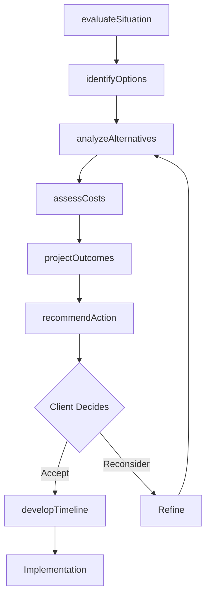
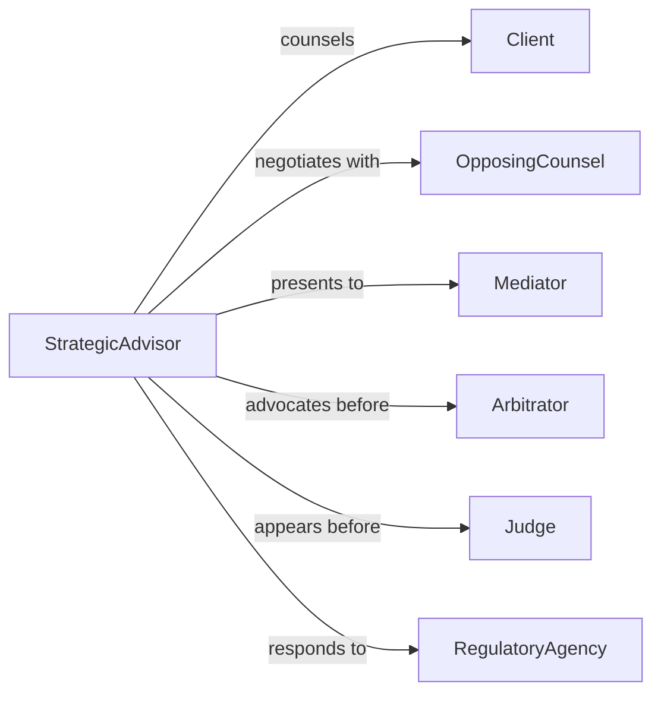

# Recommend Legal Actions

> Business-as-Code definition for legal strategy advisory services. Models the complete process from situation analysis through action evaluation, recommendation development, and strategic counsel on litigation, transactions, and compliance.

## Overview

Legal action advisory involves evaluating available remedies, assessing strategic options, and recommending specific legal steps to achieve client objectives. This definition exposes actions for option analysis, strategy comparison, and recommendation development, along with events for tracking strategic decisions and outcomes.

## Actors

| Actor | Description |
|-------|-------------|
| Client | Party seeking guidance on legal actions |
| OpposingCounsel | Attorney representing adverse party |
| Mediator | Neutral third party facilitating settlement |
| Arbitrator | Private adjudicator resolving disputes |
| Judge | Judicial officer presiding over cases |
| RegulatoryAgency | Government body enforcing compliance |

## Roles

| Role | Description |
|------|-------------|
| StrategicAdvisor | Counsels on optimal legal approach |
| LitigationCounsel | Guides dispute resolution strategy |
| TransactionCounsel | Advises on deal structure and execution |
| ComplianceAdvisor | Recommends regulatory response strategy |

## Entities

| Entity | Description |
|--------|-------------|
| Situation | Factual and legal context requiring action |
| Option | Potential legal remedy or approach |
| Recommendation | Advised course of action with rationale |
| Strategy | Comprehensive plan across multiple actions |
| Alternative | Dispute resolution method outside litigation |
| Timeline | Projected schedule for legal actions |

## Actions

| Action | Description |
|--------|-------------|
| evaluateSituation | Assess facts, law, and client objectives |
| identifyOptions | Catalog available legal remedies and approaches |
| analyzeAlternatives | Compare costs, risks, and benefits of options |
| recommendAction | Advise specific legal step to take |
| developTimeline | Create schedule for implementing actions |
| assessCosts | Estimate financial resources required |
| projectOutcomes | Forecast likely results of actions |

## Events

| Event | Description |
|-------|-------------|
| situationEvaluated | Context assessed |
| optionsIdentified | Remedies cataloged |
| alternativesAnalyzed | Options compared |
| actionRecommended | Specific step advised |
| timelineDeveloped | Schedule created |
| costsAssessed | Financial requirements estimated |
| outcomesProjected | Results forecasted |

## Searches

| Search | Description |
|--------|-------------|
| findSituations | List matters by client, type, or urgency |
| getOptions | Retrieve remedies by situation or viability |
| getRecommendations | Find advised actions by status or outcome |
| getStrategies | List comprehensive plans by complexity |

## Workflow



## Actor Relationships



## Usage

### Calling Actions

```typescript
import { recommendLegalActions } from '@headlessly/recommend-legal-actions'

const advisory = recommendLegalActions()

// Evaluate breach of contract situation
const situation = await advisory.evaluateSituation({
  matterId: 'matter-987',
  disputeType: 'Breach of contract',
  damages: 850000,
  contractTerms: 'Exclusive distribution agreement',
  clientGoals: ['Recover damages', 'Maintain relationship if possible']
})

// Identify available options
const options = await advisory.identifyOptions({
  situationId: situation.id,
  remedies: ['Litigation', 'Mediation', 'Arbitration', 'Negotiated settlement'],
  jurisdiction: 'Delaware'
})

// Recommend specific action
const recommendation = await advisory.recommendAction({
  situationId: situation.id,
  advisedAction: 'Mediation',
  rationale: 'Preserves business relationship while recovering substantial damages',
  alternativeConsidered: 'Litigation if mediation fails'
})
```

### Event-Driven Automation

```typescript
// Generate cost-benefit analysis when recommendation made
advisory.actionRecommended(async ({ situationId, recommendation }) => {
  await generateReport({
    template: 'cost-benefit-analysis',
    data: {
      action: recommendation.advisedAction,
      costs: recommendation.estimatedCosts,
      benefits: recommendation.projectedOutcome,
      risks: recommendation.riskFactors
    },
    deliverTo: recommendation.clientId
  })
})

// Alert on high-risk recommendations
advisory.outcomesProjected(async ({ situationId, projections }) => {
  if (projections.successProbability < 50 && projections.costs > 100000) {
    await notify({
      to: 'review-committee',
      priority: 'high',
      message: `High-risk recommendation for ${situationId}: <50% success, >$100K cost`
    })
  }
})
```
