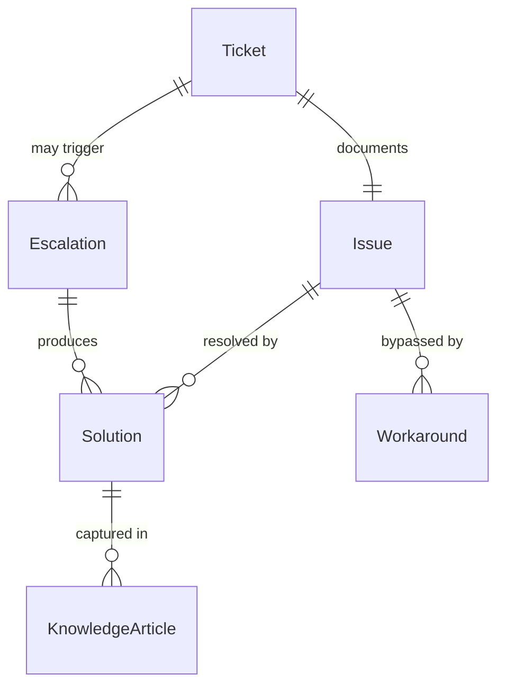
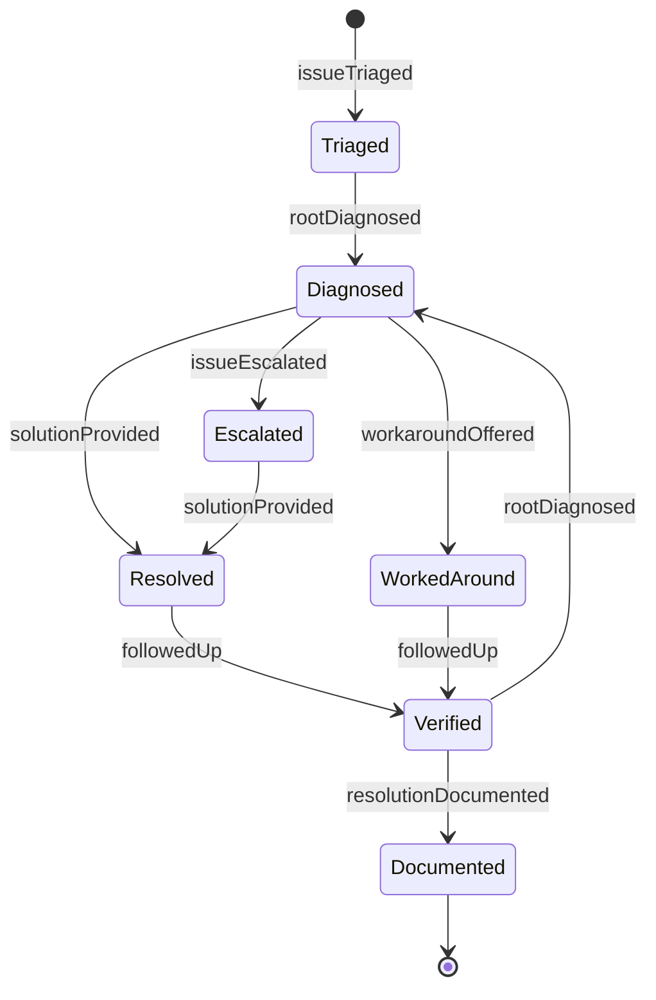
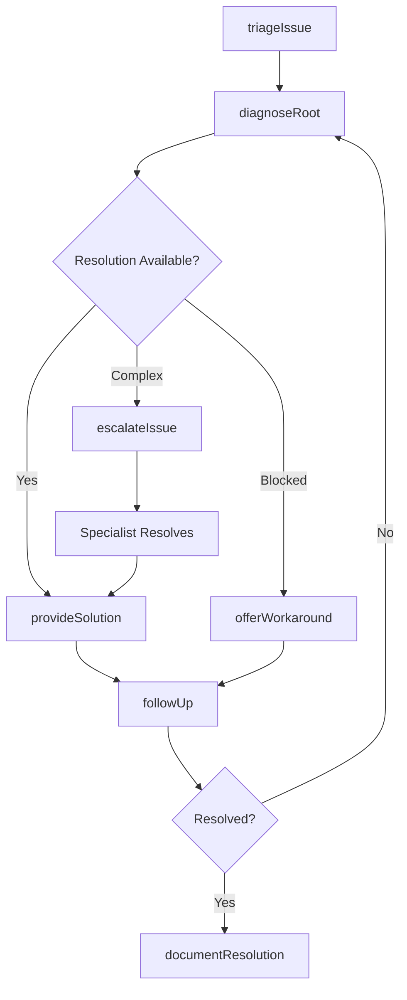
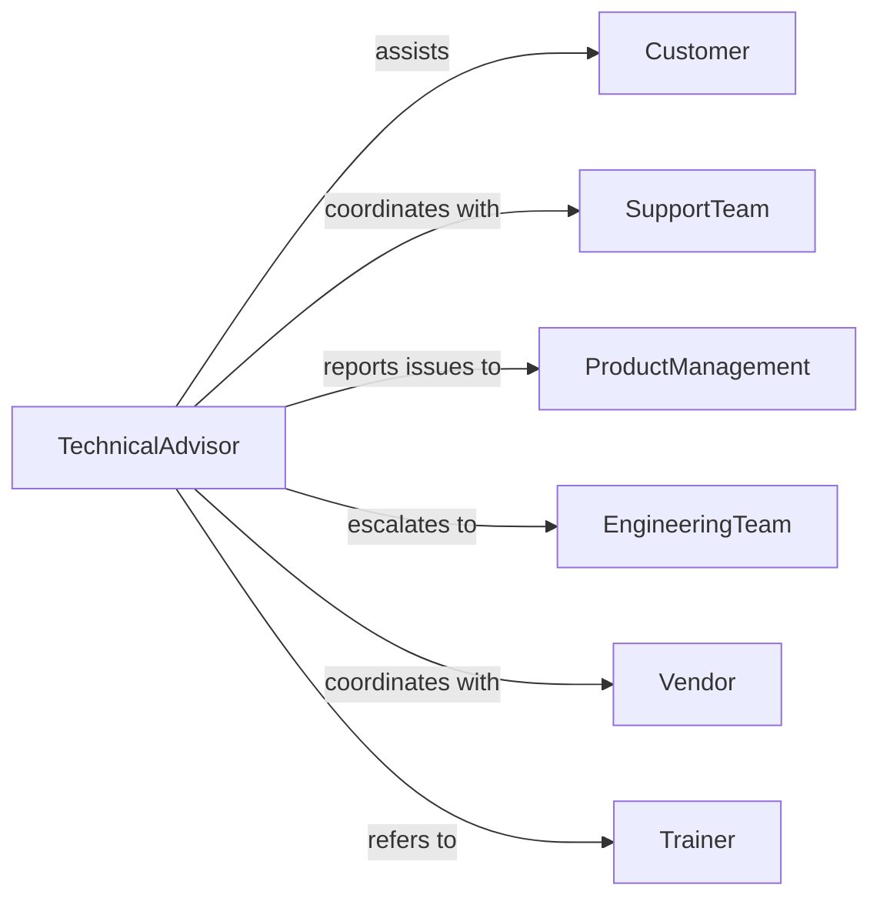

# Advise Customers Technical Procedural Issues

> Business-as-Code definition for technical support advisory services. Models the complete consultation process from issue diagnosis through troubleshooting guidance, solution implementation, and follow-up support for product and service users.

## Overview

Technical advisory services involve diagnosing customer issues, providing troubleshooting guidance, and resolving technical and procedural problems. This definition exposes actions for issue triage, solution development, and knowledge capture, along with events for tracking support interactions and resolution outcomes.

## Actors

| Actor | Description |
|-------|-------------|
| Customer | User experiencing technical or procedural issue |
| SupportTeam | Group providing technical assistance |
| ProductManagement | Team responsible for product features |
| EngineeringTeam | Developers resolving software issues |
| Vendor | Third-party provider of integrated systems |
| Trainer | Professional delivering user education |

## Roles

| Role | Description |
|------|-------------|
| TechnicalAdvisor | Provides expert troubleshooting guidance |
| SupportSpecialist | Handles customer technical inquiries |
| EscalationEngineer | Resolves complex technical problems |
| KnowledgeManager | Maintains support documentation |

## Entities

| Entity | Description |
|--------|-------------|
| Ticket | Record of customer issue and resolution effort |
| Issue | Specific technical or procedural problem |
| Solution | Step-by-step resolution to customer problem |
| Workaround | Temporary method to bypass issue |
| KnowledgeArticle | Documented guidance for common issues |
| Escalation | Transfer of complex issue to specialist |

## Actions

| Action | Description |
|--------|-------------|
| triageIssue | Assess problem severity and complexity |
| diagnoseRoot | Identify underlying cause of issue |
| provideSolution | Deliver step-by-step resolution guidance |
| offerWorkaround | Suggest temporary bypass for issue |
| escalateIssue | Transfer problem to specialist or engineering |
| documentResolution | Capture solution for knowledge base |
| followUp | Verify issue resolution and customer satisfaction |

## Events

| Event | Description |
|-------|-------------|
| issueTriaged | Problem assessed |
| rootDiagnosed | Cause identified |
| solutionProvided | Guidance delivered |
| workaroundOffered | Temporary fix suggested |
| issueEscalated | Problem transferred to specialist |
| resolutionDocumented | Solution captured |
| followedUp | Resolution verified |

## Searches

| Search | Description |
|--------|-------------|
| findTickets | List support cases by status, customer, or product |
| getIssues | Retrieve problems by category or severity |
| getSolutions | Find resolutions by issue type or effectiveness |
| getArticles | List knowledge base content by topic |

## Entity Relationships



## State Diagram



## Workflow



## Actor Relationships



## Usage

### Calling Actions

```typescript
import { adviseCustomersTechnicalProceduralIssues } from '@headlessly/advise-customers-technical-procedural-issues'

const advisory = adviseCustomersTechnicalProceduralIssues()

// Triage customer issue
const ticket = await advisory.triageIssue({
  customerId: 'cust-321',
  product: 'Enterprise Analytics Platform',
  issue: 'Unable to export dashboard to PDF',
  severity: 'Medium',
  impactedUsers: 1
})

// Diagnose root cause
const diagnosis = await advisory.diagnoseRoot({
  ticketId: ticket.id,
  reproductionSteps: ['Open dashboard', 'Click Export', 'Select PDF'],
  errorMessage: 'Export failed: timeout error',
  environment: 'Chrome 119, Windows 11'
})

// Provide solution
const solution = await advisory.provideSolution({
  ticketId: ticket.id,
  steps: [
    'Clear browser cache',
    'Disable browser extensions',
    'Reduce dashboard complexity by hiding unused widgets',
    'Retry export'
  ],
  estimatedTime: '5 minutes'
})
```

### Event-Driven Automation

```typescript
// Send solution instructions when provided
advisory.solutionProvided(async ({ ticketId, solution }) => {
  await sendEmail({
    to: solution.customerEmail,
    subject: `Solution for Ticket ${ticketId}`,
    template: 'solution-steps',
    data: solution
  })
})

// Alert engineering on recurring issues
advisory.issueEscalated(async ({ ticketId, issue }) => {
  const similarTickets = await findTickets({ issue: issue.type, days: 7 })
  if (similarTickets.length > 5) {
    await createBug({
      assignedTo: 'product-team',
      title: `Recurring issue: ${issue.type}`,
      description: `${similarTickets.length} tickets in last 7 days`,
      priority: 'high'
    })
  }
})
```
