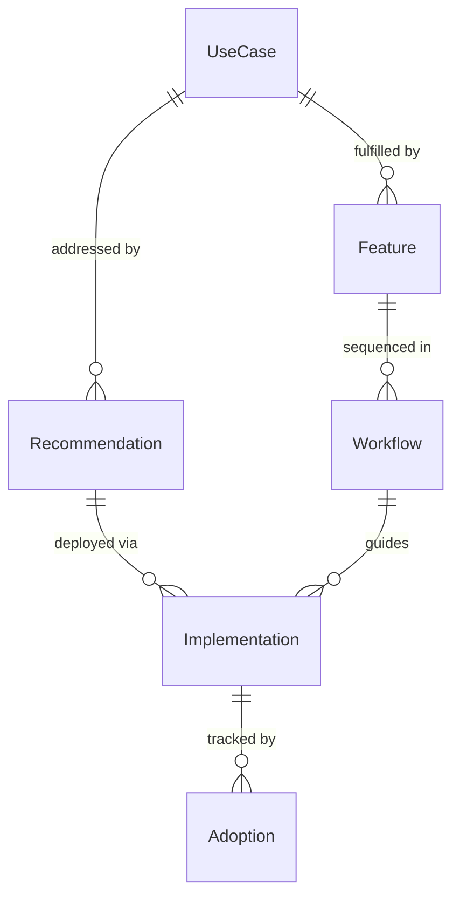
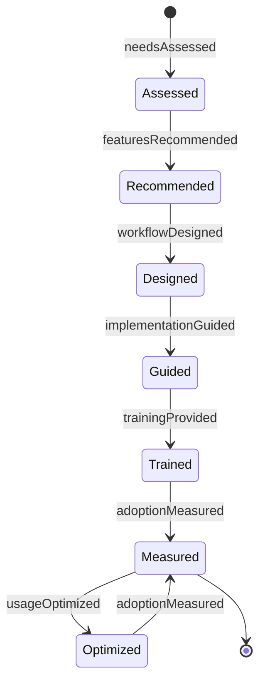
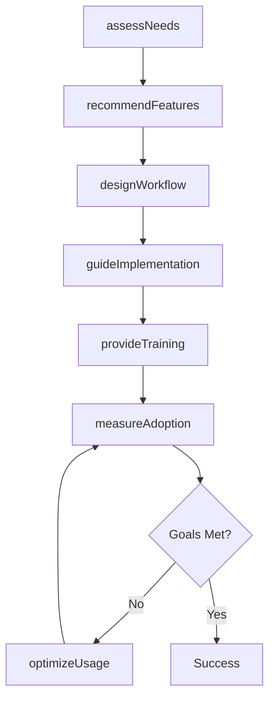
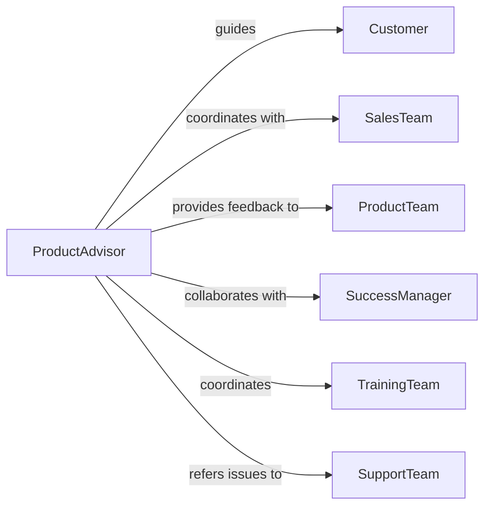

# Advise Customers Use Products Services

> Business-as-Code definition for product usage advisory services. Models the complete consultation process from needs assessment through feature guidance, implementation recommendations, and optimization strategies for maximizing product value.

## Overview

Product advisory services involve understanding customer needs, recommending appropriate features, and guiding optimal product usage. This definition exposes actions for needs analysis, feature matching, and usage optimization, along with events for tracking customer adoption and success outcomes.

## Actors

| Actor | Description |
|-------|-------------|
| Customer | User seeking to maximize product value |
| SalesTeam | Group that sold product to customer |
| ProductTeam | Team developing and enhancing product |
| SuccessManager | Professional managing customer relationship |
| TrainingTeam | Group delivering product education |
| SupportTeam | Team handling technical issues |

## Roles

| Role | Description |
|------|-------------|
| ProductAdvisor | Guides customers on optimal product usage |
| SolutionConsultant | Recommends product configurations |
| AdoptionSpecialist | Drives feature utilization |
| UsageAnalyst | Analyzes product usage patterns |

## Entities

| Entity | Description |
|--------|-------------|
| UseCase | Specific customer business need or goal |
| Feature | Product capability available to customer |
| Recommendation | Advised approach to using product |
| Implementation | Planned rollout of product features |
| Workflow | Sequence of product actions for business process |
| Adoption | Metrics tracking customer product usage |

## Actions

| Action | Description |
|--------|-------------|
| assessNeeds | Understand customer business objectives |
| recommendFeatures | Suggest product capabilities for customer needs |
| designWorkflow | Create optimal sequence of product actions |
| guideImplementation | Advise on rollout approach and timeline |
| provideTraining | Deliver education on product usage |
| optimizeUsage | Identify opportunities to increase product value |
| measureAdoption | Track customer feature utilization |

## Events

| Event | Description |
|-------|-------------|
| needsAssessed | Customer objectives understood |
| featuresRecommended | Capabilities suggested |
| workflowDesigned | Action sequence created |
| implementationGuided | Rollout advised |
| trainingProvided | Education delivered |
| usageOptimized | Value opportunities identified |
| adoptionMeasured | Utilization tracked |

## Searches

| Search | Description |
|--------|-------------|
| findCustomers | List clients by product, industry, or adoption |
| getUseCases | Retrieve needs by objective or feature |
| getRecommendations | Find advice by customer or status |
| getWorkflows | List action sequences by business process |

## Entity Relationships



## State Diagram



## Workflow



## Actor Relationships



## Usage

### Calling Actions

```typescript
import { adviseCustomersUseProductsServices } from '@headlessly/advise-customers-use-products-services'

const advisory = adviseCustomersUseProductsServices()

// Assess customer needs
const assessment = await advisory.assessNeeds({
  customerId: 'cust-456',
  product: 'Marketing Automation Platform',
  objectives: ['Increase email engagement', 'Automate lead scoring', 'Improve conversion rates'],
  currentState: 'Using basic email campaigns only'
})

// Recommend features for needs
const recommendation = await advisory.recommendFeatures({
  assessmentId: assessment.id,
  features: [
    'A/B testing',
    'Behavioral triggers',
    'Lead scoring automation',
    'Advanced segmentation'
  ],
  priority: 'High impact, easy to implement'
})

// Design workflow for lead nurturing
const workflow = await advisory.designWorkflow({
  customerId: 'cust-456',
  process: 'Lead nurturing',
  steps: [
    'Capture lead via form',
    'Score based on profile data',
    'Assign to segment',
    'Trigger email sequence',
    'Update score on engagement',
    'Notify sales at threshold'
  ]
})
```

### Event-Driven Automation

```typescript
// Schedule follow-up when implementation guided
advisory.implementationGuided(async ({ customerId, implementation }) => {
  const checkInDate = addDays(implementation.startDate, 7)
  await scheduleTask({
    date: checkInDate,
    action: 'Check implementation progress',
    assignedTo: implementation.advisorId,
    details: `Follow up on ${implementation.features.join(', ')}`
  })
})

// Alert on low adoption
advisory.adoptionMeasured(async ({ customerId, adoption }) => {
  if (adoption.activeUsers < adoption.licensedUsers * 0.5) {
    await notify({
      to: 'customer-success-team',
      priority: 'medium',
      message: `Customer ${customerId} has <50% user activation`,
      action: 'Schedule optimization consultation'
    })
  }
})
```
