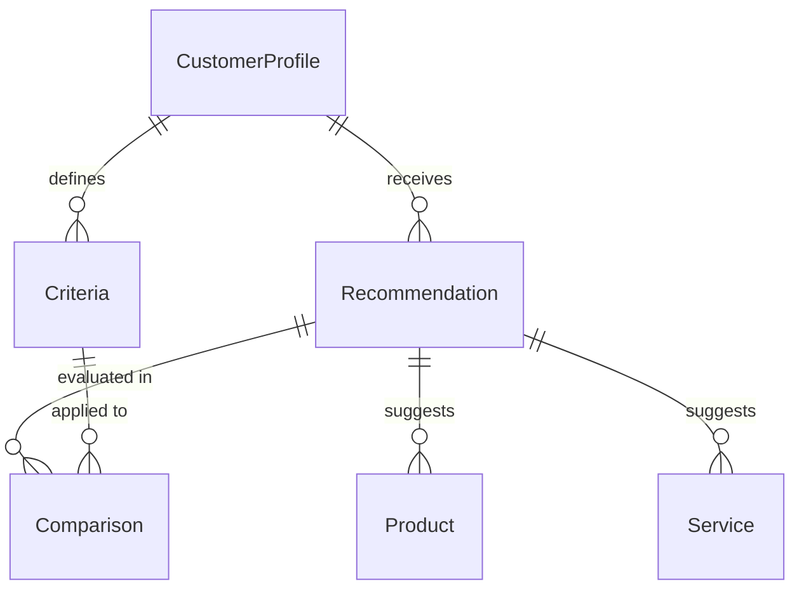
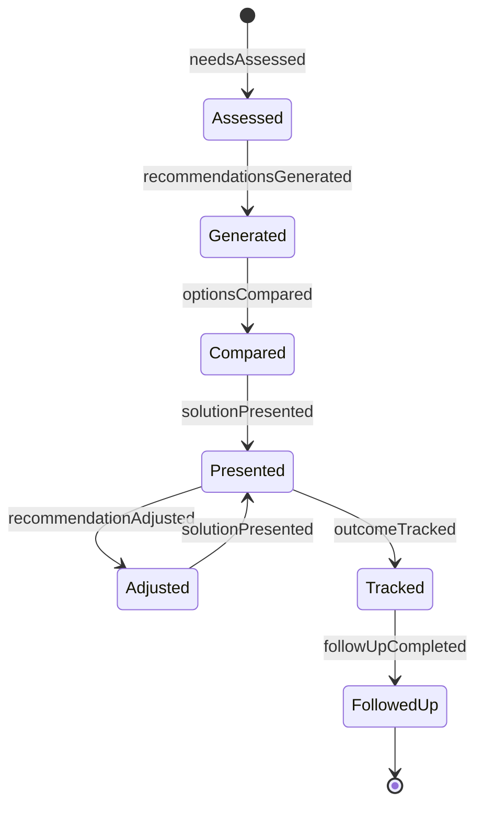
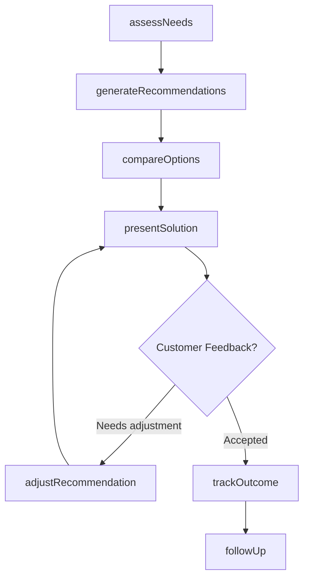
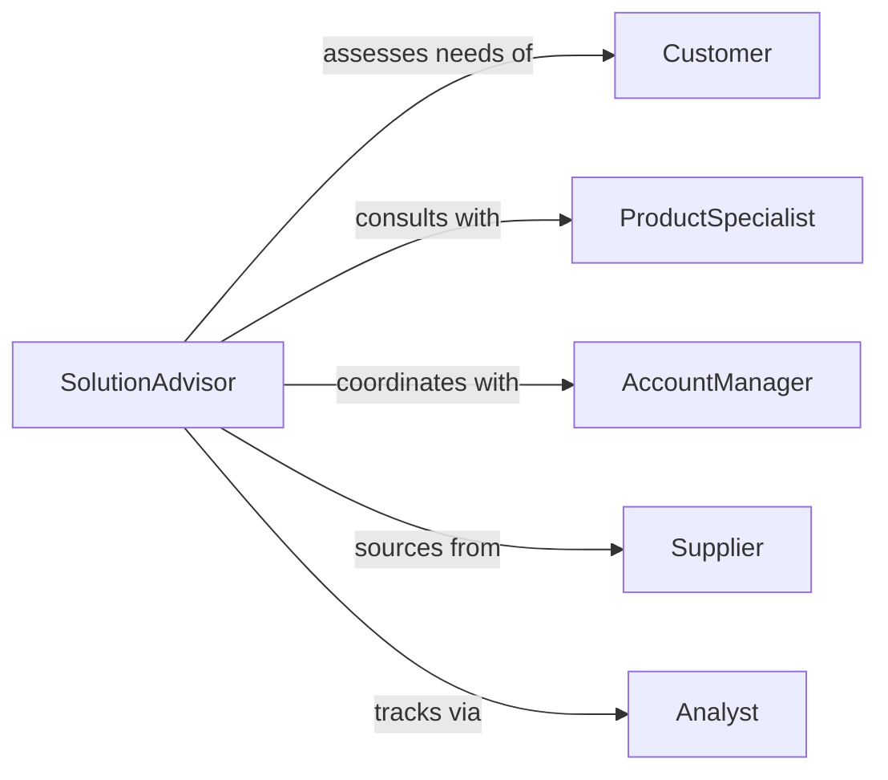

# Recommend Products Services Customers

> Business-as-Code definition for product and service recommendations. Provides personalized guidance to customers based on needs assessment, preferences, and purchase history.

## Overview

Product and service recommendation enables sales professionals and advisors to match customer needs with optimal solutions. This definition models the recommendation lifecycle from customer profiling through solution presentation and follow-up tracking.

## Actors

| Actor | Description |
|-------|-------------|
| Customer | Seeks advice on product or service selection |
| SalesRepresentative | Provides recommendations based on customer needs |
| ProductManager | Maintains product catalog and positioning |
| Supplier | Provides product inventory and specifications |
| ServiceProvider | Delivers services recommended to customers |
| Competitor | Offers alternative products considered in recommendations |

## Roles

| Role | Description |
|------|-------------|
| SolutionAdvisor | Analyzes customer needs and recommends solutions |
| ProductSpecialist | Expert on specific product categories |
| AccountManager | Manages customer relationship and follow-up |
| Analyst | Tracks recommendation effectiveness and outcomes |

## Entities

| Entity | Description |
|--------|-------------|
| Recommendation | A suggested product or service for a customer |
| CustomerProfile | Customer demographics, preferences, and history |
| Product | An item available for sale or use |
| Service | A deliverable service offering |
| Criteria | Requirements and preferences for recommendations |
| Comparison | Side-by-side analysis of options |

## Actions

| Action | Description |
|--------|-------------|
| assessNeeds | Evaluate customer requirements and preferences |
| generateRecommendations | Create personalized product or service suggestions |
| compareOptions | Analyze multiple alternatives side-by-side |
| presentSolution | Communicate recommendations to customer |
| adjustRecommendation | Refine suggestions based on feedback |
| trackOutcome | Record customer decision and satisfaction |
| followUp | Check customer satisfaction after purchase |

## Events

| Event | Description |
|-------|-------------|
| needsAssessed | Customer requirements have been evaluated |
| recommendationsGenerated | Personalized suggestions have been created |
| optionsCompared | Alternative solutions have been analyzed |
| solutionPresented | Recommendations have been shared with customer |
| recommendationAdjusted | Suggestions have been refined based on feedback |
| outcomeTracked | Customer decision has been recorded |
| followUpCompleted | Post-purchase satisfaction has been checked |

## Searches

| Search | Description |
|--------|-------------|
| findRecommendations | List recommendations by customer, date, or status |
| getCustomerHistory | Retrieve past purchases and preferences |
| searchProducts | Find products matching specific criteria |
| getEffectiveness | Analyze recommendation conversion rates |

## Entity Relationships



## State Diagram



## Workflow



## Actor Relationships



## Usage

### Calling Actions

```typescript
import { recommendProductsServicesCustomers } from '@headlessly/recommend-products-services-customers'

const recommendations = recommendProductsServicesCustomers()

// Assess customer needs
const needs = await recommendations.assessNeeds({
  customerId: 'cust_123',
  requirements: ['budget-friendly', 'high-performance', 'warranty'],
  budget: 5000,
  timeline: '30-days'
})

// Generate personalized recommendations
const options = await recommendations.generateRecommendations({
  customerId: 'cust_123',
  needsId: needs.id,
  maxOptions: 5,
  prioritize: 'value'
})

// Present solution to customer
await recommendations.presentSolution({
  customerId: 'cust_123',
  recommendationIds: options.map(o => o.id),
  channel: 'in-person',
  presentedBy: 'rep_456'
})
```

### Event-Driven Automation

```typescript
// Auto-follow up after purchase
recommendations.outcomeTracked(async ({ customerId, recommendationId, accepted }) => {
  if (accepted) {
    setTimeout(() => {
      recommendations.followUp({
        customerId,
        recommendationId,
        method: 'email'
      })
    }, 7 * 24 * 60 * 60 * 1000) // 7 days
  }
})

// Alert specialists on complex requirements
recommendations.needsAssessed(async ({ customerId, requirements }) => {
  const complexityScore = calculateComplexity(requirements)
  if (complexityScore > 8) {
    await notify({
      to: 'product-specialists',
      message: `High-complexity customer needs assessment: ${customerId}`
    })
  }
})
```
