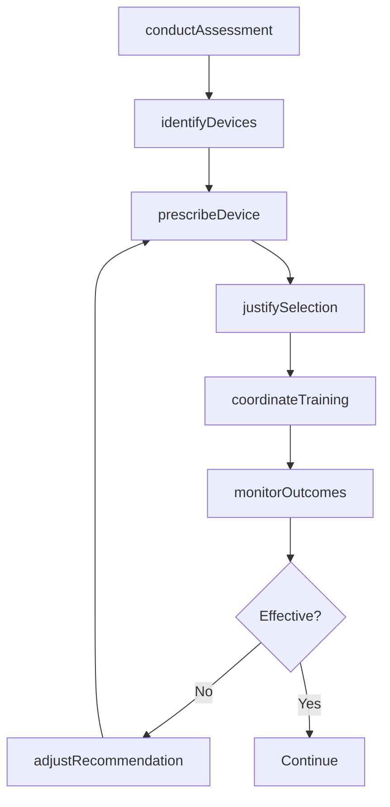
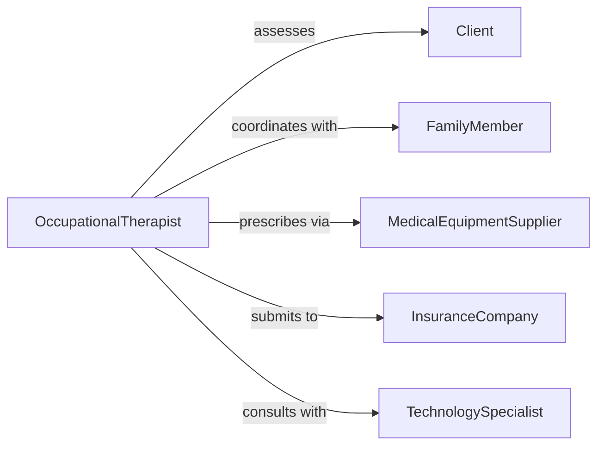

# Recommend Types Assistive Devices

> Business-as-Code definition for assistive device recommendations. Matches individuals with disabilities to appropriate assistive technologies based on functional needs, lifestyle, and clinical assessment.

## Overview

Assistive device recommendation involves evaluating individual capabilities, environmental factors, and activity goals to prescribe appropriate adaptive equipment. This definition models the clinical assessment, device selection, training coordination, and outcome monitoring process.

## Actors

| Actor | Description |
|-------|-------------|
| Client | Individual with disability seeking assistive technology |
| CareProvider | Medical professional or therapist conducting assessment |
| FamilyMember | Supports client in device selection and use |
| MedicalEquipmentSupplier | Provides assistive devices and equipment |
| InsuranceCompany | Covers costs of prescribed devices |
| DeviceManufacturer | Produces assistive technologies and equipment |

## Roles

| Role | Description |
|------|-------------|
| OccupationalTherapist | Evaluates functional needs and recommends devices |
| PhysicalTherapist | Assesses mobility and prescribes adaptive equipment |
| CaseManager | Coordinates device procurement and training |
| TechnologySpecialist | Expert on specific assistive device categories |

## Entities

| Entity | Description |
|--------|-------------|
| Assessment | Evaluation of client functional capabilities |
| AssistiveDevice | Adaptive equipment or technology solution |
| Recommendation | Prescribed device with justification |
| FunctionalGoal | Target activity or capability to enable |
| EnvironmentProfile | Home, work, or community setting characteristics |
| TrainingPlan | Instruction for device use and maintenance |

## Actions

| Action | Description |
|--------|-------------|
| conductAssessment | Evaluate client functional abilities and needs |
| identifyDevices | Find assistive devices matching assessment results |
| prescribeDevice | Formally recommend specific assistive equipment |
| justifySelection | Document clinical rationale for device choice |
| coordinateTraining | Arrange instruction on device use |
| monitorOutcomes | Track device effectiveness and client satisfaction |
| adjustRecommendation | Modify device selection based on trial results |

## Events

| Event | Description |
|-------|-------------|
| assessmentConducted | Client functional evaluation has been completed |
| devicesIdentified | Candidate assistive devices have been found |
| devicePrescribed | Specific assistive equipment has been recommended |
| selectionJustified | Clinical rationale has been documented |
| trainingCoordinated | Device instruction has been scheduled |
| outcomesMonitored | Device effectiveness has been evaluated |
| recommendationAdjusted | Device selection has been modified |

## Searches

| Search | Description |
|--------|-------------|
| findRecommendations | List device recommendations by client or date |
| searchDevices | Find assistive devices by category or features |
| getAssessments | Retrieve client functional evaluations |
| getOutcomes | Analyze device effectiveness and satisfaction |

## Workflow



## Actor Relationships



## Usage

### Calling Actions

```typescript
import { recommendTypesAssistiveDevices } from '@headlessly/recommend-types-assistive-devices'

const devices = recommendTypesAssistiveDevices()

// Conduct functional assessment
const assessment = await devices.conductAssessment({
  clientId: 'client_789',
  functionalAreas: ['mobility', 'communication', 'daily-living'],
  environment: { type: 'home', accessibility: 'limited' },
  goals: ['independent-bathing', 'meal-preparation']
})

// Identify candidate devices
const candidates = await devices.identifyDevices({
  assessmentId: assessment.id,
  categories: ['bath-safety', 'kitchen-aids'],
  insuranceCoverage: 'medicare'
})

// Prescribe specific device
const prescription = await devices.prescribeDevice({
  clientId: 'client_789',
  deviceId: 'dev_456',
  justification: 'Client has limited upper extremity strength and requires grab bars for safe bathing transfers',
  quantity: 3,
  prescribedBy: 'ot_123'
})
```

### Event-Driven Automation

```typescript
// Schedule follow-up after device delivery
devices.trainingCoordinated(async ({ clientId, deviceId, trainingDate }) => {
  const followUpDate = addWeeks(trainingDate, 2)
  await scheduleTask({
    assignee: 'case-manager',
    task: 'Follow up on device effectiveness',
    dueDate: followUpDate,
    clientId
  })
})

// Alert on poor outcomes
devices.outcomesMonitored(async ({ clientId, deviceId, satisfaction }) => {
  if (satisfaction < 3) {
    await notify({
      to: 'occupational-therapy-team',
      priority: 'high',
      message: `Low satisfaction with assistive device for client ${clientId}`
    })
  }
})
```
