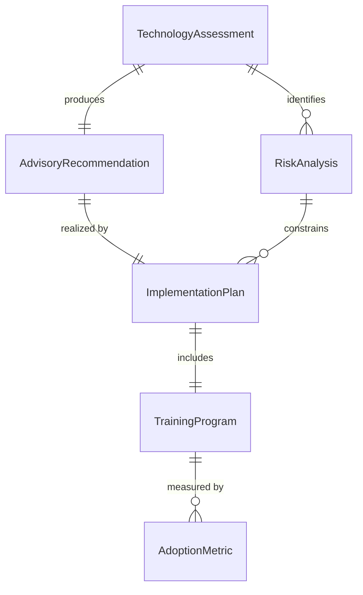
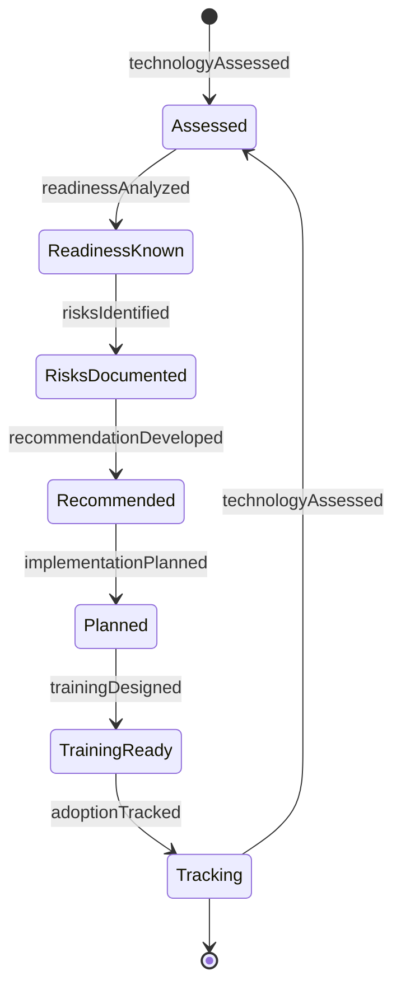
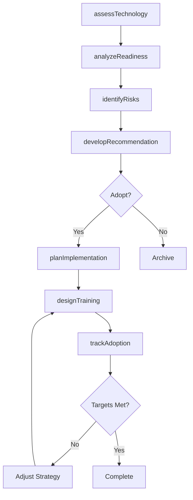
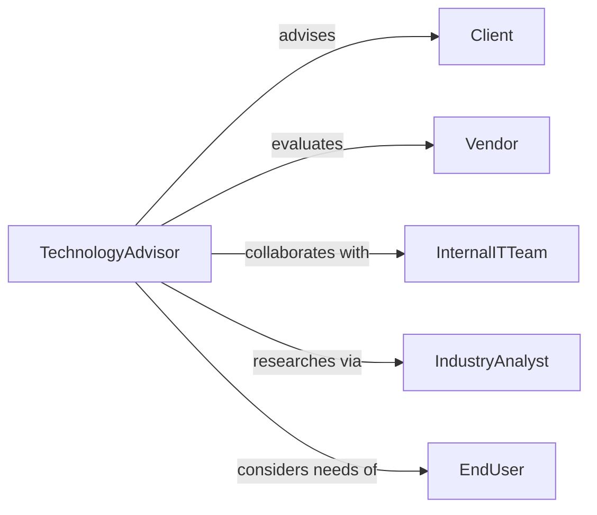

# Advise Others Development Use New

> Business-as-Code definition for technology advisory services. Guides organizations through evaluation, adoption, and implementation of emerging technologies aligned with strategic objectives.

## Overview

Technology advisory encompasses strategic consultation on emerging technology adoption, development methodologies, and organizational readiness. This definition models the assessment, recommendation, implementation planning, and knowledge transfer lifecycle for new technology initiatives.

## Actors

| Actor | Description |
|-------|-------------|
| Client | Organization seeking technology adoption guidance |
| TechnologyAdvisor | Consultant providing strategic technology guidance |
| Vendor | Supplies emerging technology products or platforms |
| InternalITTeam | Client's technology team implementing solutions |
| EndUser | Will use the new technology in daily operations |
| IndustryAnalyst | Provides market research and trend analysis |

## Roles

| Role | Description |
|------|-------------|
| ChiefTechnologyOfficer | Oversees technology strategy and adoption |
| SolutionArchitect | Designs technical implementation approach |
| ChangeManager | Manages organizational adoption process |
| TrainingCoordinator | Develops and delivers technology education |

## Entities

| Entity | Description |
|--------|-------------|
| TechnologyAssessment | Evaluation of emerging technology fit and impact |
| AdvisoryRecommendation | Strategic guidance on technology adoption |
| ImplementationPlan | Roadmap for technology deployment |
| RiskAnalysis | Evaluation of technology adoption challenges |
| TrainingProgram | Education plan for technology users |
| AdoptionMetric | Measures of technology utilization and success |

## Actions

| Action | Description |
|--------|-------------|
| assessTechnology | Evaluate emerging technology capabilities and fit |
| analyzeReadiness | Determine organizational capacity for adoption |
| developRecommendation | Create strategic guidance on technology use |
| planImplementation | Design phased rollout approach |
| identifyRisks | Document potential challenges and mitigations |
| designTraining | Create education program for technology users |
| trackAdoption | Monitor technology utilization and outcomes |

## Events

| Event | Description |
|-------|-------------|
| technologyAssessed | Emerging technology evaluation has been completed |
| readinessAnalyzed | Organizational capacity has been determined |
| recommendationDeveloped | Strategic guidance has been created |
| implementationPlanned | Rollout approach has been designed |
| risksIdentified | Potential challenges have been documented |
| trainingDesigned | Education program has been created |
| adoptionTracked | Technology utilization has been measured |

## Searches

| Search | Description |
|--------|-------------|
| findAssessments | List technology evaluations by client or date |
| searchRecommendations | Find advisory guidance by technology category |
| getImplementationPlans | Retrieve rollout roadmaps for technologies |
| getAdoptionMetrics | Analyze technology utilization and success rates |

## Entity Relationships



## State Diagram



## Workflow



## Actor Relationships



## Usage

### Calling Actions

```typescript
import { adviseOthersDevelopmentUseNew } from '@headlessly/advise-others-development-use-new'

const advisory = adviseOthersDevelopmentUseNew()

// Assess emerging technology
const assessment = await advisory.assessTechnology({
  clientId: 'client_456',
  technology: 'generative-ai',
  useCases: ['customer-service', 'content-creation', 'code-generation'],
  currentState: 'exploring-options'
})

// Analyze organizational readiness
const readiness = await advisory.analyzeReadiness({
  clientId: 'client_456',
  assessmentId: assessment.id,
  factors: ['technical-skills', 'budget', 'infrastructure', 'culture']
})

// Develop strategic recommendation
const recommendation = await advisory.developRecommendation({
  clientId: 'client_456',
  assessmentId: assessment.id,
  readinessId: readiness.id,
  approach: 'phased-pilot',
  timeline: '12-months',
  budget: 500000
})
```

### Event-Driven Automation

```typescript
// Alert on high-risk technology adoptions
advisory.risksIdentified(async ({ clientId, technologyId, risks }) => {
  const highRisks = risks.filter(r => r.severity === 'high')
  if (highRisks.length > 0) {
    await notify({
      to: 'advisory-leadership',
      priority: 'high',
      message: `High-risk technology adoption: ${technologyId} for ${clientId}`
    })
  }
})

// Schedule training after implementation plan approval
advisory.implementationPlanned(async ({ clientId, technologyId, phases }) => {
  await advisory.designTraining({
    clientId,
    technologyId,
    audiences: ['end-users', 'administrators', 'support-staff'],
    delivery: 'hybrid'
  })
})
```
