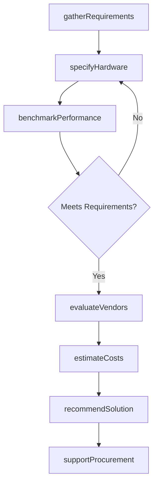
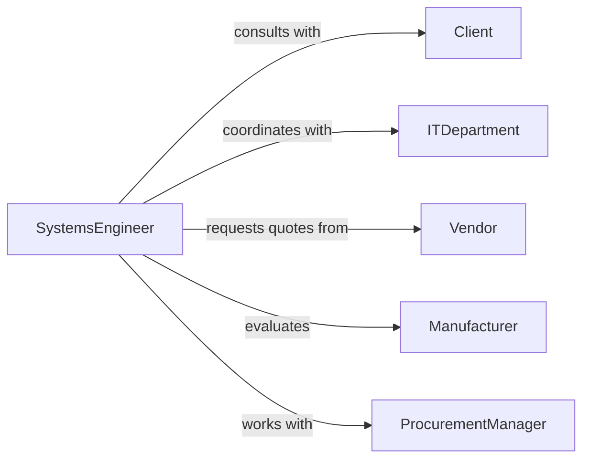

# Provide Recommendations Others About Computer

> Business-as-Code definition for computer hardware advisory services. Guides organizations and individuals in selecting, configuring, and procuring computing equipment aligned with performance requirements and budget constraints.

## Overview

Computer hardware recommendation involves analyzing workload requirements, performance needs, and budget parameters to prescribe optimal computing infrastructure. This definition models the requirements gathering, specification development, vendor evaluation, and procurement support process.

## Actors

| Actor | Description |
|-------|-------------|
| Client | Organization or individual seeking hardware guidance |
| HardwareSpecialist | Consultant providing computer equipment recommendations |
| Vendor | Supplies computer hardware and components |
| Manufacturer | Produces computing equipment and peripherals |
| ITDepartment | Client's technology team managing infrastructure |
| Reseller | Distributes hardware from multiple manufacturers |

## Roles

| Role | Description |
|------|-------------|
| SystemsEngineer | Analyzes requirements and specifies hardware |
| ProcurementManager | Coordinates vendor selection and purchasing |
| NetworkArchitect | Designs infrastructure and connectivity requirements |
| BudgetAnalyst | Evaluates costs and ROI for hardware investments |

## Entities

| Entity | Description |
|--------|-------------|
| HardwareRequirement | Specification of computing needs and constraints |
| SystemConfiguration | Detailed hardware specification for a solution |
| VendorQuote | Pricing and availability from suppliers |
| PerformanceBenchmark | Testing results for hardware capabilities |
| Recommendation | Proposed hardware solution with justification |
| ProcurementPlan | Timeline and approach for hardware acquisition |

## Actions

| Action | Description |
|--------|-------------|
| gatherRequirements | Collect workload and performance specifications |
| specifyHardware | Design detailed system configuration |
| benchmarkPerformance | Test hardware against workload requirements |
| evaluateVendors | Compare supplier pricing and service options |
| recommendSolution | Propose optimal hardware configuration |
| estimateCosts | Calculate total cost of ownership |
| supportProcurement | Assist with vendor selection and purchasing |

## Events

| Event | Description |
|-------|-------------|
| requirementsGathered | Workload specifications have been collected |
| hardwareSpecified | System configuration has been designed |
| performanceBenchmarked | Hardware has been tested against requirements |
| vendorsEvaluated | Supplier options have been compared |
| solutionRecommended | Optimal hardware has been proposed |
| costsEstimated | Total ownership costs have been calculated |
| procurementSupported | Purchasing assistance has been provided |

## Searches

| Search | Description |
|--------|-------------|
| findRecommendations | List hardware proposals by client or date |
| searchConfigurations | Find system specifications by workload type |
| compareVendors | Analyze supplier pricing and service levels |
| getBenchmarks | Retrieve performance testing results |

## Workflow



## Actor Relationships



## Usage

### Calling Actions

```typescript
import { provideRecommendationsOthersAboutComputer } from '@headlessly/provide-recommendations-others-about-computer'

const hardware = provideRecommendationsOthersAboutComputer()

// Gather workload requirements
const requirements = await hardware.gatherRequirements({
  clientId: 'client_789',
  workloads: ['data-analytics', 'machine-learning', 'web-hosting'],
  userCount: 50,
  budget: 100000,
  constraints: ['energy-efficient', 'rack-mountable']
})

// Specify hardware configuration
const config = await hardware.specifyHardware({
  requirementsId: requirements.id,
  components: {
    cpu: 'dual-xeon-scalable',
    ram: '256GB-DDR4',
    storage: '10TB-NVME',
    gpu: 'dual-a100'
  }
})

// Recommend complete solution
const recommendation = await hardware.recommendSolution({
  clientId: 'client_789',
  configurationId: config.id,
  vendor: 'vendor_123',
  totalCost: 95000,
  justification: 'Configuration meets all workload requirements with 30% performance headroom'
})
```

### Event-Driven Automation

```typescript
// Auto-benchmark after specification
hardware.hardwareSpecified(async ({ configurationId, requirementsId }) => {
  await hardware.benchmarkPerformance({
    configurationId,
    requirementsId,
    testSuites: ['compute', 'storage', 'network']
  })
})

// Alert on budget overruns
hardware.costsEstimated(async ({ clientId, totalCost, budget }) => {
  if (totalCost > budget * 1.1) {
    await notify({
      to: 'procurement-team',
      priority: 'high',
      message: `Hardware recommendation exceeds budget by ${((totalCost / budget - 1) * 100).toFixed(1)}%`
    })
  }
})
```
