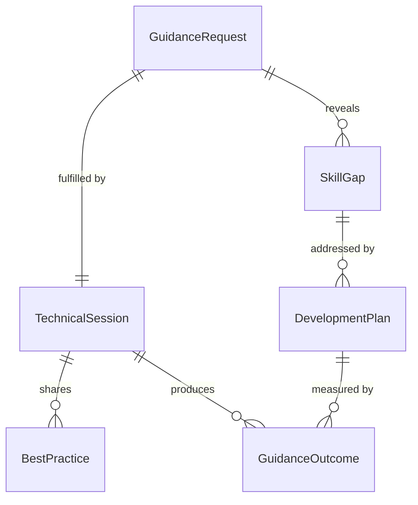
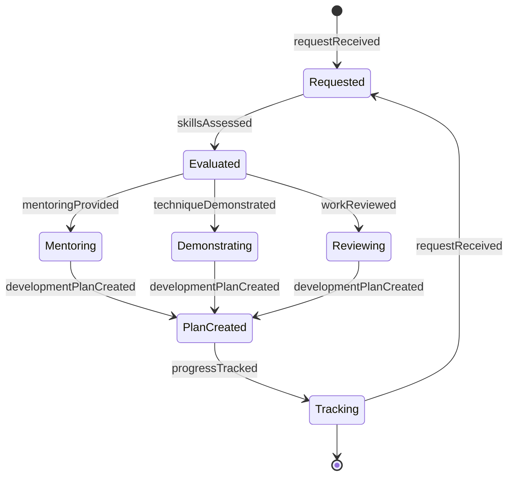
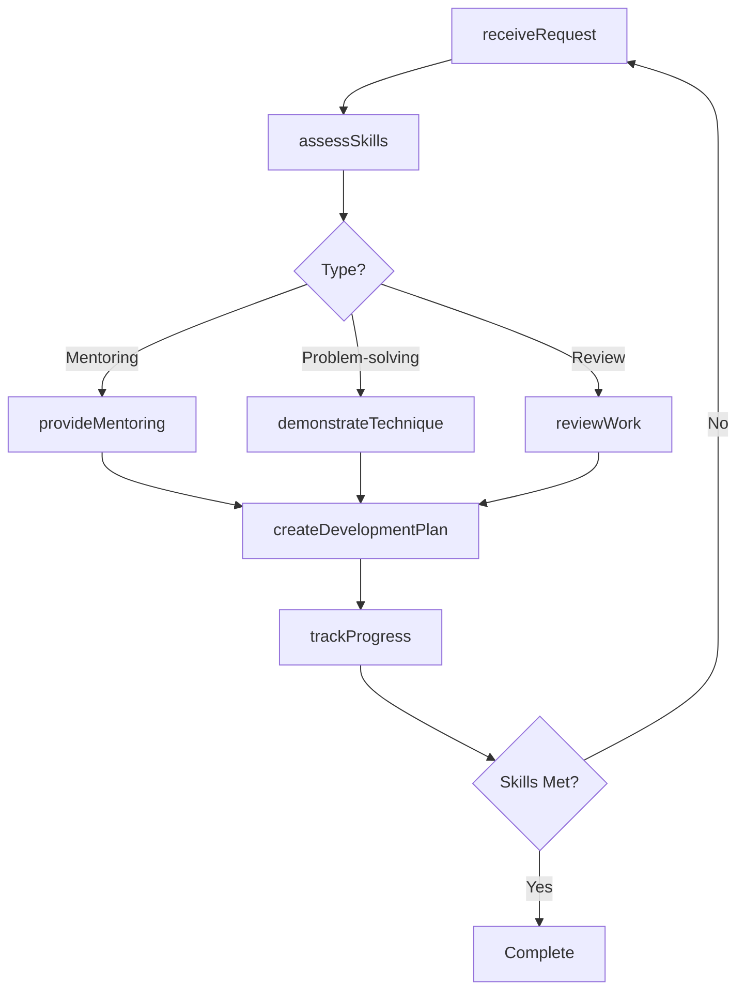
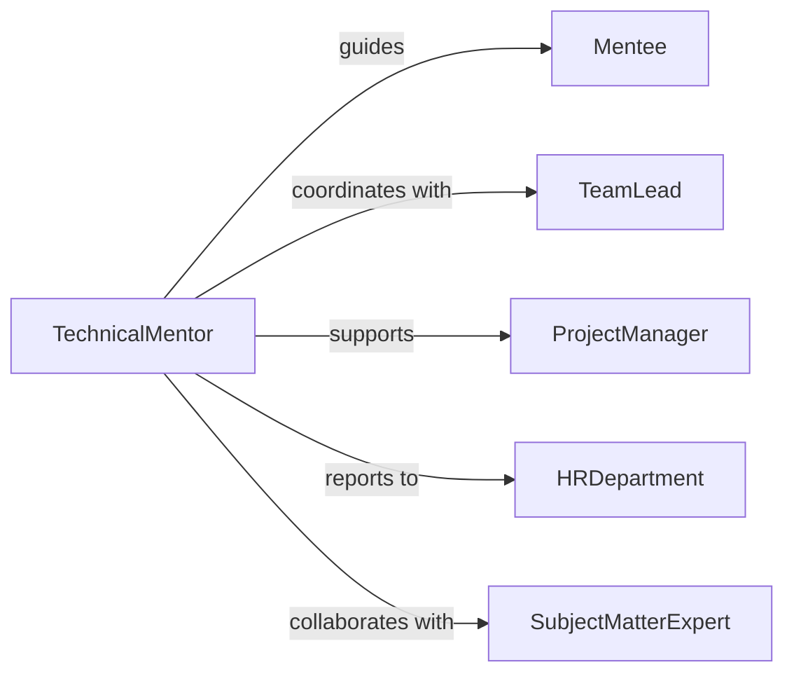

# Provide Technical Guidance Personnel

> Business-as-Code definition for technical mentorship and guidance services. Enables knowledge transfer, skill development, and problem-solving support for technical personnel across all experience levels.

## Overview

Technical guidance provision involves one-on-one mentoring, troubleshooting support, best practice education, and career development coaching for technical staff. This definition models the guidance request, knowledge transfer, skill assessment, and effectiveness tracking lifecycle.

## Actors

| Actor | Description |
|-------|-------------|
| Mentee | Technical personnel seeking guidance and support |
| TechnicalMentor | Experienced professional providing guidance |
| TeamLead | Manages team development and skill growth |
| ProjectManager | Coordinates technical work requiring guidance |
| HRDepartment | Supports career development initiatives |
| ExternalTrainer | Provides specialized technical education |

## Roles

| Role | Description |
|------|-------------|
| SubjectMatterExpert | Deep expertise in specific technical domain |
| Coach | Facilitates skill development and growth |
| Troubleshooter | Assists with complex problem resolution |
| CareerAdvisor | Guides technical career progression |

## Entities

| Entity | Description |
|--------|-------------|
| GuidanceRequest | Request for technical assistance or mentoring |
| TechnicalSession | Structured guidance interaction |
| SkillGap | Identified difference between current and target competency |
| BestPractice | Recommended approach or technique |
| DevelopmentPlan | Roadmap for skill acquisition and growth |
| GuidanceOutcome | Result and effectiveness of guidance provided |

## Actions

| Action | Description |
|--------|-------------|
| receiveRequest | Accept guidance or mentoring request |
| assessSkills | Evaluate current technical competencies |
| provideMentoring | Conduct one-on-one guidance session |
| demonstrateTechnique | Show hands-on technical approach |
| reviewWork | Evaluate technical deliverables and provide feedback |
| createDevelopmentPlan | Design skill growth roadmap |
| trackProgress | Monitor skill development over time |

## Events

| Event | Description |
|-------|-------------|
| requestReceived | Guidance request has been submitted |
| skillsAssessed | Technical competencies have been evaluated |
| mentoringProvided | Guidance session has been conducted |
| techniqueDemonstrated | Hands-on approach has been shown |
| workReviewed | Technical deliverable has been evaluated |
| developmentPlanCreated | Skill growth roadmap has been designed |
| progressTracked | Skill development has been monitored |

## Searches

| Search | Description |
|--------|-------------|
| findRequests | List guidance requests by personnel or status |
| searchSessions | Find mentoring interactions by topic or date |
| getSkillGaps | Retrieve competency deficiencies by individual or team |
| getOutcomes | Analyze guidance effectiveness and skill growth |

## Entity Relationships



## State Diagram



## Workflow



## Actor Relationships



## Usage

### Calling Actions

```typescript
import { provideTechnicalGuidancePersonnel } from '@headlessly/provide-technical-guidance-personnel'

const guidance = provideTechnicalGuidancePersonnel()

// Receive guidance request
const request = await guidance.receiveRequest({
  menteeId: 'emp_456',
  topic: 'kubernetes-deployment',
  type: 'troubleshooting',
  urgency: 'high',
  context: 'Production deployment failing on pod startup'
})

// Provide hands-on mentoring
const session = await guidance.provideMentoring({
  requestId: request.id,
  mentorId: 'emp_789',
  duration: 60,
  approach: 'pair-programming',
  topics: ['container-debugging', 'log-analysis', 'resource-limits']
})

// Create development plan
const plan = await guidance.createDevelopmentPlan({
  menteeId: 'emp_456',
  skillGaps: ['kubernetes-advanced', 'observability', 'performance-tuning'],
  timeline: '6-months',
  milestones: ['certification', 'production-deployment', 'architecture-design']
})
```

### Event-Driven Automation

```typescript
// Assign mentor based on expertise
guidance.requestReceived(async ({ menteeId, topic, urgency }) => {
  const mentor = await findExpert({ topic, availability: 'immediate' })
  await notify({
    to: mentor.id,
    priority: urgency,
    message: `New guidance request: ${topic} from ${menteeId}`
  })
})

// Schedule follow-up after mentoring
guidance.mentoringProvided(async ({ menteeId, sessionId, topics }) => {
  const followUpDate = addWeeks(new Date(), 2)
  await scheduleTask({
    assignee: 'mentor',
    task: 'Follow up on skill development',
    dueDate: followUpDate,
    menteeId,
    topics
  })
})
```
