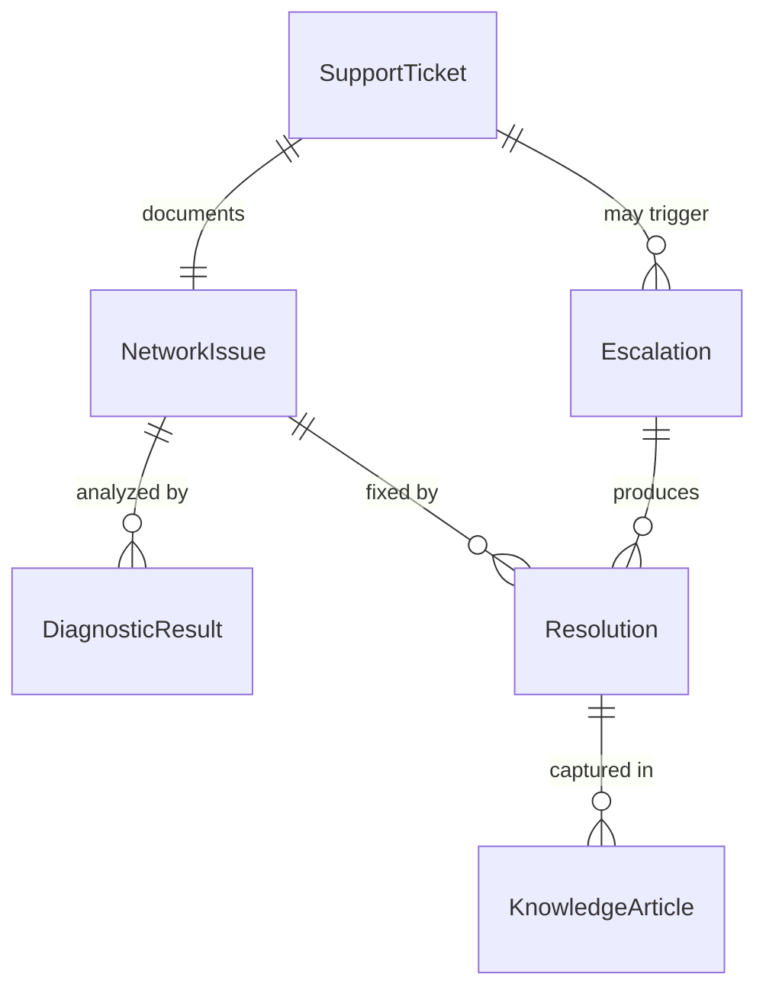
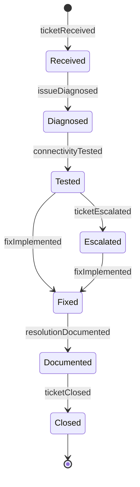
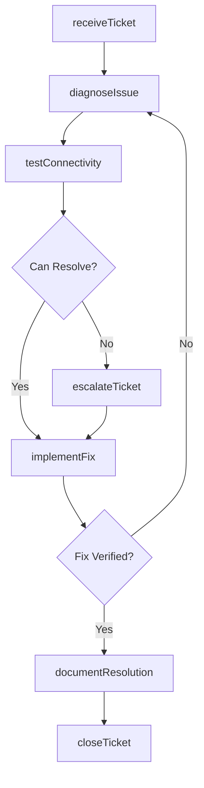
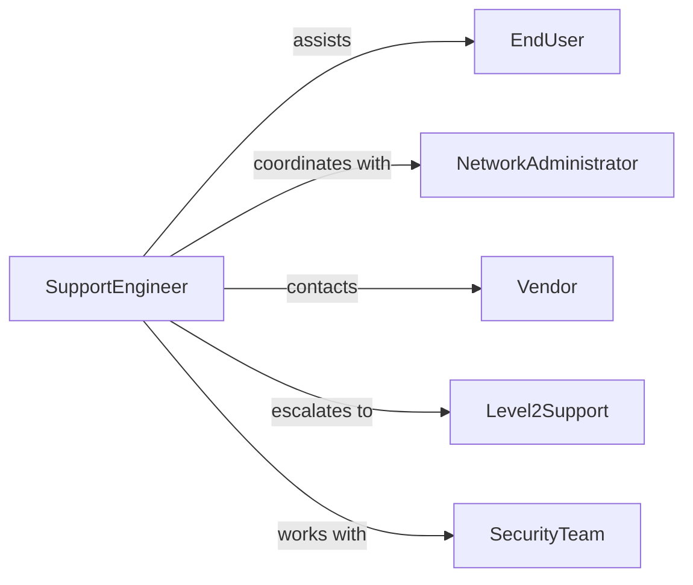

# Provide Technical Support Computer Network

> Business-as-Code definition for network technical support services. Enables incident resolution, performance optimization, and connectivity troubleshooting for enterprise network infrastructure.

## Overview

Network technical support encompasses incident triage, diagnostics, resolution, and escalation management for wired and wireless network infrastructure. This definition models the support request lifecycle from ticket creation through resolution and knowledge base updates.

## Actors

| Actor | Description |
|-------|-------------|
| EndUser | Individual experiencing network connectivity issues |
| SupportEngineer | Technical personnel providing network support |
| NetworkAdministrator | Manages network infrastructure and configuration |
| Vendor | Supplies network hardware and software |
| ServiceProvider | Delivers internet and WAN connectivity |
| SecurityTeam | Monitors network for threats and vulnerabilities |

## Roles

| Role | Description |
|------|-------------|
| Level1Support | Handles initial triage and basic troubleshooting |
| Level2Support | Resolves complex network issues |
| NetworkArchitect | Designs network topology and standards |
| IncidentCoordinator | Manages major network outages |

## Entities

| Entity | Description |
|--------|-------------|
| SupportTicket | Request for network technical assistance |
| NetworkIssue | Documented connectivity or performance problem |
| DiagnosticResult | Output from network testing and analysis |
| Resolution | Solution applied to resolve network issue |
| Escalation | Transfer of support ticket to higher level |
| KnowledgeArticle | Documented solution for common issues |

## Actions

| Action | Description |
|--------|-------------|
| receiveTicket | Accept network support request |
| diagnoseIssue | Analyze network problem using tools and logs |
| testConnectivity | Verify network paths and reachability |
| implementFix | Apply solution to resolve network issue |
| escalateTicket | Transfer complex issue to specialized support |
| documentResolution | Record solution for knowledge base |
| closeTicket | Mark support request as resolved |

## Events

| Event | Description |
|-------|-------------|
| ticketReceived | Network support request has been created |
| issueDiagnosed | Network problem has been analyzed |
| connectivityTested | Network paths have been verified |
| fixImplemented | Solution has been applied to network |
| ticketEscalated | Issue has been transferred to specialized support |
| resolutionDocumented | Solution has been recorded for knowledge base |
| ticketClosed | Support request has been marked resolved |

## Searches

| Search | Description |
|--------|-------------|
| findTickets | List support requests by user, status, or priority |
| searchIssues | Find network problems by type or device |
| getResolutions | Retrieve solutions for similar issues |
| getMetrics | Analyze support performance and resolution times |

## Entity Relationships



## State Diagram



## Workflow



## Actor Relationships



## Usage

### Calling Actions

```typescript
import { provideTechnicalSupportComputerNetwork } from '@headlessly/provide-technical-support-computer-network'

const networkSupport = provideTechnicalSupportComputerNetwork()

// Receive support ticket
const ticket = await networkSupport.receiveTicket({
  userId: 'user_123',
  issue: 'Cannot access shared drives on corporate network',
  priority: 'medium',
  location: 'Building-A-Floor-3',
  device: { type: 'laptop', os: 'windows-11' }
})

// Diagnose network issue
const diagnosis = await networkSupport.diagnoseIssue({
  ticketId: ticket.id,
  tools: ['ping', 'traceroute', 'nslookup', 'netstat'],
  findings: 'DNS resolution failing for internal domains'
})

// Implement fix
const resolution = await networkSupport.implementFix({
  ticketId: ticket.id,
  diagnosisId: diagnosis.id,
  solution: 'Updated DNS server configuration to include backup resolver',
  testing: 'Verified access to shared drives and internal resources'
})
```

### Event-Driven Automation

```typescript
// Auto-escalate high-priority unresolved tickets
networkSupport.issueDiagnosed(async ({ ticketId, priority, complexity }) => {
  if (priority === 'critical' && complexity === 'high') {
    await networkSupport.escalateTicket({
      ticketId,
      targetTeam: 'level-2-network-support',
      reason: 'Critical priority with complex diagnosis'
    })
  }
})

// Create knowledge article for frequent issues
networkSupport.resolutionDocumented(async ({ issueType, resolutionId }) => {
  const frequency = await getIssueFrequency(issueType)
  if (frequency > 10) {
    await createKnowledgeArticle({
      title: `How to resolve: ${issueType}`,
      resolutionId,
      category: 'network-troubleshooting'
    })
  }
})
```
