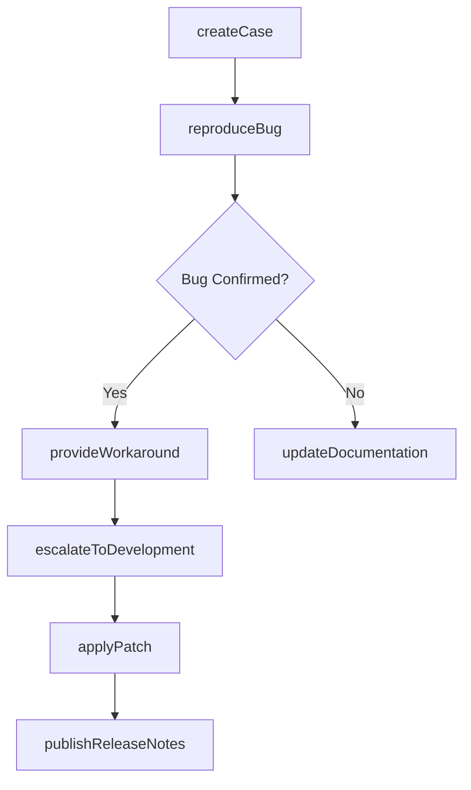
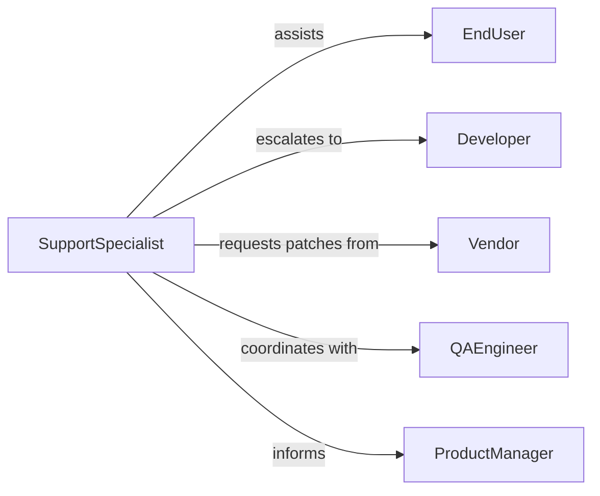

# Provide Technical Support Software Maintenance

> Business-as-Code definition for software technical support and maintenance services. Enables incident resolution, patch management, bug tracking, and user assistance for enterprise software applications.

## Overview

Software technical support encompasses troubleshooting application issues, coordinating updates and patches, managing bug reports, and providing user guidance. This definition models the support lifecycle from incident creation through diagnosis, resolution, and continuous improvement.

## Actors

| Actor | Description |
|-------|-------------|
| EndUser | Individual using software and reporting issues |
| SupportSpecialist | Technical personnel providing software assistance |
| Developer | Engineers maintaining and fixing software |
| Vendor | Provides commercial software and updates |
| QAEngineer | Tests software fixes and patches |
| ProductManager | Prioritizes feature requests and bug fixes |

## Roles

| Role | Description |
|------|-------------|
| ApplicationSupport | Handles software-specific troubleshooting |
| PatchCoordinator | Manages software update deployment |
| BugTriager | Categorizes and prioritizes defect reports |
| KnowledgeManager | Maintains support documentation |

## Entities

| Entity | Description |
|--------|-------------|
| SupportCase | Request for software technical assistance |
| BugReport | Documented software defect or error |
| Patch | Software update addressing bugs or vulnerabilities |
| Workaround | Temporary solution for software issue |
| ReleaseNote | Documentation of software changes and fixes |
| UserGuide | Instructions for software features and usage |

## Actions

| Action | Description |
|--------|-------------|
| createCase | Log software support request or incident |
| reproduceBug | Verify and document software defect |
| applyPatch | Deploy software update or fix |
| provideWorkaround | Offer temporary solution for issue |
| escalateToDevelopment | Transfer bug report to engineering team |
| publishReleaseNotes | Communicate software changes to users |
| updateDocumentation | Revise user guides and knowledge articles |

## Events

| Event | Description |
|-------|-------------|
| caseCreated | Software support request has been logged |
| bugReproduced | Software defect has been verified |
| patchApplied | Software update has been deployed |
| workaroundProvided | Temporary solution has been offered |
| escalatedToDevelopment | Bug has been transferred to engineering |
| releaseNotesPublished | Software changes have been communicated |
| documentationUpdated | User guides have been revised |

## Searches

| Search | Description |
|--------|-------------|
| findCases | List support requests by user, status, or software |
| searchBugs | Find defect reports by severity or component |
| getPatches | Retrieve available software updates |
| getWorkarounds | Find temporary solutions for known issues |

## Workflow



## Actor Relationships



## Usage

### Calling Actions

```typescript
import { provideTechnicalSupportSoftwareMaintenance } from '@headlessly/provide-technical-support-software-maintenance'

const softwareSupport = provideTechnicalSupportSoftwareMaintenance()

// Create support case
const supportCase = await softwareSupport.createCase({
  userId: 'user_456',
  software: 'erp-system',
  module: 'inventory-management',
  issue: 'Stock count report showing incorrect values',
  severity: 'high',
  impact: 'Affects monthly audit process'
})

// Reproduce and verify bug
const bug = await softwareSupport.reproduceBug({
  caseId: supportCase.id,
  steps: ['Navigate to Reports > Inventory > Stock Count', 'Select date range', 'Generate report'],
  expected: 'Report shows accurate stock counts',
  actual: 'Report shows values 10% lower than database query',
  environment: { version: '5.2.1', database: 'postgresql-14' }
})

// Provide temporary workaround
await softwareSupport.provideWorkaround({
  caseId: supportCase.id,
  bugId: bug.id,
  solution: 'Use legacy report template from Reports > Legacy > Stock Count until patch is available',
  limitations: 'Legacy template does not support multi-warehouse filtering'
})
```

### Event-Driven Automation

```typescript
// Auto-escalate critical bugs
softwareSupport.bugReproduced(async ({ bugId, severity, impact }) => {
  if (severity === 'critical' || impact === 'system-wide') {
    await softwareSupport.escalateToDevelopment({
      bugId,
      priority: 'urgent',
      assignee: 'on-call-developer'
    })
  }
})

// Notify users when patch is available
softwareSupport.patchApplied(async ({ software, version, affectedUsers }) => {
  await softwareSupport.publishReleaseNotes({
    software,
    version,
    fixes: await getBugsByVersion(version),
    distribution: affectedUsers
  })
})
```
