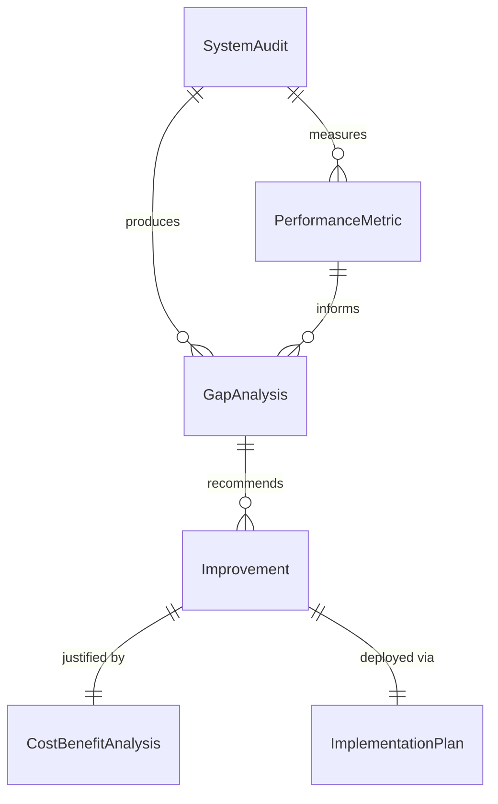
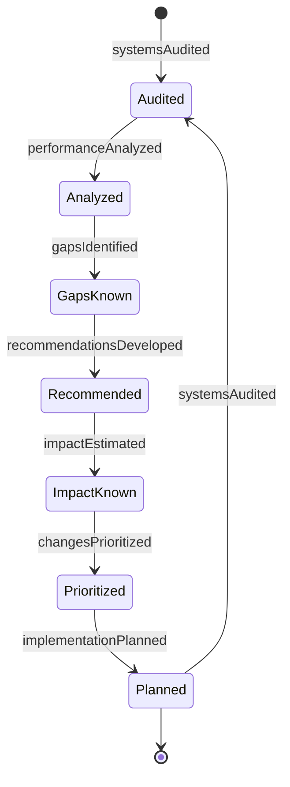
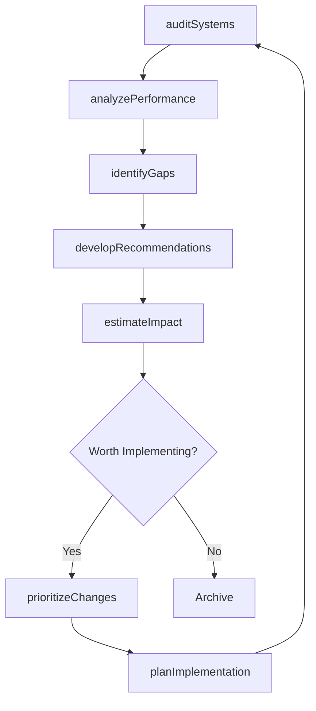
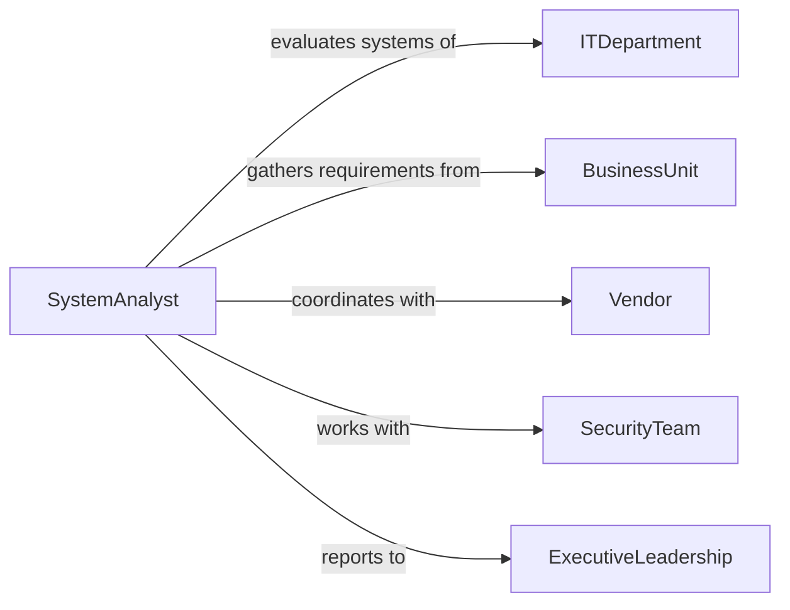

# Recommend Changes Improve Computer Information

> Business-as-Code definition for IT system improvement advisory. Analyzes existing computer and information systems to identify optimization opportunities and recommend enhancements for performance, security, and efficiency.

## Overview

IT system improvement recommendation involves assessing current infrastructure, analyzing performance metrics, identifying bottlenecks, and proposing enhancements. This definition models the system audit, gap analysis, recommendation development, and implementation planning process.

## Actors

| Actor | Description |
|-------|-------------|
| ITDepartment | Manages existing computer and information systems |
| SystemAnalyst | Evaluates infrastructure and recommends improvements |
| BusinessUnit | Experiences system performance and usability |
| Vendor | Provides technology solutions and upgrades |
| SecurityTeam | Assesses system vulnerabilities and compliance |
| ExecutiveLeadership | Approves system improvement investments |

## Roles

| Role | Description |
|------|-------------|
| ITArchitect | Designs system improvements and migrations |
| PerformanceEngineer | Analyzes system efficiency and bottlenecks |
| ChangeManager | Coordinates system enhancement rollout |
| BudgetAnalyst | Evaluates costs and ROI for improvements |

## Entities

| Entity | Description |
|--------|-------------|
| SystemAudit | Comprehensive evaluation of current IT systems |
| PerformanceMetric | Measurement of system efficiency and capability |
| Improvement | Proposed enhancement to computer or information system |
| GapAnalysis | Comparison of current state to desired state |
| ImplementationPlan | Roadmap for deploying system improvements |
| CostBenefitAnalysis | Financial evaluation of proposed changes |

## Actions

| Action | Description |
|--------|-------------|
| auditSystems | Evaluate current IT infrastructure and capabilities |
| analyzePerformance | Measure system efficiency and identify bottlenecks |
| identifyGaps | Determine differences between current and optimal state |
| developRecommendations | Create proposals for system improvements |
| estimateImpact | Assess benefits and risks of proposed changes |
| prioritizeChanges | Rank improvements by value and feasibility |
| planImplementation | Design phased approach for system enhancements |

## Events

| Event | Description |
|-------|-------------|
| systemsAudited | IT infrastructure has been evaluated |
| performanceAnalyzed | System efficiency has been measured |
| gapsIdentified | State differences have been determined |
| recommendationsDeveloped | Improvement proposals have been created |
| impactEstimated | Benefits and risks have been assessed |
| changesPrioritized | Improvements have been ranked |
| implementationPlanned | Enhancement approach has been designed |

## Searches

| Search | Description |
|--------|-------------|
| findAudits | List system evaluations by date or scope |
| searchRecommendations | Find improvement proposals by system or priority |
| getPerformanceMetrics | Retrieve efficiency measurements by system |
| getImplementationPlans | Access enhancement roadmaps |

## Entity Relationships



## State Diagram



## Workflow



## Actor Relationships



## Usage

### Calling Actions

```typescript
import { recommendChangesImproveComputerInformation } from '@headlessly/recommend-changes-improve-computer-information'

const improvements = recommendChangesImproveComputerInformation()

// Audit current IT systems
const audit = await improvements.auditSystems({
  scope: ['network', 'storage', 'applications', 'security'],
  departments: ['finance', 'operations', 'sales'],
  auditDate: '2026-02-05'
})

// Analyze performance bottlenecks
const performance = await improvements.analyzePerformance({
  auditId: audit.id,
  metrics: ['response-time', 'throughput', 'availability', 'error-rate'],
  baseline: 'last-6-months'
})

// Develop improvement recommendations
const recommendations = await improvements.developRecommendations({
  auditId: audit.id,
  performanceId: performance.id,
  focus: ['performance', 'security', 'cost-reduction'],
  budget: 500000,
  timeline: '12-months'
})
```

### Event-Driven Automation

```typescript
// Escalate critical gaps
improvements.gapsIdentified(async ({ auditId, gaps }) => {
  const criticalGaps = gaps.filter(g => g.severity === 'critical')
  if (criticalGaps.length > 0) {
    await notify({
      to: 'it-leadership',
      priority: 'high',
      message: `${criticalGaps.length} critical gaps identified in system audit ${auditId}`
    })
  }
})

// Auto-prioritize high-ROI improvements
improvements.impactEstimated(async ({ recommendationId, roi, risk }) => {
  if (roi > 200 && risk === 'low') {
    await improvements.prioritizeChanges({
      recommendationId,
      priority: 'high',
      justification: 'High ROI with low implementation risk'
    })
  }
})
```
