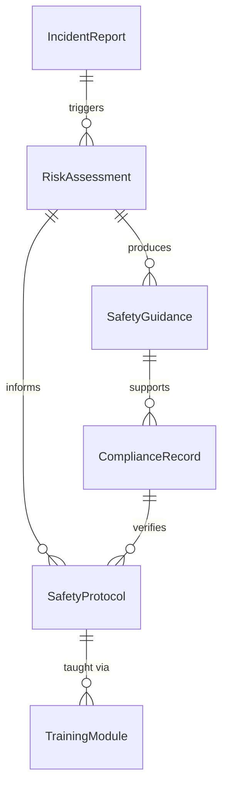
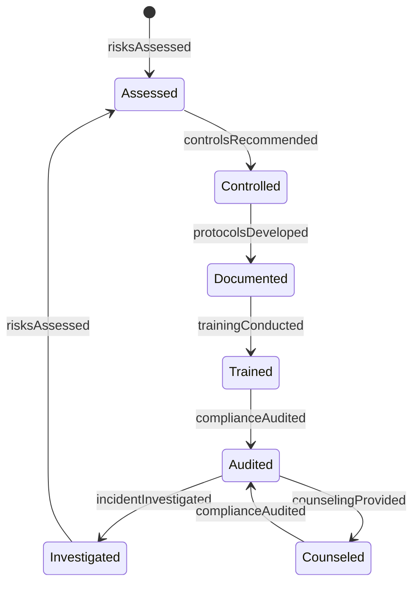
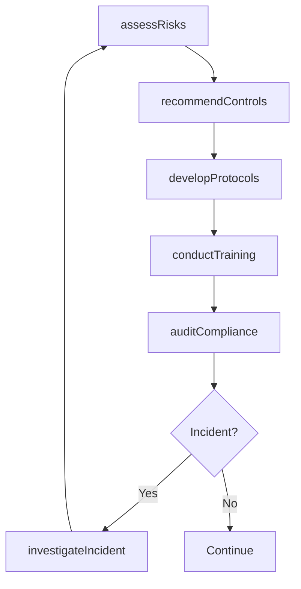
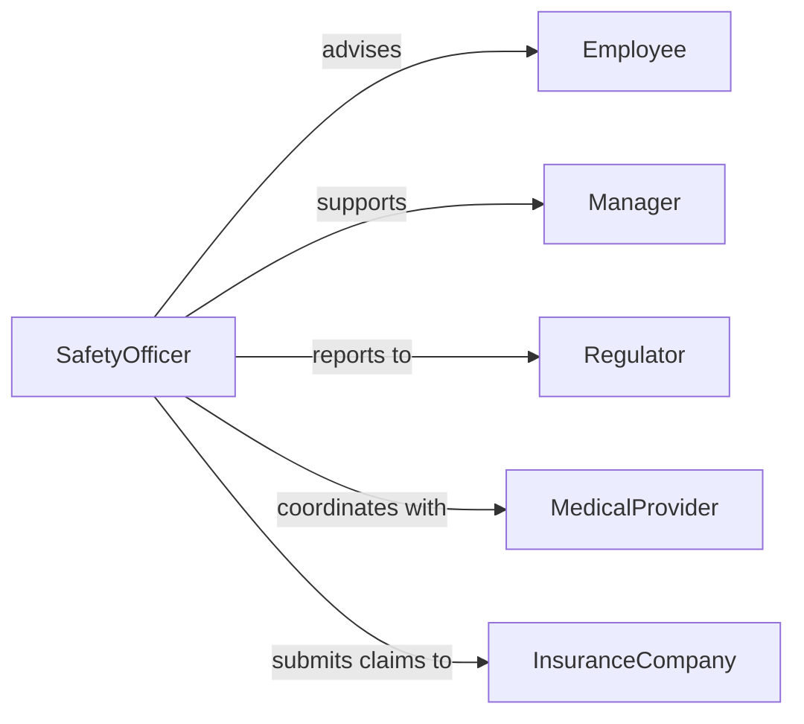

# Advise Others Health Safety Issues

> Business-as-Code definition for workplace health and safety advisory services. Provides guidance on occupational hazards, regulatory compliance, injury prevention, and safety program development.

## Overview

Health and safety advisory involves assessing workplace risks, developing safety protocols, educating employees on hazard prevention, and ensuring regulatory compliance. This definition models the risk assessment, guidance provision, training coordination, and compliance monitoring lifecycle.

## Actors

| Actor | Description |
|-------|-------------|
| Employee | Workers requiring health and safety guidance |
| SafetyAdvisor | Professional providing occupational safety expertise |
| Manager | Supervises workplace and implements safety protocols |
| Regulator | Enforces health and safety compliance standards |
| MedicalProvider | Treats work-related injuries and illnesses |
| InsuranceCompany | Covers workers compensation claims |

## Roles

| Role | Description |
|------|-------------|
| SafetyOfficer | Manages workplace safety programs |
| OccupationalHygienist | Assesses environmental health hazards |
| SafetyTrainer | Delivers health and safety education |
| ComplianceAuditor | Verifies adherence to safety regulations |

## Entities

| Entity | Description |
|--------|-------------|
| RiskAssessment | Evaluation of workplace health and safety hazards |
| SafetyGuidance | Advisory recommendation on hazard mitigation |
| SafetyProtocol | Standard procedure for safe work practices |
| TrainingModule | Educational content on health and safety topics |
| IncidentReport | Documentation of workplace injury or near-miss |
| ComplianceRecord | Evidence of regulatory adherence |

## Actions

| Action | Description |
|--------|-------------|
| assessRisks | Evaluate workplace health and safety hazards |
| provideCounseling | Offer guidance on specific safety concerns |
| developProtocols | Create standard procedures for safe work |
| conductTraining | Deliver health and safety education sessions |
| investigateIncident | Analyze workplace injury or near-miss event |
| auditCompliance | Verify adherence to safety regulations |
| recommendControls | Propose measures to eliminate or reduce hazards |

## Events

| Event | Description |
|-------|-------------|
| risksAssessed | Workplace hazards have been evaluated |
| counselingProvided | Guidance has been offered on safety concerns |
| protocolsDeveloped | Safe work procedures have been created |
| trainingConducted | Safety education has been delivered |
| incidentInvestigated | Workplace injury has been analyzed |
| complianceAudited | Regulatory adherence has been verified |
| controlsRecommended | Hazard mitigation measures have been proposed |

## Searches

| Search | Description |
|--------|-------------|
| findAssessments | List risk evaluations by workplace or date |
| searchIncidents | Find injury reports by type or severity |
| getProtocols | Retrieve safe work procedures by hazard category |
| getTrainingRecords | Access employee safety education history |

## Entity Relationships



## State Diagram



## Workflow



## Actor Relationships



## Usage

### Calling Actions

```typescript
import { adviseOthersHealthSafetyIssues } from '@headlessly/advise-others-health-safety-issues'

const safety = adviseOthersHealthSafetyIssues()

// Assess workplace risks
const assessment = await safety.assessRisks({
  location: 'manufacturing-floor-2',
  scope: ['machinery', 'chemical-exposure', 'ergonomics', 'noise'],
  assessmentDate: '2026-02-05',
  assessorId: 'safety_123'
})

// Recommend hazard controls
const controls = await safety.recommendControls({
  assessmentId: assessment.id,
  hazards: ['moving-machinery', 'chemical-vapors'],
  hierarchy: ['elimination', 'substitution', 'engineering', 'administrative', 'ppe'],
  budget: 50000
})

// Conduct safety training
const training = await safety.conductTraining({
  topic: 'chemical-handling-safety',
  audience: ['production-staff', 'maintenance-team'],
  format: 'classroom',
  duration: 120,
  trainerBefore: 'trainer_456'
})
```

### Event-Driven Automation

```typescript
// Auto-investigate high-severity incidents
safety.incidentInvestigated(async ({ incidentId, severity, injuries }) => {
  if (severity === 'serious' || injuries > 0) {
    await notify({
      to: 'safety-committee',
      priority: 'urgent',
      message: `Serious workplace incident requires immediate investigation: ${incidentId}`
    })
    await safety.assessRisks({
      location: incident.location,
      trigger: 'incident-investigation'
    })
  }
})

// Schedule refresher training
safety.trainingConducted(async ({ topic, participants, completionDate }) => {
  const refresherDate = addMonths(completionDate, 12)
  await scheduleTask({
    task: `Refresher training: ${topic}`,
    assignee: 'safety-trainer',
    dueDate: refresherDate,
    participants
  })
})
```
