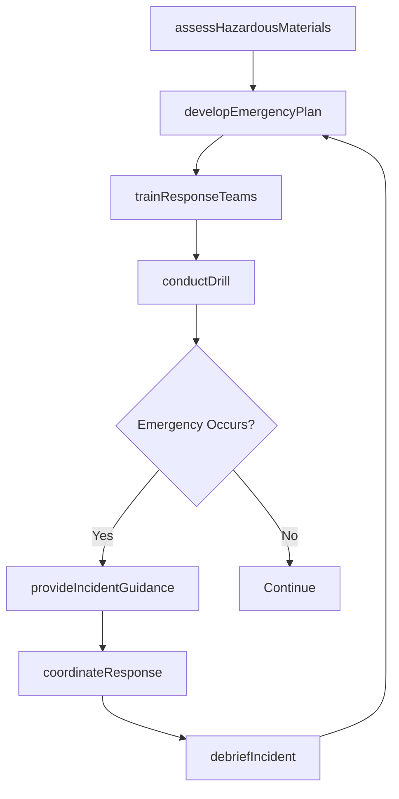
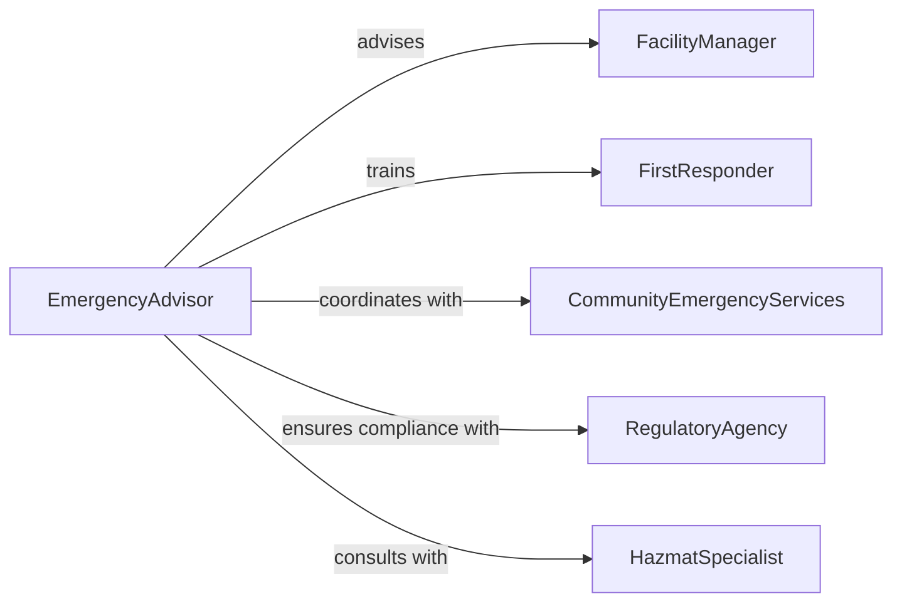

# Advise Others Management Emergencies Hazardous

> Business-as-Code definition for emergency and hazardous materials management advisory. Provides expertise on emergency response planning, hazmat handling, incident command, and regulatory compliance for dangerous situations.

## Overview

Emergency and hazmat management advisory encompasses developing response plans, training personnel on emergency procedures, providing real-time incident guidance, and ensuring regulatory compliance. This definition models the planning, training, response coordination, and post-incident analysis lifecycle.

## Actors

| Actor | Description |
|-------|-------------|
| FacilityManager | Oversees workplace safety and emergency preparedness |
| EmergencyAdvisor | Expert providing guidance on emergency management |
| FirstResponder | Personnel trained to handle emergency situations |
| RegulatoryAgency | Enforces hazmat and emergency response compliance |
| HazmatSpecialist | Expert in hazardous materials handling |
| CommunityEmergencyServices | External fire, police, and medical response teams |

## Roles

| Role | Description |
|------|-------------|
| EmergencyCoordinator | Manages emergency response program |
| IncidentCommander | Leads response during active emergencies |
| HazmatTechnician | Handles hazardous materials safely |
| TrainingDirector | Develops and delivers emergency response education |

## Entities

| Entity | Description |
|--------|-------------|
| EmergencyPlan | Documented procedures for responding to emergencies |
| HazardousSubstance | Dangerous material requiring special handling |
| IncidentScenario | Potential emergency situation requiring preparation |
| ResponseProcedure | Step-by-step actions for specific emergencies |
| DrillExercise | Simulated emergency for training and testing |
| IncidentDebrief | Post-emergency analysis and lessons learned |

## Actions

| Action | Description |
|--------|-------------|
| developEmergencyPlan | Create comprehensive emergency response procedures |
| assessHazardousMaterials | Evaluate dangerous substances and risks |
| trainResponseTeams | Educate personnel on emergency procedures |
| conductDrill | Simulate emergency scenario for practice |
| provideIncidentGuidance | Offer real-time advice during active emergencies |
| coordinateResponse | Manage multi-agency emergency operations |
| debriefIncident | Analyze emergency response and identify improvements |

## Events

| Event | Description |
|-------|-------------|
| emergencyPlanDeveloped | Response procedures have been created |
| hazardousMaterialsAssessed | Dangerous substances have been evaluated |
| responseTeamsTrained | Personnel have been educated on procedures |
| drillConducted | Emergency simulation has been completed |
| incidentGuidanceProvided | Real-time advice has been offered during emergency |
| responseCoordinated | Multi-agency operations have been managed |
| incidentDebriefed | Emergency response has been analyzed |

## Searches

| Search | Description |
|--------|-------------|
| findEmergencyPlans | List response procedures by facility or scenario |
| searchHazmat | Find hazardous materials by type or location |
| getDrillRecords | Retrieve emergency simulation history |
| getIncidents | Access emergency response and debrief reports |

## Workflow



## Actor Relationships



## Usage

### Calling Actions

```typescript
import { adviseOthersManagementEmergenciesHazardous } from '@headlessly/advise-others-management-emergencies-hazardous'

const emergency = adviseOthersManagementEmergenciesHazardous()

// Assess hazardous materials on-site
const assessment = await emergency.assessHazardousMaterials({
  facilityId: 'facility_789',
  substances: [
    { name: 'sulfuric-acid', quantity: 500, unit: 'gallons', storage: 'corrosive-cabinet' },
    { name: 'ammonia', quantity: 200, unit: 'pounds', storage: 'pressurized-tank' }
  ],
  assessmentDate: '2026-02-05'
})

// Develop emergency response plan
const plan = await emergency.developEmergencyPlan({
  facilityId: 'facility_789',
  assessmentId: assessment.id,
  scenarios: ['chemical-spill', 'fire', 'gas-release', 'explosion'],
  evacuationRoutes: true,
  incidentCommand: 'ics-structure'
})

// Train response teams
await emergency.trainResponseTeams({
  planId: plan.id,
  teams: ['emergency-response-team', 'hazmat-team', 'first-aid-team'],
  topics: ['incident-command', 'spill-containment', 'evacuation-procedures'],
  duration: 480
})
```

### Event-Driven Automation

```typescript
// Activate incident command during emergencies
emergency.incidentGuidanceProvided(async ({ facilityId, scenario, severity }) => {
  if (severity === 'critical') {
    await emergency.coordinateResponse({
      facilityId,
      scenario,
      activateICS: true,
      notifyAgencies: ['fire-department', 'hazmat-team', 'environmental-agency']
    })
  }
})

// Schedule debrief after drills
emergency.drillConducted(async ({ facilityId, scenario, participants }) => {
  const debriefDate = addDays(new Date(), 3)
  await scheduleTask({
    task: 'Emergency drill debrief meeting',
    assignee: 'emergency-coordinator',
    dueDate: debriefDate,
    facilityId,
    participants
  })
})
```
