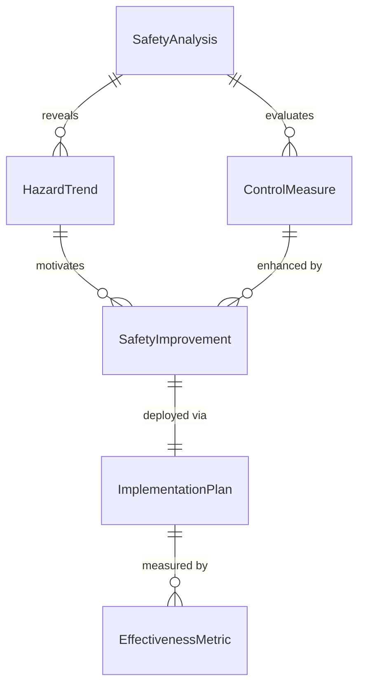
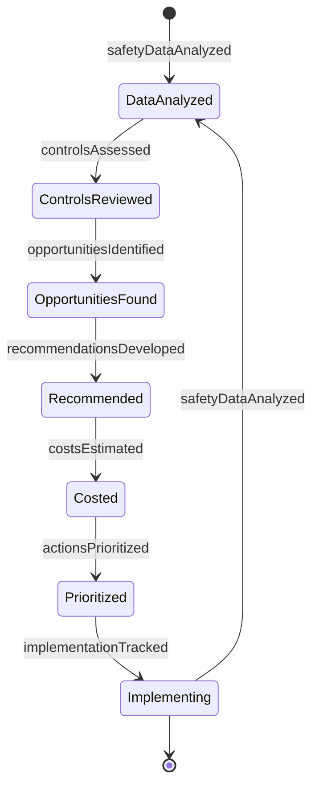
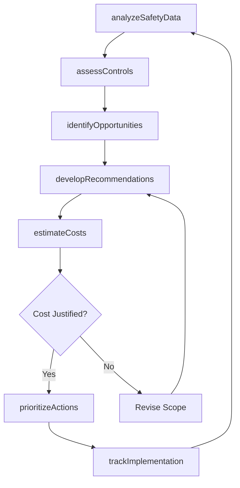
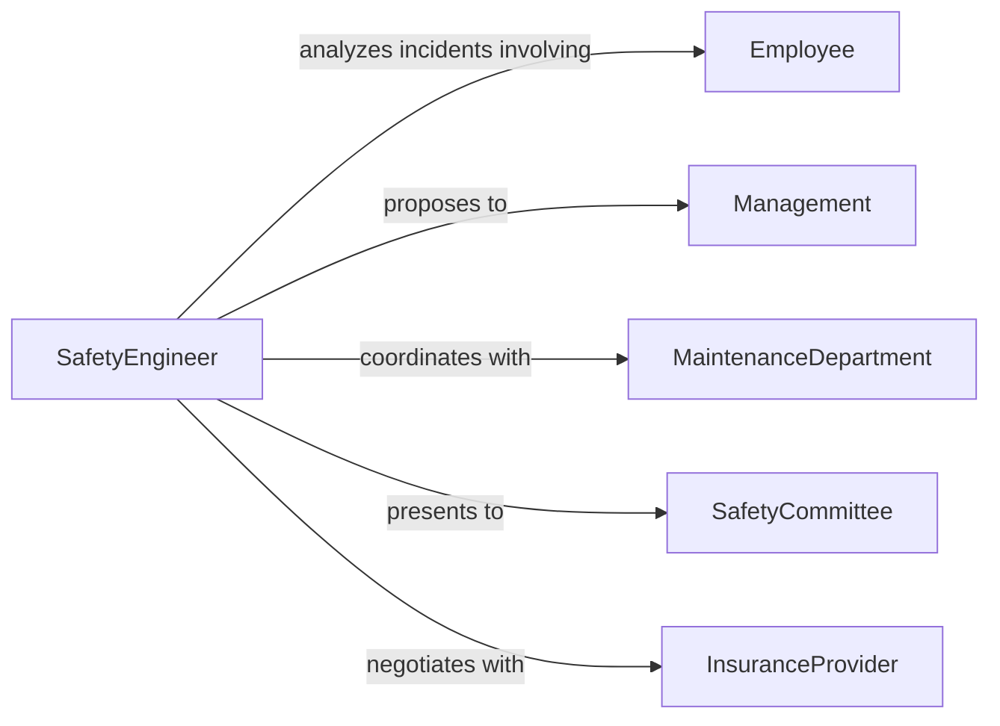

# Recommend Improvements Increase Safety Reduce

> Business-as-Code definition for safety improvement recommendations. Analyzes workplace hazards, evaluates control effectiveness, and proposes enhancements to reduce injury risk and improve occupational safety performance.

## Overview

Safety improvement recommendation involves analyzing incident trends, assessing existing controls, identifying enhancement opportunities, and developing prioritized action plans. This definition models the safety analysis, gap identification, recommendation development, and implementation tracking lifecycle.

## Actors

| Actor | Description |
|-------|-------------|
| Employee | Workers who benefit from safety improvements |
| SafetyEngineer | Professional analyzing and recommending safety enhancements |
| Management | Approves and funds safety improvement initiatives |
| MaintenanceDepartment | Implements engineering safety controls |
| SafetyCommittee | Reviews and prioritizes safety recommendations |
| InsuranceProvider | Offers premium reductions for safety improvements |

## Roles

| Role | Description |
|------|-------------|
| RiskAnalyst | Evaluates workplace hazards and trends |
| SafetyConsultant | Develops improvement recommendations |
| ImplementationManager | Oversees safety enhancement deployment |
| ComplianceOfficer | Ensures improvements meet regulations |

## Entities

| Entity | Description |
|--------|-------------|
| SafetyAnalysis | Evaluation of workplace safety performance |
| HazardTrend | Pattern of incidents or near-misses over time |
| SafetyImprovement | Proposed enhancement to reduce risk |
| ControlMeasure | Existing or proposed safety intervention |
| ImplementationPlan | Roadmap for deploying safety enhancements |
| EffectivenessMetric | Measurement of improvement impact |

## Actions

| Action | Description |
|--------|-------------|
| analyzeSafetyData | Evaluate incident trends and hazard patterns |
| assessControls | Review effectiveness of existing safety measures |
| identifyOpportunities | Find areas for safety enhancement |
| developRecommendations | Create prioritized improvement proposals |
| estimateCosts | Calculate investment required for improvements |
| prioritizeActions | Rank improvements by risk reduction and feasibility |
| trackImplementation | Monitor deployment of safety enhancements |

## Events

| Event | Description |
|-------|-------------|
| safetyDataAnalyzed | Incident trends have been evaluated |
| controlsAssessed | Safety measure effectiveness has been reviewed |
| opportunitiesIdentified | Enhancement areas have been found |
| recommendationsDeveloped | Improvement proposals have been created |
| costsEstimated | Investment requirements have been calculated |
| actionsPrioritized | Improvements have been ranked |
| implementationTracked | Enhancement deployment has been monitored |

## Searches

| Search | Description |
|--------|-------------|
| findAnalyses | List safety evaluations by location or date |
| searchRecommendations | Find improvement proposals by hazard type |
| getIncidentTrends | Retrieve patterns of workplace injuries |
| getImplementationStatus | Access enhancement deployment progress |

## Entity Relationships



## State Diagram



## Workflow



## Actor Relationships



## Usage

### Calling Actions

```typescript
import { recommendImprovementsIncreaseSafetyReduce } from '@headlessly/recommend-improvements-increase-safety-reduce'

const improvements = recommendImprovementsIncreaseSafetyReduce()

// Analyze safety performance data
const analysis = await improvements.analyzeSafetyData({
  facilityId: 'facility_456',
  period: { start: '2025-01-01', end: '2025-12-31' },
  metrics: ['injury-rate', 'lost-time-incidents', 'near-misses', 'severity'],
  comparison: 'industry-benchmark'
})

// Assess current safety controls
const assessment = await improvements.assessControls({
  analysisId: analysis.id,
  controls: ['machine-guarding', 'ppe-program', 'lockout-tagout', 'fall-protection'],
  effectiveness: 'quantitative'
})

// Develop safety recommendations
const recommendations = await improvements.developRecommendations({
  analysisId: analysis.id,
  assessmentId: assessment.id,
  focus: ['engineering-controls', 'administrative-controls', 'training'],
  targetReduction: '50-percent-injury-rate'
})
```

### Event-Driven Automation

```typescript
// Fast-track high-impact recommendations
improvements.actionsPrioritized(async ({ recommendations }) => {
  const highImpact = recommendations.filter(r => r.riskReduction > 75 && r.cost < 10000)
  for (const rec of highImpact) {
    await notify({
      to: 'safety-committee',
      priority: 'high',
      message: `High-impact, low-cost safety improvement identified: ${rec.title}`
    })
  }
})

// Track ROI after implementation
improvements.implementationTracked(async ({ improvementId, status }) => {
  if (status === 'completed') {
    const effectivenessDate = addMonths(new Date(), 3)
    await scheduleTask({
      task: 'Measure safety improvement effectiveness',
      assignee: 'risk-analyst',
      dueDate: effectivenessDate,
      improvementId
    })
  }
})
```
