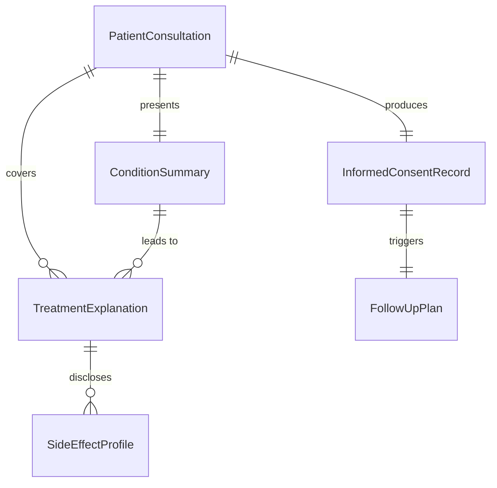
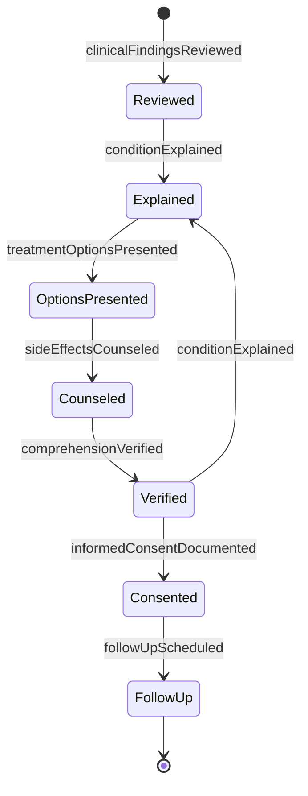
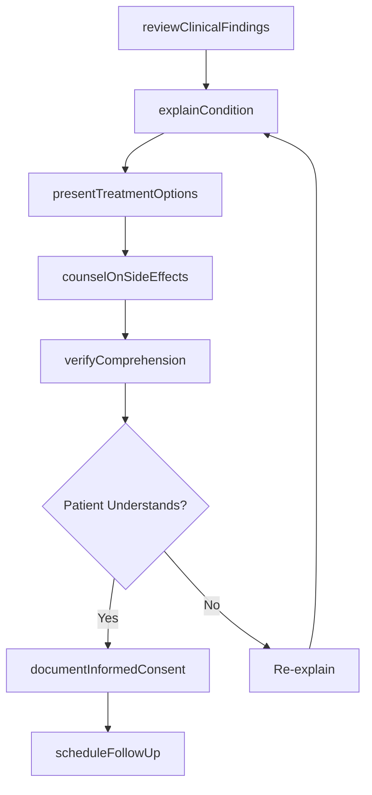
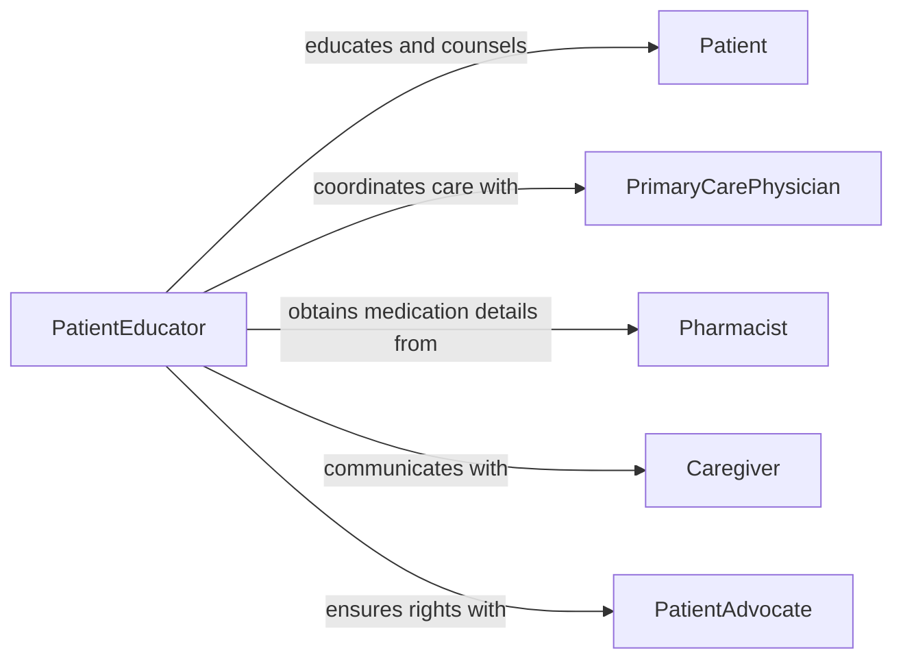

# Advise Patients on Effects of Health Conditions or Treatments

> Business-as-Code definition for advising patients on the effects of health conditions and treatments. Models the patient education process from clinical assessment through treatment explanation, side effect counseling, and comprehension verification.

## Overview

Advising patients on the effects of health conditions or treatments involves explaining diagnoses, prognoses, treatment options, potential side effects, and lifestyle modifications in terms patients can understand. This definition exposes actions for reviewing clinical findings, preparing educational content, delivering patient consultations, and confirming patient comprehension. Events enable automated follow-up scheduling and adherence monitoring, while searches provide access to condition-specific education materials, medication profiles, and patient communication histories.

## Actors

| Actor | Description |
|-------|-------------|
| Patient | Receives education about their health condition and treatment options |
| Caregiver | Accompanies patient and assists with understanding and adherence |
| PrimaryCarePhysician | Diagnoses conditions and prescribes treatments to be explained |
| Pharmacist | Provides detailed medication information and interaction warnings |
| InsurancePayer | Determines coverage that affects treatment options |
| PatientAdvocate | Supports patient rights and ensures informed consent |

## Roles

| Role | Description |
|------|-------------|
| PatientEducator | Explains health conditions and treatment effects to patients |
| ClinicalAdvisor | Provides expert guidance on treatment options and expected outcomes |
| NurseNavigator | Guides patients through the care continuum and follow-up steps |
| PharmacyCounselor | Educates patients on medication effects, interactions, and adherence |

## Entities

| Entity | Description |
|--------|-------------|
| PatientConsultation | A documented educational session with a patient |
| ConditionSummary | A patient-friendly explanation of a diagnosed health condition |
| TreatmentExplanation | Documentation of treatment options, benefits, and risks |
| SideEffectProfile | A catalog of potential adverse effects for a treatment |
| InformedConsentRecord | Documentation that the patient understands and agrees to treatment |
| FollowUpPlan | Scheduled check-ins to monitor treatment response and comprehension |

## Actions

| Action | Description |
|--------|-------------|
| reviewClinicalFindings | Examine diagnostic results and treatment plans before patient consultation |
| explainCondition | Describe the health condition, progression, and prognosis to the patient |
| presentTreatmentOptions | Outline available treatments with benefits, risks, and alternatives |
| counselOnSideEffects | Educate the patient on potential adverse effects and management strategies |
| verifyComprehension | Confirm the patient understands the information provided |
| documentInformedConsent | Record the patient's acknowledgment and agreement to treatment |
| scheduleFollowUp | Arrange a subsequent visit to review treatment response |

## Events

| Event | Description |
|-------|-------------|
| clinicalFindingsReviewed | Diagnostic results and treatment plans have been examined |
| conditionExplained | The health condition has been described to the patient |
| treatmentOptionsPresented | Available treatments have been outlined with risks and benefits |
| sideEffectsCounseled | Potential adverse effects have been explained to the patient |
| comprehensionVerified | Patient understanding of the information has been confirmed |
| informedConsentDocumented | Patient agreement to treatment has been formally recorded |
| followUpScheduled | A subsequent visit has been arranged |

## Searches

| Search | Description |
|--------|-------------|
| findConsultations | List patient consultations by provider, condition, or date range |
| getConditionEducation | Retrieve patient-friendly materials by diagnosis or condition |
| getSideEffectProfiles | Look up adverse effect data by medication or treatment type |
| findFollowUpPlans | Search scheduled follow-ups by patient, provider, or status |

## Entity Relationships



## State Diagram



## Workflow



## Actor Relationships



## Usage

### Calling Actions

```typescript
import { advisePatientsOnEffectsOfHealthConditionsOrTreatments } from '@headlessly/advise-patients-on-effects-of-health-conditions-or-treatments'

const educator = advisePatientsOnEffectsOfHealthConditionsOrTreatments()

// Review clinical findings before consultation
const findings = await educator.reviewClinicalFindings({
  patientId: 'PAT-3391',
  diagnosis: 'Type 2 Diabetes Mellitus',
  prescribedTreatment: 'metformin-500mg',
  labResults: { hba1c: 7.8, fastingGlucose: 142 }
})

// Explain the condition to the patient
await educator.explainCondition({
  patientId: 'PAT-3391',
  condition: 'Type 2 Diabetes Mellitus',
  explanation: 'Your body is not using insulin effectively, causing elevated blood sugar levels',
  prognosis: 'Manageable with medication, diet, and exercise',
  visualAids: ['blood-sugar-chart', 'insulin-pathway-diagram']
})

// Counsel on side effects
await educator.counselOnSideEffects({
  patientId: 'PAT-3391',
  medication: 'metformin-500mg',
  commonEffects: ['nausea', 'diarrhea', 'metallic-taste'],
  seriousEffects: ['lactic-acidosis'],
  managementTips: ['Take with meals', 'Start with low dose and increase gradually']
})
```

### Event-Driven Automation

```typescript
// Auto-schedule follow-up after consent is documented
educator.informedConsentDocumented(async ({ patientId, treatment }) => {
  await educator.scheduleFollowUp({
    patientId,
    topic: `Treatment response review for ${treatment}`,
    delay: '14d'
  })
})

// Alert nurse navigator when comprehension is not verified
educator.comprehensionVerified(async ({ patientId, understood }) => {
  if (!understood) {
    await notify({
      to: 'nurse-navigation',
      message: `Patient ${patientId} requires additional education - comprehension not confirmed`
    })
  }
})
```
