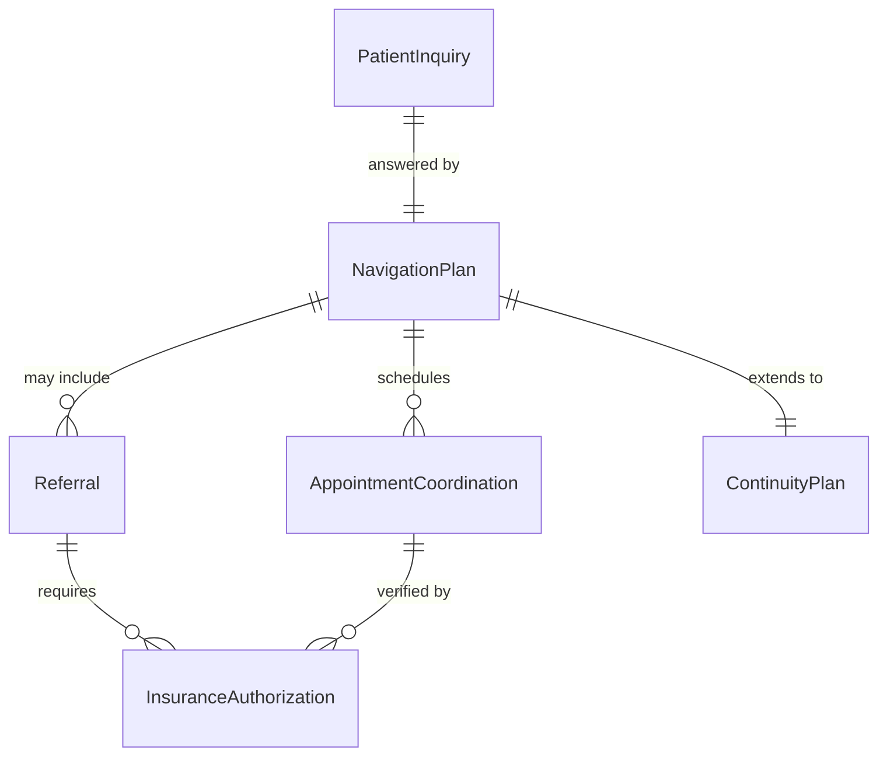
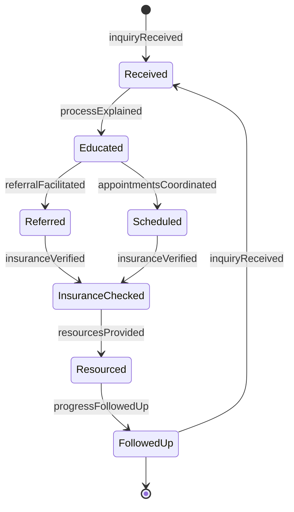
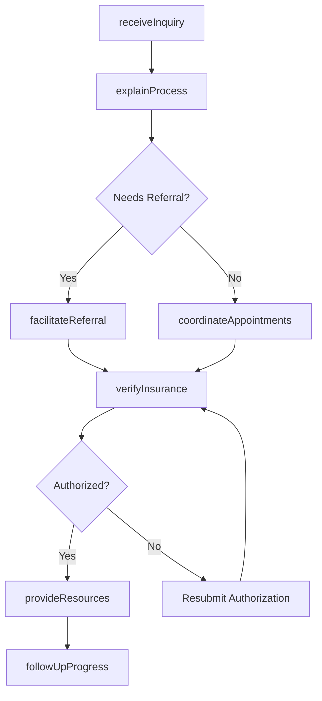
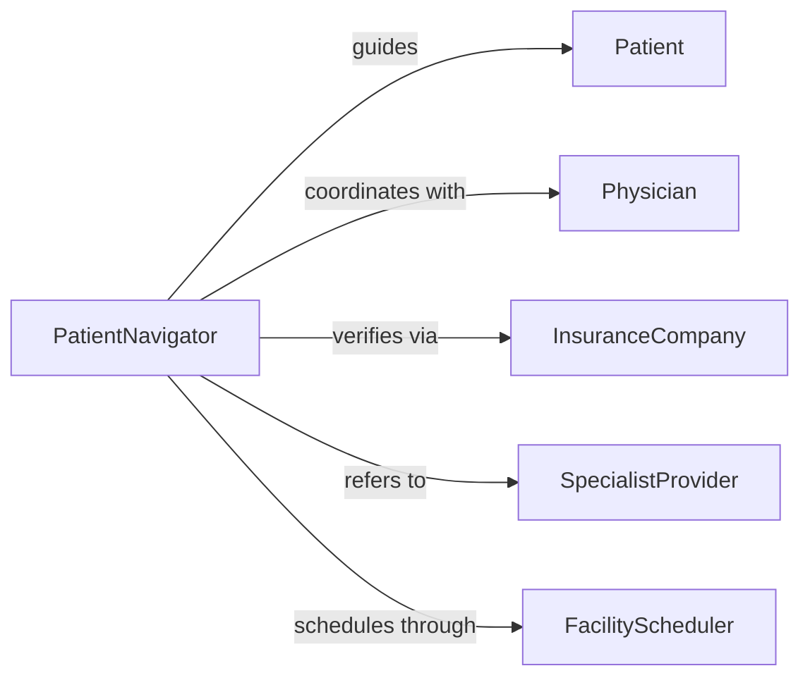

# Advise Patients Healthcare System Processes

> Business-as-Code definition for patient navigation and healthcare system guidance. Helps patients understand and navigate complex healthcare processes including appointments, referrals, insurance, and continuity of care.

## Overview

Healthcare system navigation involves educating patients on care processes, coordinating appointments and referrals, explaining insurance coverage, and ensuring smooth transitions between providers. This definition models the patient inquiry, guidance provision, coordination, and follow-up lifecycle.

## Actors

| Actor | Description |
|-------|-------------|
| Patient | Individual seeking to understand healthcare processes |
| PatientNavigator | Professional guiding patients through healthcare system |
| Physician | Provides medical care and orders tests or referrals |
| InsuranceCompany | Covers healthcare services and procedures |
| SpecialistProvider | Delivers specialized medical care via referral |
| FacilityScheduler | Coordinates appointments and procedures |

## Roles

| Role | Description |
|------|-------------|
| CareCoordinator | Manages patient journey across providers |
| InsuranceCounselor | Explains coverage and financial responsibility |
| ReferralSpecialist | Facilitates transfers to specialty care |
| PatientAdvocate | Resolves barriers to care access |

## Entities

| Entity | Description |
|--------|-------------|
| PatientInquiry | Request for guidance on healthcare process |
| NavigationPlan | Roadmap for patient through healthcare system |
| Referral | Transfer of care to specialist or facility |
| AppointmentCoordination | Scheduling of medical services |
| InsuranceAuthorization | Approval for coverage of services |
| ContinuityPlan | Strategy for ongoing care coordination |

## Actions

| Action | Description |
|--------|-------------|
| receiveInquiry | Accept patient request for process guidance |
| explainProcess | Educate patient on healthcare system procedures |
| coordinateAppointments | Schedule medical services and procedures |
| facilitateReferral | Arrange transfer to specialist or facility |
| verifyInsurance | Confirm coverage and authorization requirements |
| provideResources | Share educational materials and contact information |
| followUpProgress | Check patient understanding and care continuity |

## Events

| Event | Description |
|-------|-------------|
| inquiryReceived | Patient request has been accepted |
| processExplained | Healthcare procedures have been educated |
| appointmentsCoordinated | Medical services have been scheduled |
| referralFacilitated | Transfer to specialist has been arranged |
| insuranceVerified | Coverage has been confirmed |
| resourcesProvided | Educational materials have been shared |
| progressFollowedUp | Patient understanding has been checked |

## Searches

| Search | Description |
|--------|-------------|
| findInquiries | List patient requests by type or status |
| searchReferrals | Find specialist transfers by specialty or date |
| getAppointments | Retrieve scheduled services by patient |
| getAuthorizations | Access insurance approval status |

## Entity Relationships



## State Diagram



## Workflow



## Actor Relationships



## Usage

### Calling Actions

```typescript
import { advisePatientsHealthcareSystemProcesses } from '@headlessly/advise-patients-healthcare-system-processes'

const navigation = advisePatientsHealthcareSystemProcesses()

// Receive patient inquiry
const inquiry = await navigation.receiveInquiry({
  patientId: 'patient_789',
  topic: 'specialist-referral',
  question: 'How do I see a cardiologist for my heart condition?',
  urgency: 'routine'
})

// Explain healthcare process
await navigation.explainProcess({
  inquiryId: inquiry.id,
  topics: ['referral-process', 'insurance-authorization', 'specialist-selection'],
  method: 'phone-call',
  duration: 20
})

// Facilitate specialist referral
const referral = await navigation.facilitateReferral({
  patientId: 'patient_789',
  specialty: 'cardiology',
  requestingPhysician: 'physician_123',
  insuranceId: 'ins_456',
  urgency: 'routine'
})
```

### Event-Driven Automation

```typescript
// Auto-verify insurance after referral
navigation.referralFacilitated(async ({ patientId, referralId, specialty }) => {
  await navigation.verifyInsurance({
    patientId,
    referralId,
    serviceType: specialty,
    checkAuthorization: true
  })
})

// Follow up on pending appointments
navigation.appointmentsCoordinated(async ({ patientId, appointmentDate }) => {
  const reminderDate = subtractDays(appointmentDate, 3)
  await scheduleTask({
    task: 'Send appointment reminder to patient',
    assignee: 'patient-navigator',
    dueDate: reminderDate,
    patientId
  })
})
```
