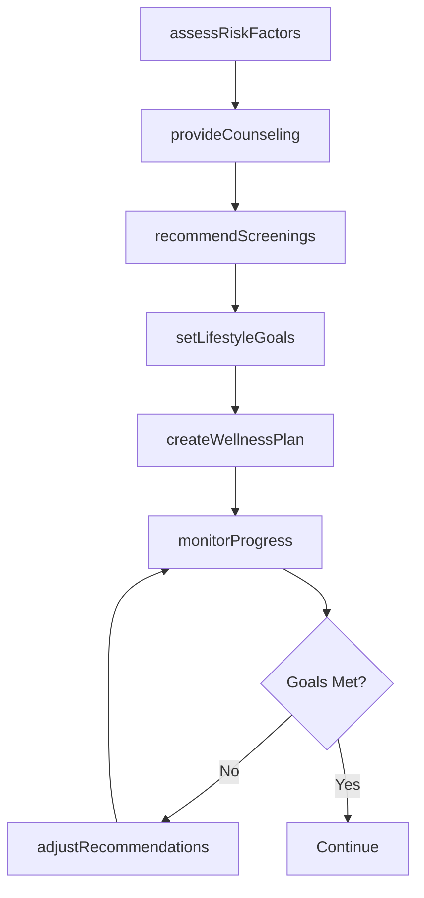
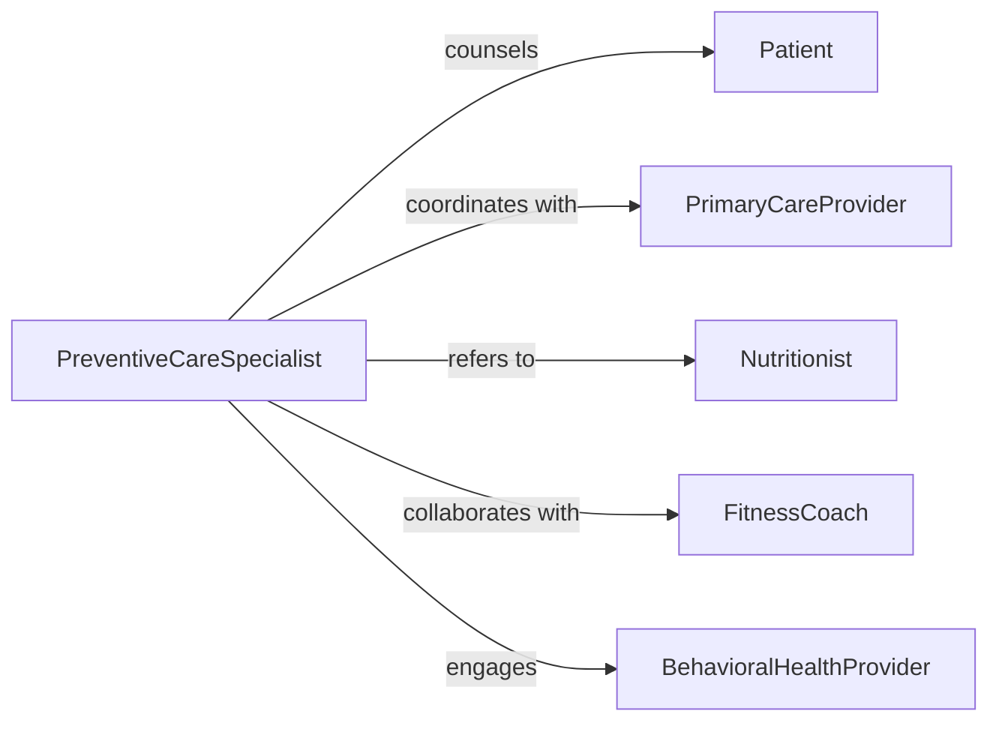

# Advise Patients Preventive Care Techniques

> Business-as-Code definition for preventive health education and counseling. Provides evidence-based guidance on disease prevention, health screening, lifestyle modifications, and wellness promotion strategies.

## Overview

Preventive care advisory involves assessing patient risk factors, educating on health maintenance strategies, recommending screening schedules, and supporting behavior change. This definition models the risk assessment, counseling, goal-setting, and follow-up monitoring lifecycle.

## Actors

| Actor | Description |
|-------|-------------|
| Patient | Individual seeking preventive health guidance |
| PreventiveCareSpecialist | Healthcare professional providing wellness counseling |
| PrimaryCareProvider | Physician managing overall patient health |
| Nutritionist | Expert on dietary interventions and nutrition |
| FitnessCoach | Guides physical activity and exercise programs |
| BehavioralHealthProvider | Supports mental health and stress management |

## Roles

| Role | Description |
|------|-------------|
| HealthEducator | Delivers preventive care education |
| RiskAssessor | Evaluates patient disease risk factors |
| WellnessCoach | Facilitates behavior change and goal achievement |
| ScreeningCoordinator | Manages preventive health testing schedules |

## Entities

| Entity | Description |
|--------|-------------|
| RiskAssessment | Evaluation of patient disease and health risks |
| PreventiveCounsel | Guidance on disease prevention strategies |
| ScreeningRecommendation | Suggested health tests based on risk profile |
| LifestyleGoal | Target behavior change for health improvement |
| WellnessPlan | Comprehensive strategy for preventive care |
| ProgressTracking | Monitoring of patient adherence and outcomes |

## Actions

| Action | Description |
|--------|-------------|
| assessRiskFactors | Evaluate patient health risks and vulnerabilities |
| provideCounseling | Educate on evidence-based prevention strategies |
| recommendScreenings | Suggest appropriate health tests and schedules |
| setLifestyleGoals | Establish behavior change targets with patient |
| createWellnessPlan | Develop comprehensive preventive care strategy |
| monitorProgress | Track patient adherence and health outcomes |
| adjustRecommendations | Modify guidance based on progress and feedback |

## Events

| Event | Description |
|-------|-------------|
| riskFactorsAssessed | Patient vulnerabilities have been evaluated |
| counselingProvided | Prevention education has been delivered |
| screeningsRecommended | Health tests have been suggested |
| lifestyleGoalsSet | Behavior targets have been established |
| wellnessPlanCreated | Comprehensive strategy has been developed |
| progressMonitored | Adherence and outcomes have been tracked |
| recommendationsAdjusted | Guidance has been modified |

## Searches

| Search | Description |
|--------|-------------|
| findAssessments | List risk evaluations by patient or date |
| searchRecommendations | Find preventive guidance by risk category |
| getScreeningSchedules | Retrieve health testing recommendations |
| getProgressReports | Access patient adherence and outcome data |

## Workflow



## Actor Relationships



## Usage

### Calling Actions

```typescript
import { advisePatientsPreventiveCareTechniques } from '@headlessly/advise-patients-preventive-care-techniques'

const preventiveCare = advisePatientsPreventiveCareTechniques()

// Assess patient risk factors
const assessment = await preventiveCare.assessRiskFactors({
  patientId: 'patient_456',
  demographics: { age: 52, gender: 'male' },
  history: ['hypertension', 'family-history-diabetes'],
  lifestyle: { smoking: false, exercise: 'sedentary', diet: 'high-sodium' },
  screenings: { lastPhysical: '2024-03-15', lastBloodwork: '2024-06-01' }
})

// Provide preventive counseling
await preventiveCare.provideCounseling({
  assessmentId: assessment.id,
  topics: ['cardiovascular-health', 'diabetes-prevention', 'weight-management'],
  approach: 'motivational-interviewing',
  duration: 30
})

// Set lifestyle modification goals
const goals = await preventiveCare.setLifestyleGoals({
  patientId: 'patient_456',
  assessmentId: assessment.id,
  targets: [
    { category: 'nutrition', goal: 'Reduce sodium intake to under 2000mg daily', timeline: '3-months' },
    { category: 'exercise', goal: 'Walk 30 minutes 5 days per week', timeline: '6-months' },
    { category: 'weight', goal: 'Lose 15 pounds', timeline: '6-months' }
  ]
})
```

### Event-Driven Automation

```typescript
// Schedule screenings after recommendations
preventiveCare.screeningsRecommended(async ({ patientId, screenings }) => {
  for (const screening of screenings) {
    await scheduleTask({
      task: `Schedule ${screening.test} for patient`,
      assignee: 'scheduling-coordinator',
      dueDate: screening.dueDate,
      patientId
    })
  }
})

// Alert on missed prevention goals
preventiveCare.progressMonitored(async ({ patientId, goals, adherence }) => {
  const missedGoals = goals.filter(g => adherence[g.id] < 50)
  if (missedGoals.length > 0) {
    await notify({
      to: 'wellness-coach',
      priority: 'medium',
      message: `Patient ${patientId} has low adherence to ${missedGoals.length} preventive care goals`
    })
  }
})
```
