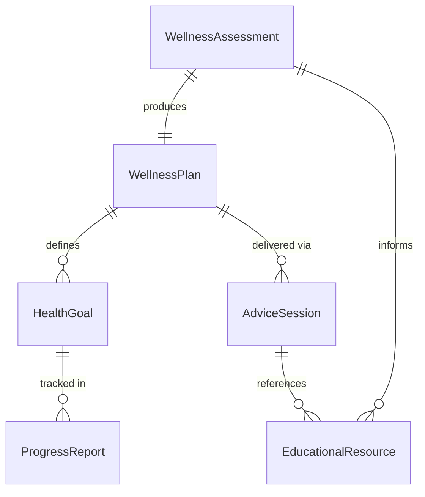
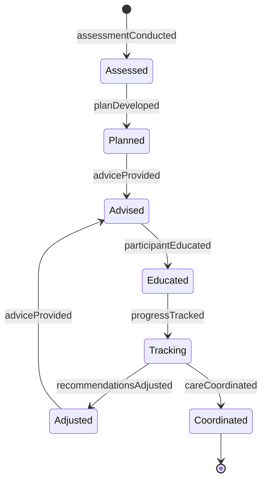
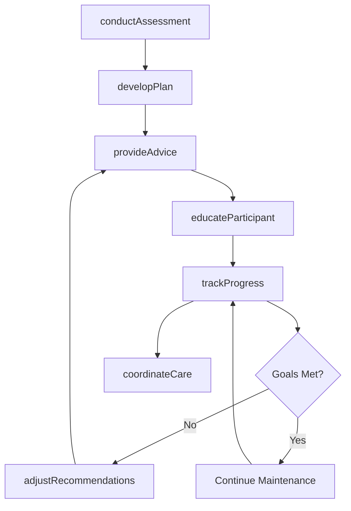
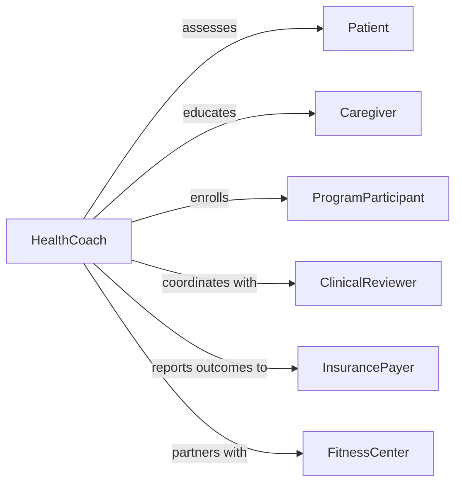

# Provide Health Wellness Advice Patients

> Business-as-Code definition for health and wellness consultation services. Models personalized advice delivery to patients, program participants, and caregivers across preventive care, lifestyle management, and chronic condition support.

## Overview

Health and wellness advice provision encompasses nutritional guidance, exercise recommendations, stress management, preventive care education, and chronic disease management support. This definition exposes actions for assessment, recommendation, education, and follow-up, enabling healthcare providers to deliver evidence-based wellness counseling at scale.

## Actors

| Actor | Description |
|-------|-------------|
| Patient | Receives health and wellness advice and implements recommendations |
| Caregiver | Supports patient adherence and provides feedback on outcomes |
| ProgramParticipant | Enrolled in structured wellness program with specific goals |
| InsurancePayer | Covers preventive services and wellness program costs |
| PharmacyProvider | Coordinates medication management with wellness plans |
| FitnessCenter | Partners on exercise programs and physical activity tracking |

## Roles

| Role | Description |
|------|-------------|
| HealthCoach | Delivers personalized wellness advice and behavior change support |
| NutritionCounselor | Provides dietary guidance and meal planning assistance |
| WellnessCoordinator | Manages wellness program enrollment and progress tracking |
| ClinicalReviewer | Validates advice against medical history and current treatments |

## Entities

| Entity | Description |
|--------|-------------|
| WellnessAssessment | Comprehensive evaluation of current health status and risk factors |
| AdviceSession | Structured consultation with documented recommendations |
| WellnessPlan | Personalized roadmap with goals, actions, and milestones |
| EducationalResource | Materials supporting behavior change and self-management |
| ProgressReport | Tracked outcomes and adherence to wellness recommendations |
| HealthGoal | Specific measurable objective for lifestyle improvement |

## Actions

| Action | Description |
|--------|-------------|
| conductAssessment | Evaluate health status, risks, and wellness opportunities |
| developPlan | Create personalized wellness plan with actionable recommendations |
| provideAdvice | Deliver evidence-based guidance on specific health topics |
| educateParticipant | Share educational resources and skill-building content |
| trackProgress | Monitor adherence and measure outcomes against goals |
| adjustRecommendations | Modify plan based on progress and changing needs |
| coordinateCare | Integrate wellness advice with medical treatment plans |

## Events

| Event | Description |
|-------|-------------|
| assessmentConducted | Baseline health and wellness evaluation completed |
| planDeveloped | Personalized wellness plan created and shared |
| adviceProvided | Specific guidance delivered to patient or caregiver |
| participantEducated | Educational resources and training delivered |
| progressTracked | Outcomes measured and adherence documented |
| recommendationsAdjusted | Plan modified based on results or barriers |
| careCoordinated | Wellness and medical care integrated successfully |

## Searches

| Search | Description |
|--------|-------------|
| findParticipants | List participants by program, risk level, or engagement status |
| getPlans | Retrieve wellness plans by patient or program type |
| getAssessments | Find assessments by date range or risk category |
| trackOutcomes | Query progress reports and goal achievement metrics |

## Entity Relationships



## State Diagram



## Workflow



## Actor Relationships



## Usage

### Calling Actions

```typescript
import { provideHealthWellnessAdvicePatients } from '@headlessly/provide-health-wellness-advice-patients'

const wellness = provideHealthWellnessAdvicePatients()

// Conduct initial wellness assessment
const assessment = await wellness.conductAssessment({
  patientId: 'pt-789',
  assessmentType: 'comprehensive',
  data: {
    age: 52,
    bmi: 28.3,
    bloodPressure: '138/88',
    activityLevel: 'sedentary',
    smokingStatus: 'former',
    chronicConditions: ['prediabetes', 'hypertension']
  }
})

// Develop personalized wellness plan
const plan = await wellness.developPlan({
  patientId: 'pt-789',
  assessmentId: assessment.id,
  goals: [
    { type: 'weight', target: 'lose 15 lbs', timeframe: '6 months' },
    { type: 'activity', target: '150 min/week moderate exercise', timeframe: '3 months' },
    { type: 'nutrition', target: 'reduce sodium to 2000mg/day', timeframe: '1 month' }
  ],
  recommendations: [
    'Begin walking program: 20 min daily, gradually increase',
    'Mediterranean diet pattern with portion control',
    'Blood pressure monitoring twice daily',
    'Stress reduction: mindfulness 10 min/day'
  ]
})

// Provide specific advice during consultation
await wellness.provideAdvice({
  patientId: 'pt-789',
  topic: 'hypertension-management',
  advice: 'Focus on DASH diet principles, limit processed foods, increase potassium-rich foods like bananas and leafy greens',
  resources: ['dash-diet-guide', 'blood-pressure-log']
})
```

### Event-Driven Automation

```typescript
// Alert coordinator when high-risk assessment completed
wellness.assessmentConducted(async ({ patientId, assessment }) => {
  if (assessment.riskLevel === 'high') {
    await notify({
      to: 'wellness-coordinator',
      priority: 'high',
      message: `High-risk assessment for patient ${patientId} - schedule intensive coaching`
    })
  }
})

// Auto-schedule follow-up when plan developed
wellness.planDeveloped(async ({ patientId, plan }) => {
  await schedule({
    type: 'follow-up-call',
    patientId,
    scheduledDate: addDays(new Date(), 14),
    purpose: 'Review progress and address barriers'
  })
})
```
