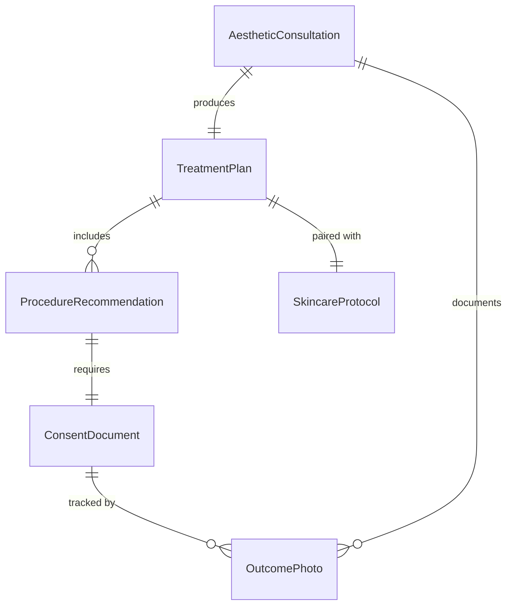
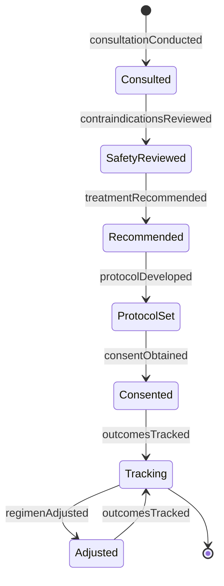
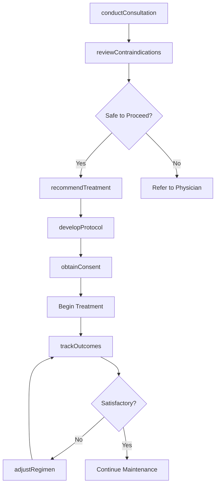
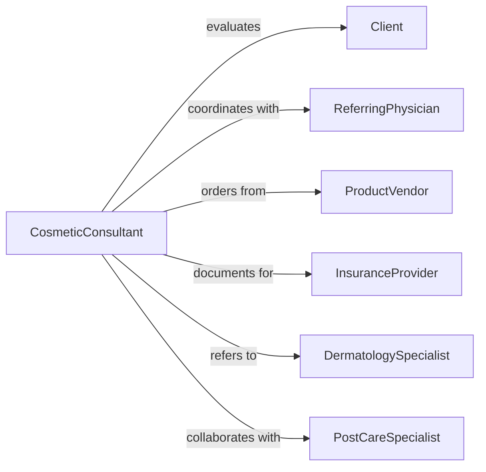

# Provide Medical Cosmetic Advice Clients

> Business-as-Code definition for medical and cosmetic consultation services. Models aesthetic treatment recommendations, skincare protocols, and cosmetic procedure guidance for clients seeking medical-grade beauty solutions.

## Overview

Medical and cosmetic advice delivery spans dermatological treatments, aesthetic procedures, anti-aging protocols, and cosmetic surgery consultations. This definition provides actions for assessment, treatment planning, product recommendations, and post-procedure care, enabling practitioners to deliver personalized aesthetic guidance integrated with medical safety protocols.

## Actors

| Actor | Description |
|-------|-------------|
| Client | Seeks aesthetic improvement and cosmetic treatment advice |
| ReferringPhysician | Coordinates medical clearance and treatment contraindications |
| ProductVendor | Supplies medical-grade skincare and treatment products |
| InsuranceProvider | Evaluates coverage for medically necessary procedures |
| ImagingCenter | Provides diagnostic imaging for treatment planning |
| PostCareSpecialist | Delivers follow-up care and complication management |

## Roles

| Role | Description |
|------|-------------|
| CosmeticConsultant | Evaluates aesthetic concerns and recommends treatments |
| DermatologySpecialist | Addresses medical skin conditions and cosmetic dermatology |
| TreatmentCoordinator | Manages appointment scheduling and treatment sequencing |
| ProductAdvisor | Recommends homecare products and skincare regimens |

## Entities

| Entity | Description |
|--------|-------------|
| AestheticConsultation | Comprehensive evaluation of cosmetic concerns and goals |
| TreatmentPlan | Sequenced recommendations for procedures and products |
| ProcedureRecommendation | Specific treatment option with expected outcomes |
| SkincareProtocol | Daily regimen with medical-grade product recommendations |
| ConsentDocument | Informed consent with risks, benefits, and alternatives |
| OutcomePhoto | Before and after documentation for treatment tracking |

## Actions

| Action | Description |
|--------|-------------|
| conductConsultation | Assess aesthetic concerns, skin condition, and treatment goals |
| recommendTreatment | Propose procedures, products, or protocols based on evaluation |
| developProtocol | Create personalized skincare regimen with specific products |
| reviewContraindications | Evaluate medical history for treatment safety concerns |
| obtainConsent | Document client understanding of risks and expectations |
| trackOutcomes | Monitor results and document progress with photography |
| adjustRegimen | Modify treatments or products based on response and tolerance |

## Events

| Event | Description |
|-------|-------------|
| consultationConducted | Initial aesthetic evaluation completed with client |
| treatmentRecommended | Specific procedures or protocols proposed to client |
| protocolDeveloped | Personalized skincare regimen created and shared |
| contraindicationsReviewed | Medical safety evaluation completed and documented |
| consentObtained | Client formally agreed to treatment with full disclosure |
| outcomesTracked | Progress documented with clinical photography or metrics |
| regimenAdjusted | Treatment plan modified based on results or concerns |

## Searches

| Search | Description |
|--------|-------------|
| findClients | List clients by treatment type, concern area, or status |
| getConsultations | Retrieve consultation records by date or practitioner |
| getTreatmentPlans | Find active treatment plans by procedure or product category |
| trackResults | Query outcome photos and satisfaction metrics |

## Entity Relationships



## State Diagram



## Workflow



## Actor Relationships



## Usage

### Calling Actions

```typescript
import { provideMedicalCosmeticAdviceClients } from '@headlessly/provide-medical-cosmetic-advice-clients'

const cosmetic = provideMedicalCosmeticAdviceClients()

// Conduct initial aesthetic consultation
const consultation = await cosmetic.conductConsultation({
  clientId: 'cl-456',
  concerns: ['fine-lines', 'pigmentation', 'loss-of-volume'],
  goals: 'natural-looking rejuvenation, minimal downtime',
  skinType: 'combination, sensitive',
  previousTreatments: ['chemical-peels', 'microneedling']
})

// Review medical contraindications
const safety = await cosmetic.reviewContraindications({
  clientId: 'cl-456',
  medicalHistory: {
    conditions: ['autoimmune-thyroid'],
    medications: ['levothyroxine'],
    allergies: ['benzoyl-peroxide']
  },
  proposedTreatments: ['botox', 'hyaluronic-filler', 'laser-resurfacing']
})

// Recommend treatment approach
const treatment = await cosmetic.recommendTreatment({
  clientId: 'cl-456',
  consultationId: consultation.id,
  recommendations: [
    {
      procedure: 'neuromodulator-forehead-glabella',
      units: 30,
      frequency: 'every-3-months',
      expectedOutcome: 'reduce dynamic lines by 70-80%'
    },
    {
      procedure: 'dermal-filler-nasolabial',
      volume: '1ml-per-side',
      frequency: 'every-12-months',
      expectedOutcome: 'restore volume, soften creases'
    }
  ]
})

// Develop skincare protocol
await cosmetic.developProtocol({
  clientId: 'cl-456',
  protocol: {
    morning: ['gentle-cleanser', 'vitamin-c-serum', 'spf-50-mineral'],
    evening: ['oil-cleanser', 'retinol-0.5%', 'peptide-moisturizer'],
    weekly: ['exfoliating-enzyme-mask'],
    products: ['medical-grade-brand']
  }
})
```

### Event-Driven Automation

```typescript
// Flag high-risk contraindications for physician review
cosmetic.contraindicationsReviewed(async ({ clientId, safety }) => {
  if (safety.riskLevel === 'high') {
    await notify({
      to: 'medical-director',
      priority: 'high',
      message: `Medical clearance required for client ${clientId} before proceeding`
    })
  }
})

// Schedule follow-up after treatment recommendation
cosmetic.treatmentRecommended(async ({ clientId, recommendations }) => {
  await schedule({
    type: 'treatment-appointment',
    clientId,
    scheduledDate: addDays(new Date(), 7),
    purpose: 'First treatment session'
  })
})
```
