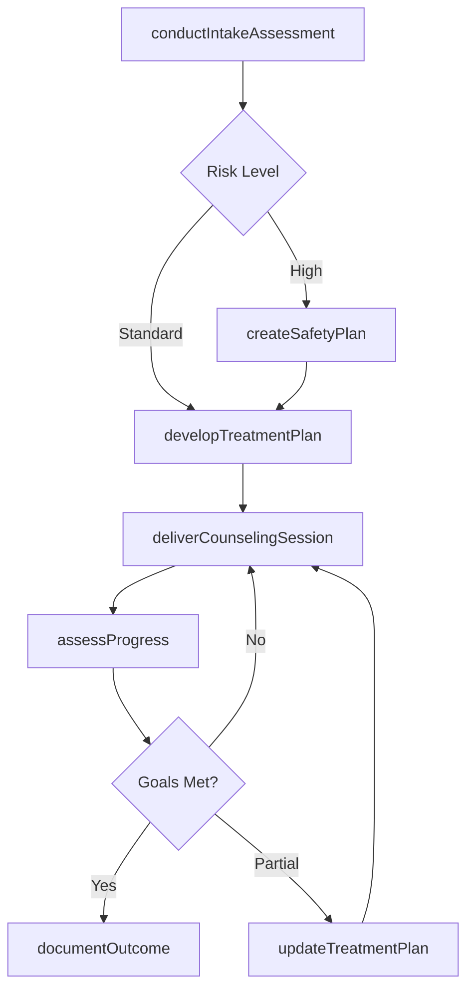
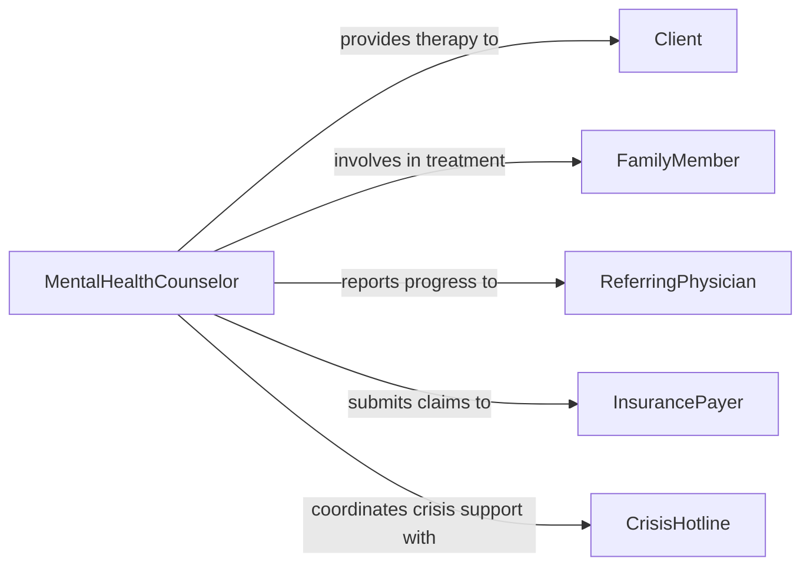

# Counsel Clients on Mental Health or Personal Achievement

> Business-as-Code definition for counseling clients on mental health and personal achievement. Models the therapeutic and coaching process from intake assessment through treatment planning, session delivery, progress evaluation, and outcome documentation.

## Overview

Counseling clients on mental health or personal achievement involves providing therapeutic support for psychological conditions, emotional well-being, and personal growth objectives. This definition exposes actions for conducting clinical assessments, developing treatment or coaching plans, delivering counseling sessions, and measuring client progress. Events enable automated scheduling, crisis response, and compliance workflows, while searches surface clinical histories, outcome benchmarks, and resource directories.

## Actors

| Actor | Description |
|-------|-------------|
| Client | Seeks counseling for mental health concerns or personal development goals |
| FamilyMember | Participates in treatment or provides collateral information |
| ReferringPhysician | Refers patients for mental health counseling and receives progress reports |
| InsurancePayer | Authorizes and reimburses counseling sessions |
| LicensingBoard | Sets standards for clinical practice and credentialing |
| CrisisHotline | Provides immediate support during mental health emergencies |

## Roles

| Role | Description |
|------|-------------|
| MentalHealthCounselor | Delivers therapeutic interventions for psychological and emotional concerns |
| LifeCoach | Guides clients toward personal achievement and goal attainment |
| ClinicalSupervisor | Oversees counseling quality and provides clinical guidance to staff |
| IntakeCoordinator | Manages initial assessments and assigns clients to appropriate counselors |

## Entities

| Entity | Description |
|--------|-------------|
| ClientIntake | Initial assessment documenting presenting concerns and history |
| TreatmentPlan | A structured plan of therapeutic goals, interventions, and timelines |
| CounselingSession | A documented encounter between counselor and client |
| ProgressNote | A clinical record of session content and client status |
| OutcomeAssessment | A standardized measure of client improvement over time |
| SafetyPlan | A documented protocol for managing crisis or self-harm risk |

## Actions

| Action | Description |
|--------|-------------|
| conductIntakeAssessment | Gather presenting concerns, mental health history, and risk factors |
| developTreatmentPlan | Create a structured plan with therapeutic goals and interventions |
| deliverCounselingSession | Facilitate a therapeutic or coaching session with the client |
| assessProgress | Evaluate client advancement toward treatment goals |
| updateTreatmentPlan | Modify goals or interventions based on progress assessment |
| createSafetyPlan | Develop a crisis management protocol with the client |
| documentOutcome | Record treatment completion status and final assessment results |

## Events

| Event | Description |
|-------|-------------|
| intakeAssessmentCompleted | Client intake and initial evaluation have been documented |
| treatmentPlanDeveloped | A treatment plan has been created for the client |
| counselingSessionDelivered | A therapeutic session has been conducted and documented |
| progressAssessed | Client progress toward goals has been evaluated |
| treatmentPlanUpdated | Treatment goals or interventions have been modified |
| safetyPlanCreated | A crisis management protocol has been established |
| outcomeDocumented | Treatment results have been formally recorded |

## Searches

| Search | Description |
|--------|-------------|
| findClientIntakes | List intake records by counselor, date, or presenting concern |
| getTreatmentPlans | Retrieve treatment plans by client, status, or diagnosis |
| getSessionHistory | Look up counseling sessions by client, date range, or session type |
| findOutcomeAssessments | Search outcome measures by client, instrument, or score range |

## Workflow



## Actor Relationships



## Usage

### Calling Actions

```typescript
import { counselClientsOnMentalHealthOrPersonalAchievement } from '@headlessly/counsel-clients-on-mental-health-or-personal-achievement'

const counselor = counselClientsOnMentalHealthOrPersonalAchievement()

// Conduct intake assessment
const intake = await counselor.conductIntakeAssessment({
  clientId: 'CLT-5593',
  presentingConcerns: ['anxiety', 'work-related-stress'],
  mentalHealthHistory: { priorTreatment: true, medications: ['sertraline'] },
  riskFactors: { suicidalIdeation: false, substanceUse: 'none' }
})

// Develop treatment plan
await counselor.developTreatmentPlan({
  clientId: 'CLT-5593',
  intakeId: intake.id,
  diagnosis: 'Generalized Anxiety Disorder',
  goals: [
    { goal: 'Reduce anxiety symptoms', target: 'GAD-7 score below 10', timeline: '12 weeks' },
    { goal: 'Develop coping strategies', target: 'Client reports using 3+ techniques', timeline: '8 weeks' }
  ],
  modality: 'cognitive-behavioral-therapy',
  frequency: 'weekly'
})

// Deliver a counseling session
await counselor.deliverCounselingSession({
  clientId: 'CLT-5593',
  sessionNumber: 4,
  focus: 'Cognitive restructuring of catastrophic thinking patterns',
  interventions: ['thought-record', 'behavioral-experiment'],
  clientResponse: 'engaged'
})
```

### Event-Driven Automation

```typescript
// Alert supervisor when safety plan is needed
counselor.intakeAssessmentCompleted(async ({ clientId, riskFactors }) => {
  if (riskFactors.suicidalIdeation) {
    await notify({
      to: 'clinical-supervisor',
      message: `High-risk intake for client ${clientId} - safety plan required`,
      priority: 'urgent'
    })
  }
})

// Schedule progress review after series of sessions
counselor.counselingSessionDelivered(async ({ clientId, sessionNumber }) => {
  if (sessionNumber % 6 === 0) {
    await scheduleTask({
      action: 'assessProgress',
      clientId,
      delay: '7d'
    })
  }
})
```
