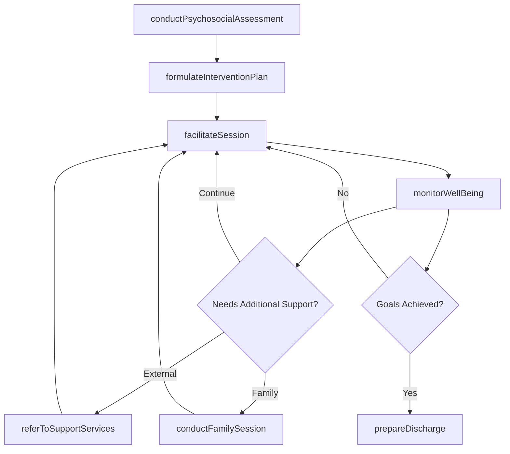
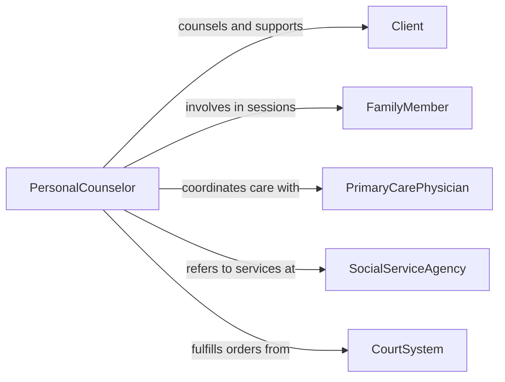

# Counsel Clients or Patients Regarding Personal Issues

> Business-as-Code definition for counseling clients or patients on personal issues. Models the supportive counseling process from initial assessment through intervention planning, session delivery, and outcome tracking.

## Overview

Counseling clients or patients regarding personal issues involves providing empathetic, structured support for challenges related to relationships, grief, life transitions, family dynamics, and personal identity. This definition exposes actions for conducting psychosocial assessments, formulating intervention strategies, facilitating counseling sessions, and monitoring client well-being. Events enable automated case management and referral workflows, while searches surface client histories, intervention resources, and community support directories.

## Actors

| Actor | Description |
|-------|-------------|
| Client | Seeks support for personal challenges affecting daily functioning |
| FamilyMember | Participates in family counseling or provides contextual information |
| PrimaryCarePhysician | Refers patients with personal distress and coordinates care |
| SocialServiceAgency | Provides housing, financial, and community support services |
| CourtSystem | Orders counseling as part of legal proceedings or custody arrangements |
| ClergyMember | Offers pastoral care and may refer individuals for professional counseling |

## Roles

| Role | Description |
|------|-------------|
| PersonalCounselor | Facilitates therapeutic conversations about personal challenges |
| FamilyTherapist | Guides families through relational conflicts and transitions |
| GriefCounselor | Supports individuals processing loss and bereavement |
| CaseCoordinator | Manages referrals and ensures continuity of care |

## Entities

| Entity | Description |
|--------|-------------|
| PsychosocialAssessment | An evaluation of the client's personal, social, and environmental context |
| InterventionPlan | A structured approach to addressing identified personal issues |
| CounselingSession | A documented therapeutic encounter focused on personal matters |
| ClientJournal | A record of client reflections and homework between sessions |
| ReferralRecord | Documentation of connections to external support services |
| DischargesSummary | A concluding record of counseling outcomes and recommendations |

## Actions

| Action | Description |
|--------|-------------|
| conductPsychosocialAssessment | Evaluate the client's personal circumstances, relationships, and stressors |
| formulateInterventionPlan | Design a counseling approach tailored to the client's needs |
| facilitateSession | Conduct a counseling session focused on personal issues |
| monitorWellBeing | Track the client's emotional and functional status between sessions |
| referToSupportServices | Connect the client with community or social services |
| conductFamilySession | Facilitate a joint session with the client and family members |
| prepareDischarge | Summarize outcomes and plan for termination of counseling |

## Events

| Event | Description |
|-------|-------------|
| psychosocialAssessmentCompleted | The client's personal and social context has been evaluated |
| interventionPlanFormulated | A counseling approach has been designed for the client |
| sessionFacilitated | A counseling session has been conducted and documented |
| wellBeingMonitored | Client well-being status has been recorded between sessions |
| supportServiceReferralMade | The client has been connected with external services |
| familySessionConducted | A joint session with family members has been completed |
| dischargeCompleted | Counseling has concluded and outcomes have been documented |

## Searches

| Search | Description |
|--------|-------------|
| findAssessments | List psychosocial assessments by client, counselor, or date |
| getSessionHistory | Retrieve counseling session records by client or date range |
| findReferrals | Search referral records by service type, agency, or status |
| getSupportServices | Look up available community and social support resources |

## Workflow



## Actor Relationships



## Usage

### Calling Actions

```typescript
import { counselClientsOrPatientsOnPersonalIssues } from '@headlessly/counsel-clients-or-patients-on-personal-issues'

const counselor = counselClientsOrPatientsOnPersonalIssues()

// Conduct psychosocial assessment
const assessment = await counselor.conductPsychosocialAssessment({
  clientId: 'CLT-7714',
  presentingIssues: ['divorce-adjustment', 'parenting-stress'],
  livingArrangement: 'single-parent-household',
  supportNetwork: { family: 'limited', friends: 'moderate', community: 'none' }
})

// Formulate an intervention plan
await counselor.formulateInterventionPlan({
  clientId: 'CLT-7714',
  assessmentId: assessment.id,
  approach: 'solution-focused-brief-therapy',
  goals: [
    { goal: 'Develop effective co-parenting communication', timeline: '8 weeks' },
    { goal: 'Establish stable daily routine', timeline: '6 weeks' }
  ],
  frequency: 'biweekly'
})

// Refer to support services
await counselor.referToSupportServices({
  clientId: 'CLT-7714',
  serviceType: 'parenting-support-group',
  agency: 'Family Resource Center',
  urgency: 'standard'
})
```

### Event-Driven Automation

```typescript
// Notify case coordinator when referral is made
counselor.supportServiceReferralMade(async ({ clientId, serviceType, agency }) => {
  await notify({
    to: 'case-coordination',
    message: `Referral for ${serviceType} submitted for client ${clientId} to ${agency}`
  })
})

// Flag clients with declining well-being
counselor.wellBeingMonitored(async ({ clientId, score, previousScore }) => {
  if (score < previousScore - 10) {
    await notify({
      to: 'clinical-supervisor',
      message: `Client ${clientId} well-being score declined significantly: ${previousScore} to ${score}`
    })
  }
})
```
