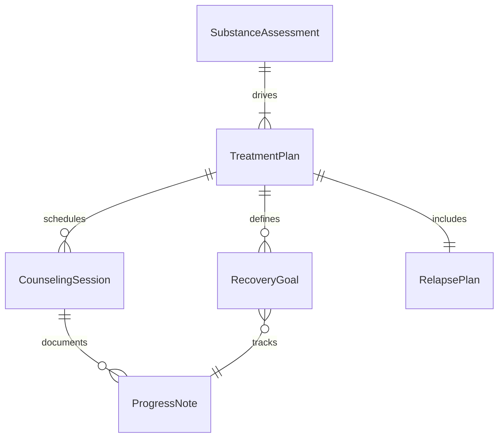
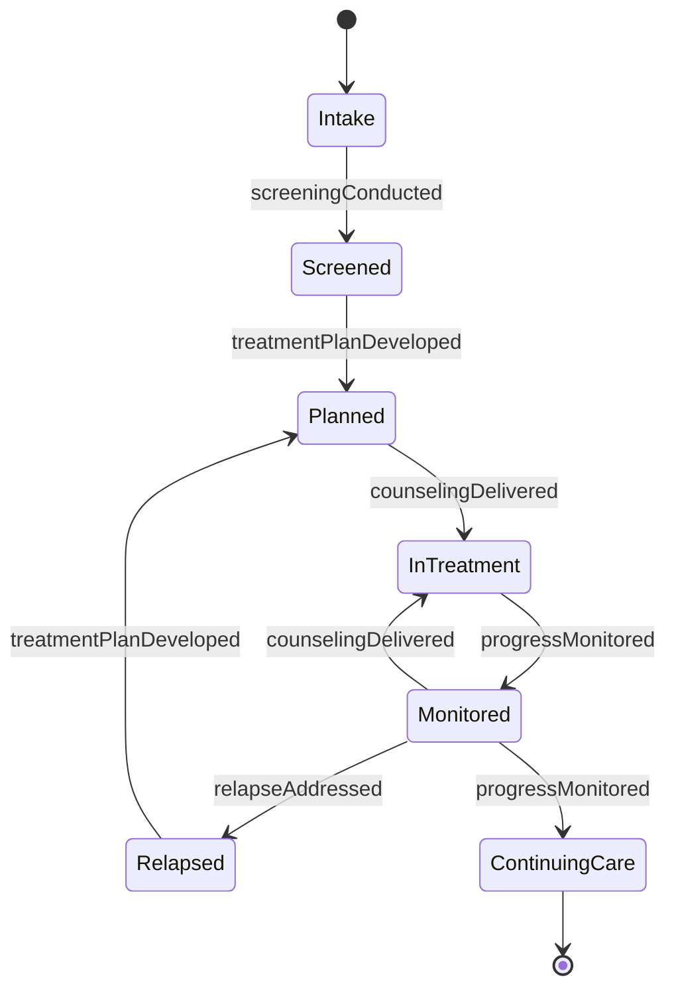
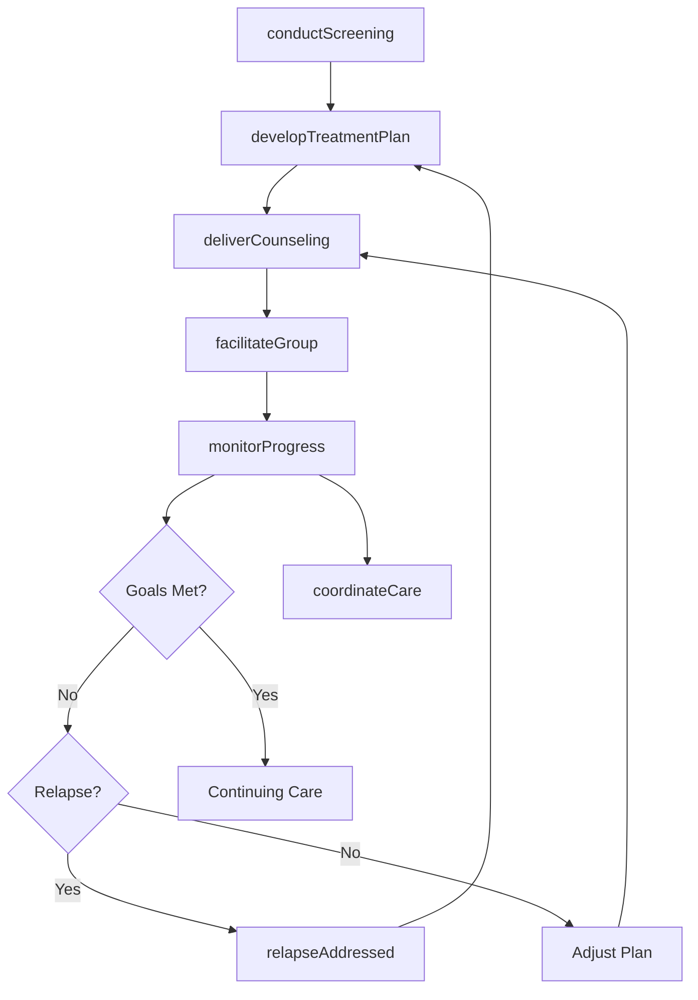
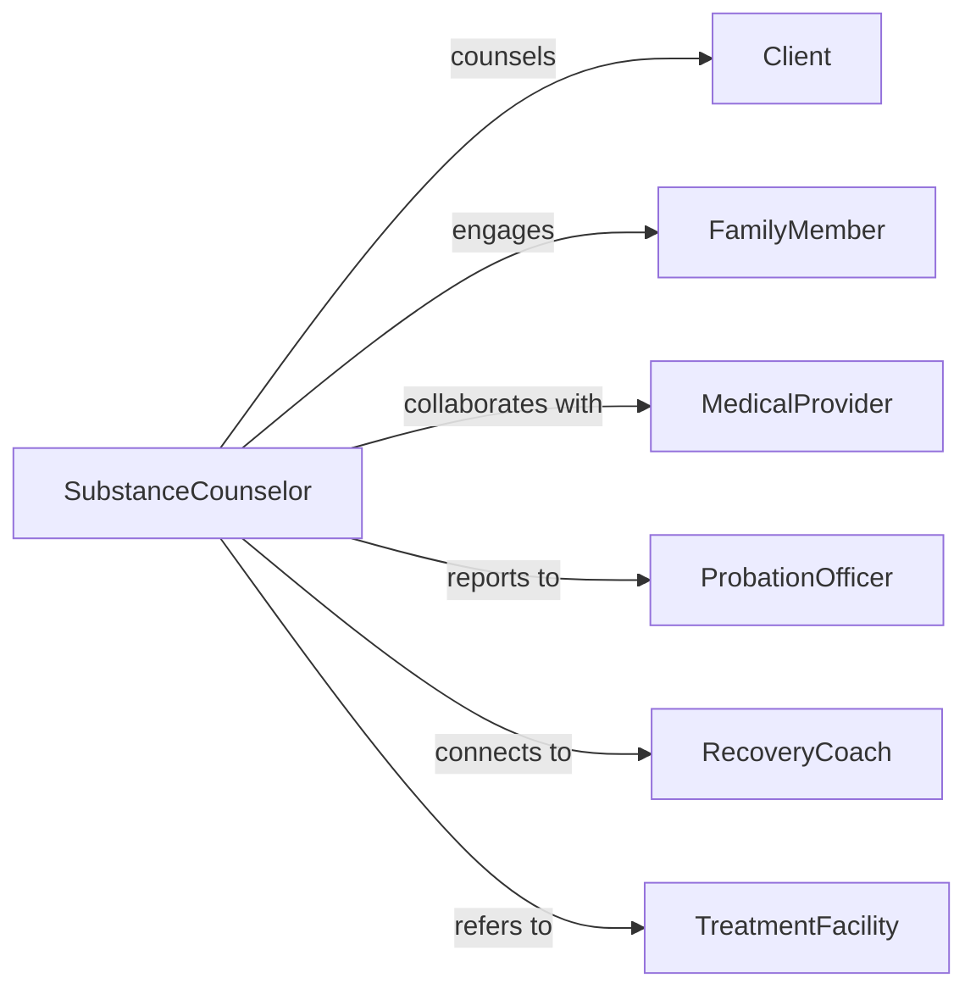

# Counsel Clients Patients Substance Abuse

> Business-as-Code definition for substance abuse counseling services. Models evidence-based interventions for addiction treatment, relapse prevention, and recovery support across individual, group, and family counseling modalities.

## Overview

Substance abuse counseling encompasses assessment, treatment planning, behavioral interventions, relapse prevention, and ongoing recovery support for individuals struggling with addiction. This definition exposes actions for screening, intervention delivery, progress monitoring, and care coordination, enabling counselors to deliver structured, evidence-based treatment in alignment with clinical best practices.

## Actors

| Actor | Description |
|-------|-------------|
| Client | Individual receiving substance abuse counseling and treatment services |
| FamilyMember | Provides support and participates in family therapy sessions |
| MedicalProvider | Prescribes medication-assisted treatment and monitors health status |
| ProbationOfficer | Oversees court-mandated treatment compliance and reporting |
| RecoveryCoach | Provides peer support and community resource connection |
| TreatmentFacility | Delivers residential or intensive outpatient program services |

## Roles

| Role | Description |
|------|-------------|
| SubstanceCounselor | Delivers individual and group counseling using evidence-based approaches |
| ClinicalSupervisor | Reviews treatment plans and ensures adherence to clinical standards |
| IntakeCoordinator | Conducts initial assessments and coordinates treatment placement |
| CaseManager | Connects clients to community resources and wraparound services |

## Entities

| Entity | Description |
|--------|-------------|
| SubstanceAssessment | Comprehensive evaluation of substance use history and severity |
| TreatmentPlan | Individualized goals, interventions, and recovery milestones |
| CounselingSession | Documented individual or group therapy encounter |
| RelapsePlan | Strategies for recognizing triggers and maintaining sobriety |
| ProgressNote | Clinical documentation of session content and client response |
| RecoveryGoal | Specific measurable objective supporting sustained abstinence |

## Actions

| Action | Description |
|--------|-------------|
| conductScreening | Assess substance use patterns, severity, and readiness to change |
| developTreatmentPlan | Create individualized plan with goals, interventions, and timeline |
| deliverCounseling | Provide therapeutic intervention using evidence-based modalities |
| facilitateGroup | Lead group therapy focused on skill-building and peer support |
| monitorProgress | Track adherence, abstinence, and achievement of recovery goals |
| coordinateCare | Integrate counseling with medical, legal, and social services |
| preventRelapse | Teach coping strategies and develop response plan for high-risk situations |

## Events

| Event | Description |
|-------|-------------|
| screeningConducted | Initial substance use assessment completed and documented |
| treatmentPlanDeveloped | Individualized recovery plan created with client input |
| counselingDelivered | Therapeutic session completed with documented interventions |
| groupFacilitated | Group therapy session led with participation tracked |
| progressMonitored | Client adherence and outcomes reviewed and documented |
| careCoordinated | Referrals and service integration activities completed |
| relapseAddressed | Return to use documented and treatment plan adjusted |

## Searches

| Search | Description |
|--------|-------------|
| findClients | List clients by treatment status, substance type, or program |
| getSessions | Retrieve counseling sessions by counselor, date, or modality |
| getTreatmentPlans | Find active treatment plans by goal status or review date |
| trackOutcomes | Query abstinence metrics and goal achievement rates |

## Entity Relationships



## State Diagram



## Workflow



## Actor Relationships



## Usage

### Calling Actions

```typescript
import { counselClientsPatientsSubstanceAbuse } from '@headlessly/counsel-clients-patients-substance-abuse'

const substanceCounseling = counselClientsPatientsSubstanceAbuse()

// Conduct initial substance use screening
const screening = await substanceCounseling.conductScreening({
  clientId: 'cl-123',
  screeningType: 'comprehensive',
  substances: ['alcohol', 'opioids'],
  usePattern: {
    frequency: 'daily',
    quantity: 'heavy',
    duration: '3-years',
    lastUse: '2-days-ago'
  },
  consequences: ['job-loss', 'relationship-conflict', 'legal-issues'],
  readinessToChange: 'contemplation'
})

// Develop individualized treatment plan
const plan = await substanceCounseling.developTreatmentPlan({
  clientId: 'cl-123',
  screeningId: screening.id,
  goals: [
    { type: 'abstinence', target: '90-days-continuous-sobriety', timeframe: '3-months' },
    { type: 'employment', target: 'secure-stable-employment', timeframe: '6-months' },
    { type: 'relationships', target: 'repair-family-relationships', timeframe: '9-months' }
  ],
  interventions: [
    'individual-counseling-weekly',
    'cognitive-behavioral-therapy',
    'group-therapy-twice-weekly',
    'medication-assisted-treatment-evaluation',
    'case-management-services'
  ],
  duration: '12-months-intensive-outpatient'
})

// Deliver individual counseling session
await substanceCounseling.deliverCounseling({
  clientId: 'cl-123',
  sessionType: 'individual',
  modality: 'cognitive-behavioral-therapy',
  focus: 'identifying-triggers-and-developing-coping-strategies',
  interventions: [
    'thought-record-worksheet',
    'urge-surfing-technique',
    'behavioral-activation-planning'
  ],
  clientResponse: 'engaged, identified three high-risk situations',
  homework: 'complete daily thought records, practice urge-surfing'
})
```

### Event-Driven Automation

```typescript
// Alert supervisor when high-severity case identified
substanceCounseling.screeningConducted(async ({ clientId, screening }) => {
  if (screening.severity === 'severe' && screening.suicidalIdeation) {
    await notify({
      to: 'clinical-supervisor',
      priority: 'urgent',
      message: `High-risk client ${clientId} requires immediate review and safety planning`
    })
  }
})

// Auto-coordinate care when medical needs identified
substanceCounseling.treatmentPlanDeveloped(async ({ clientId, plan }) => {
  if (plan.interventions.includes('medication-assisted-treatment-evaluation')) {
    await referToProvider({
      clientId,
      providerType: 'addiction-medicine',
      reason: 'MAT evaluation for opioid use disorder'
    })
  }
})
```
