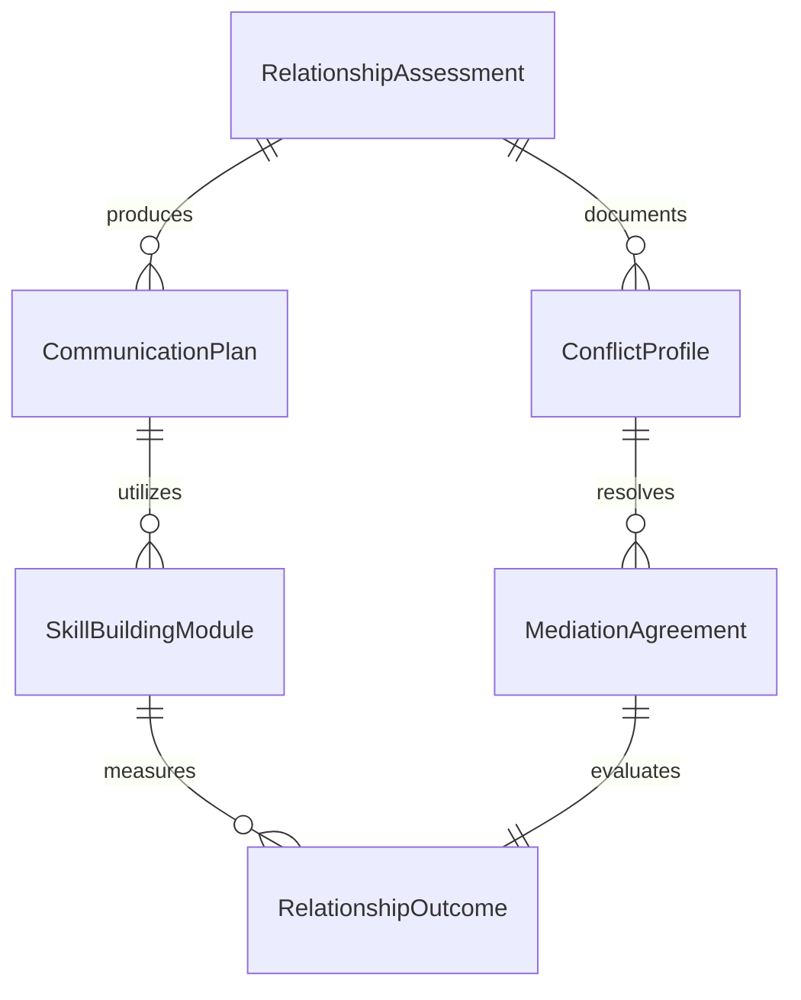
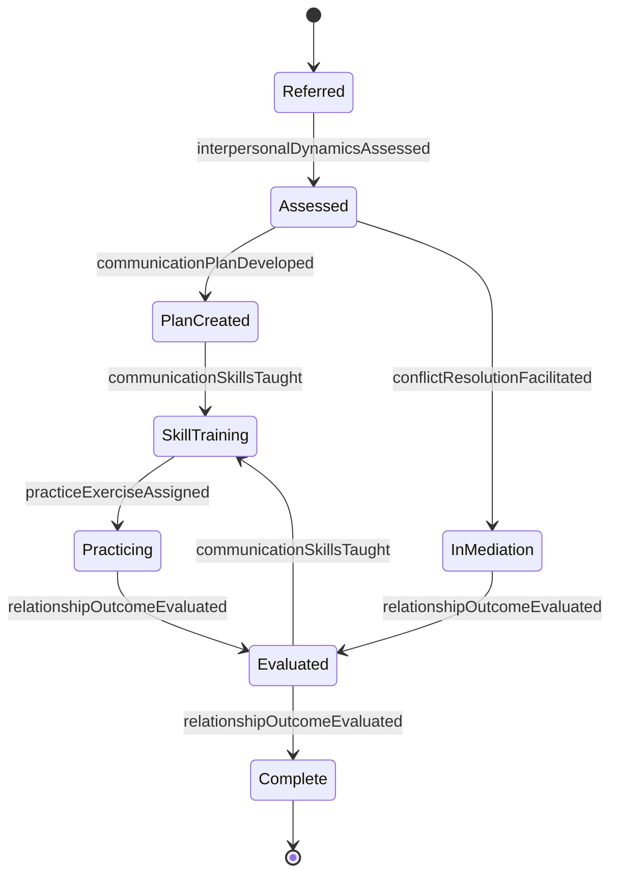
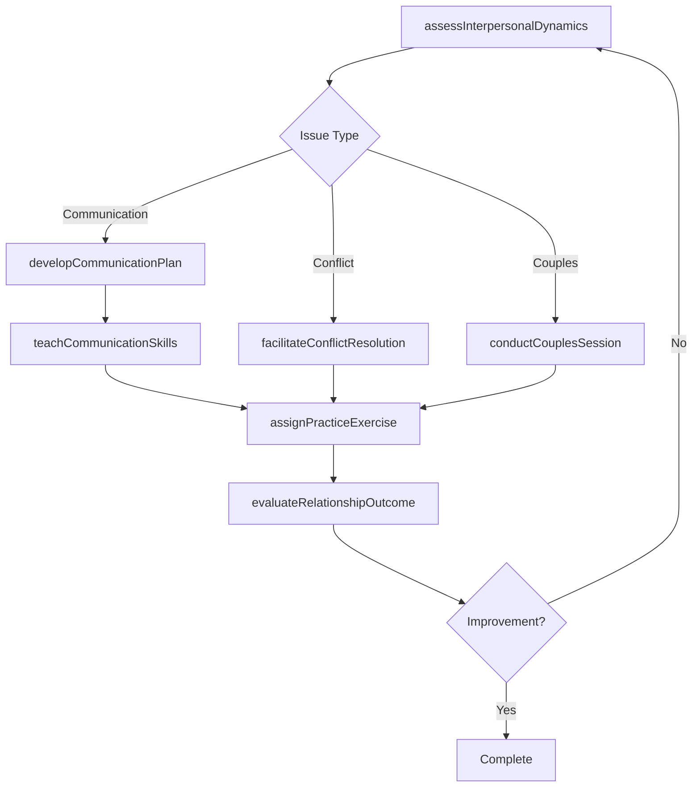
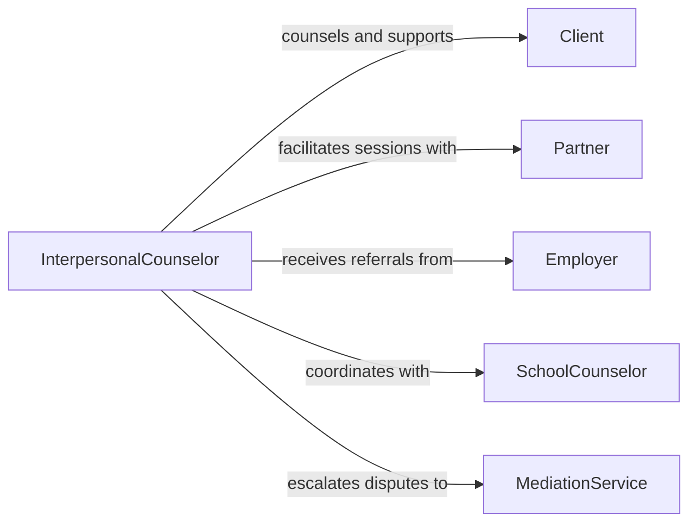

# Counsel Clients Regarding Interpersonal Issues

> Business-as-Code definition for counseling clients on interpersonal issues. Models the relational counseling process from conflict assessment through communication skill building, mediation facilitation, and relationship outcome tracking.

## Overview

Counseling clients regarding interpersonal issues involves helping individuals and groups navigate relational conflicts, communication breakdowns, boundary challenges, and social skill deficits. This definition exposes actions for assessing interpersonal dynamics, teaching communication techniques, facilitating conflict resolution, and evaluating relationship improvements. Events enable automated session scheduling and escalation workflows, while searches provide access to client relationship histories, skill-building resources, and outcome benchmarks.

## Actors

| Actor | Description |
|-------|-------------|
| Client | Seeks support for interpersonal difficulties in personal or professional contexts |
| Partner | Participates in couples counseling or relational mediation |
| Employer | Refers employees for interpersonal skill development or conflict resolution |
| SchoolCounselor | Refers students experiencing peer relationship difficulties |
| MediationService | Provides formal dispute resolution support for escalated conflicts |
| SupportGroup | Offers peer-based relational skill practice and community |

## Roles

| Role | Description |
|------|-------------|
| InterpersonalCounselor | Facilitates therapeutic work on relational patterns and communication |
| CouplesTherapist | Guides partners through relational conflicts and attachment issues |
| ConflictMediator | Facilitates structured resolution of specific interpersonal disputes |
| GroupFacilitator | Leads group sessions focused on social skills and peer support |

## Entities

| Entity | Description |
|--------|-------------|
| RelationshipAssessment | An evaluation of the client's interpersonal patterns and conflicts |
| CommunicationPlan | A structured approach to improving specific communication behaviors |
| ConflictProfile | Documentation of the nature, history, and parties in a dispute |
| SkillBuildingModule | A curriculum unit teaching specific interpersonal techniques |
| MediationAgreement | A documented resolution reached through facilitated negotiation |
| RelationshipOutcome | A record of measurable changes in relational functioning |

## Actions

| Action | Description |
|--------|-------------|
| assessInterpersonalDynamics | Evaluate the client's relational patterns, conflicts, and strengths |
| developCommunicationPlan | Create a targeted strategy for improving communication behaviors |
| teachCommunicationSkills | Instruct the client in active listening, assertiveness, or boundary-setting |
| facilitateConflictResolution | Guide parties through structured dialogue to resolve a dispute |
| conductCouplesSession | Facilitate a joint therapeutic session with partners |
| assignPracticeExercise | Provide homework to reinforce interpersonal skills between sessions |
| evaluateRelationshipOutcome | Measure improvements in relational functioning and satisfaction |

## Events

| Event | Description |
|-------|-------------|
| interpersonalDynamicsAssessed | Client relational patterns and conflicts have been evaluated |
| communicationPlanDeveloped | A strategy for improving communication has been created |
| communicationSkillsTaught | The client has received instruction on interpersonal techniques |
| conflictResolutionFacilitated | A structured dialogue to resolve a dispute has been completed |
| couplesSessionConducted | A joint therapeutic session with partners has been facilitated |
| practiceExerciseAssigned | Homework has been provided to reinforce skills |
| relationshipOutcomeEvaluated | Changes in relational functioning have been measured |

## Searches

| Search | Description |
|--------|-------------|
| findRelationshipAssessments | List assessments by client, conflict type, or date range |
| getCommunicationPlans | Retrieve communication plans by client or status |
| getConflictProfiles | Look up conflict documentation by parties or resolution status |
| findSkillBuildingModules | Search instructional modules by topic or skill area |

## Entity Relationships



## State Diagram



## Workflow



## Actor Relationships



## Usage

### Calling Actions

```typescript
import { counselClientsOnInterpersonalIssues } from '@headlessly/counsel-clients-on-interpersonal-issues'

const counselor = counselClientsOnInterpersonalIssues()

// Assess interpersonal dynamics
const assessment = await counselor.assessInterpersonalDynamics({
  clientId: 'CLT-4428',
  context: 'workplace',
  primaryConflict: 'Communication breakdown with direct supervisor',
  relationalHistory: { conflictFrequency: 'weekly', duration: '6 months' }
})

// Develop a communication plan
await counselor.developCommunicationPlan({
  clientId: 'CLT-4428',
  assessmentId: assessment.id,
  targetSkills: ['assertive-communication', 'active-listening', 'boundary-setting'],
  milestones: [
    { week: 2, target: 'Practice assertive requests in low-stakes situations' },
    { week: 4, target: 'Apply active listening in supervisor meetings' },
    { week: 6, target: 'Set and maintain one professional boundary' }
  ]
})

// Assign practice exercise
await counselor.assignPracticeExercise({
  clientId: 'CLT-4428',
  exercise: 'Assertive communication role-play',
  instructions: 'Practice making one clear request per day using I-statements',
  dueDate: '2026-02-12'
})
```

### Event-Driven Automation

```typescript
// Schedule follow-up when communication plan is created
counselor.communicationPlanDeveloped(async ({ clientId }) => {
  await scheduleTask({
    action: 'evaluateRelationshipOutcome',
    clientId,
    delay: '30d'
  })
})

// Alert mediator when conflict resolution stalls
counselor.conflictResolutionFacilitated(async ({ clientId, resolutionStatus }) => {
  if (resolutionStatus === 'impasse') {
    await notify({
      to: 'mediation-services',
      message: `Client ${clientId} conflict at impasse - formal mediation may be needed`
    })
  }
})
```
