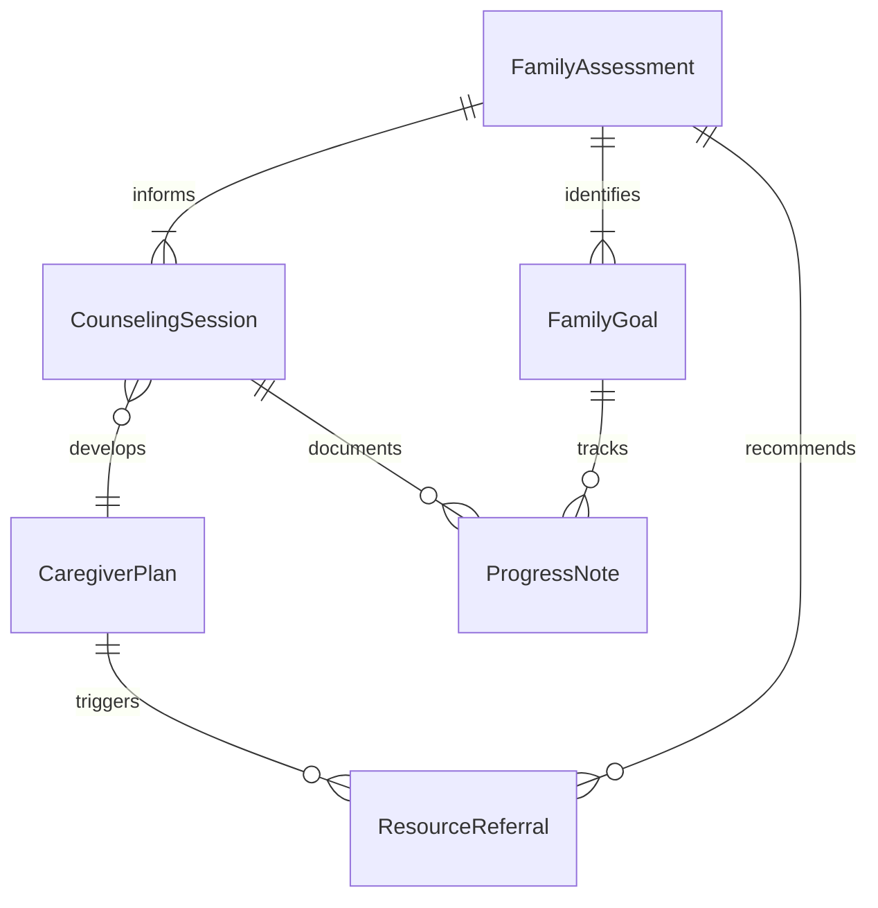
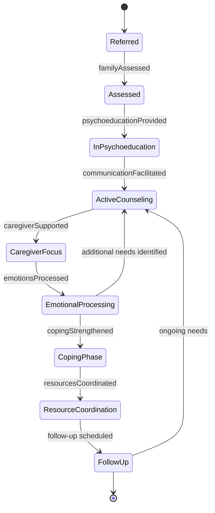
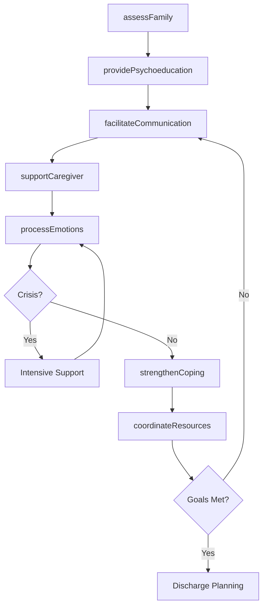
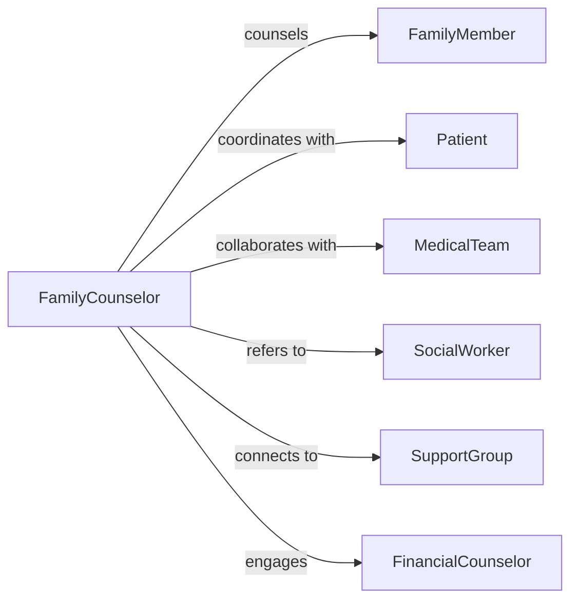

# Counsel Family Members Clients Patients

> Business-as-Code definition for family counseling services. Models therapeutic support for families coping with illness, caregiving stress, relationship conflict, and adjustment to medical diagnoses affecting loved ones.

## Overview

Family counseling addresses the emotional, relational, and practical challenges faced by family members supporting clients or patients through illness, recovery, or chronic conditions. This definition provides actions for family assessment, psychoeducation, communication skill-building, and caregiver support, enabling counselors to strengthen family systems and improve outcomes through coordinated family-centered care.

## Actors

| Actor | Description |
|-------|-------------|
| FamilyMember | Relative or caregiver seeking support and coping strategies |
| Patient | Individual receiving primary treatment whose condition affects family |
| MedicalTeam | Healthcare providers coordinating patient care with family input |
| SocialWorker | Connects families to community resources and support services |
| SupportGroup | Peer support network for families facing similar challenges |
| FinancialCounselor | Assists with insurance, benefits, and financial planning |

## Roles

| Role | Description |
|------|-------------|
| FamilyCounselor | Delivers therapeutic interventions to families and caregivers |
| GriefSpecialist | Supports families processing loss, anticipatory grief, or bereavement |
| CaregiverCoach | Provides education and skill-building for caregiving responsibilities |
| SystemsTherapist | Addresses family dynamics and communication patterns |

## Entities

| Entity | Description |
|--------|-------------|
| FamilyAssessment | Evaluation of family structure, coping resources, and needs |
| CounselingSession | Documented family therapy or psychoeducation encounter |
| CaregiverPlan | Strategies for managing caregiving demands and self-care |
| FamilyGoal | Specific objective for improving communication or coping |
| ResourceReferral | Connection to support services or community programs |
| ProgressNote | Clinical documentation of family response and interventions |

## Actions

| Action | Description |
|--------|-------------|
| assessFamily | Evaluate family dynamics, stressors, and support needs |
| providePsychoeducation | Educate families about diagnosis, treatment, and expectations |
| facilitateCommunication | Improve dialogue between family members and medical team |
| supportCaregiver | Address caregiver stress, burden, and self-care needs |
| processEmotions | Help families navigate grief, anxiety, anger, or guilt |
| coordinateResources | Connect families to financial, respite, or community support |
| strengthenCoping | Teach problem-solving and stress management strategies |

## Events

| Event | Description |
|-------|-------------|
| familyAssessed | Family evaluation completed with identified needs and strengths |
| psychoeducationProvided | Educational session delivered on diagnosis or caregiving |
| communicationFacilitated | Family meeting held to improve understanding and collaboration |
| caregiverSupported | Caregiver counseling session completed with coping strategies |
| emotionsProcessed | Therapeutic work completed on grief, loss, or adjustment |
| resourcesCoordinated | Referrals made to support services and community programs |
| copingStrengthened | Skills training delivered for stress management and resilience |

## Searches

| Search | Description |
|--------|-------------|
| findFamilies | List families by patient diagnosis, counseling status, or need type |
| getSessions | Retrieve counseling sessions by counselor, family, or date |
| getReferrals | Find resource referrals by service type or organization |
| trackProgress | Query family coping outcomes and goal achievement |

## Entity Relationships



## State Diagram



## Workflow



## Actor Relationships



## Usage

### Calling Actions

```typescript
import { counselFamilyMembersClientsPatients } from '@headlessly/counsel-family-members-clients-patients'

const familyCounseling = counselFamilyMembersClientsPatients()

// Assess family needs and dynamics
const assessment = await familyCounseling.assessFamily({
  patientId: 'pt-567',
  familyMembers: [
    { relationship: 'spouse', role: 'primary-caregiver', age: 58 },
    { relationship: 'adult-child', role: 'financial-support', age: 32 },
    { relationship: 'adult-child', role: 'limited-contact', age: 29 }
  ],
  diagnosis: 'early-onset-alzheimers',
  stressors: ['role-reversal', 'caregiver-burnout', 'financial-strain', 'family-conflict'],
  strengths: ['committed-spouse', 'one-involved-child', 'stable-housing']
})

// Provide psychoeducation about diagnosis
await familyCounseling.providePsychoeducation({
  patientId: 'pt-567',
  familyId: assessment.familyId,
  topic: 'alzheimers-disease-progression',
  content: [
    'disease-stages-and-timeline',
    'behavioral-changes-to-expect',
    'communication-strategies',
    'safety-planning',
    'legal-and-financial-preparation'
  ],
  materials: ['alzheimers-association-guide', 'local-support-group-list']
})

// Support primary caregiver
await familyCounseling.supportCaregiver({
  patientId: 'pt-567',
  caregiverId: 'spouse-caregiver',
  issues: ['sleep-deprivation', 'social-isolation', 'anticipatory-grief'],
  interventions: [
    'respite-care-planning',
    'self-care-strategies',
    'caregiver-support-group-referral',
    'mindfulness-stress-reduction'
  ],
  goals: ['obtain-weekly-respite', 'maintain-social-connections', 'process-grief']
})

// Coordinate community resources
await familyCounseling.coordinateResources({
  patientId: 'pt-567',
  familyId: assessment.familyId,
  referrals: [
    { service: 'adult-day-program', provider: 'eldercare-center', frequency: 'twice-weekly' },
    { service: 'home-health-aide', provider: 'visiting-nurses', frequency: 'daily-morning' },
    { service: 'alzheimers-support-group', provider: 'community-hospital', frequency: 'monthly' }
  ]
})
```

### Event-Driven Automation

```typescript
// Alert social worker when family in crisis
familyCounseling.familyAssessed(async ({ familyId, assessment }) => {
  if (assessment.crisisIndicators.includes('caregiver-collapse-risk')) {
    await notify({
      to: 'social-worker',
      priority: 'urgent',
      message: `Family ${familyId} requires immediate respite care coordination`
    })
  }
})

// Auto-schedule follow-up for caregiver support
familyCounseling.caregiverSupported(async ({ patientId, caregiverId }) => {
  await schedule({
    type: 'caregiver-check-in',
    caregiverId,
    scheduledDate: addDays(new Date(), 14),
    purpose: 'Monitor caregiver stress and adherence to self-care plan'
  })
})
```
