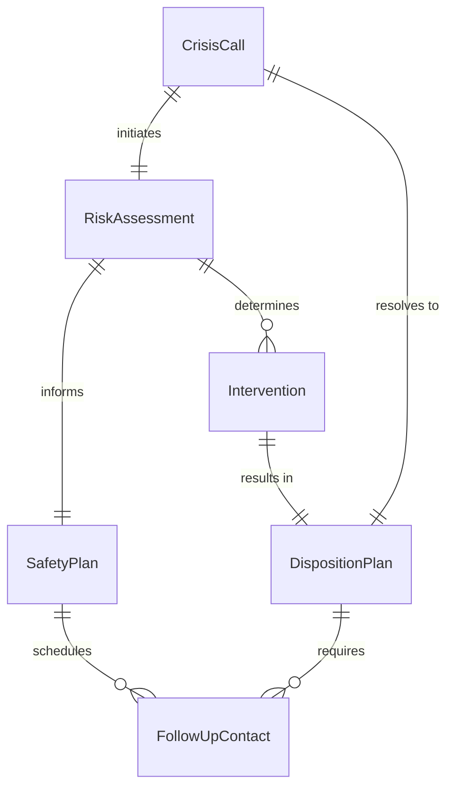
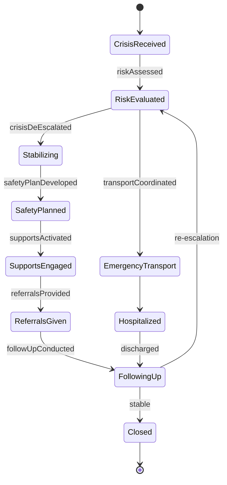
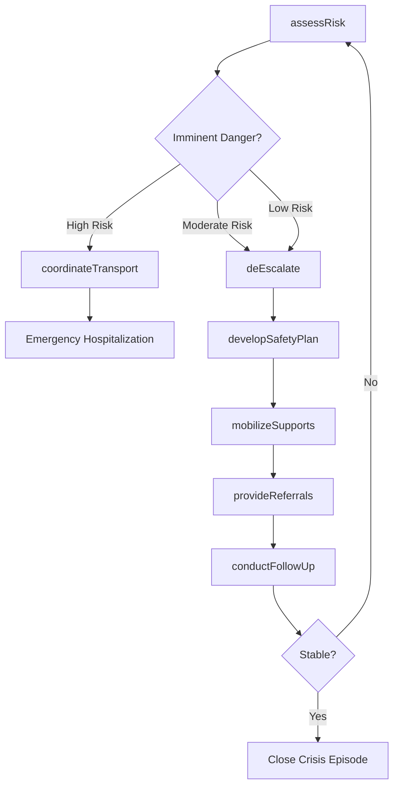
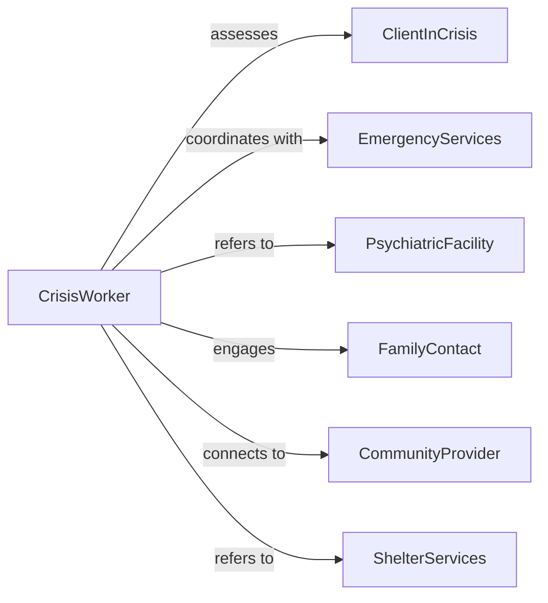

# Intervene Crisis Situations Assist Clients

> Business-as-Code definition for crisis intervention services. Models rapid response protocols for mental health emergencies, suicide risk, domestic violence, and acute distress requiring immediate stabilization and safety planning.

## Overview

Crisis intervention provides immediate short-term assistance to individuals experiencing acute psychological, behavioral, or situational crises that overwhelm their coping abilities. This definition exposes actions for risk assessment, de-escalation, safety planning, and resource mobilization, enabling crisis workers to deliver time-sensitive interventions that prevent harm and connect clients to appropriate ongoing care.

## Actors

| Actor | Description |
|-------|-------------|
| ClientInCrisis | Individual experiencing acute mental health or situational emergency |
| EmergencyServices | Police, fire, or ambulance responding to crisis situation |
| PsychiatricFacility | Provides emergency psychiatric evaluation and hospitalization |
| FamilyContact | Designated support person to involve in safety planning |
| CommunityProvider | Ongoing therapist or case manager for follow-up care |
| ShelterServices | Emergency housing for domestic violence or homelessness crises |

## Roles

| Role | Description |
|------|-------------|
| CrisisWorker | Provides immediate assessment and intervention during crisis |
| MobileResponder | Responds to crisis in community settings or homes |
| HotlineCounselor | Delivers phone or text-based crisis support |
| PsychiatricConsultant | Evaluates need for psychiatric hospitalization or medication |

## Entities

| Entity | Description |
|--------|-------------|
| CrisisCall | Documented initial contact with client in acute distress |
| RiskAssessment | Evaluation of imminent danger to self or others |
| SafetyPlan | Immediate strategies to reduce risk and maintain stability |
| Intervention | Specific crisis response actions taken with client |
| DispositionPlan | Next steps including referrals, follow-up, or hospitalization |
| FollowUpContact | Post-crisis check-in to ensure continued safety |

## Actions

| Action | Description |
|--------|-------------|
| assessRisk | Evaluate imminent danger of suicide, self-harm, or violence |
| deEscalate | Reduce emotional intensity and establish rapport |
| developSafetyPlan | Create immediate action plan with coping strategies and contacts |
| mobilizeSupports | Activate family, friends, or professional resources |
| coordinateTransport | Arrange emergency psychiatric evaluation or hospitalization |
| provideReferrals | Connect client to ongoing treatment and community services |
| conductFollowUp | Check on client safety and adherence to safety plan |

## Events

| Event | Description |
|-------|-------------|
| riskAssessed | Suicide, self-harm, or violence risk evaluated and documented |
| crisisDeEscalated | Client emotional state stabilized through intervention |
| safetyPlanDeveloped | Immediate safety strategies created and shared with client |
| supportsActivated | Family, friends, or professionals engaged in crisis response |
| transportCoordinated | Emergency services or facility transport arranged |
| referralsProvided | Connections made to ongoing care and support resources |
| followUpConducted | Post-crisis contact completed to verify continued safety |

## Searches

| Search | Description |
|--------|-------------|
| findCrisisCalls | List crisis contacts by date, risk level, or disposition |
| getRiskAssessments | Retrieve assessments by risk category or client |
| getSafetyPlans | Find active safety plans by client or crisis type |
| trackOutcomes | Query disposition outcomes and follow-up completion rates |

## Entity Relationships



## State Diagram



## Workflow



## Actor Relationships



## Usage

### Calling Actions

```typescript
import { interveneCrisisSituationsAssistClients } from '@headlessly/intervene-crisis-situations-assist-clients'

const crisisIntervention = interveneCrisisSituationsAssistClients()

// Assess risk during crisis call
const risk = await crisisIntervention.assessRisk({
  clientId: 'cl-emergency-789',
  crisisType: 'suicidal-ideation',
  riskFactors: [
    'recent-job-loss',
    'social-isolation',
    'alcohol-intoxication',
    'access-to-firearms',
    'previous-attempt'
  ],
  protectiveFactors: ['has-supportive-sibling', 'spiritual-beliefs'],
  currentSafety: {
    suicidalThoughts: 'active with plan',
    means: 'firearm at home',
    intent: 'ambivalent',
    timeframe: 'tonight'
  }
})

// De-escalate and establish safety
await crisisIntervention.deEscalate({
  clientId: 'cl-emergency-789',
  techniques: [
    'active-listening-and-validation',
    'explore-reasons-for-living',
    'collaborative-problem-solving',
    'instill-hope-for-change'
  ],
  clientResponse: 'emotional-intensity-decreased, willing to engage in safety planning'
})

// Develop immediate safety plan
const safetyPlan = await crisisIntervention.developSafetyPlan({
  clientId: 'cl-emergency-789',
  warningSigns: ['intrusive-thoughts', 'feeling-hopeless', 'urge-to-drink'],
  copingStrategies: [
    'call-sibling',
    'go-for-walk',
    'use-crisis-hotline',
    'practice-breathing-exercises'
  ],
  distractions: ['watch-comedy', 'play-with-dog', 'listen-to-music'],
  supportContacts: [
    { name: 'sibling', phone: '555-0123', available: '24/7' },
    { name: 'sponsor', phone: '555-0456', available: 'evenings' }
  ],
  professionalContacts: [
    { service: 'crisis-hotline', phone: '988', available: '24/7' },
    { service: 'mobile-crisis-team', phone: '555-0789', available: '24/7' }
  ],
  environmentSafety: ['sibling-to-secure-firearms-immediately']
})

// Mobilize supports and coordinate care
await crisisIntervention.mobilizeSupports({
  clientId: 'cl-emergency-789',
  contacts: [
    { person: 'sibling', action: 'stay-with-client-tonight', contacted: true },
    { person: 'therapist', action: 'emergency-session-tomorrow', contacted: true }
  ]
})
```

### Event-Driven Automation

```typescript
// Immediate alert for high-risk assessments
crisisIntervention.riskAssessed(async ({ clientId, risk }) => {
  if (risk.level === 'imminent-danger') {
    await notify({
      to: ['crisis-supervisor', 'mobile-crisis-team'],
      priority: 'critical',
      message: `Immediate response needed for client ${clientId} - active suicidal intent with means and plan`
    })
  }
})

// Auto-schedule follow-up after crisis de-escalation
crisisIntervention.safetyPlanDeveloped(async ({ clientId, safetyPlan }) => {
  await schedule({
    type: 'crisis-follow-up',
    clientId,
    scheduledDate: addHours(new Date(), 24),
    purpose: 'Verify client safety and adherence to safety plan'
  })
})
```
