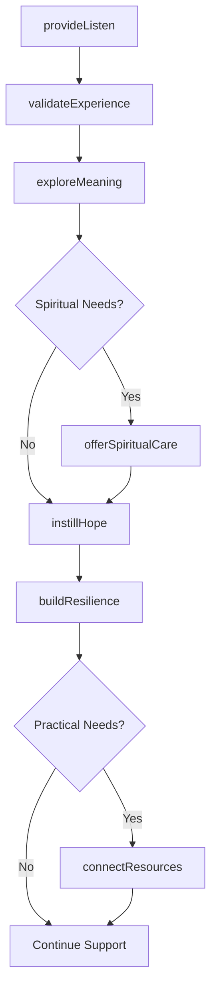
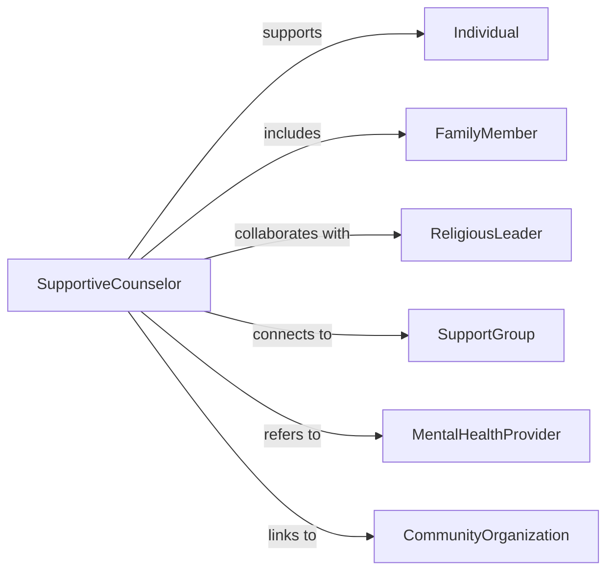

# Provide Counsel Comfort Encouragement Individuals

> Business-as-Code definition for supportive counseling services. Models compassionate guidance and emotional support for individuals and families facing life transitions, loss, illness, or personal challenges requiring empathetic care.

## Overview

Supportive counseling provides emotional validation, practical guidance, and encouragement to individuals experiencing difficult life circumstances, grief, adjustment challenges, or spiritual distress. This definition exposes actions for empathetic listening, meaning-making, hope instillation, and resilience building, enabling counselors, chaplains, and support workers to deliver person-centered care that honors individual values and promotes psychological well-being.

## Actors

| Actor | Description |
|-------|-------------|
| Individual | Person seeking emotional support and guidance during difficulty |
| FamilyMember | Loved one also affected by situation or providing support |
| ReligiousLeader | Faith community representative offering spiritual counsel |
| SupportGroup | Peer community sharing similar experiences and challenges |
| MentalHealthProvider | Professional offering clinical assessment and therapy as needed |
| CommunityOrganization | Provides practical assistance and connection to resources |

## Roles

| Role | Description |
|------|-------------|
| SupportiveCounselor | Provides empathetic listening and emotional validation |
| Chaplain | Offers spiritual care and religious counseling |
| PeerSupporter | Shares personal experience and provides hope through example |
| LifeCoach | Focuses on goal-setting and forward momentum |

## Entities

| Entity | Description |
|--------|-------------|
| SupportSession | Documented encounter providing counsel and encouragement |
| CareNeed | Identified emotional, practical, or spiritual concern |
| EncouragementPlan | Strategies for building hope and resilience |
| SpiritualAssessment | Evaluation of faith, meaning, and existential concerns |
| ResourceConnection | Referral to practical assistance or support community |
| ProgressNote | Documentation of individual response and ongoing needs |

## Actions

| Action | Description |
|--------|-------------|
| provideListen | Offer empathetic presence and active listening without judgment |
| validateExperience | Acknowledge emotions and normalize responses to difficulty |
| instillHope | Share perspective that promotes optimism and possibility |
| exploreMeaning | Help individual make sense of experience through their values |
| buildResilience | Identify strengths and past coping successes |
| connectResources | Link individual to practical help and community support |
| offerSpiritualCare | Provide religious or existential counsel aligned with beliefs |

## Events

| Event | Description |
|-------|-------------|
| listeningProvided | Empathetic presence and active listening offered |
| experienceValidated | Emotions acknowledged and responses normalized |
| hopeInstilled | Perspective shared to promote optimism and forward thinking |
| meaningExplored | Values and meaning-making conversation facilitated |
| resilienceBuilt | Strengths identified and coping capacity strengthened |
| resourcesConnected | Practical assistance and support connections established |
| spiritualCareOffered | Religious or existential counseling delivered |

## Searches

| Search | Description |
|--------|-------------|
| findIndividuals | List individuals by care need, concern type, or support status |
| getSessions | Retrieve support sessions by counselor, date, or need category |
| getConnections | Find resource referrals by service type or organization |
| trackEngagement | Query ongoing support participation and outcome measures |

## Workflow



## Actor Relationships



## Usage

### Calling Actions

```typescript
import { provideCounselComfortEncouragementIndividuals } from '@headlessly/provide-counsel-comfort-encouragement-individuals'

const supportCounseling = provideCounselComfortEncouragementIndividuals()

// Provide empathetic listening during difficult time
await supportCounseling.provideListen({
  individualId: 'ind-234',
  situation: 'terminal-cancer-diagnosis',
  concerns: [
    'fear-of-dying',
    'worry-about-family',
    'sense-of-unfairness',
    'spiritual-questions'
  ],
  approach: 'create-safe-space-for-expression-without-rushing-to-fix',
  duration: 45
})

// Validate emotional experience
await supportCounseling.validateExperience({
  individualId: 'ind-234',
  emotions: ['anger', 'sadness', 'fear', 'guilt'],
  validation: [
    'all-feelings-are-understandable-given-circumstances',
    'grief-comes-in-waves-not-linear',
    'no-right-way-to-feel',
    'ok-to-have-moments-of-joy-alongside-sorrow'
  ]
})

// Explore meaning and purpose
await supportCounseling.exploreMeaning({
  individualId: 'ind-234',
  values: ['family-connection', 'leaving-legacy', 'making-peace'],
  meaningMaking: [
    'what-has-given-your-life-purpose',
    'what-matters-most-in-time-remaining',
    'how-do-you-want-to-be-remembered',
    'what-brings-comfort-in-this-moment'
  ],
  insights: 'wants to record life stories for grandchildren, repair relationship with estranged son'
})

// Instill hope for meaningful time
await supportCounseling.instillHope({
  individualId: 'ind-234',
  hopeMessages: [
    'you-can-still-create-beautiful-moments-with-loved-ones',
    'there-is-time-to-say-what-needs-to-be-said',
    'your-legacy-lives-on-through-your-family',
    'you-are-not-alone-in-this-journey'
  ],
  goals: [
    'reconciliation-with-son',
    'legacy-video-project',
    'bucket-list-experiences'
  ]
})

// Connect to resources and support
await supportCounseling.connectResources({
  individualId: 'ind-234',
  referrals: [
    { service: 'hospice-chaplain', organization: 'hospice-care-team' },
    { service: 'life-review-therapy', organization: 'oncology-social-work' },
    { service: 'cancer-support-group', organization: 'community-cancer-center' },
    { service: 'legacy-video-service', organization: 'memory-keepers-nonprofit' }
  ]
})
```

### Event-Driven Automation

```typescript
// Flag acute spiritual distress for chaplain referral
supportCounseling.meaningExplored(async ({ individualId, insights }) => {
  if (insights.includes('spiritual-distress') || insights.includes('existential-crisis')) {
    await notify({
      to: 'chaplain-services',
      priority: 'high',
      message: `Individual ${individualId} expressing spiritual distress - chaplain visit requested`
    })
  }
})

// Auto-schedule follow-up for ongoing support
supportCounseling.listeningProvided(async ({ individualId, situation }) => {
  if (['terminal-illness', 'recent-loss', 'major-trauma'].includes(situation)) {
    await schedule({
      type: 'support-check-in',
      individualId,
      scheduledDate: addDays(new Date(), 7),
      purpose: 'Continued emotional support and resource connection'
    })
  }
})
```
