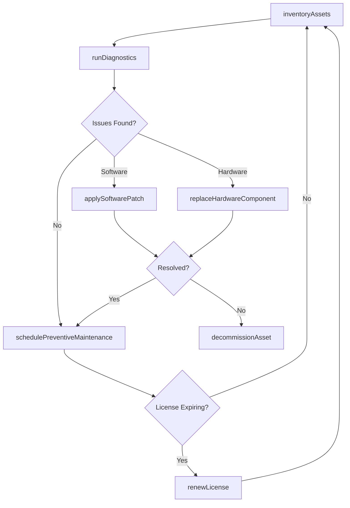
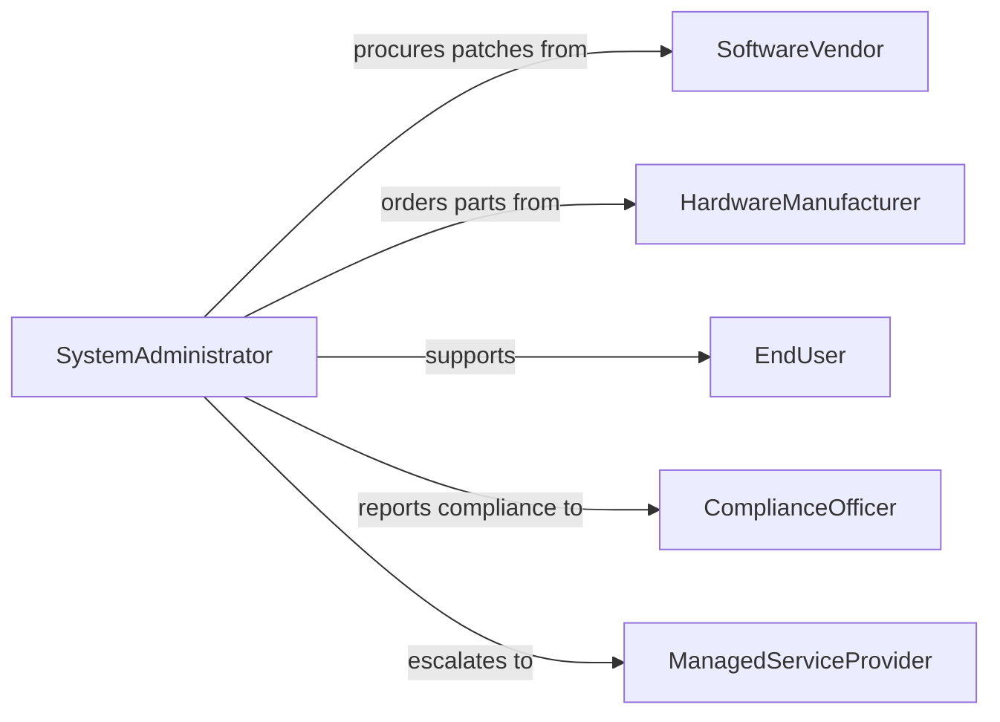

# Maintain Computer Equipment Software

> Business-as-Code definition for computer equipment and software maintenance. Models the lifecycle of keeping computing hardware operational and software systems patched, updated, and performing optimally.

## Overview

Computer equipment and software maintenance encompasses routine hardware servicing, software patching, license management, and system health monitoring. This definition exposes actions for preventive and corrective maintenance tasks, events for automated lifecycle tracking, and searches for querying asset and software inventory states.

## Actors

| Actor | Description |
|-------|-------------|
| SoftwareVendor | Provides software licenses, updates, and support |
| HardwareManufacturer | Supplies replacement parts and warranty services |
| EndUser | Operates equipment and reports issues |
| ComplianceOfficer | Ensures software licensing and regulatory compliance |
| ManagedServiceProvider | Delivers outsourced IT maintenance and monitoring |

## Roles

| Role | Description |
|------|-------------|
| SystemAdministrator | Manages day-to-day equipment and software maintenance |
| DesktopSupportTechnician | Performs hands-on hardware and software troubleshooting |
| ITManager | Oversees maintenance schedules and budget allocation |
| LicenseAdministrator | Tracks software entitlements and renewal dates |

## Entities

| Entity | Description |
|--------|-------------|
| ComputerAsset | A desktop, laptop, server, or peripheral device |
| SoftwareInstallation | An installed application or operating system instance |
| Patch | A software update addressing bugs or vulnerabilities |
| License | An entitlement to use a specific software product |
| MaintenanceTicket | A record of a maintenance request or scheduled task |
| ServiceContract | An agreement with a vendor for ongoing support |

## Actions

| Action | Description |
|--------|-------------|
| inventoryAssets | Catalog all hardware and software across the organization |
| applySoftwarePatch | Deploy a patch to one or more systems |
| schedulePreventiveMaintenance | Plan routine hardware servicing tasks |
| replaceHardwareComponent | Swap out a failed or aging hardware part |
| renewLicense | Extend or renew a software license agreement |
| runDiagnostics | Execute hardware or software diagnostic checks |
| decommissionAsset | Retire and securely dispose of end-of-life equipment |

## Events

| Event | Description |
|-------|-------------|
| assetsInventoried | Hardware and software inventory has been updated |
| softwarePatched | A software patch has been successfully deployed |
| maintenanceScheduled | A preventive maintenance task has been planned |
| hardwareReplaced | A hardware component has been swapped out |
| licenseRenewed | A software license has been extended |
| diagnosticsCompleted | Diagnostic checks have finished with results |
| assetDecommissioned | Equipment has been retired and disposed of |

## Searches

| Search | Description |
|--------|-------------|
| findAssets | List computer assets by type, location, or status |
| getPatchStatus | Query patch deployment status across systems |
| getLicenses | Retrieve licenses by vendor, expiration, or compliance state |
| findMaintenanceTickets | List maintenance tickets by priority or date range |

## Workflow



## Actor Relationships



## Usage

### Calling Actions

```typescript
import { maintainComputerEquipmentSoftware } from '@headlessly/maintain-computer-equipment-software'

const equipment = maintainComputerEquipmentSoftware()

// Run diagnostics on a server
const results = await equipment.runDiagnostics({
  assetId: 'srv-web-04',
  checks: ['disk', 'memory', 'cpu', 'network']
})

// Apply a critical software patch
await equipment.applySoftwarePatch({
  patchId: 'CVE-2026-1234-fix',
  targetAssets: ['ws-eng-01', 'ws-eng-02', 'ws-eng-03'],
  scheduledTime: '2026-02-08T02:00:00Z'
})

// Renew an expiring license
await equipment.renewLicense({
  licenseId: 'lic-office-365-enterprise',
  renewalPeriod: '12-months',
  seatCount: 250
})
```

### Event-Driven Automation

```typescript
// Alert when diagnostics reveal critical issues
equipment.diagnosticsCompleted(async ({ assetId, results }) => {
  const critical = results.filter(r => r.severity === 'critical')
  if (critical.length > 0) {
    await notify({
      to: 'it-support',
      message: `Critical issues on ${assetId}: ${critical.map(r => r.check).join(', ')}`
    })
  }
})

// Auto-schedule decommission for aging assets
equipment.hardwareReplaced(async ({ assetId, replacedComponentAge }) => {
  if (replacedComponentAge > 60) {
    await equipment.decommissionAsset({ assetId, reason: 'end-of-life' })
  }
})
```
