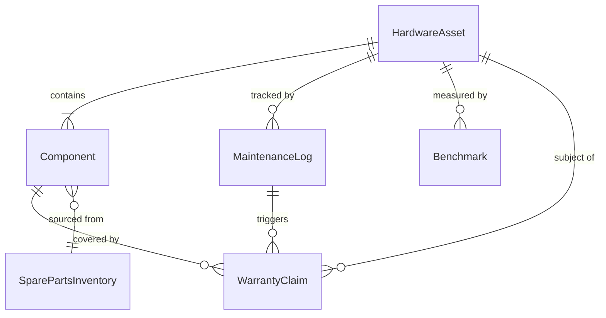
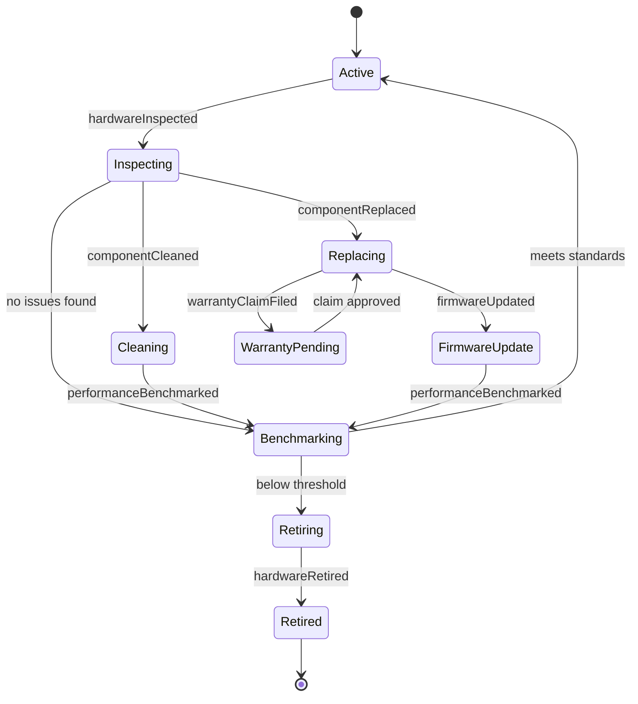
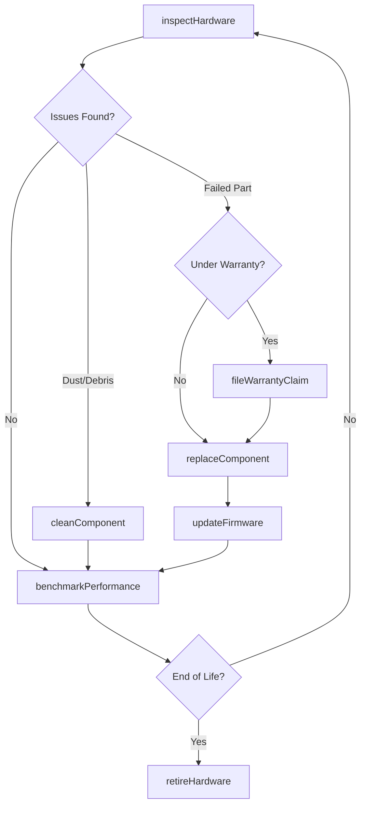
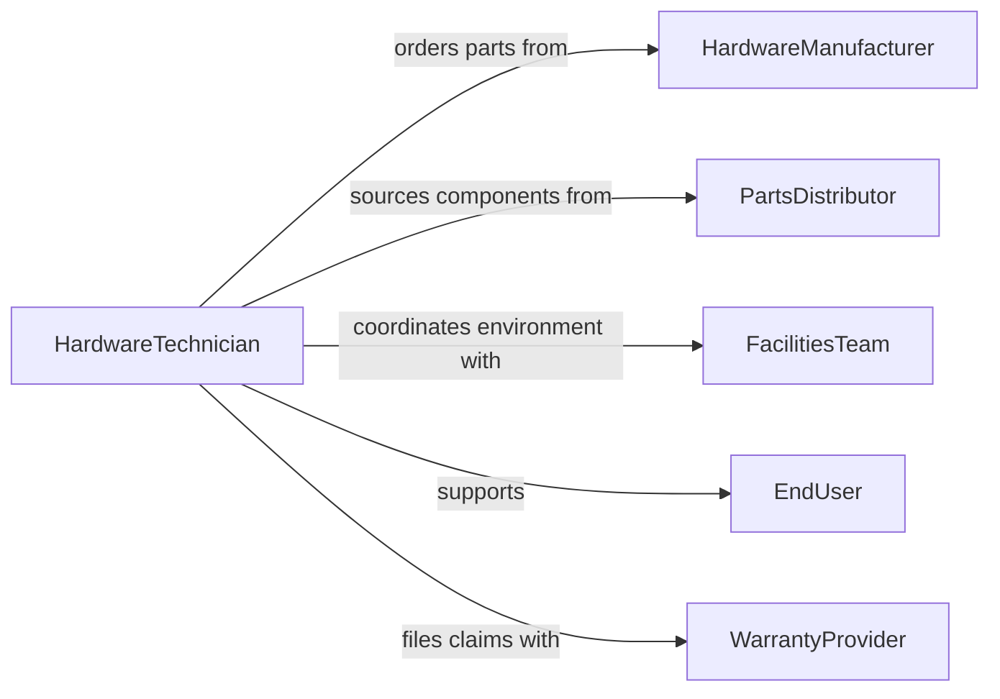

# Maintain Computer Hardware

> Business-as-Code definition for computer hardware maintenance. Models the end-to-end process of inspecting, cleaning, repairing, and upgrading physical computing components to maximize uptime and extend asset life.

## Overview

Computer hardware maintenance involves routine inspection, cleaning, component replacement, and performance benchmarking of servers, workstations, and peripherals. This definition exposes actions for preventive and corrective hardware tasks, events for tracking asset condition changes, and searches for querying hardware inventory and maintenance history.

## Actors

| Actor | Description |
|-------|-------------|
| HardwareManufacturer | Provides replacement parts, firmware, and warranty support |
| PartsDistributor | Supplies third-party and aftermarket components |
| FacilitiesTeam | Manages physical environment including power and cooling |
| EndUser | Operates hardware and reports physical malfunctions |
| WarrantyProvider | Processes warranty claims and authorizes replacements |

## Roles

| Role | Description |
|------|-------------|
| HardwareTechnician | Performs hands-on inspection, cleaning, and repairs |
| AssetManager | Tracks hardware inventory and lifecycle stages |
| DataCenterOperator | Manages server rack hardware and environmental controls |
| ITDirector | Approves hardware budgets and replacement cycles |

## Entities

| Entity | Description |
|--------|-------------|
| HardwareAsset | A physical computing device such as a server or workstation |
| Component | An individual part such as a disk, memory module, or power supply |
| MaintenanceLog | A record of inspection, cleaning, or repair activities |
| WarrantyClaim | A formal request for manufacturer repair or replacement |
| Benchmark | A performance measurement baseline for a hardware asset |
| SparePartsInventory | Stock of replacement components available on-site |

## Actions

| Action | Description |
|--------|-------------|
| inspectHardware | Perform visual and diagnostic inspection of a device |
| cleanComponent | Remove dust, debris, and contaminants from hardware |
| replaceComponent | Swap a failed or degraded part with a functioning one |
| benchmarkPerformance | Run standardized tests to measure hardware capability |
| updateFirmware | Flash updated firmware to a hardware component |
| fileWarrantyClaim | Submit a warranty request to the manufacturer |
| retireHardware | Remove end-of-life equipment from active service |

## Events

| Event | Description |
|-------|-------------|
| hardwareInspected | A hardware inspection has been completed |
| componentCleaned | A component has been cleaned and serviced |
| componentReplaced | A hardware part has been swapped out |
| performanceBenchmarked | Benchmark results have been recorded |
| firmwareUpdated | New firmware has been flashed to a device |
| warrantyClaimFiled | A warranty request has been submitted |
| hardwareRetired | A device has been removed from active inventory |

## Searches

| Search | Description |
|--------|-------------|
| findHardwareAssets | List assets by type, age, location, or status |
| getMaintenanceLogs | Retrieve maintenance history for a device or period |
| getWarrantyClaims | Query warranty claims by status or manufacturer |
| findComponentInventory | Check spare parts stock levels by component type |

## Entity Relationships



## State Diagram



## Workflow



## Actor Relationships



## Usage

### Calling Actions

```typescript
import { maintainComputerHardware } from '@headlessly/maintain-computer-hardware'

const hardware = maintainComputerHardware()

// Inspect a server for issues
const inspection = await hardware.inspectHardware({
  assetId: 'srv-db-02',
  checks: ['thermals', 'diskHealth', 'powerSupply', 'fans']
})

// Replace a failing disk drive
await hardware.replaceComponent({
  assetId: 'srv-db-02',
  componentType: 'ssd',
  slotId: 'bay-3',
  replacementPartId: 'ssd-nvme-2tb-001'
})

// Benchmark after maintenance
const benchmark = await hardware.benchmarkPerformance({
  assetId: 'srv-db-02',
  tests: ['diskIO', 'cpuMulticore', 'memoryBandwidth']
})
```

### Event-Driven Automation

```typescript
// Auto-file warranty claim for premature failures
hardware.componentReplaced(async ({ assetId, componentType, componentAge }) => {
  if (componentAge < 12) {
    await hardware.fileWarrantyClaim({
      assetId,
      componentType,
      reason: 'premature-failure'
    })
  }
})

// Schedule retirement review when benchmark degrades
hardware.performanceBenchmarked(async ({ assetId, scores, previousScores }) => {
  const degradation = (previousScores.overall - scores.overall) / previousScores.overall
  if (degradation > 0.30) {
    await notify({
      to: 'asset-management',
      message: `Asset ${assetId} performance degraded by ${Math.round(degradation * 100)}%`
    })
  }
})
```
