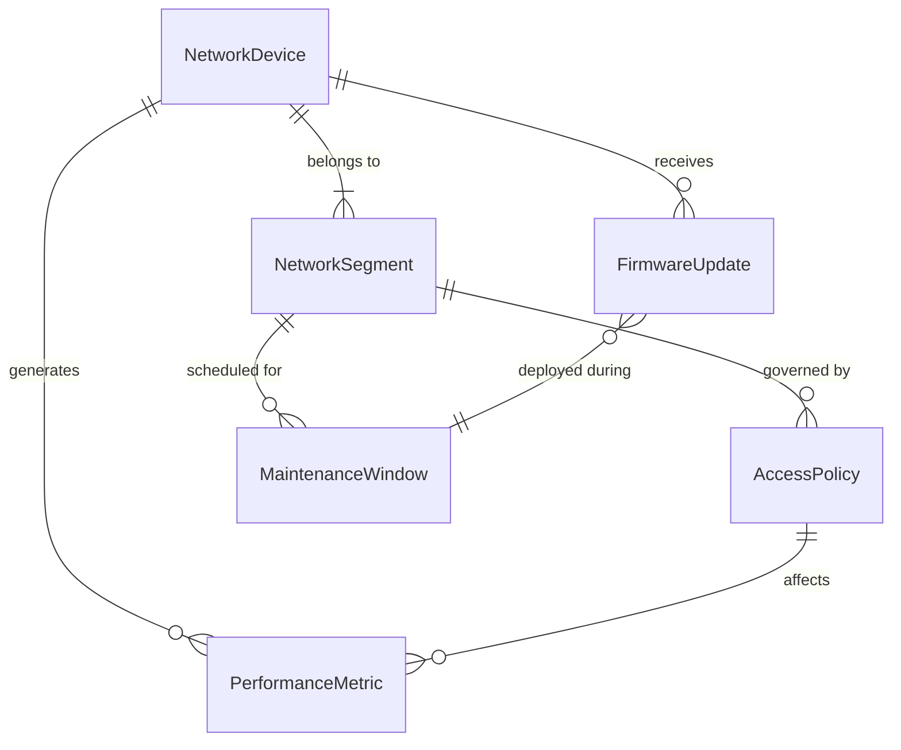
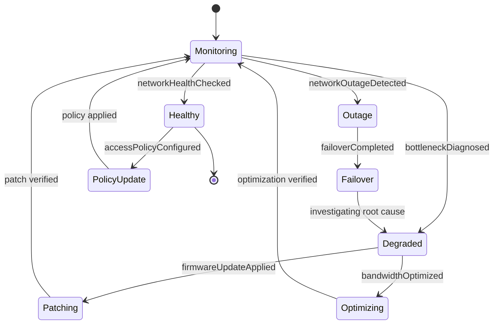
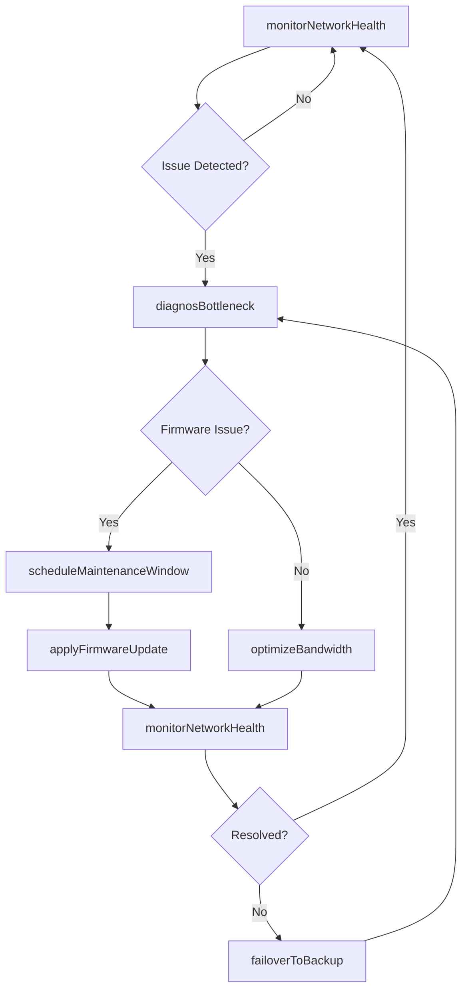
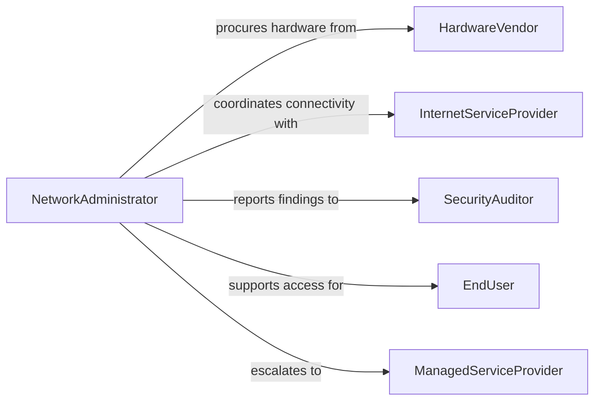

# Maintain Computer Networks Enhance Performance

> Business-as-Code definition for computer network maintenance and performance optimization. Models the complete lifecycle of monitoring, tuning, and upgrading network infrastructure to ensure reliable connectivity and user access.

## Overview

Computer network maintenance involves monitoring network health, diagnosing performance bottlenecks, applying firmware and configuration updates, and managing user access policies. This definition exposes actions for proactive and reactive network management, events for automated alerting and remediation, and searches for querying network state and historical performance data.

## Actors

| Actor | Description |
|-------|-------------|
| InternetServiceProvider | Delivers upstream connectivity and bandwidth |
| HardwareVendor | Supplies routers, switches, and access points |
| SecurityAuditor | Evaluates network security posture and compliance |
| EndUser | Consumes network resources and reports connectivity issues |
| ManagedServiceProvider | Provides outsourced network monitoring and support |

## Roles

| Role | Description |
|------|-------------|
| NetworkAdministrator | Configures and maintains network infrastructure |
| NetworkEngineer | Designs network architecture and resolves complex issues |
| HelpDeskTechnician | Handles first-line user connectivity complaints |
| SecurityAnalyst | Monitors network traffic for threats and anomalies |

## Entities

| Entity | Description |
|--------|-------------|
| NetworkDevice | A router, switch, firewall, or access point on the network |
| NetworkSegment | A logical or physical subdivision of the network |
| PerformanceMetric | A measurement of throughput, latency, or packet loss |
| AccessPolicy | Rules governing user and device access to network resources |
| FirmwareUpdate | A software patch or upgrade for network hardware |
| MaintenanceWindow | A scheduled period for network changes and updates |

## Actions

| Action | Description |
|--------|-------------|
| monitorNetworkHealth | Collect real-time metrics from network devices |
| diagnosBottleneck | Identify and analyze performance degradation sources |
| applyFirmwareUpdate | Deploy firmware patches to network devices |
| configureAccessPolicy | Create or modify user and device access rules |
| optimizeBandwidth | Adjust QoS settings and traffic shaping rules |
| scheduleMaintenanceWindow | Plan a downtime window for network changes |
| failoverToBackup | Switch traffic to redundant paths during outages |

## Events

| Event | Description |
|-------|-------------|
| networkHealthChecked | Network health metrics have been collected |
| bottleneckDiagnosed | A performance bottleneck has been identified |
| firmwareUpdateApplied | A firmware patch has been deployed to a device |
| accessPolicyConfigured | User or device access rules have been updated |
| bandwidthOptimized | QoS and traffic shaping settings have been adjusted |
| networkOutageDetected | A network segment has become unreachable |
| failoverCompleted | Traffic has been rerouted to a backup path |

## Searches

| Search | Description |
|--------|-------------|
| findNetworkDevices | List devices by type, segment, or firmware version |
| getPerformanceMetrics | Retrieve throughput, latency, and loss data by period |
| getAccessPolicies | Query active access rules by user group or segment |
| findMaintenanceWindows | List scheduled maintenance by date range or segment |

## Entity Relationships



## State Diagram



## Workflow



## Actor Relationships



## Usage

### Calling Actions

```typescript
import { maintainComputerNetworksEnhancePerformance } from '@headlessly/maintain-computer-networks-enhance-performance'

const networks = maintainComputerNetworksEnhancePerformance()

// Monitor current network health
const health = await networks.monitorNetworkHealth({
  segmentId: 'seg-datacenter-01',
  metrics: ['throughput', 'latency', 'packetLoss']
})

// Apply a firmware update during scheduled window
await networks.applyFirmwareUpdate({
  deviceId: 'switch-core-01',
  firmwareVersion: '4.2.1',
  maintenanceWindowId: 'mw-2026-02-08'
})

// Optimize bandwidth allocation
await networks.optimizeBandwidth({
  segmentId: 'seg-office-floor3',
  qosProfile: 'high-priority-voip',
  bandwidthLimit: '500Mbps'
})
```

### Event-Driven Automation

```typescript
// Alert on network outages
networks.networkOutageDetected(async ({ segmentId, deviceId, timestamp }) => {
  await notify({
    to: 'network-ops',
    message: `Outage detected on segment ${segmentId} at device ${deviceId}`
  })
  await networks.failoverToBackup({ segmentId })
})

// Log firmware deployments for compliance
networks.firmwareUpdateApplied(async ({ deviceId, firmwareVersion }) => {
  await auditLog.record({
    action: 'firmwareUpdate',
    device: deviceId,
    version: firmwareVersion
  })
})
```
