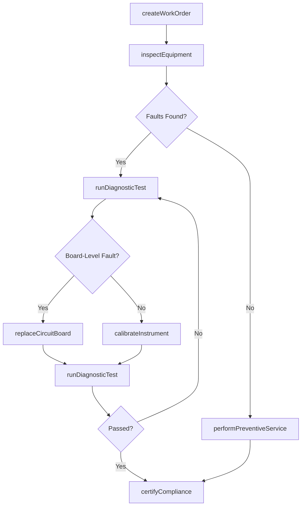
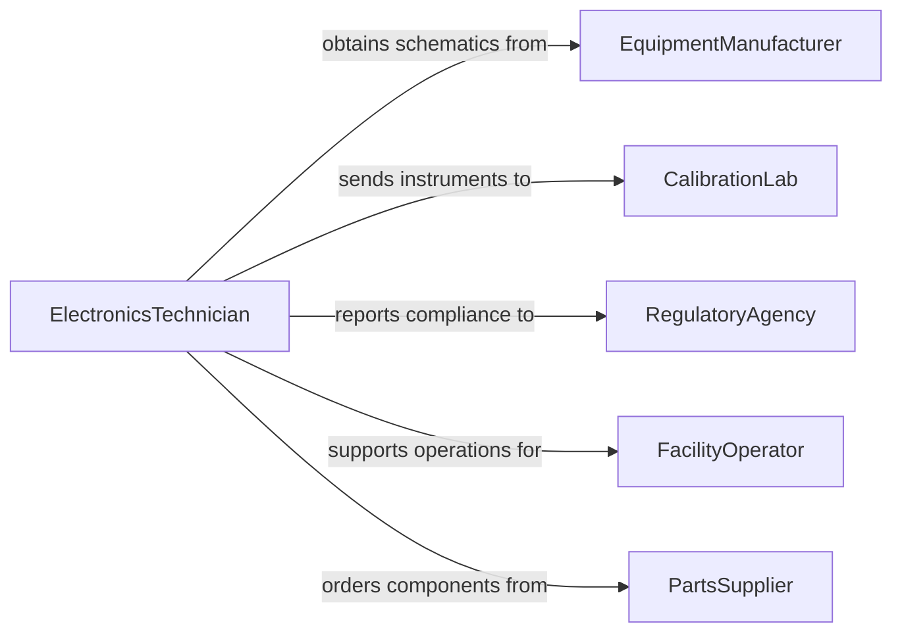

# Maintain Electronic Equipment

> Business-as-Code definition for electronic equipment maintenance. Models the systematic process of inspecting, testing, servicing, and repairing electronic systems and components to ensure reliable operation.

## Overview

Electronic equipment maintenance covers a broad range of activities including visual inspection, functional testing, preventive servicing, and corrective repairs on systems such as control panels, instrumentation, communication devices, and power electronics. This definition exposes actions for scheduled and demand-driven maintenance workflows, events for tracking equipment reliability, and searches for querying equipment condition and service records.

## Actors

| Actor | Description |
|-------|-------------|
| EquipmentManufacturer | Supplies schematics, parts, and technical support |
| CalibrationLab | Provides certified measurement and calibration services |
| RegulatoryAgency | Enforces safety and electromagnetic compliance standards |
| FacilityOperator | Depends on electronic equipment for facility operations |
| PartsSupplier | Distributes replacement electronic components |

## Roles

| Role | Description |
|------|-------------|
| ElectronicsTechnician | Performs diagnostics, repairs, and component-level service |
| MaintenanceSupervisor | Plans maintenance schedules and assigns work orders |
| ReliabilityEngineer | Analyzes failure patterns and improves maintenance strategies |
| SafetyOfficer | Ensures electronic equipment meets safety regulations |

## Entities

| Entity | Description |
|--------|-------------|
| ElectronicSystem | An assembled electronic device or control system |
| CircuitBoard | A printed circuit board within an electronic system |
| WorkOrder | A formal maintenance task assignment with priority and scope |
| TestResult | Measured output from diagnostic or functional testing |
| ServiceHistory | A chronological record of all maintenance on a device |
| ComplianceCertificate | Documentation proving equipment meets regulatory standards |

## Actions

| Action | Description |
|--------|-------------|
| inspectEquipment | Perform visual and functional checks on electronic systems |
| runDiagnosticTest | Execute automated or manual tests to identify faults |
| replaceCircuitBoard | Swap a faulty board with a known-good replacement |
| calibrateInstrument | Adjust settings to match certified reference standards |
| performPreventiveService | Execute scheduled cleaning, tightening, and verification |
| createWorkOrder | Generate a maintenance task for a specific piece of equipment |
| certifyCompliance | Document that equipment meets applicable safety standards |

## Events

| Event | Description |
|-------|-------------|
| equipmentInspected | An inspection has been completed on electronic equipment |
| diagnosticTestRun | Diagnostic test results have been recorded |
| circuitBoardReplaced | A faulty circuit board has been swapped out |
| instrumentCalibrated | An instrument has been calibrated to specification |
| preventiveServicePerformed | Scheduled maintenance has been executed |
| workOrderCreated | A new maintenance work order has been generated |
| complianceCertified | Equipment has passed regulatory compliance verification |

## Searches

| Search | Description |
|--------|-------------|
| findElectronicSystems | List systems by type, location, or maintenance status |
| getServiceHistory | Retrieve maintenance records for a device or time period |
| getTestResults | Query diagnostic results by equipment or test type |
| findOverdueWorkOrders | List work orders past their scheduled completion date |
| getComplianceCertificates | Retrieve compliance documentation by equipment or standard |

## Workflow



## Actor Relationships



## Usage

### Calling Actions

```typescript
import { maintainElectronicEquipment } from '@headlessly/maintain-electronic-equipment'

const electronics = maintainElectronicEquipment()

// Create a work order for a control panel
const workOrder = await electronics.createWorkOrder({
  equipmentId: 'ctrl-panel-hvac-03',
  type: 'preventive',
  priority: 'medium',
  scheduledDate: '2026-02-15'
})

// Run diagnostics on the control panel
const results = await electronics.runDiagnosticTest({
  equipmentId: 'ctrl-panel-hvac-03',
  testSuite: 'full-functional',
  referenceStandard: 'IEC-61010'
})

// Replace a faulty circuit board
await electronics.replaceCircuitBoard({
  equipmentId: 'ctrl-panel-hvac-03',
  boardSlot: 'main-controller',
  replacementPartId: 'pcb-hvac-ctrl-v4'
})
```

### Event-Driven Automation

```typescript
// Escalate repeated failures on the same equipment
electronics.circuitBoardReplaced(async ({ equipmentId }) => {
  const history = await electronics.getServiceHistory({ equipmentId, months: 6 })
  const replacements = history.filter(h => h.action === 'replaceCircuitBoard')
  if (replacements.length >= 3) {
    await notify({
      to: 'reliability-engineering',
      message: `Equipment ${equipmentId} has had ${replacements.length} board replacements in 6 months`
    })
  }
})

// Auto-generate work orders from inspection findings
electronics.equipmentInspected(async ({ equipmentId, findings }) => {
  if (findings.some(f => f.severity === 'high')) {
    await electronics.createWorkOrder({
      equipmentId,
      type: 'corrective',
      priority: 'high',
      scheduledDate: 'next-available'
    })
  }
})
```
