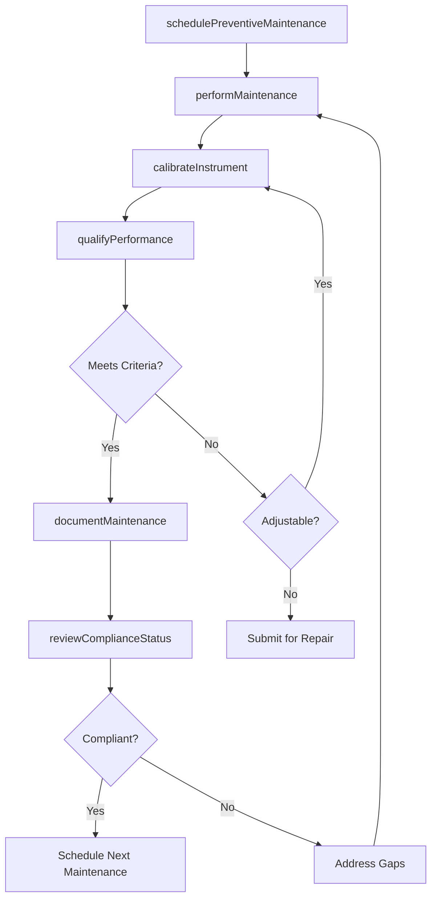
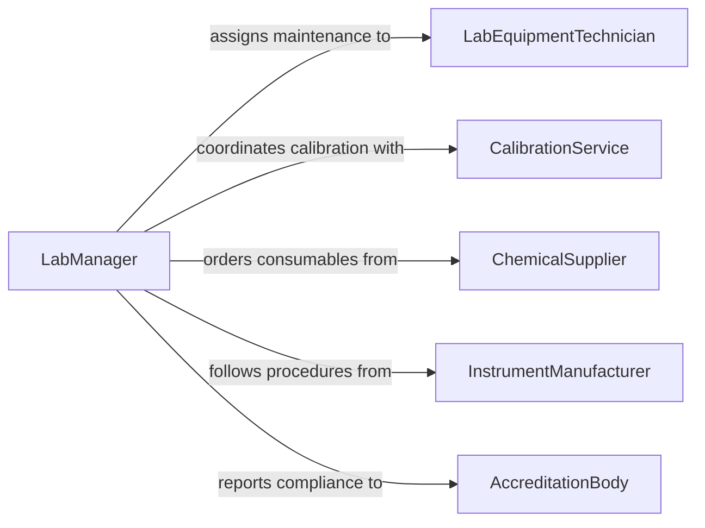

# Maintain Laboratory Technical Equipment

> Business-as-Code definition for maintaining laboratory and technical equipment. Models the preventive maintenance, calibration, and performance verification workflow for analytical instruments, testing apparatus, and specialized laboratory systems.

## Overview

Laboratory and technical equipment maintenance encompasses the scheduled servicing, calibration, cleaning, and performance verification of instruments such as spectrometers, chromatographs, centrifuges, microscopes, and environmental chambers. This definition exposes actions for maintenance scheduling, calibration execution, performance qualification, and compliance documentation. Events enable automated tracking of maintenance intervals, calibration due dates, and regulatory audit readiness.

## Actors

| Actor | Description |
|-------|-------------|
| LaboratoryDirector | Authorizes maintenance schedules and equipment budgets |
| InstrumentManufacturer | Provides maintenance procedures, firmware, and proprietary parts |
| AccreditationBody | Sets standards for equipment qualification and maintenance records |
| CalibrationService | Provides traceable calibration standards and certification |
| ChemicalSupplier | Provides reference standards, solvents, and consumables for maintenance |

## Roles

| Role | Description |
|------|-------------|
| LabEquipmentTechnician | Performs hands-on maintenance, cleaning, and minor repairs |
| MetrologySpecialist | Executes calibrations and manages measurement traceability |
| QualityAssuranceManager | Ensures maintenance records satisfy accreditation requirements |
| LabManager | Schedules maintenance windows to minimize disruption to lab operations |

## Entities

| Entity | Description |
|--------|-------------|
| LaboratoryInstrument | A specific piece of lab equipment such as a spectrometer or centrifuge |
| MaintenanceSchedule | Planned timeline of preventive maintenance activities |
| CalibrationRecord | Documentation of calibration results and traceability to standards |
| PerformanceQualification | Verification that equipment meets specified performance criteria |
| MaintenanceLog | Chronological record of all service activities on an instrument |
| ConsumablesInventory | Stock of filters, lamps, columns, and other maintenance consumables |

## Actions

| Action | Description |
|--------|-------------|
| schedulePreventiveMaintenance | Plan routine servicing based on manufacturer intervals and usage |
| performMaintenance | Execute cleaning, lubrication, filter changes, and component checks |
| calibrateInstrument | Adjust instrument response using traceable reference standards |
| qualifyPerformance | Run standard samples to verify instrument meets performance criteria |
| documentMaintenance | Record all service activities, parts used, and observations |
| orderConsumables | Requisition filters, lamps, columns, and other maintenance supplies |
| reviewComplianceStatus | Assess whether maintenance records satisfy accreditation requirements |

## Events

| Event | Description |
|-------|-------------|
| preventiveMaintenanceScheduled | A maintenance activity has been planned on the calendar |
| maintenancePerformed | Hands-on servicing of laboratory equipment has been completed |
| instrumentCalibrated | Calibration adjustments and verification have been completed |
| performanceQualified | Instrument performance has been verified against acceptance criteria |
| maintenanceDocumented | Service records have been finalized and archived |
| maintenanceOverdue | An instrument has passed its scheduled maintenance date |
| consumablesLow | Maintenance supplies have fallen below minimum stock level |

## Searches

| Search | Description |
|--------|-------------|
| findInstruments | List laboratory equipment by type, location, or maintenance status |
| getMaintenanceSchedule | Retrieve upcoming maintenance activities by instrument or date range |
| getCalibrationHistory | Look up past calibration records and measurement uncertainty data |
| findOverdueInstruments | Identify equipment past their scheduled maintenance or calibration date |
| getComplianceStatus | Check which instruments meet current accreditation requirements |

## Workflow



## Actor Relationships



## Usage

### Calling Actions

```typescript
import { maintainLaboratoryTechnicalEquipment } from '@headlessly/maintain-laboratory-technical-equipment'

const labEquipment = maintainLaboratoryTechnicalEquipment()

// Schedule preventive maintenance for a spectrophotometer
const schedule = await labEquipment.schedulePreventiveMaintenance({
  instrumentId: 'uv-vis-spec-03',
  type: 'uv-vis-spectrophotometer',
  tasks: ['lamp-replacement', 'wavelength-calibration', 'cuvette-holder-cleaning'],
  scheduledDate: '2026-02-20'
})

// Calibrate the instrument after maintenance
const calibration = await labEquipment.calibrateInstrument({
  instrumentId: 'uv-vis-spec-03',
  referenceStandards: ['holmium-oxide-filter', 'potassium-dichromate-solution'],
  wavelengthPoints: [240, 340, 440, 540, 640]
})

// Qualify performance with standard samples
const qualification = await labEquipment.qualifyPerformance({
  instrumentId: 'uv-vis-spec-03',
  criteria: { wavelengthAccuracy: 1.0, absorbanceAccuracy: 0.005, strayLight: 0.1 }
})
```

### Event-Driven Automation

```typescript
// Alert lab manager when maintenance is overdue
labEquipment.maintenanceOverdue(async ({ instrumentId, scheduledDate, daysPastDue }) => {
  await notify({
    to: 'lab-manager',
    message: `Instrument ${instrumentId} maintenance overdue by ${daysPastDue} days. Originally scheduled ${scheduledDate}.`
  })
})

// Auto-reorder consumables when stock is low
labEquipment.consumablesLow(async ({ item, currentStock, reorderLevel }) => {
  await labEquipment.orderConsumables({
    itemId: item.id,
    quantity: reorderLevel * 3,
    supplier: item.preferredSupplier
  })
})
```
