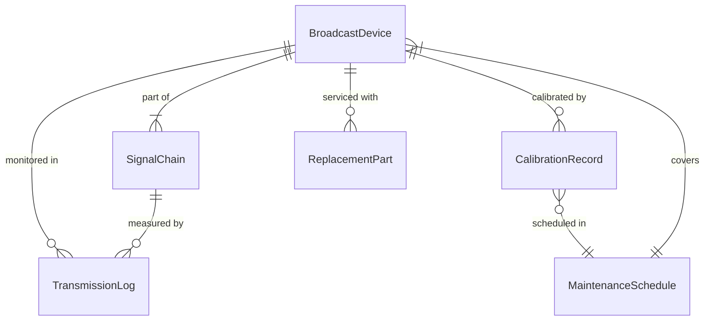
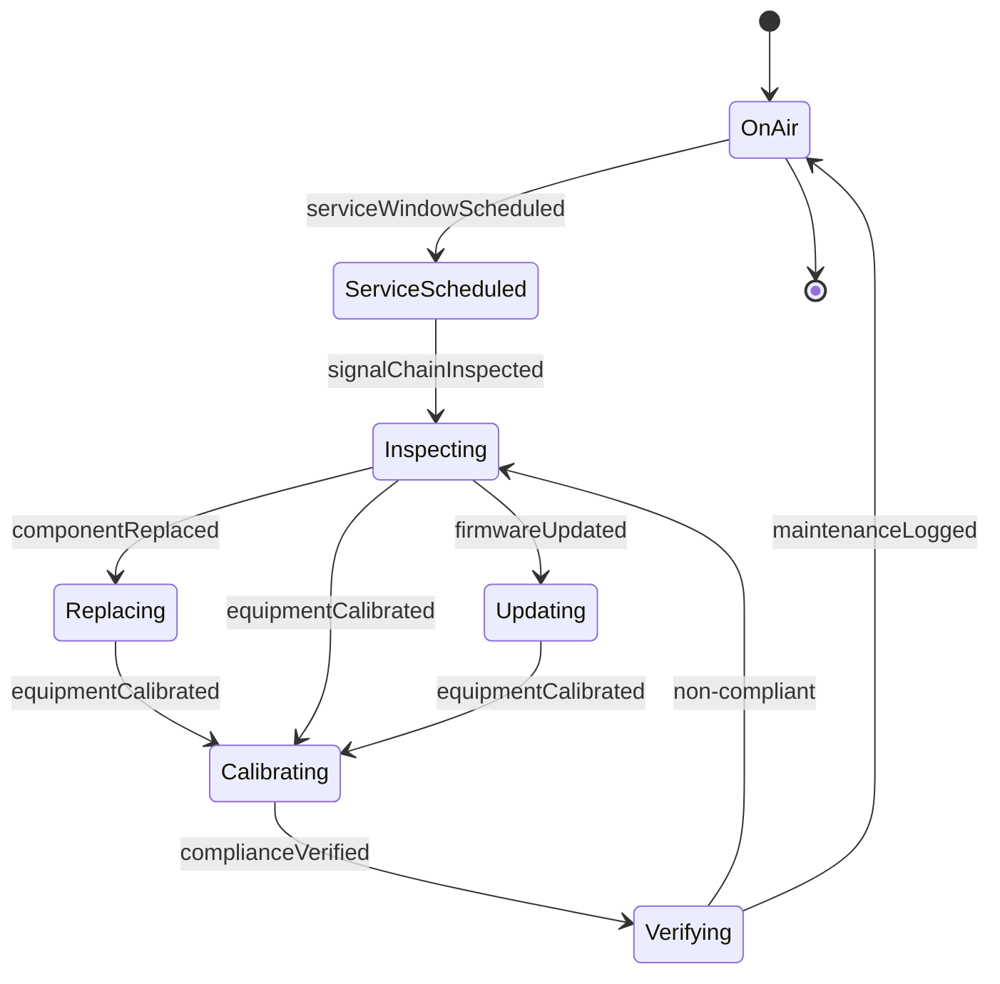
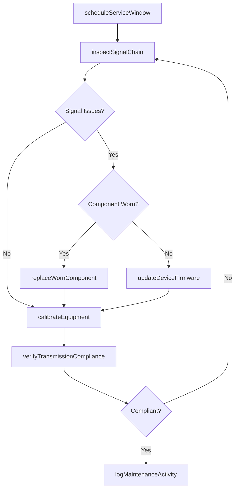
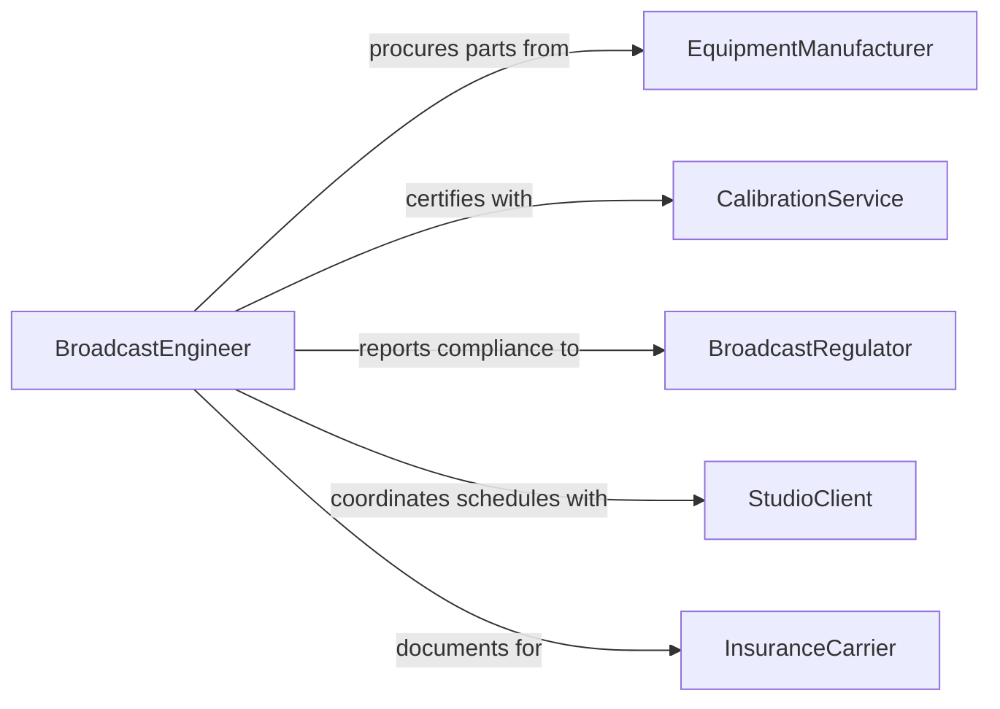

# Maintain Recording Broadcasting Equipment

> Business-as-Code definition for recording and broadcasting equipment maintenance. Models the lifecycle of servicing audio, video, and transmission systems to ensure broadcast-quality output and signal reliability.

## Overview

Recording and broadcasting equipment maintenance involves calibrating audio and video systems, servicing transmitters and receivers, replacing worn components, and verifying signal quality. This definition exposes actions for scheduled and unscheduled maintenance of broadcast infrastructure, events for tracking equipment condition and service history, and searches for querying equipment status across studios and transmission sites.

## Actors

| Actor | Description |
|-------|-------------|
| EquipmentManufacturer | Provides technical specifications, parts, and firmware |
| BroadcastRegulator | Sets standards for signal quality and transmission compliance |
| StudioClient | Relies on equipment availability for production schedules |
| CalibrationService | Provides certified calibration and measurement services |
| InsuranceCarrier | Covers equipment damage and business interruption |

## Roles

| Role | Description |
|------|-------------|
| BroadcastEngineer | Designs and maintains signal chains and transmission systems |
| AudioVideoTechnician | Performs hands-on servicing of recording and playback equipment |
| MaintenanceScheduler | Coordinates equipment downtime with production calendars |
| QualityAssuranceEngineer | Verifies signal quality meets broadcast standards |

## Entities

| Entity | Description |
|--------|-------------|
| BroadcastDevice | A camera, microphone, mixer, transmitter, or encoder |
| SignalChain | The end-to-end path from capture through transmission |
| CalibrationRecord | A certified measurement of equipment performance |
| MaintenanceSchedule | A planned timeline for servicing equipment |
| ReplacementPart | A component stocked for swap-out during service |
| TransmissionLog | A record of broadcast signal performance over time |

## Actions

| Action | Description |
|--------|-------------|
| calibrateEquipment | Adjust settings to meet certified performance standards |
| inspectSignalChain | Test end-to-end signal integrity from source to output |
| replaceWornComponent | Swap degraded parts such as heads, lamps, or connectors |
| updateDeviceFirmware | Flash updated firmware to recording or broadcast devices |
| scheduleServiceWindow | Plan equipment downtime aligned with production gaps |
| verifyTransmissionCompliance | Confirm signal meets regulatory broadcast standards |
| logMaintenanceActivity | Record all service actions for audit and warranty tracking |

## Events

| Event | Description |
|-------|-------------|
| equipmentCalibrated | A device has been calibrated to specification |
| signalChainInspected | Signal chain testing has been completed |
| componentReplaced | A worn part has been swapped out |
| firmwareUpdated | Device firmware has been successfully updated |
| serviceWindowScheduled | A maintenance window has been planned |
| complianceVerified | Transmission meets regulatory broadcast standards |
| maintenanceLogged | A service activity has been recorded |

## Searches

| Search | Description |
|--------|-------------|
| findBroadcastDevices | List devices by type, studio location, or calibration status |
| getCalibrationRecords | Retrieve calibration history for a device or date range |
| getTransmissionLogs | Query signal performance data by period or transmitter |
| findUpcomingService | List equipment approaching scheduled maintenance dates |

## Entity Relationships



## State Diagram



## Workflow



## Actor Relationships



## Usage

### Calling Actions

```typescript
import { maintainRecordingBroadcastingEquipment } from '@headlessly/maintain-recording-broadcasting-equipment'

const broadcast = maintainRecordingBroadcastingEquipment()

// Calibrate a studio camera
await broadcast.calibrateEquipment({
  deviceId: 'cam-studio-a-01',
  standard: 'SMPTE-ST-2110',
  calibrationServiceId: 'cal-svc-certified'
})

// Inspect the signal chain before a live broadcast
const inspection = await broadcast.inspectSignalChain({
  chainId: 'chain-live-news-01',
  testSignal: 'color-bars-1080p',
  measurePoints: ['source', 'mixer', 'encoder', 'transmitter']
})

// Schedule maintenance during production gap
await broadcast.scheduleServiceWindow({
  deviceIds: ['tx-uhf-01', 'tx-uhf-02'],
  window: { start: '2026-02-10T01:00:00Z', end: '2026-02-10T06:00:00Z' },
  reason: 'quarterly-transmitter-service'
})
```

### Event-Driven Automation

```typescript
// Alert on calibration drift
broadcast.equipmentCalibrated(async ({ deviceId, deviation }) => {
  if (deviation > 0.05) {
    await notify({
      to: 'broadcast-engineering',
      message: `Device ${deviceId} calibration deviation at ${(deviation * 100).toFixed(1)}%`
    })
  }
})

// Auto-log compliance verifications for audit trail
broadcast.complianceVerified(async ({ deviceId, standard, result }) => {
  await auditLog.record({
    action: 'transmissionCompliance',
    device: deviceId,
    standard,
    result
  })
})
```
