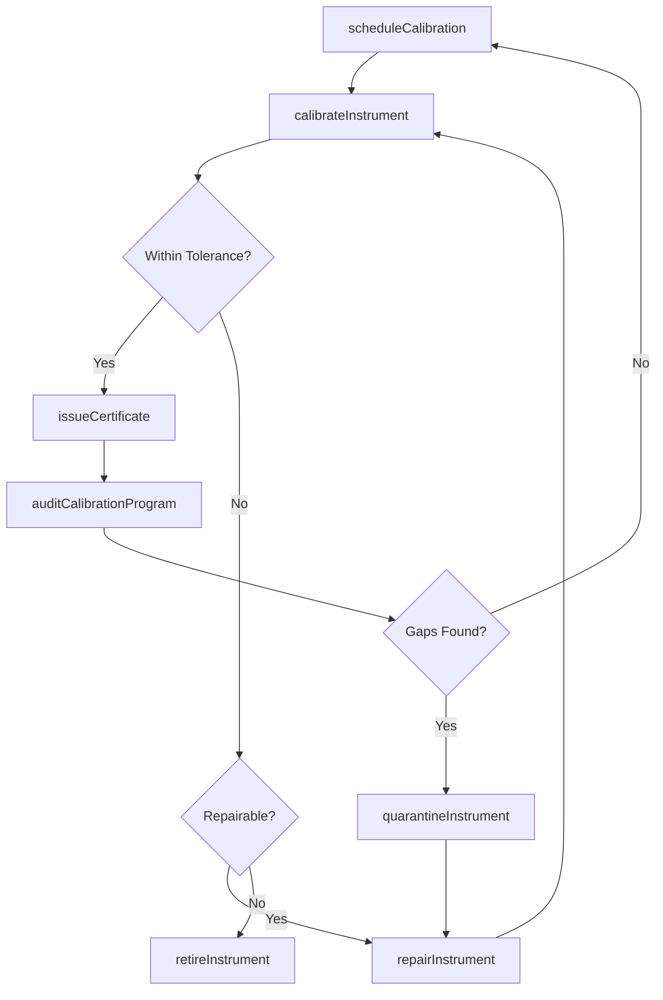
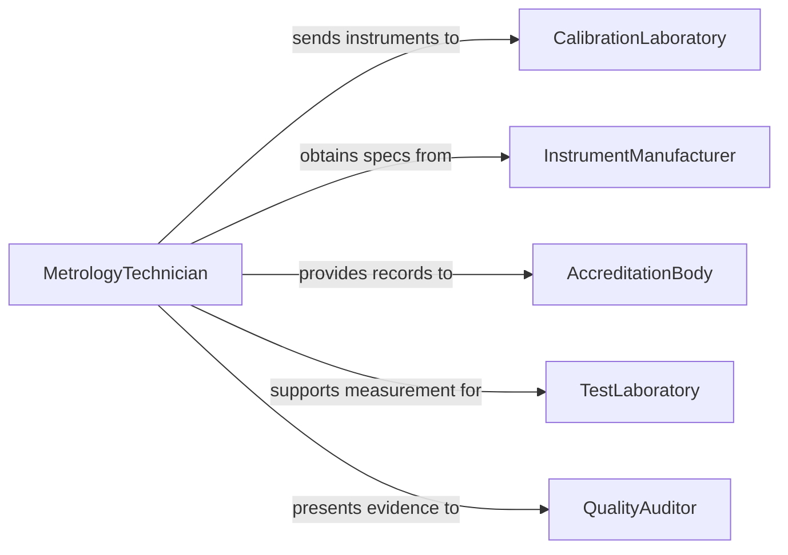

# Maintain Test Equipment

> Business-as-Code definition for test equipment maintenance. Models the calibration, servicing, and lifecycle management of measurement and testing instruments used in quality assurance, manufacturing, and laboratory environments.

## Overview

Test equipment maintenance ensures that oscilloscopes, multimeters, spectrometers, environmental chambers, and other measurement instruments remain accurate and traceable. This definition exposes actions for calibration scheduling, corrective repair, and certification tracking, events for lifecycle automation, and searches for querying calibration status and instrument inventory.

## Actors

| Actor | Description |
|-------|-------------|
| CalibrationLaboratory | Provides traceable calibration services and certificates |
| InstrumentManufacturer | Supplies specifications, parts, and repair services |
| AccreditationBody | Audits calibration processes and grants ISO/IEC accreditation |
| TestLaboratory | Relies on calibrated instruments for valid test results |
| QualityAuditor | Reviews calibration records during quality system audits |

## Roles

| Role | Description |
|------|-------------|
| MetrologyTechnician | Performs calibration and adjustment of test instruments |
| CalibrationManager | Oversees the calibration program and schedules |
| QualityEngineer | Ensures measurement capability meets product requirements |
| LabManager | Manages instrument inventory and utilization |

## Entities

| Entity | Description |
|--------|-------------|
| TestInstrument | A measurement device such as a meter, analyzer, or gauge |
| CalibrationCertificate | A document attesting to instrument accuracy and traceability |
| CalibrationSchedule | A planned timeline for instrument calibration cycles |
| MeasurementUncertainty | The quantified margin of error for a calibrated instrument |
| RepairRecord | A log of corrective actions performed on an instrument |
| InstrumentPool | A collection of instruments available for checkout and use |

## Actions

| Action | Description |
|--------|-------------|
| calibrateInstrument | Perform traceable calibration against reference standards |
| scheduleCalibration | Plan upcoming calibration dates based on intervals |
| repairInstrument | Diagnose and fix a malfunctioning test instrument |
| issueCertificate | Generate a calibration certificate with uncertainty data |
| quarantineInstrument | Remove a suspect instrument from service pending review |
| retireInstrument | Decommission an instrument that can no longer be calibrated |
| auditCalibrationProgram | Review the calibration system for compliance and gaps |

## Events

| Event | Description |
|-------|-------------|
| instrumentCalibrated | An instrument has been calibrated and certified |
| calibrationScheduled | A calibration date has been set for an instrument |
| instrumentRepaired | A malfunctioning instrument has been restored to service |
| certificateIssued | A calibration certificate has been generated |
| instrumentQuarantined | An instrument has been removed from service |
| instrumentRetired | An instrument has been permanently decommissioned |
| calibrationProgramAudited | The calibration system has been reviewed for compliance |

## Searches

| Search | Description |
|--------|-------------|
| findInstruments | List instruments by type, status, or calibration due date |
| getCalibrationHistory | Retrieve calibration records for an instrument over time |
| getOverdueCalibrations | Find instruments past their calibration due date |
| getCertificates | Query calibration certificates by instrument or date range |

## Workflow



## Actor Relationships



## Usage

### Calling Actions

```typescript
import { maintainTestEquipment } from '@headlessly/maintain-test-equipment'

const testEquip = maintainTestEquipment()

// Schedule calibrations for all overdue instruments
const overdue = await testEquip.getOverdueCalibrations({})
for (const instrument of overdue) {
  await testEquip.scheduleCalibration({
    instrumentId: instrument.id,
    dueDate: '2026-02-20',
    calibrationLabId: 'cal-lab-nist-traceable'
  })
}

// Calibrate an oscilloscope
const result = await testEquip.calibrateInstrument({
  instrumentId: 'osc-tek-4series-01',
  referenceStandard: 'NIST-traceable-freq-ref',
  points: ['1kHz', '10kHz', '100kHz', '1MHz', '100MHz']
})

// Issue calibration certificate
await testEquip.issueCertificate({
  instrumentId: 'osc-tek-4series-01',
  calibrationDate: '2026-02-08',
  nextDueDate: '2027-02-08',
  uncertainty: '0.02%'
})
```

### Event-Driven Automation

```typescript
// Auto-quarantine instruments past calibration due date
testEquip.calibrationScheduled(async ({ instrumentId, dueDate }) => {
  const now = new Date()
  if (new Date(dueDate) < now) {
    await testEquip.quarantineInstrument({
      instrumentId,
      reason: 'calibration-overdue'
    })
  }
})

// Notify lab managers when instruments are retired
testEquip.instrumentRetired(async ({ instrumentId, instrumentType }) => {
  await notify({
    to: 'lab-management',
    message: `${instrumentType} (${instrumentId}) has been retired. Review replacement needs.`
  })
})
```
