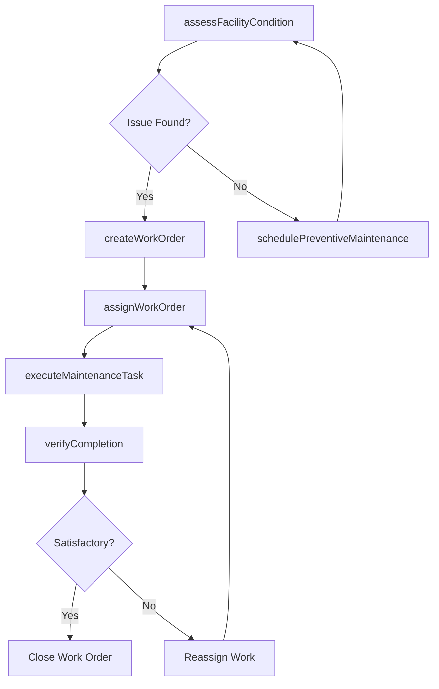
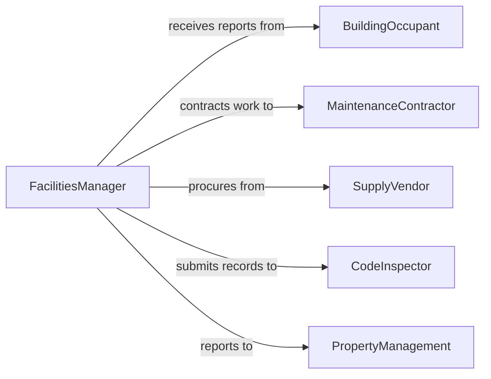

# Maintain Facilities

> Business-as-Code definition for maintaining facilities. Models the facility maintenance lifecycle from condition assessment through work order management, preventive scheduling, and compliance tracking.

## Overview

Maintaining facilities involves conducting regular inspections, managing corrective and preventive work orders, scheduling routine maintenance tasks, and ensuring buildings and grounds meet safety and regulatory standards. This definition exposes actions for the full facility maintenance process, events for tracking maintenance activities and outcomes, and searches for retrieving work orders, inspection records, and asset data.

## Actors

| Actor | Description |
|-------|-------------|
| BuildingOccupant | Reports maintenance issues and provides condition feedback |
| MaintenanceContractor | Performs specialized repairs and service work |
| SupplyVendor | Provides maintenance materials, tools, and replacement parts |
| CodeInspector | Conducts regulatory inspections and issues compliance findings |
| PropertyManagement | Sets maintenance standards and budgets for the facility |

## Roles

| Role | Description |
|------|-------------|
| FacilitiesManager | Oversees all maintenance operations and sets priorities |
| MaintenanceTechnician | Performs inspections, repairs, and preventive maintenance tasks |
| WorkOrderCoordinator | Manages work order intake, scheduling, and assignment |
| SafetyComplianceOfficer | Ensures maintenance activities meet regulatory standards |

## Entities

| Entity | Description |
|--------|-------------|
| Facility | A building, structure, or grounds under maintenance management |
| WorkOrder | A documented request for maintenance or repair work |
| InspectionRecord | Documentation of a facility condition assessment |
| MaintenanceSchedule | A calendar of planned preventive maintenance activities |
| Asset | An individual building system or component tracked for maintenance |
| ComplianceRecord | A log of regulatory inspections and their outcomes |

## Actions

| Action | Description |
|--------|-------------|
| assessFacilityCondition | Conduct a comprehensive inspection of facility systems and structures |
| createWorkOrder | Generate a maintenance or repair request for a specific issue |
| assignWorkOrder | Dispatch a work order to a technician or contractor |
| executeMaintenanceTask | Perform the required maintenance or repair activity |
| schedulePreventiveMaintenance | Plan recurring maintenance activities on a defined cycle |
| verifyCompletion | Confirm that maintenance work has been satisfactorily completed |
| recordComplianceInspection | Document the results of a regulatory or safety inspection |

## Events

| Event | Description |
|-------|-------------|
| facilityConditionAssessed | A facility inspection has been completed |
| workOrderCreated | A new maintenance request has been generated |
| workOrderAssigned | A work order has been dispatched to a technician |
| maintenanceTaskExecuted | A maintenance or repair activity has been completed |
| preventiveMaintenanceScheduled | Recurring maintenance has been planned |
| completionVerified | Maintenance work has been confirmed as satisfactory |
| complianceInspectionRecorded | A regulatory inspection result has been documented |

## Searches

| Search | Description |
|--------|-------------|
| findWorkOrders | List work orders by facility, status, priority, or assignee |
| getInspectionRecords | Retrieve inspection records by facility or date range |
| getMaintenanceSchedules | Find scheduled maintenance by facility or system type |
| findAssets | Search facility assets by type, location, or condition |

## Workflow



## Actor Relationships



## Usage

### Calling Actions

```typescript
import { maintainFacilities } from '@headlessly/maintain-facilities'

const facilities = maintainFacilities()

// Assess facility condition
const inspection = await facilities.assessFacilityCondition({
  facilityId: 'BLDG-HQ-001',
  systems: ['electrical', 'plumbing', 'hvac', 'structural', 'fire-safety'],
  inspector: 'tech-martinez'
})

// Create a work order for an identified issue
const workOrder = await facilities.createWorkOrder({
  facilityId: 'BLDG-HQ-001',
  description: 'Parking garage lighting fixtures on level 2 are non-functional',
  priority: 'high',
  system: 'electrical'
})

// Schedule preventive maintenance
await facilities.schedulePreventiveMaintenance({
  facilityId: 'BLDG-HQ-001',
  system: 'hvac',
  frequency: 'quarterly',
  tasks: ['filter-replacement', 'coil-cleaning', 'belt-inspection']
})
```

### Event-Driven Automation

```typescript
// Auto-assign high-priority work orders
facilities.workOrderCreated(async ({ workOrderId, priority, system }) => {
  if (priority === 'high' || priority === 'emergency') {
    const technician = await findAvailableTechnician({ specialty: system })
    await facilities.assignWorkOrder({ workOrderId, assignee: technician.id })
  }
})

// Notify property management on compliance inspection results
facilities.complianceInspectionRecorded(async ({ facilityId, result }) => {
  if (result === 'failed') {
    await notify({
      to: 'property-management',
      message: `Compliance inspection failed for facility ${facilityId}`
    })
  }
})
```
