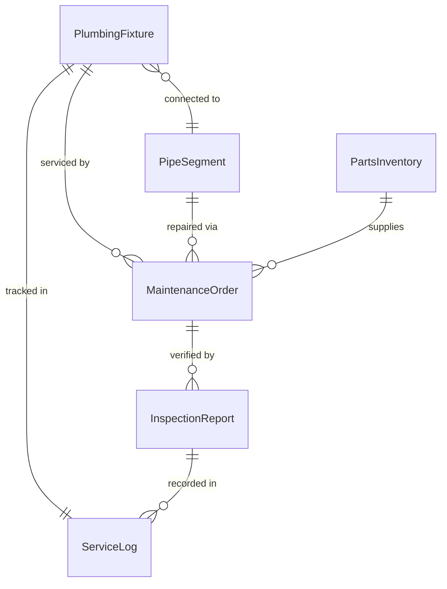
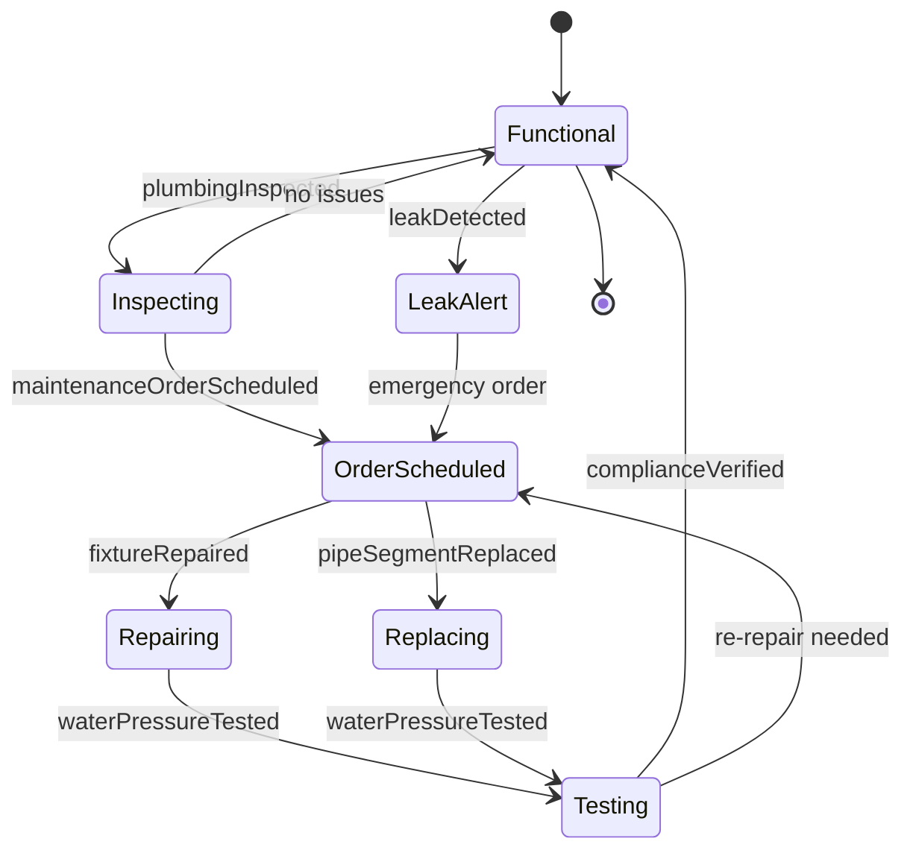
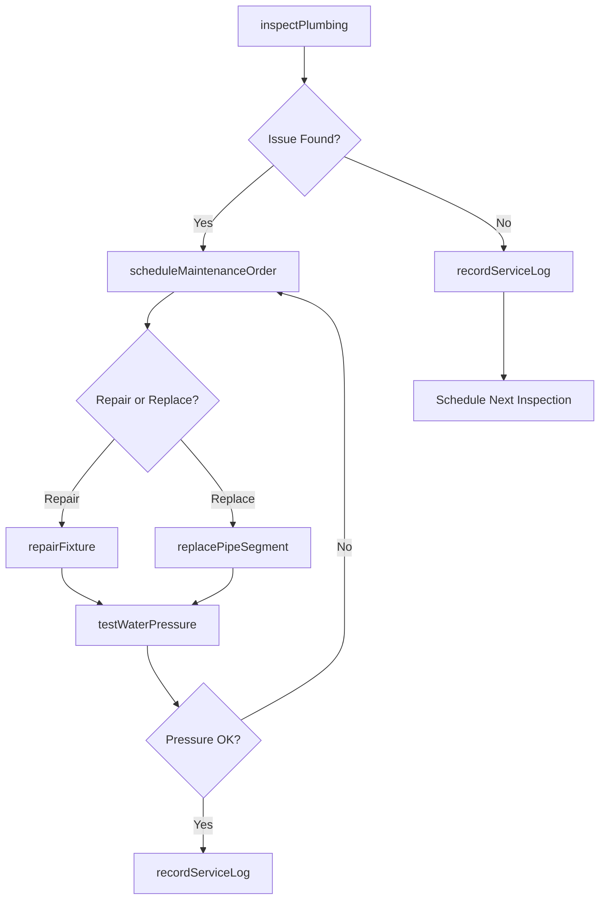
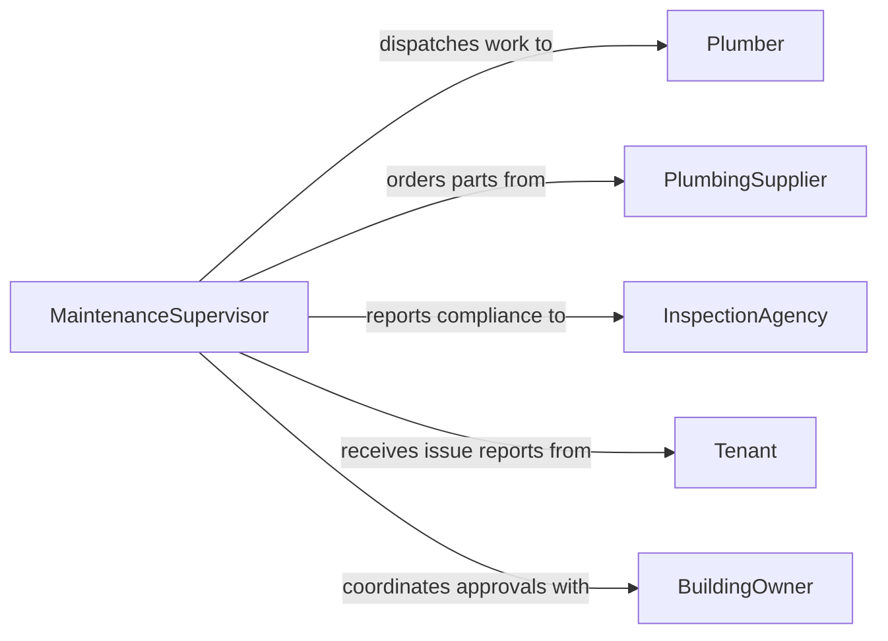

# Maintain Plumbing Structures Fixtures

> Business-as-Code definition for maintaining plumbing structures and fixtures. Models the complete lifecycle of plumbing maintenance from inspection through repair, testing, and compliance verification.

## Overview

Plumbing structures and fixtures maintenance encompasses the inspection, servicing, repair, and replacement of pipes, valves, faucets, drains, water heaters, and related infrastructure. This definition exposes actions for scheduling preventive maintenance, diagnosing plumbing issues, executing repairs, and verifying system integrity. Events enable automated alerting for leaks, pressure anomalies, and compliance deadlines.

## Actors

| Actor | Description |
|-------|-------------|
| BuildingOwner | Owns the facility and authorizes plumbing work |
| PlumbingSupplier | Provides pipes, fittings, valves, and fixtures |
| MunicipalWaterAuthority | Regulates water quality and plumbing codes |
| Tenant | Occupies the space and reports plumbing issues |
| InspectionAgency | Conducts code compliance inspections |

## Roles

| Role | Description |
|------|-------------|
| Plumber | Performs hands-on plumbing maintenance and repairs |
| MaintenanceSupervisor | Schedules work orders and oversees plumbing crews |
| FacilitiesManager | Plans long-term plumbing infrastructure needs |
| ComplianceOfficer | Ensures plumbing meets building codes and standards |

## Entities

| Entity | Description |
|--------|-------------|
| PlumbingFixture | A specific faucet, toilet, drain, or valve in the system |
| MaintenanceOrder | A work order for plumbing inspection or repair |
| PipeSegment | A section of pipe within the plumbing infrastructure |
| InspectionReport | Documentation of plumbing condition and compliance status |
| PartsInventory | Stock of replacement plumbing components and materials |
| ServiceLog | Historical record of maintenance activities on a fixture |

## Actions

| Action | Description |
|--------|-------------|
| inspectPlumbing | Examine plumbing fixtures and pipes for leaks, corrosion, or damage |
| scheduleMaintenanceOrder | Create a planned maintenance work order for plumbing service |
| repairFixture | Fix or restore a malfunctioning plumbing fixture |
| replacePipeSegment | Remove and install a new section of pipe |
| testWaterPressure | Verify water pressure meets operational specifications |
| flushSystem | Clear sediment and debris from pipes and drains |
| recordServiceLog | Document completed maintenance activity and findings |

## Events

| Event | Description |
|-------|-------------|
| plumbingInspected | A plumbing inspection has been completed |
| maintenanceOrderScheduled | A maintenance work order has been created and assigned |
| fixtureRepaired | A plumbing fixture has been restored to working condition |
| pipeSegmentReplaced | A section of pipe has been replaced |
| waterPressureTested | Water pressure testing has been completed |
| leakDetected | A water leak has been identified in the plumbing system |
| complianceVerified | Plumbing has passed code compliance inspection |

## Searches

| Search | Description |
|--------|-------------|
| findFixtures | List plumbing fixtures by location, type, or condition |
| getMaintenanceOrders | Retrieve work orders by status, priority, or date range |
| getServiceHistory | Look up past maintenance records for a specific fixture |
| findOverdueInspections | Identify fixtures or systems past their scheduled inspection date |

## Entity Relationships



## State Diagram



## Workflow



## Actor Relationships



## Usage

### Calling Actions

```typescript
import { maintainPlumbingStructuresFixtures } from '@headlessly/maintain-plumbing-structures-fixtures'

const plumbing = maintainPlumbingStructuresFixtures()

// Inspect plumbing in a building section
const inspection = await plumbing.inspectPlumbing({
  buildingId: 'bldg-101',
  zone: 'north-wing-floor-2',
  fixtureTypes: ['faucet', 'toilet', 'drain']
})

// Schedule a repair based on inspection findings
const order = await plumbing.scheduleMaintenanceOrder({
  fixtureId: inspection.issues[0].fixtureId,
  priority: 'high',
  description: 'Leaking supply valve under sink',
  scheduledDate: '2026-02-10'
})

// Test water pressure after repair
const pressureTest = await plumbing.testWaterPressure({
  fixtureId: order.fixtureId,
  minimumPsi: 40,
  maximumPsi: 80
})
```

### Event-Driven Automation

```typescript
// Alert facilities manager when a leak is detected
plumbing.leakDetected(async ({ fixtureId, location, severity }) => {
  await notify({
    to: 'facilities-manager',
    message: `Leak detected at ${location} on fixture ${fixtureId} - severity: ${severity}`
  })
  if (severity === 'critical') {
    await plumbing.scheduleMaintenanceOrder({
      fixtureId,
      priority: 'emergency',
      description: 'Critical leak requiring immediate attention'
    })
  }
})

// Schedule follow-up inspection after repairs
plumbing.fixtureRepaired(async ({ fixtureId, orderId }) => {
  await plumbing.testWaterPressure({ fixtureId, minimumPsi: 40, maximumPsi: 80 })
})
```
