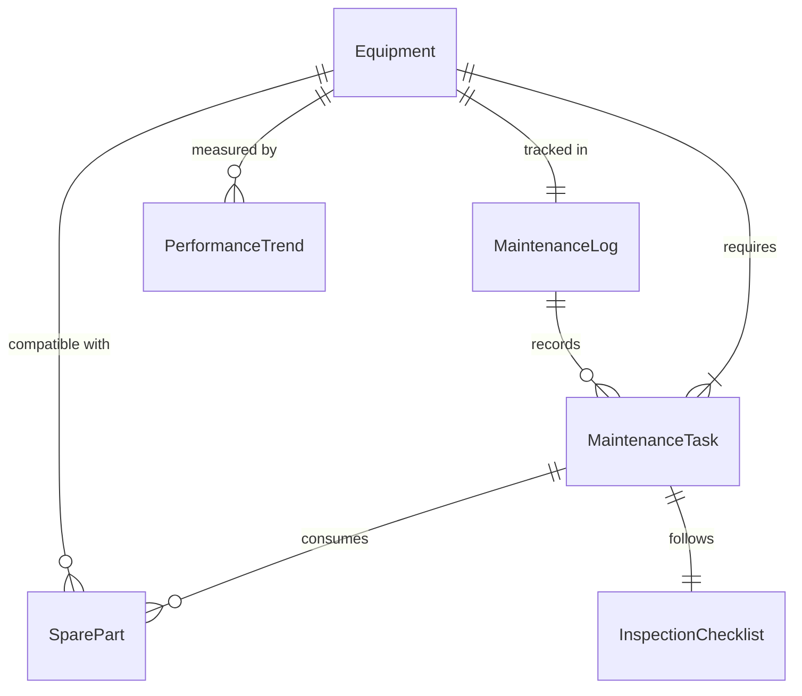
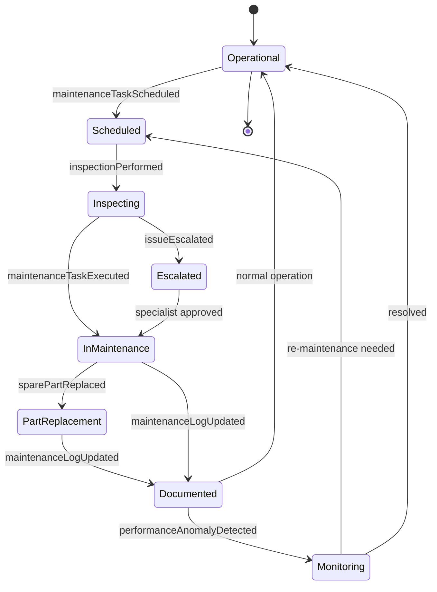
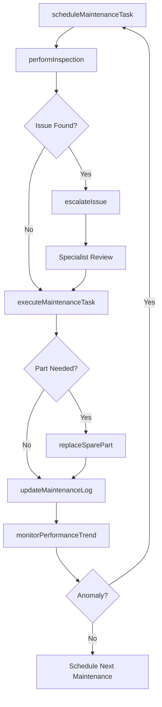
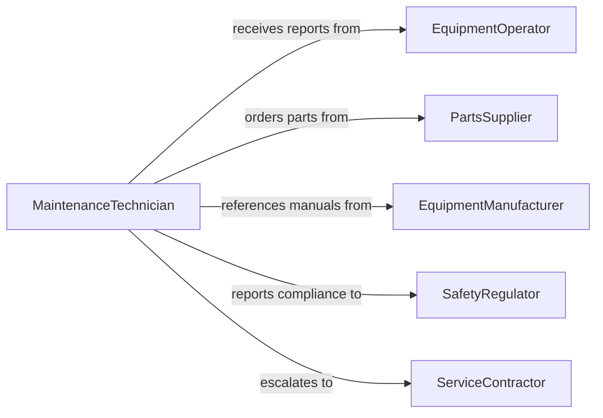

# Perform Basic Equipment Maintenance

> Business-as-Code definition for performing basic equipment maintenance. Models the routine maintenance lifecycle from inspection scheduling through task execution, documentation, and performance monitoring.

## Overview

Performing basic equipment maintenance involves scheduling routine inspections, executing preventive tasks such as lubrication, filter changes, and calibration, documenting maintenance activities, and monitoring equipment performance trends. This definition exposes actions for managing equipment maintenance workflows, events for tracking task completion and anomalies, and searches for retrieving maintenance logs, equipment records, and performance data.

## Actors

| Actor | Description |
|-------|-------------|
| EquipmentOperator | Uses the equipment daily and reports operational issues |
| PartsSupplier | Provides replacement parts, lubricants, and consumables |
| EquipmentManufacturer | Supplies maintenance manuals and warranty coverage |
| SafetyRegulator | Sets maintenance standards and conducts compliance audits |
| ServiceContractor | Performs specialized maintenance beyond in-house capabilities |

## Roles

| Role | Description |
|------|-------------|
| MaintenanceTechnician | Executes routine maintenance tasks on equipment |
| MaintenancePlanner | Schedules and coordinates maintenance activities |
| EquipmentManager | Oversees the equipment maintenance program and budget |
| QualityInspector | Verifies that maintenance tasks meet operational standards |

## Entities

| Entity | Description |
|--------|-------------|
| Equipment | A machine or device under the maintenance program |
| MaintenanceTask | A specific activity to be performed on a piece of equipment |
| MaintenanceLog | A chronological record of all maintenance performed on equipment |
| InspectionChecklist | A standardized list of items to verify during inspection |
| SparePart | A replacement component kept in inventory for maintenance |
| PerformanceTrend | Historical data tracking equipment operation over time |

## Actions

| Action | Description |
|--------|-------------|
| scheduleMaintenanceTask | Plan a routine maintenance activity for a piece of equipment |
| performInspection | Execute a standardized checklist inspection on the equipment |
| executeMaintenanceTask | Carry out the planned maintenance activity |
| replaceSparePart | Swap a worn or depleted component with a new part |
| updateMaintenanceLog | Record completed maintenance activities and observations |
| monitorPerformanceTrend | Track equipment operating metrics over time |
| escalateIssue | Flag an abnormality that requires specialized attention |

## Events

| Event | Description |
|-------|-------------|
| maintenanceTaskScheduled | A routine maintenance activity has been planned |
| inspectionPerformed | An equipment inspection has been completed |
| maintenanceTaskExecuted | A maintenance activity has been carried out |
| sparePartReplaced | A component has been swapped on the equipment |
| maintenanceLogUpdated | A maintenance record has been documented |
| performanceAnomalyDetected | Equipment metrics indicate abnormal operation |
| issueEscalated | A maintenance finding has been flagged for specialist review |

## Searches

| Search | Description |
|--------|-------------|
| findMaintenanceTasks | List tasks by equipment, status, or due date |
| getMaintenanceLogs | Retrieve maintenance history by equipment or date range |
| getPerformanceTrends | Find equipment performance data by metric or period |
| findSpareParts | Search spare parts inventory by equipment type or part number |

## Entity Relationships



## State Diagram



## Workflow



## Actor Relationships



## Usage

### Calling Actions

```typescript
import { performBasicEquipmentMaintenance } from '@headlessly/perform-basic-equipment-maintenance'

const maintenance = performBasicEquipmentMaintenance()

// Schedule a maintenance task
const task = await maintenance.scheduleMaintenanceTask({
  equipmentId: 'CNC-MILL-04',
  taskType: 'lubrication-and-filter-change',
  dueDate: '2026-03-01',
  frequency: 'monthly'
})

// Perform the inspection
const inspection = await maintenance.performInspection({
  equipmentId: 'CNC-MILL-04',
  checklist: ['oil-level', 'filter-condition', 'belt-tension', 'coolant-level']
})

// Execute the maintenance task
await maintenance.executeMaintenanceTask({
  taskId: task.id,
  activities: ['replaced-oil-filter', 'topped-off-coolant', 'adjusted-belt-tension'],
  duration: 45
})
```

### Event-Driven Automation

```typescript
// Auto-reorder spare parts when replaced
maintenance.sparePartReplaced(async ({ equipmentId, partNumber, inventoryLevel }) => {
  if (inventoryLevel < 2) {
    await createPurchaseOrder({
      partNumber,
      quantity: 5,
      priority: 'standard'
    })
  }
})

// Alert manager on performance anomalies
maintenance.performanceAnomalyDetected(async ({ equipmentId, metric, value }) => {
  await notify({
    to: 'equipment-manager',
    message: `Anomaly on ${equipmentId}: ${metric} at ${value}`
  })
})
```
