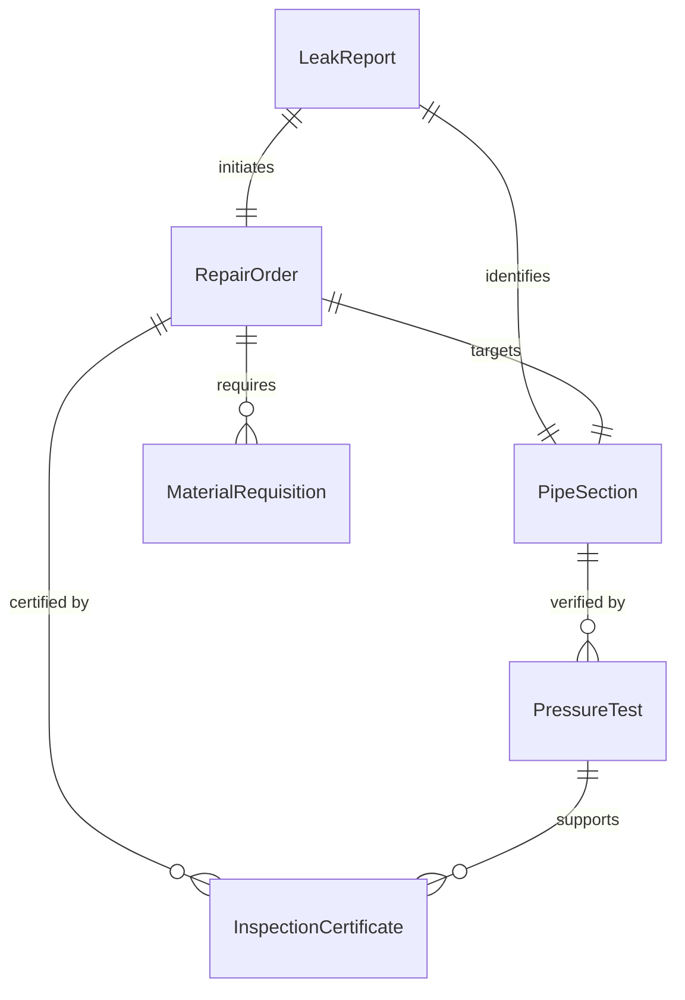
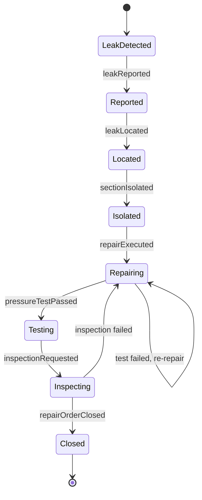
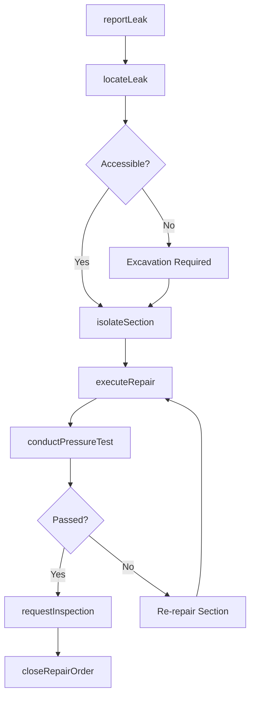
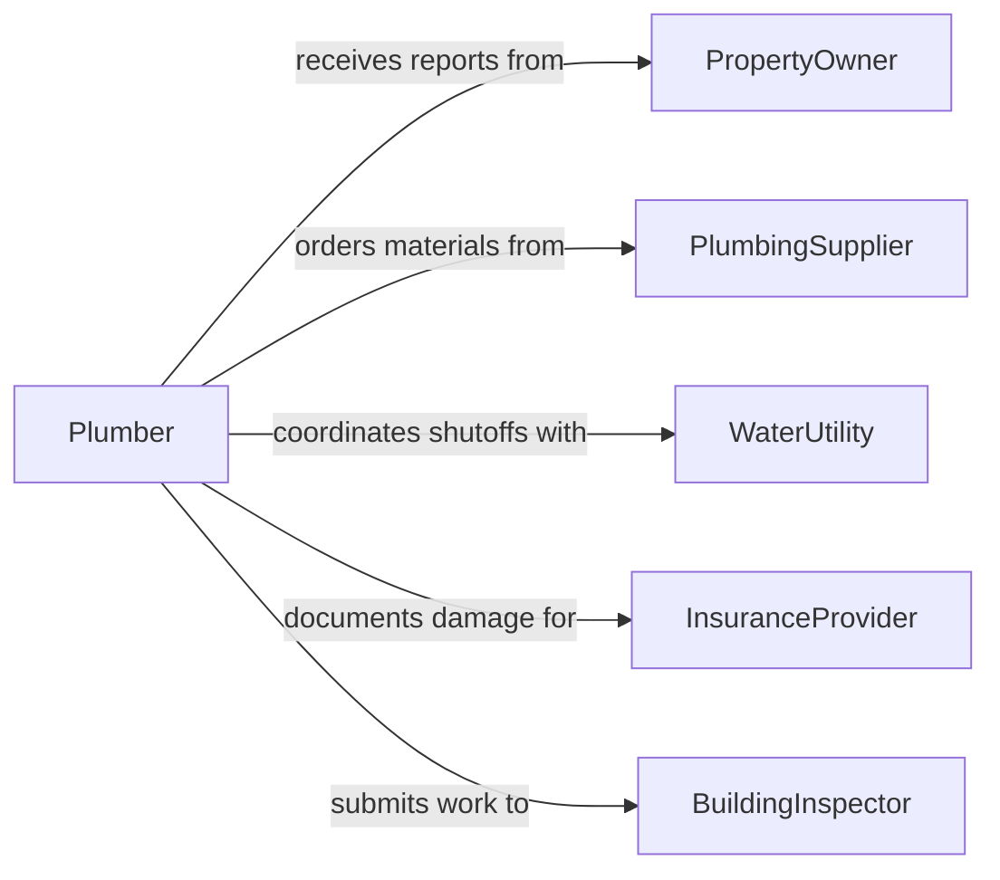

# Repair Pipes Stop Leaking

> Business-as-Code definition for repairing pipes to stop leaking. Models the pipe repair lifecycle from leak detection through isolation, repair execution, and pressure testing.

## Overview

Repairing pipes to stop leaking involves identifying leak locations, isolating affected sections, executing repairs or replacements, and verifying system integrity through pressure testing. This definition exposes actions for managing plumbing repair workflows, events for tracking repair progress and outcomes, and searches for retrieving leak reports, repair records, and inspection data.

## Actors

| Actor | Description |
|-------|-------------|
| PropertyOwner | Reports leaks and authorizes repair work |
| PlumbingSupplier | Provides pipes, fittings, sealants, and repair materials |
| WaterUtility | Coordinates shutoffs and provides system pressure data |
| InsuranceProvider | Processes claims related to water damage from leaks |
| BuildingInspector | Verifies repairs meet plumbing codes and standards |

## Roles

| Role | Description |
|------|-------------|
| Plumber | Locates leaks, executes repairs, and tests pipe integrity |
| MaintenanceSupervisor | Prioritizes repair requests and dispatches technicians |
| FacilitiesCoordinator | Manages building access and communicates service disruptions |
| SafetyOfficer | Ensures repair activities comply with workplace safety standards |

## Entities

| Entity | Description |
|--------|-------------|
| LeakReport | A documented report of a detected or suspected pipe leak |
| RepairOrder | A work request authorizing pipe repair activities |
| PipeSection | A specific segment of piping identified for repair or replacement |
| PressureTest | A test verifying pipe integrity after repair completion |
| MaterialRequisition | A request for pipe fittings, sealants, or replacement sections |
| InspectionCertificate | A document confirming the repair meets code requirements |

## Actions

| Action | Description |
|--------|-------------|
| reportLeak | Document a detected or suspected pipe leak |
| locateLeak | Identify the precise location and source of the leak |
| isolateSection | Shut off water flow to the affected pipe section |
| executeRepair | Perform the pipe repair using appropriate method |
| conductPressureTest | Test the repaired section under operating pressure |
| requestInspection | Submit the completed repair for building code inspection |
| closeRepairOrder | Finalize documentation and close the work request |

## Events

| Event | Description |
|-------|-------------|
| leakReported | A pipe leak has been documented |
| leakLocated | The precise leak location has been identified |
| sectionIsolated | Water flow to the affected area has been shut off |
| repairExecuted | The pipe repair has been completed |
| pressureTestPassed | The repaired section has passed integrity testing |
| inspectionRequested | The repair has been submitted for code inspection |
| repairOrderClosed | The repair work request has been finalized |

## Searches

| Search | Description |
|--------|-------------|
| findLeakReports | List leak reports by location, severity, or status |
| getRepairOrders | Retrieve repair orders by building, plumber, or date |
| getPressureTests | Find pressure test results by pipe section or date |
| findInspectionCertificates | Search inspection records by repair or building |

## Entity Relationships



## State Diagram



## Workflow



## Actor Relationships



## Usage

### Calling Actions

```typescript
import { repairPipesStopLeaking } from '@headlessly/repair-pipes-stop-leaking'

const pipes = repairPipesStopLeaking()

// Report a leak
const report = await pipes.reportLeak({
  building: 'Building C',
  floor: 2,
  description: 'Water dripping from ceiling near restroom',
  severity: 'moderate'
})

// Locate the leak
const location = await pipes.locateLeak({
  reportId: report.id,
  method: 'acoustic-detection',
  result: { section: 'PIPE-C2-R4', jointType: 'copper-solder' }
})

// Execute the repair
await pipes.executeRepair({
  reportId: report.id,
  section: location.section,
  method: 'solder-joint-reflow',
  materials: ['flux', 'lead-free-solder']
})
```

### Event-Driven Automation

```typescript
// Alert facilities when a high-severity leak is reported
pipes.leakReported(async ({ reportId, severity, building }) => {
  if (severity === 'critical') {
    await notify({
      to: 'facilities-emergency',
      message: `Critical pipe leak in ${building}. Report: ${reportId}`
    })
  }
})

// Auto-close repair order after successful inspection
pipes.pressureTestPassed(async ({ reportId, section }) => {
  await pipes.requestInspection({
    reportId,
    section,
    inspectorType: 'plumbing-code'
  })
})
```
