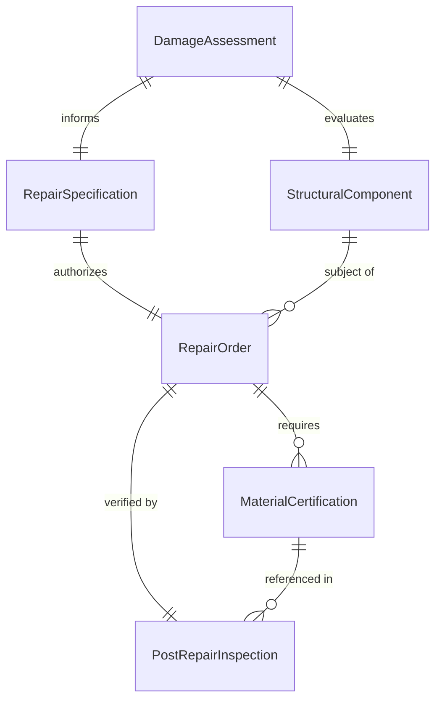
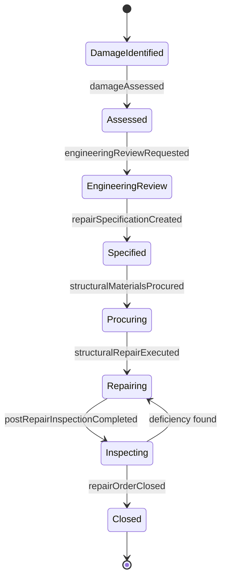
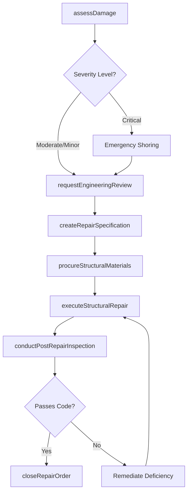
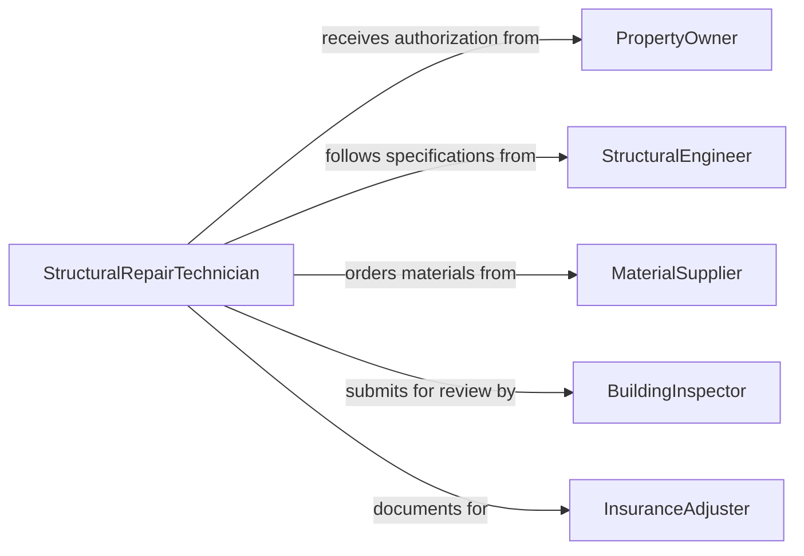

# Repair Structural Components

> Business-as-Code definition for repairing structural components. Models the structural repair lifecycle from damage assessment through engineering review, repair execution, and post-repair inspection.

## Overview

Repairing structural components involves assessing damage to load-bearing and non-load-bearing elements, obtaining engineering evaluations, executing repairs using approved methods, and verifying restored structural integrity. This definition exposes actions for managing structural repair workflows, events for tracking assessment and repair progress, and searches for retrieving damage reports, engineering evaluations, and inspection records.

## Actors

| Actor | Description |
|-------|-------------|
| PropertyOwner | Reports structural damage and authorizes repair expenditures |
| StructuralEngineer | Evaluates damage severity and specifies repair methods |
| MaterialSupplier | Provides structural materials such as steel, concrete, and fasteners |
| BuildingInspector | Verifies repairs comply with structural codes and standards |
| InsuranceAdjuster | Assesses damage claims and approves coverage for repairs |

## Roles

| Role | Description |
|------|-------------|
| StructuralRepairTechnician | Executes structural repairs using approved methods |
| ProjectSupervisor | Manages the repair project timeline, budget, and crew |
| SafetyCoordinator | Ensures repair activities comply with workplace safety protocols |
| QualityInspector | Verifies that completed repairs meet engineering specifications |

## Entities

| Entity | Description |
|--------|-------------|
| DamageAssessment | A documented evaluation of structural damage severity and extent |
| RepairSpecification | Engineering-approved instructions for executing the repair |
| StructuralComponent | A beam, column, wall, foundation, or other building element |
| RepairOrder | A work authorization for structural repair activities |
| PostRepairInspection | A verification that the repair meets structural integrity standards |
| MaterialCertification | Documentation confirming materials meet structural grade requirements |

## Actions

| Action | Description |
|--------|-------------|
| assessDamage | Evaluate the extent and severity of structural damage |
| requestEngineeringReview | Submit damage assessment for structural engineering evaluation |
| createRepairSpecification | Define the approved repair method and material requirements |
| procureStructuralMaterials | Order certified structural materials for the repair |
| executeStructuralRepair | Perform the repair work according to the specification |
| conductPostRepairInspection | Verify restored structural integrity meets code standards |
| closeRepairOrder | Finalize documentation and close the repair authorization |

## Events

| Event | Description |
|-------|-------------|
| damageAssessed | Structural damage has been evaluated and documented |
| engineeringReviewRequested | The damage assessment has been submitted for engineering review |
| repairSpecificationCreated | The approved repair method has been documented |
| structuralMaterialsProcured | Certified materials have been received for the repair |
| structuralRepairExecuted | The repair work has been completed |
| postRepairInspectionCompleted | The structural integrity verification has been performed |
| repairOrderClosed | The repair project has been finalized |

## Searches

| Search | Description |
|--------|-------------|
| findDamageAssessments | List assessments by building, severity, or status |
| getRepairSpecifications | Retrieve specifications by component type or engineer |
| getPostRepairInspections | Find inspection results by repair order or inspector |
| findRepairOrders | Search repair authorizations by building, status, or date |

## Entity Relationships



## State Diagram



## Workflow



## Actor Relationships



## Usage

### Calling Actions

```typescript
import { repairStructuralComponents } from '@headlessly/repair-structural-components'

const structural = repairStructuralComponents()

// Assess the damage
const assessment = await structural.assessDamage({
  building: 'Warehouse B',
  component: 'steel-column-B7',
  damageType: 'corrosion',
  severity: 'moderate',
  photos: ['col-b7-front.jpg', 'col-b7-detail.jpg']
})

// Request engineering review
await structural.requestEngineeringReview({
  assessmentId: assessment.id,
  engineer: 'PE-smith',
  urgency: 'standard'
})

// Execute the repair
await structural.executeStructuralRepair({
  specificationId: 'SPEC-2026-0042',
  method: 'steel-plate-reinforcement',
  materials: ['A572-Grade50-plate', 'structural-bolts', 'primer-coat'],
  crew: ['tech-jones', 'tech-garcia']
})
```

### Event-Driven Automation

```typescript
// Notify engineer when damage is assessed as severe
structural.damageAssessed(async ({ assessmentId, severity, building }) => {
  if (severity === 'severe' || severity === 'critical') {
    await notify({
      to: 'structural-engineering',
      message: `Urgent: ${severity} structural damage at ${building}. Assessment: ${assessmentId}`
    })
  }
})

// Auto-schedule inspection after repair completion
structural.structuralRepairExecuted(async ({ repairOrderId, component }) => {
  await structural.conductPostRepairInspection({
    repairOrderId,
    component,
    inspectionType: 'structural-code-compliance'
  })
})
```
