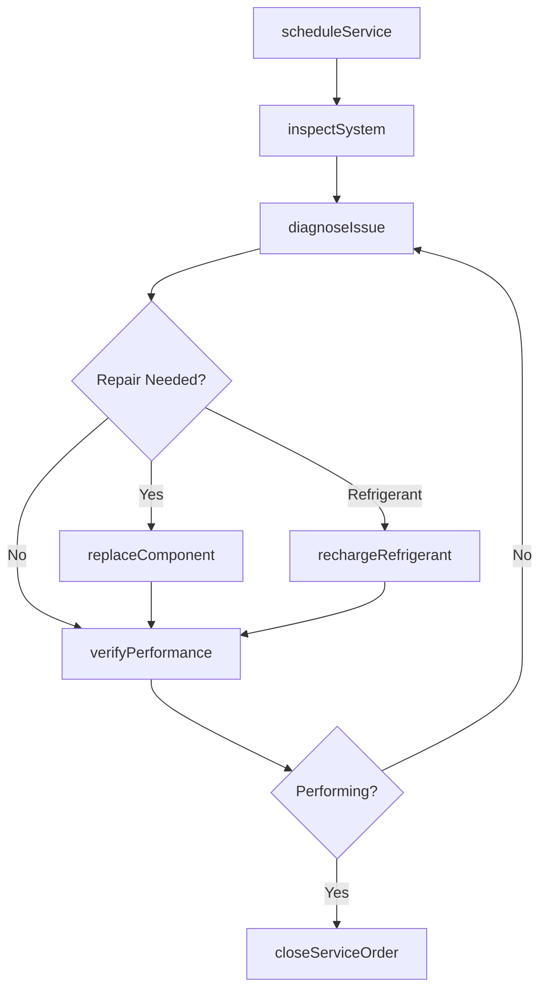
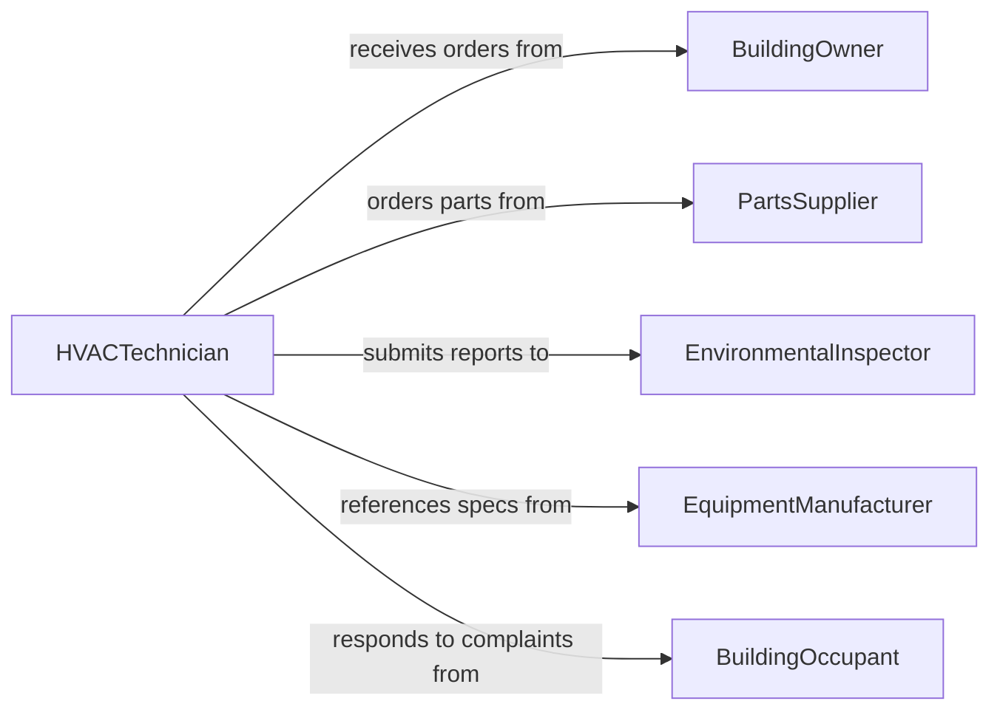

# Service Heating Ventilation Air-conditioning(hvac)

> Business-as-Code definition for servicing heating, ventilation, and air-conditioning (HVAC) systems or components. Models the complete service lifecycle from inspection through diagnosis, repair, and performance verification.

## Overview

Servicing HVAC systems involves scheduled inspections, diagnosing performance issues, replacing or repairing components, and verifying system operation meets environmental and efficiency standards. This definition exposes actions for each phase of HVAC service management, events for tracking maintenance workflows, and searches for retrieving service records, equipment data, and compliance documentation.

## Actors

| Actor | Description |
|-------|-------------|
| BuildingOwner | Requests service and approves major repairs or replacements |
| PartsSupplier | Provides HVAC components, refrigerants, and consumables |
| EnvironmentalInspector | Verifies compliance with refrigerant and emissions regulations |
| EquipmentManufacturer | Provides technical specifications and warranty support |
| BuildingOccupant | Reports comfort issues and provides feedback on system performance |

## Roles

| Role | Description |
|------|-------------|
| HVACTechnician | Inspects, diagnoses, and repairs HVAC systems |
| MaintenanceSupervisor | Schedules service activities and oversees technician work |
| FacilitiesManager | Manages building systems and coordinates service priorities |
| ComplianceOfficer | Ensures HVAC operations meet environmental regulations |

## Entities

| Entity | Description |
|--------|-------------|
| HVACUnit | A heating, ventilation, or air-conditioning system or component |
| ServiceOrder | A work request for inspection, maintenance, or repair |
| InspectionReport | Documentation of system condition and findings |
| ComponentReplacement | A record of parts swapped during service |
| RefrigerantLog | A tracking record for refrigerant usage and disposal |
| PerformanceReading | Temperature, pressure, or airflow measurements taken during service |

## Actions

| Action | Description |
|--------|-------------|
| scheduleService | Create a service appointment for an HVAC unit |
| inspectSystem | Perform a visual and diagnostic inspection of the HVAC system |
| diagnoseIssue | Identify the root cause of a performance problem |
| replaceComponent | Swap a faulty part with a new or refurbished component |
| rechargeRefrigerant | Add or replace refrigerant to specified levels |
| verifyPerformance | Test the system after service to confirm proper operation |
| closeServiceOrder | Finalize documentation and close the work request |

## Events

| Event | Description |
|-------|-------------|
| serviceScheduled | A service appointment has been created |
| systemInspected | The HVAC system inspection has been completed |
| issueDiagnosed | The root cause of a problem has been identified |
| componentReplaced | A faulty part has been swapped |
| refrigerantRecharged | Refrigerant levels have been restored |
| performanceVerified | Post-service testing confirms proper operation |
| serviceOrderClosed | The service work request has been finalized |

## Searches

| Search | Description |
|--------|-------------|
| findServiceOrders | List service orders by unit, status, or technician |
| getInspectionReports | Retrieve inspection records by unit or date range |
| getRefrigerantLogs | Find refrigerant usage records by unit or compliance period |
| findComponentReplacements | Search replacement history by unit or part type |

## Workflow



## Actor Relationships



## Usage

### Calling Actions

```typescript
import { serviceHeatingVentilationAirConditioning } from '@headlessly/service-heating-ventilation-air-conditioning-hvac'

const hvac = serviceHeatingVentilationAirConditioning()

// Schedule a service call
const order = await hvac.scheduleService({
  unitId: 'RTU-BLDG-A-03',
  type: 'preventive-maintenance',
  scheduledDate: '2026-03-15',
  priority: 'standard'
})

// Inspect the system
const inspection = await hvac.inspectSystem({
  serviceOrderId: order.id,
  checks: ['filter-condition', 'refrigerant-levels', 'electrical-connections', 'airflow']
})

// Replace a component if needed
await hvac.replaceComponent({
  serviceOrderId: order.id,
  partNumber: 'BLWR-MTR-5HP',
  description: 'Blower motor replacement',
  warrantyStatus: 'in-warranty'
})
```

### Event-Driven Automation

```typescript
// Alert facilities manager on critical diagnoses
hvac.issueDiagnosed(async ({ serviceOrderId, severity, description }) => {
  if (severity === 'critical') {
    await notify({
      to: 'facilities-manager',
      message: `Critical HVAC issue: ${description} on order ${serviceOrderId}`
    })
  }
})

// Log refrigerant usage for compliance
hvac.refrigerantRecharged(async ({ unitId, type, quantity }) => {
  await logCompliance({
    category: 'refrigerant-tracking',
    unitId,
    refrigerantType: type,
    quantity
  })
})
```
