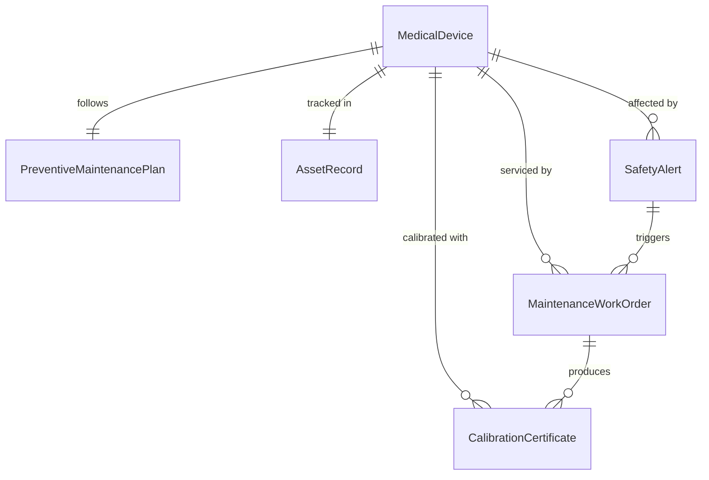
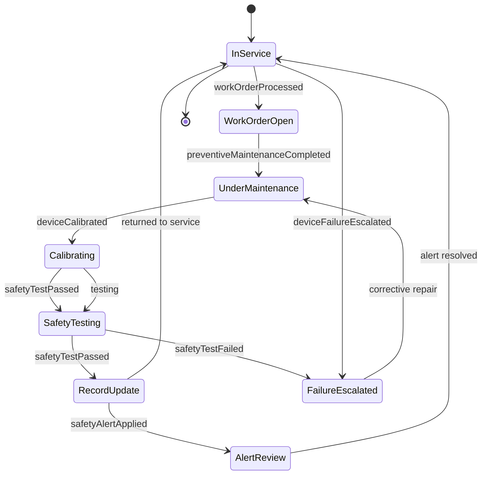
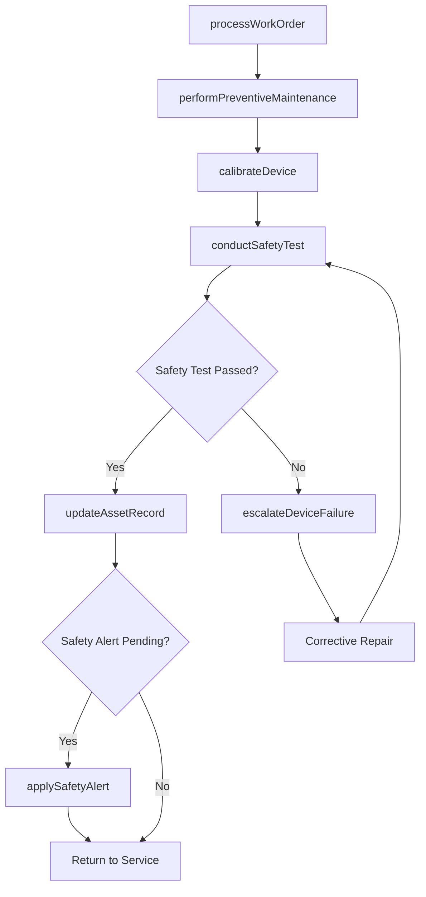
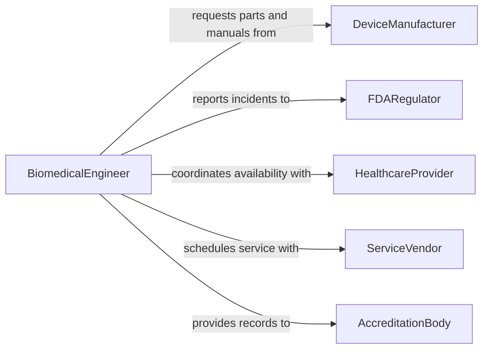

# Maintain Medical Equipment Instruments

> Business-as-Code definition for maintaining medical equipment and instruments to ensure patient safety, clinical effectiveness, and compliance with healthcare regulations.

## Overview

Maintaining medical equipment and instruments involves inspecting, testing, calibrating, cleaning, and repairing devices used in patient care such as ventilators, infusion pumps, defibrillators, and surgical instruments. This definition exposes actions for managing preventive maintenance programs governed by Joint Commission and FDA requirements, events for tracking device readiness and safety alerts, and searches for retrieving equipment status and maintenance compliance data.

## Actors

| Actor | Description |
|-------|-------------|
| DeviceManufacturer | Provides service manuals, firmware updates, and OEM replacement parts |
| FDARegulator | Enforces medical device safety and maintenance documentation requirements |
| HealthcareProvider | Uses the equipment for patient care and reports operational issues |
| ServiceVendor | Performs specialized maintenance under contract for complex medical devices |
| AccreditationBody | Audits equipment maintenance programs as part of facility accreditation |
| GroupPurchasingOrganization | Negotiates service contracts and parts pricing on behalf of the facility |

## Roles

| Role | Description |
|------|-------------|
| BiomedicalEngineer | Plans and oversees the maintenance program for medical devices |
| BiomedicalTechnician | Performs hands-on inspection, testing, calibration, and repair |
| ClinicalEngineeringManager | Manages the biomedical team and maintenance budgets |
| RiskManager | Assesses equipment-related patient safety risks and incidents |
| NurseManager | Coordinates equipment availability for clinical departments |

## Entities

| Entity | Description |
|--------|-------------|
| MedicalDevice | A clinical instrument or piece of equipment used in patient care |
| MaintenanceWorkOrder | A formal request to inspect, repair, or service a medical device |
| CalibrationCertificate | Documentation proving a device meets performance specifications |
| SafetyAlert | A manufacturer or FDA notification about a device defect or hazard |
| PreventiveMaintenancePlan | A schedule of required maintenance activities for each device class |
| AssetRecord | The complete lifecycle record for a medical device including purchase, service, and disposition |

## Actions

| Action | Description |
|--------|-------------|
| performPreventiveMaintenance | Execute scheduled inspection, testing, and servicing of a medical device |
| calibrateDevice | Adjust device output to match known reference standards |
| processWorkOrder | Create, assign, and track a maintenance request through completion |
| conductSafetyTest | Verify electrical safety, alarms, and fail-safe mechanisms function correctly |
| applySafetyAlert | Review and implement corrective actions from manufacturer or FDA notifications |
| updateAssetRecord | Record maintenance details, condition changes, and compliance status |
| escalateDeviceFailure | Flag a critical device malfunction requiring immediate clinical notification |

## Events

| Event | Description |
|-------|-------------|
| preventiveMaintenanceCompleted | Scheduled maintenance has been performed on a medical device |
| deviceCalibrated | A device has been adjusted and verified against reference standards |
| workOrderProcessed | A maintenance request has been completed and closed |
| safetyTestPassed | A device has passed electrical safety and alarm verification |
| safetyTestFailed | A device has failed safety testing and requires corrective action |
| safetyAlertApplied | A manufacturer or FDA corrective action has been implemented |
| deviceFailureEscalated | A critical equipment malfunction has been reported to clinical staff |

## Searches

| Search | Description |
|--------|-------------|
| findDevicesByStatus | List medical devices filtered by operational status, location, or department |
| getMaintenanceHistory | Retrieve the complete service record for a specific medical device |
| getOverdueDevices | Find devices that have exceeded their scheduled maintenance interval |
| findOpenWorkOrders | Locate active maintenance requests by priority, technician, or device type |
| getSafetyAlerts | Retrieve active safety alerts for devices in the facility inventory |

## Entity Relationships



## State Diagram



## Workflow



## Actor Relationships



## Usage

### Calling Actions

```typescript
import { maintainMedicalEquipmentInstruments } from '@headlessly/maintain-medical-equipment-instruments'

const devices = maintainMedicalEquipmentInstruments()

// Process a work order for a ventilator PM
const workOrder = await devices.processWorkOrder({
  deviceId: 'VENT-ICU-012',
  type: 'preventive-maintenance',
  priority: 'high',
  department: 'Intensive Care Unit'
})

// Perform preventive maintenance
await devices.performPreventiveMaintenance({
  workOrderId: workOrder.id,
  tasks: ['visual-inspection', 'flow-sensor-test', 'battery-check', 'alarm-verification'],
  technician: 'biomed-tech-park'
})

// Conduct safety test
const safetyResult = await devices.conductSafetyTest({
  deviceId: 'VENT-ICU-012',
  tests: ['electrical-leakage', 'ground-resistance', 'alarm-function']
})
```

### Event-Driven Automation

```typescript
// Immediately notify clinical staff when safety test fails
devices.safetyTestFailed(async ({ deviceId, testResults }) => {
  await devices.escalateDeviceFailure({
    deviceId,
    severity: 'critical',
    reason: `Failed safety tests: ${testResults.failed.join(', ')}`
  })
})

// Auto-schedule next PM after completion
devices.preventiveMaintenanceCompleted(async ({ deviceId, completedAt }) => {
  const plan = await getMaintenancePlan(deviceId)
  await devices.processWorkOrder({
    deviceId,
    type: 'preventive-maintenance',
    scheduledDate: addMonths(completedAt, plan.intervalMonths)
  })
})
```
