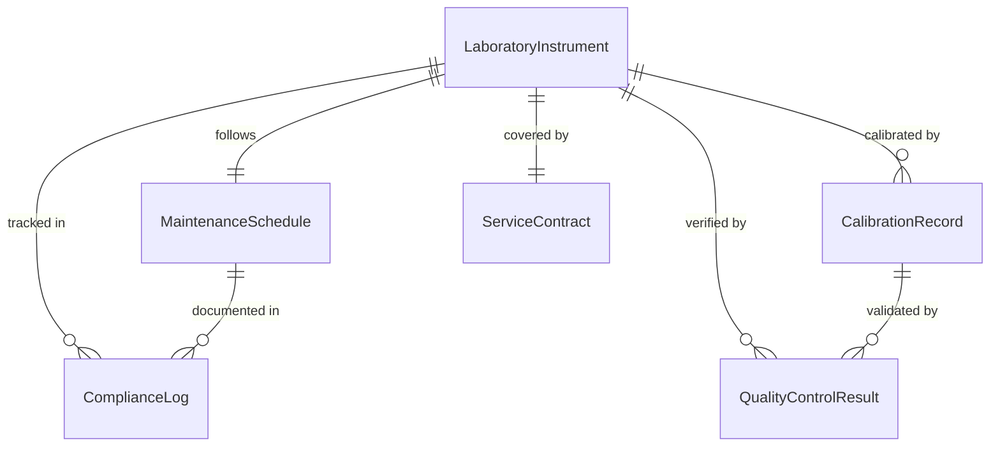
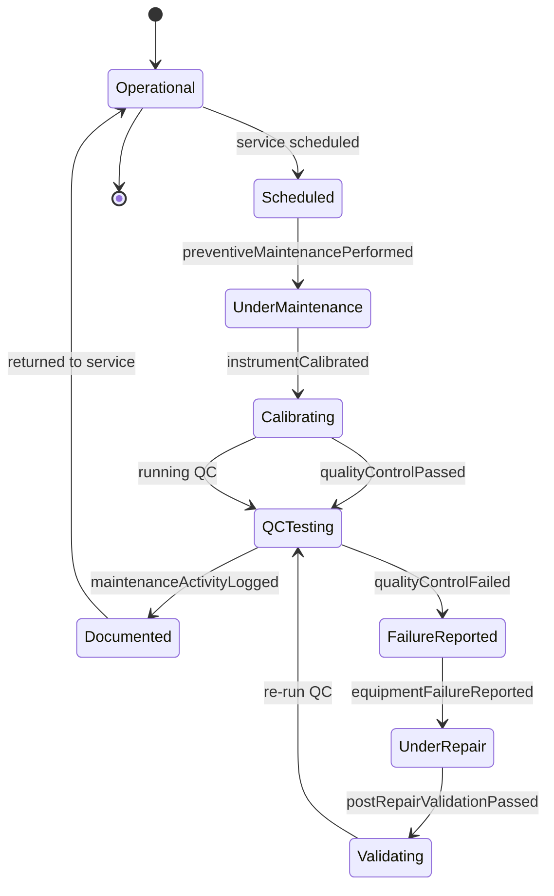
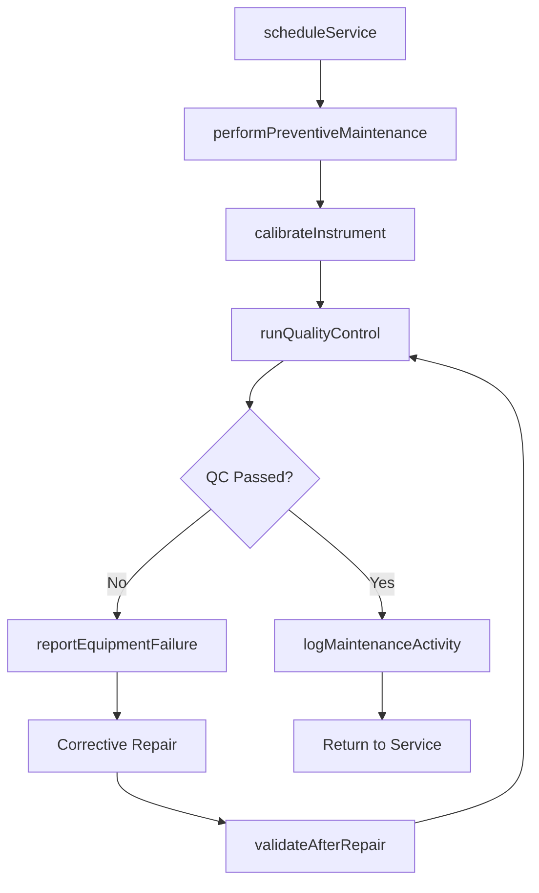
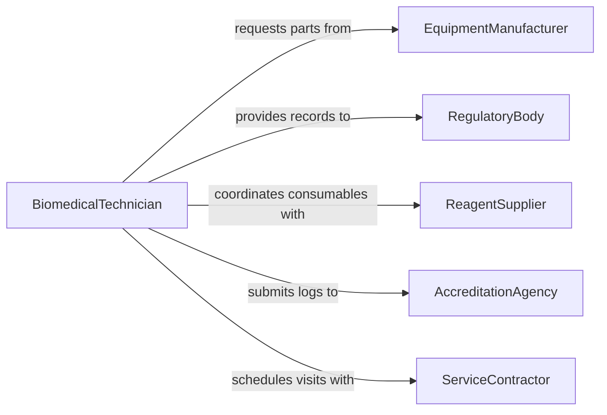

# Maintain Medical Laboratory Equipment

> Business-as-Code definition for maintaining medical laboratory equipment to ensure diagnostic accuracy, regulatory compliance, and uninterrupted laboratory operations.

## Overview

Maintaining medical laboratory equipment involves calibrating, cleaning, repairing, and validating instruments such as analyzers, centrifuges, microscopes, and autoclaves used in clinical and research laboratories. This definition exposes actions for managing preventive maintenance schedules in compliance with CLIA and FDA regulations, events for tracking calibration status and equipment failures, and searches for retrieving maintenance records required during audits.

## Actors

| Actor | Description |
|-------|-------------|
| EquipmentManufacturer | Provides service contracts, calibration standards, and OEM replacement parts |
| RegulatoryBody | Enforces CLIA, CAP, and FDA compliance requirements for laboratory instruments |
| ReagentSupplier | Supplies consumables and quality control materials used with laboratory equipment |
| AccreditationAgency | Audits laboratory operations and equipment maintenance records |
| ServiceContractor | Performs specialized repairs and annual preventive maintenance |

## Roles

| Role | Description |
|------|-------------|
| BiomedicalTechnician | Performs hands-on maintenance, calibration, and repair of laboratory instruments |
| LaboratoryDirector | Oversees equipment readiness and authorizes maintenance expenditures |
| QualityAssuranceSpecialist | Validates that equipment performance meets regulatory and quality standards |
| LabSupervisor | Coordinates daily equipment usage and reports operational issues |

## Entities

| Entity | Description |
|--------|-------------|
| LaboratoryInstrument | An analyzer, centrifuge, microscope, or other lab device |
| CalibrationRecord | Documentation of instrument calibration results and adjustments |
| MaintenanceSchedule | A plan of preventive maintenance intervals for each instrument |
| QualityControlResult | Test outcomes used to verify instrument accuracy |
| ServiceContract | An agreement with a manufacturer or vendor for ongoing maintenance support |
| ComplianceLog | A record of all maintenance activities required for regulatory audits |

## Actions

| Action | Description |
|--------|-------------|
| calibrateInstrument | Adjust instrument settings to match reference standards |
| performPreventiveMaintenance | Execute scheduled cleaning, lubrication, and component replacement |
| runQualityControl | Execute QC tests to verify instrument accuracy within acceptable ranges |
| logMaintenanceActivity | Record maintenance details in the compliance log |
| scheduleService | Plan upcoming preventive maintenance or vendor service visits |
| reportEquipmentFailure | Document an instrument malfunction and initiate corrective action |
| validateAfterRepair | Confirm instrument performance meets specifications following repair |

## Events

| Event | Description |
|-------|-------------|
| instrumentCalibrated | An instrument has been calibrated to reference standards |
| preventiveMaintenancePerformed | Scheduled maintenance has been completed |
| qualityControlPassed | QC results confirm instrument is within acceptable limits |
| qualityControlFailed | QC results indicate instrument is out of specification |
| maintenanceActivityLogged | A maintenance record has been added to the compliance log |
| equipmentFailureReported | An instrument malfunction has been documented |
| postRepairValidationPassed | Instrument has been verified functional after corrective repair |

## Searches

| Search | Description |
|--------|-------------|
| findInstrumentsByStatus | List laboratory instruments filtered by operational or maintenance status |
| getCalibrationHistory | Retrieve calibration records for a specific instrument |
| getUpcomingMaintenance | Find instruments with scheduled service within a given timeframe |
| findFailedQualityControls | Locate instruments that have recently failed QC checks |
| getComplianceRecords | Retrieve all maintenance documentation for audit purposes |

## Entity Relationships



## State Diagram



## Workflow



## Actor Relationships



## Usage

### Calling Actions

```typescript
import { maintainMedicalLaboratoryEquipment } from '@headlessly/maintain-medical-laboratory-equipment'

const labEquipment = maintainMedicalLaboratoryEquipment()

// Calibrate a chemistry analyzer
await labEquipment.calibrateInstrument({
  instrumentId: 'CHEM-ANALYZER-003',
  referenceStandard: 'CAL-STD-2026-Q1',
  technician: 'biomed-tech-williams'
})

// Run quality control after calibration
const qcResult = await labEquipment.runQualityControl({
  instrumentId: 'CHEM-ANALYZER-003',
  controlLevel: 'normal',
  expectedRange: { min: 95.0, max: 105.0 }
})

// Log the completed maintenance
await labEquipment.logMaintenanceActivity({
  instrumentId: 'CHEM-ANALYZER-003',
  activityType: 'calibration-and-qc',
  result: qcResult.passed ? 'pass' : 'fail',
  completedAt: new Date().toISOString()
})
```

### Event-Driven Automation

```typescript
// Immediately take instrument offline when QC fails
labEquipment.qualityControlFailed(async ({ instrumentId, controlLevel, result }) => {
  await labEquipment.reportEquipmentFailure({
    instrumentId,
    failureType: 'qc-out-of-range',
    details: `${controlLevel} control result: ${result.value} (expected ${result.expectedRange})`
  })
})

// Schedule next maintenance after service completion
labEquipment.preventiveMaintenancePerformed(async ({ instrumentId, completedAt }) => {
  const contract = await getServiceContract(instrumentId)
  await labEquipment.scheduleService({
    instrumentId,
    dueDate: addDays(completedAt, contract.intervalDays)
  })
})
```
