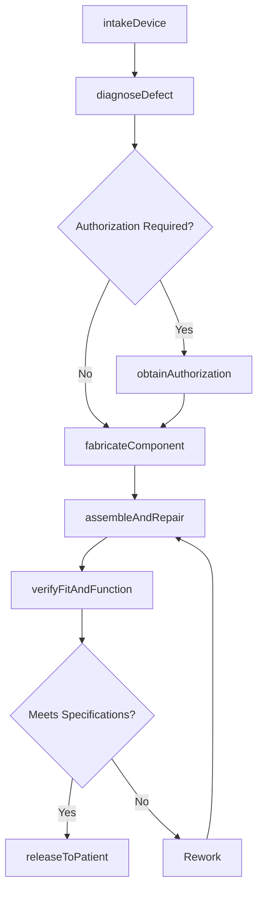
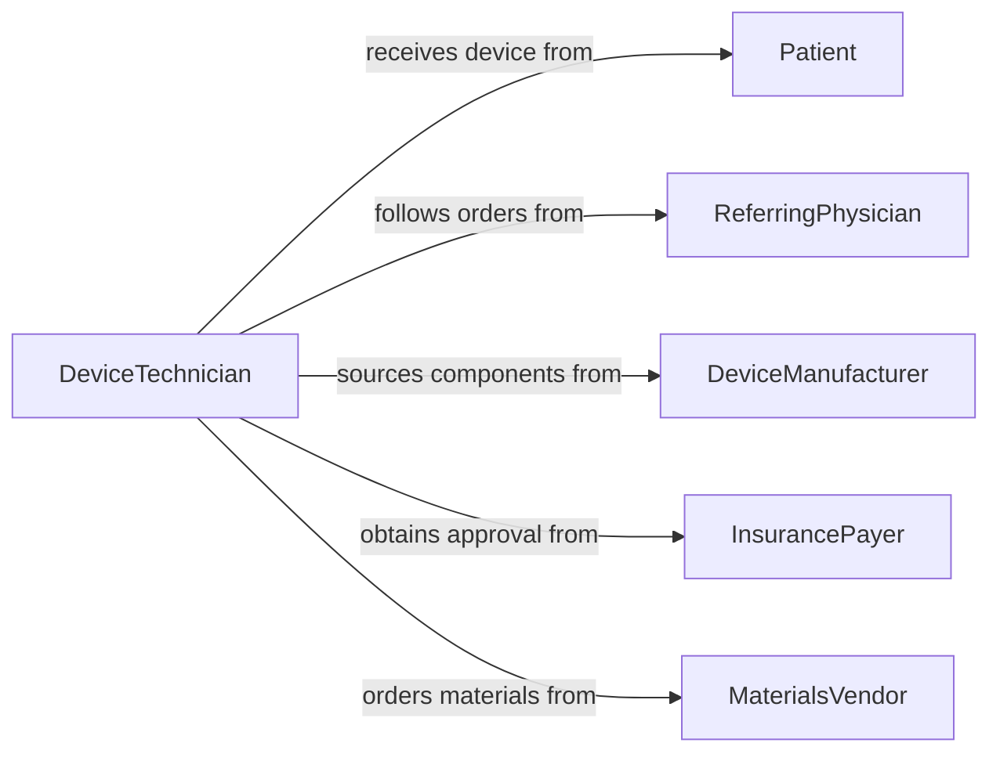

# Repair Medical Dental Assistive Devices

> Business-as-Code definition for repairing medical and dental assistive devices including prosthetics, orthotics, hearing aids, and dental appliances to restore patient function and comfort.

## Overview

Repairing medical and dental assistive devices involves diagnosing defects, fabricating replacement components, and restoring devices such as prosthetic limbs, orthotic braces, hearing aids, dentures, and dental crowns to their intended specifications. This definition exposes actions for intake and assessment of damaged devices, tracking repair workflows through fabrication and fitting, and managing patient-specific customization requirements that are governed by FDA and state licensing standards.

## Actors

| Actor | Description |
|-------|-------------|
| Patient | The individual who uses the assistive device and reports issues |
| ReferringPhysician | The prescribing clinician who orders the device repair or modification |
| DeviceManufacturer | Supplies proprietary components, materials, and technical specifications |
| InsurancePayer | Authorizes and reimburses covered repair services |
| MaterialsVendor | Provides raw materials such as acrylics, alloys, and biocompatible polymers |

## Roles

| Role | Description |
|------|-------------|
| DeviceTechnician | Performs hands-on repair, fabrication, and fitting of assistive devices |
| Prosthetist | Evaluates prosthetic device fit, function, and alignment |
| DentalLabTechnician | Repairs and fabricates dental appliances such as dentures and crowns |
| CaseCoordinator | Manages repair intake, insurance authorization, and patient scheduling |
| QualitySpecialist | Inspects repaired devices against safety and performance standards |

## Entities

| Entity | Description |
|--------|-------------|
| AssistiveDevice | A prosthetic, orthotic, hearing aid, denture, or other patient-specific device |
| RepairOrder | A formal request to diagnose and fix a damaged or malfunctioning device |
| PatientRecord | The clinical and device history for the individual using the appliance |
| DeviceSpecification | The original design parameters, materials, and measurements for the device |
| InsuranceAuthorization | Pre-approval from a payer for the repair service |
| QualityReport | Documentation of post-repair inspection results |

## Actions

| Action | Description |
|--------|-------------|
| intakeDevice | Receive a damaged device, document the reported issue, and create a repair order |
| diagnoseDefect | Assess the device to identify the root cause of failure or damage |
| obtainAuthorization | Request insurance pre-approval for the repair procedure |
| fabricateComponent | Manufacture or shape a replacement part to match device specifications |
| assembleAndRepair | Restore the device by replacing, bonding, or adjusting damaged components |
| verifyFitAndFunction | Confirm the repaired device meets original specifications and patient needs |
| releaseToPatient | Complete final quality check and return the device to the patient |

## Events

| Event | Description |
|-------|-------------|
| deviceIntaken | A damaged device has been received and a repair order created |
| defectDiagnosed | The root cause of device failure has been identified |
| authorizationObtained | Insurance pre-approval for the repair has been secured |
| componentFabricated | A replacement part has been manufactured to specification |
| deviceRepaired | The assistive device has been restored to working condition |
| fitAndFunctionVerified | Post-repair testing confirms the device meets specifications |
| deviceReleasedToPatient | The repaired device has been returned to the patient |

## Searches

| Search | Description |
|--------|-------------|
| findRepairOrders | List repair orders by status, device type, patient, or date range |
| getDeviceHistory | Retrieve the full repair and service history for a specific device |
| getPendingAuthorizations | Find repair orders awaiting insurance pre-approval |
| findOverdueRepairs | Locate repair orders that have exceeded their expected turnaround time |

## Workflow



## Actor Relationships



## Usage

### Calling Actions

```typescript
import { repairMedicalDentalAssistiveDevices } from '@headlessly/repair-medical-dental-assistive-devices'

const repairs = repairMedicalDentalAssistiveDevices()

// Intake a damaged prosthetic leg
const repairOrder = await repairs.intakeDevice({
  patientId: 'PAT-2847',
  deviceType: 'below-knee-prosthesis',
  reportedIssue: 'Socket crack along lateral wall',
  referringPhysician: 'DR-THOMPSON'
})

// Diagnose the defect
await repairs.diagnoseDefect({
  repairOrderId: repairOrder.id,
  findings: 'Stress fracture in carbon fiber socket shell',
  repairPlan: 'Fabricate new socket shell and re-laminate'
})

// Verify fit after repair
const verification = await repairs.verifyFitAndFunction({
  repairOrderId: repairOrder.id,
  checks: ['socket-fit', 'alignment', 'gait-assessment'],
  technician: 'prosthetist-nguyen'
})
```

### Event-Driven Automation

```typescript
// Auto-request authorization when diagnosis is complete
repairs.defectDiagnosed(async ({ repairOrderId, estimatedCost }) => {
  if (estimatedCost > 200) {
    await repairs.obtainAuthorization({
      repairOrderId,
      estimatedCost,
      procedureCodes: ['L5700', 'L5710']
    })
  }
})

// Notify patient when repair is ready for pickup
repairs.deviceReleasedToPatient(async ({ repairOrderId, patientId }) => {
  await notify({
    to: patientId,
    channel: 'sms',
    message: 'Your device repair is complete and ready for pickup.'
  })
})
```
