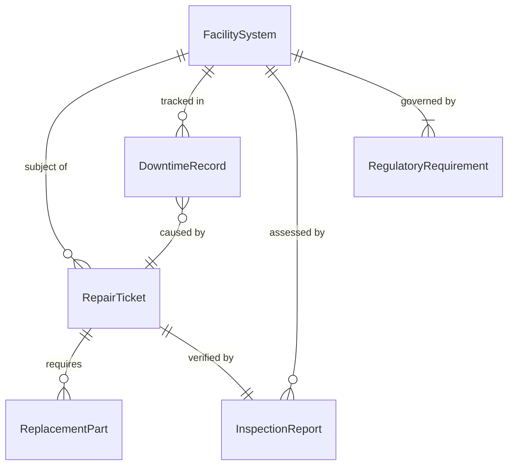
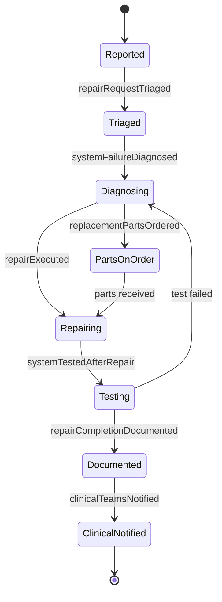
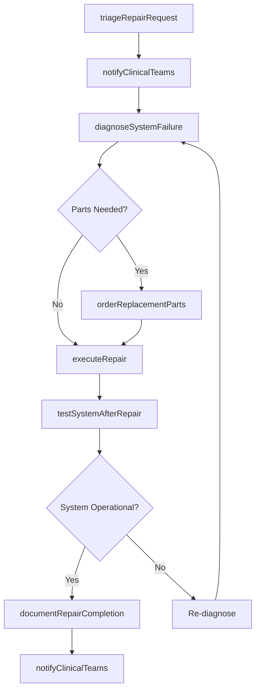
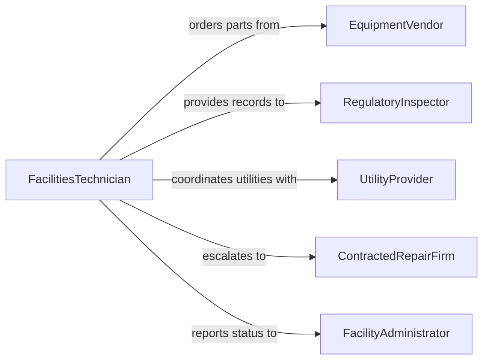

# Repair Medical Facility Equipment

> Business-as-Code definition for repairing medical facility equipment including HVAC, sterilization systems, emergency generators, and building infrastructure that supports clinical operations.

## Overview

Repairing medical facility equipment involves diagnosing and correcting failures in the physical plant and support systems that hospitals, clinics, and laboratories depend on for safe operations. This includes HVAC systems maintaining clean rooms and operating theaters, sterilization autoclaves, medical gas distribution, emergency power systems, and patient transport infrastructure. This definition exposes actions for prioritizing repairs based on clinical impact, coordinating with facilities and clinical teams, and maintaining regulatory compliance with Joint Commission and CMS standards.

## Actors

| Actor | Description |
|-------|-------------|
| EquipmentVendor | Provides replacement parts, technical support, and warranty service for facility systems |
| RegulatoryInspector | Enforces building codes, life safety, and healthcare facility compliance standards |
| UtilityProvider | Supplies electricity, water, and medical gases to the facility |
| ContractedRepairFirm | Performs specialized repair work on complex building systems |
| FacilityAdministrator | Authorizes repair expenditures and coordinates with clinical leadership |

## Roles

| Role | Description |
|------|-------------|
| FacilitiesTechnician | Performs hands-on diagnosis and repair of building and support systems |
| FacilitiesEngineer | Plans repair strategies and evaluates system performance |
| ClinicalLiaison | Communicates equipment downtime impact and coordinates patient care adjustments |
| ComplianceCoordinator | Ensures repair activities meet regulatory documentation requirements |
| MaintenanceDispatcher | Triages incoming repair requests and assigns work to technicians |

## Entities

| Entity | Description |
|--------|-------------|
| FacilitySystem | An HVAC unit, sterilizer, generator, medical gas line, or other building system |
| RepairTicket | A documented request to diagnose and fix a facility equipment issue |
| DowntimeRecord | A log of when equipment was unavailable and its impact on operations |
| RegulatoryRequirement | A compliance standard that governs how the system must be maintained |
| ReplacementPart | A component needed to restore a system to operational condition |
| InspectionReport | Documentation of a system assessment before or after repair |

## Actions

| Action | Description |
|--------|-------------|
| triageRepairRequest | Assess incoming repair requests and assign priority based on clinical impact |
| diagnoseSystemFailure | Identify the root cause of a facility equipment malfunction |
| orderReplacementParts | Procure components needed for the repair |
| executeRepair | Perform the corrective maintenance to restore system functionality |
| testSystemAfterRepair | Verify the repaired system operates within specification |
| documentRepairCompletion | Record repair details, parts used, and downtime for compliance |
| notifyClinicalTeams | Inform clinical departments of equipment status changes |

## Events

| Event | Description |
|-------|-------------|
| repairRequestTriaged | An incoming request has been assessed and prioritized |
| systemFailureDiagnosed | The root cause of a facility equipment issue has been identified |
| replacementPartsOrdered | Components needed for repair have been procured |
| repairExecuted | Corrective maintenance has been completed on the facility system |
| systemTestedAfterRepair | Post-repair verification confirms the system is operational |
| repairCompletionDocumented | All repair details have been recorded for compliance |
| clinicalTeamsNotified | Departments have been informed of the equipment status change |

## Searches

| Search | Description |
|--------|-------------|
| findRepairTickets | List repair requests by priority, system type, status, or location |
| getSystemDowntimeHistory | Retrieve downtime records for a specific facility system |
| findOpenRepairs | Locate active repair tickets by technician assignment or urgency |
| getComplianceDocumentation | Retrieve repair records required for regulatory inspections |
| getPartsOnOrder | Check status of replacement parts awaiting delivery |

## Entity Relationships



## State Diagram



## Workflow



## Actor Relationships



## Usage

### Calling Actions

```typescript
import { repairMedicalFacilityEquipment } from '@headlessly/repair-medical-facility-equipment'

const facility = repairMedicalFacilityEquipment()

// Triage an emergency HVAC failure in the operating suite
const ticket = await facility.triageRepairRequest({
  systemId: 'HVAC-OR-SUITE-A',
  reportedIssue: 'Temperature rising in OR-3, positive pressure lost',
  reportedBy: 'charge-nurse-williams',
  priority: 'emergency'
})

// Diagnose the failure
await facility.diagnoseSystemFailure({
  ticketId: ticket.id,
  findings: 'Compressor relay failure on AHU-7',
  estimatedRepairTime: '2 hours'
})

// Execute the repair
await facility.executeRepair({
  ticketId: ticket.id,
  actions: ['replace-compressor-relay', 'verify-refrigerant-charge', 'test-airflow'],
  technician: 'facilities-tech-johnson'
})
```

### Event-Driven Automation

```typescript
// Immediately notify clinical teams when emergency systems fail
facility.repairRequestTriaged(async ({ systemId, priority }) => {
  if (priority === 'emergency') {
    await facility.notifyClinicalTeams({
      systemId,
      message: `Emergency repair in progress for ${systemId}. Estimated impact: check with facilities.`
    })
  }
})

// Trigger compliance documentation after repair
facility.systemTestedAfterRepair(async ({ ticketId, testResults }) => {
  if (testResults.passed) {
    await facility.documentRepairCompletion({
      ticketId,
      completedAt: new Date().toISOString(),
      outcome: 'system-restored'
    })
  }
})
```
