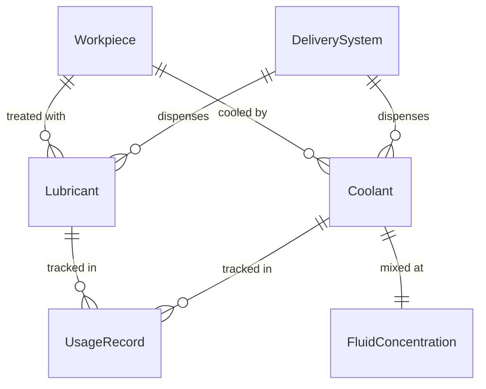
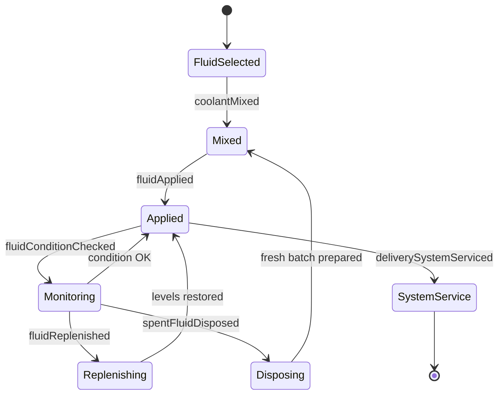
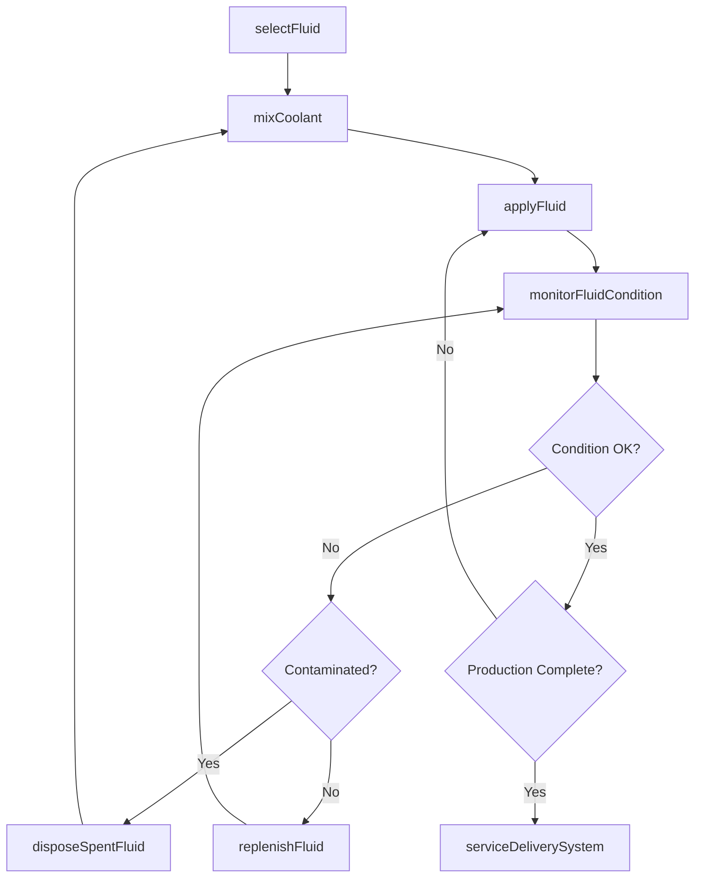
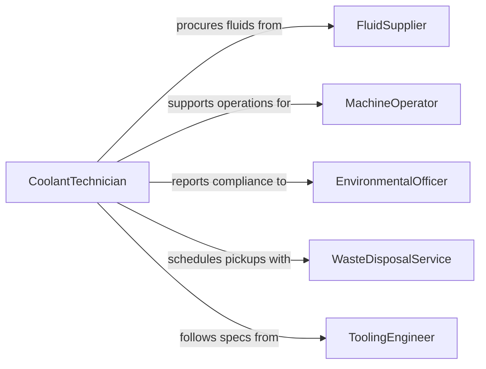

# Apply Lubricants Coolants Workpieces

> Business-as-Code definition for applying lubricants or coolants to workpieces. Models the selection, preparation, application, and monitoring of cutting fluids, oils, and coolants used during machining and manufacturing processes.

## Overview

Applying lubricants or coolants to workpieces involves selecting the correct fluid type for the material and operation, configuring delivery systems, applying the fluid at the proper flow rate and concentration, and monitoring fluid condition over time. This definition exposes actions for fluid management during production, events for tracking application and fluid lifecycle, and searches for querying fluid inventories and usage records.

## Actors

| Actor | Description |
|-------|-------------|
| FluidSupplier | Provides cutting oils, coolants, and lubricant concentrates |
| MachineOperator | Runs production equipment that requires lubrication or cooling |
| EnvironmentalOfficer | Ensures fluid handling meets environmental regulations |
| WasteDisposalService | Collects and processes spent fluids for disposal or recycling |
| ToolingEngineer | Specifies lubrication requirements for tooling and workpiece combinations |

## Roles

| Role | Description |
|------|-------------|
| CoolantTechnician | Mixes, applies, and monitors coolant and lubricant systems |
| ProductionSupervisor | Oversees manufacturing operations including fluid management |
| MaintenanceMechanic | Services coolant delivery systems and filtration equipment |
| SafetyCoordinator | Ensures proper handling, storage, and PPE for fluid operations |

## Entities

| Entity | Description |
|--------|-------------|
| Lubricant | An oil or grease used to reduce friction during machining |
| Coolant | A fluid used to dissipate heat from workpieces and tools |
| Workpiece | The material being machined or processed |
| DeliverySystem | Pumps, nozzles, and lines that transport fluid to the work zone |
| FluidConcentration | The ratio of concentrate to water in a coolant mixture |
| UsageRecord | A log of fluid application, volume, and condition readings |

## Actions

| Action | Description |
|--------|-------------|
| selectFluid | Choose the appropriate lubricant or coolant for the operation |
| mixCoolant | Prepare coolant at the correct concentration ratio |
| applyFluid | Deliver lubricant or coolant to the workpiece during operation |
| monitorFluidCondition | Test concentration, pH, and contamination levels |
| replenishFluid | Top off or replace fluid that has been consumed or degraded |
| disposeSpentFluid | Remove and properly dispose of used lubricant or coolant |
| serviceDeliverySystem | Clean and maintain nozzles, filters, and pumps |

## Events

| Event | Description |
|-------|-------------|
| fluidSelected | A lubricant or coolant has been chosen for the operation |
| coolantMixed | Coolant has been prepared at the target concentration |
| fluidApplied | Lubricant or coolant has been delivered to the workpiece |
| fluidConditionChecked | Concentration and contamination readings have been taken |
| fluidReplenished | Fluid levels have been restored |
| spentFluidDisposed | Used fluid has been collected for disposal or recycling |
| deliverySystemServiced | Coolant delivery equipment has been cleaned and maintained |

## Searches

| Search | Description |
|--------|-------------|
| findFluids | List available lubricants and coolants by type or application |
| getUsageRecords | Retrieve fluid usage data by machine, period, or operation |
| getFluidCondition | Query current concentration and contamination readings |
| findDisposalRecords | List spent fluid disposal events by date or waste stream |

## Entity Relationships



## State Diagram



## Workflow



## Actor Relationships



## Usage

### Calling Actions

```typescript
import { applyLubricantsCoolantsWorkpieces } from '@headlessly/apply-lubricants-coolants-workpieces'

const fluids = applyLubricantsCoolantsWorkpieces()

// Select and mix coolant for a milling operation
await fluids.selectFluid({
  operationType: 'milling',
  workpieceMaterial: 'stainless-steel-316',
  fluidType: 'semi-synthetic-coolant'
})

const mixture = await fluids.mixCoolant({
  concentrateId: 'coolant-ss-semi-synth-01',
  targetConcentration: 8.0,
  volumeLiters: 200
})

// Apply during machining
await fluids.applyFluid({
  machineId: 'cnc-mill-04',
  fluidMixtureId: mixture.id,
  flowRateLpm: 12,
  nozzleConfig: 'flood'
})

// Monitor condition mid-shift
const condition = await fluids.monitorFluidCondition({
  machineId: 'cnc-mill-04',
  tests: ['concentration', 'pH', 'bacteriaCount', 'trampOil']
})
```

### Event-Driven Automation

```typescript
// Auto-replenish when concentration drops
fluids.fluidConditionChecked(async ({ machineId, concentration, targetConcentration }) => {
  if (concentration < targetConcentration * 0.85) {
    await fluids.replenishFluid({
      machineId,
      adjustTo: targetConcentration
    })
  }
})

// Schedule disposal when contamination exceeds limits
fluids.fluidConditionChecked(async ({ machineId, bacteriaCount }) => {
  if (bacteriaCount > 10000) {
    await fluids.disposeSpentFluid({ machineId, reason: 'bacterial-contamination' })
    await notify({
      to: 'coolant-technician',
      message: `Coolant on ${machineId} requires full replacement due to bacterial growth`
    })
  }
})
```
